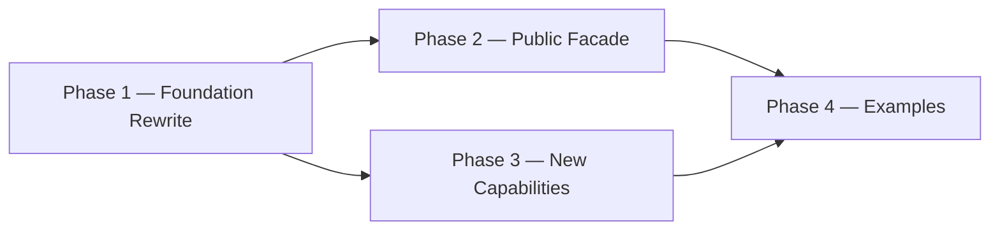

# Implementation Plan

**Version:** 1.4.0
**Project Version:** 0.1.0 (initial release target — semver baseline)
**Generated:** 2026-04-29
**Last Updated:** 2026-05-01
**Based on:** .design/INDEX.md v2.0.0
**Based on RULES:** .design/RULES.md v1.2.0
**Based on ROADMAP:** .design/ROADMAP.md v1.0.0
**Status:** Active

## Overview

GoNN library implementation plan derived from `ROADMAP.md` Hybrid Path. Phase ordering follows the build graph: Foundation Rewrite → Public Facade → New Capabilities → Examples. Already-Stable subsystems (`pkg/activation`, `pkg/loss`, `pkg/utils/float.go`, `pkg/utils/logger.go`) are excluded from active phases — they are catalogued in Phase 0.

## Phase 0 — Concept Foundations (Already in Place)

*Layer-1 abstract contracts and Layer-2 specs whose code is already Stable in the repository.*

- [x] **Math Functions Framework** ([l1-math-functions.md](specifications/l1-math-functions.md)) [L1, Stable v1.0.0]
- [x] **Weight Initialization Contract** ([l1-weight-initialization.md](specifications/l1-weight-initialization.md)) [L1, Stable v1.0.0]
- [x] **Error Taxonomy Contract** ([l1-error-taxonomy.md](specifications/l1-error-taxonomy.md)) [L1, Stable v1.0.0]
- [x] **Activation Functions** ([l2-activation-functions.md](specifications/l2-activation-functions.md)) [L2, Stable v1.0.0] — `pkg/activation/` retained
- [x] **Loss Functions** ([l2-loss-functions.md](specifications/l2-loss-functions.md)) [L2, Stable v1.0.0] — `pkg/loss/` retained

## Phase 1 — Foundation Rewrite (Track A) ✓ Done

*Rewrites the broken core under the fresh L2 contracts. Blocking constraint C-001 resolved 2026-04-29.*

**Subsystem:** `pkg/utils`, `pkg/neuron`, `pkg/layer`, `pkg/network`
**Build order:** errors+init (parallel) → cell+axon → layer → network
**Tasks file:** [tasks/phase-1.md](tasks/phase-1.md)

- [x] **Error Taxonomy Implementation** ([l2-errors-impl.md](specifications/l2-errors-impl.md)) [L2, Stable v1.0.0]
- [x] **Weight-Init Implementation** ([l2-init-impl.md](specifications/l2-init-impl.md)) [L2, Stable v1.0.0]
- [x] **Neuron Model Rewrite** ([l2-neuron-model.md](specifications/l2-neuron-model.md)) [L2, Stable v1.1.0]
- [x] **Layer Types Rewrite** ([l2-layer-types.md](specifications/l2-layer-types.md)) [L2, Stable v1.1.0]
- [x] **Network Graph Rewrite** ([l2-network-graph.md](specifications/l2-network-graph.md)) [L2, Stable v1.1.0]

## Phase 2 — Public Facade Restoration (Track B) ✓ Done

*Restores the public `pkg/nn` API on top of the Phase-1 foundation. Closed 2026-04-30.*

**Subsystem:** `pkg/nn`
**Requires:** Phase 1 ✓
**Tasks file:** [tasks/phase-2.md](tasks/phase-2.md)
**Outcome:** Builder + Functional Options dual-style fluent API converging on `compile()`. XOR converges via the public facade. Pause/Resume/Stop race-clean under `-race`. Single-hidden v0.1 limitation logged for v0.2 multi-hidden patch.

- [x] **NN Public Facade** ([l2-nn-facade.md](specifications/l2-nn-facade.md)) [L2, Stable v2.0.0]
- [x] **Training Loop Implementation** ([l2-training-loop.md](specifications/l2-training-loop.md)) [L2, Stable v1.0.0]
- [x] **Training Control Implementation** ([l2-control-impl.md](specifications/l2-control-impl.md)) [L2, Stable v1.0.0]

## Phase 3 — New Capability Packages (Track C) ✓ Done

*Adds capabilities not present in the legacy code. Closed 2026-05-01. All five new packages ship with ≥ 80 % line coverage and race-clean tests.*

**Subsystem:** `pkg/persistence`, `pkg/checkpoint`, `pkg/dataset`, `pkg/compute`, `pkg/network` (perf)
**Requires:** Phase 1 complete (Track E also needs Phase 2)
**Tasks file:** [tasks/phase-3.md](tasks/phase-3.md)
**Outcome:** 15 atomic tasks + 4 gate checks executed across Tracks A–E. PERF-4 backward-pass at 0 allocs/op; pprof opt-in via `WithProfiling`.

- [x] **[A] Persistence** ([l2-persistence-impl.md](specifications/l2-persistence-impl.md)) [L2, Stable v1.0.0] — `pkg/persistence/` JSON round-trip, PERS-1..4
- [x] **[B] Checkpointing** ([l2-checkpointing-impl.md](specifications/l2-checkpointing-impl.md)) [L2, Stable v1.0.0] — `pkg/checkpoint/` atomic write, retention, CHK-1..4
- [x] **[C] Data Streaming** ([l2-streaming-impl.md](specifications/l2-streaming-impl.md)) [L2, Stable v1.0.0] — `pkg/dataset/` iterator + prefetch, DAT-1..4
- [x] **[D] CPU Compute Backend** ([l2-backend-cpu.md](specifications/l2-backend-cpu.md)) [L2, Stable v1.0.0] — `pkg/compute/cpu/` reference path, COMP-1..4
- [x] **[E] Performance Harness** ([l2-perf-impl.md](specifications/l2-perf-impl.md)) [L2, Stable v1.0.0] — sync.Pool + benchmarks, PERF-1..5

## Phase 4 — Examples Catalog (Track D)

*Smoke-test catalog validating every track end-to-end. Unblocked 2026-05-01.*

**Subsystem:** `examples/`
**Requires:** Phase 2 + Phase 3 complete ✓
**Tasks file:** [tasks/phase-4.md](tasks/phase-4.md)

- [ ] **Usage Examples Catalog (15 entries)** ([l2-usage-examples.md](specifications/l2-usage-examples.md)) [L2, RFC v1.0.0]

## Backlog

*Specs registered but not in the active plan. Pulled into a phase when their parent L1 is Stable, an explicit user request promotes them, or a downstream consumer requires them.*

### L1 Concept (deferred — future phases)

- [l1-dynamic-topology.md](specifications/l1-dynamic-topology.md) — Draft v0.2.0 (layer lifecycle + neuron mutation design; 5 open TBDs in §5.5; parent Stable)
- [l1-meta-learning-hooks.md](specifications/l1-meta-learning-hooks.md) — Draft v0.2.0 (universal ParamAccessor + MetaConfig; 9 param categories; 8 open TBDs in §5.6; no L2 spec yet)

### L1 Concept (tracked — promoted to Stable 2026-05-01, parents of active Phase 3 specs)

- [l1-neural-network-architecture.md](specifications/l1-neural-network-architecture.md) — Stable v2.0.0
- [l1-training-semantics.md](specifications/l1-training-semantics.md) — Stable v1.0.0
- [l1-training-control.md](specifications/l1-training-control.md) — Stable v1.0.0
- [l1-network-persistence.md](specifications/l1-network-persistence.md) — Stable v1.0.0
- [l1-checkpointing.md](specifications/l1-checkpointing.md) — Stable v1.0.0
- [l1-observability-protocol.md](specifications/l1-observability-protocol.md) — Stable v1.0.0
- [l1-performance-contract.md](specifications/l1-performance-contract.md) — Stable v1.0.0
- [l1-data-streaming.md](specifications/l1-data-streaming.md) — Stable v1.0.0
- [l1-compute-backend.md](specifications/l1-compute-backend.md) — Stable v1.0.0

### L2 Implementation (deferred — post-MVP)

- [l2-cli-client.md](specifications/l2-cli-client.md) — RFC v0.1.0 (CLI binary, post-MVP)
- [l2-visualization-api.md](specifications/l2-visualization-api.md) — Draft v0.1.0
- [l2-logging-strategy.md](specifications/l2-logging-strategy.md) — Draft v0.1.0 (`pkg/utils/logger.go` baseline sufficient for Phase 3)

## Build Order Diagram

## Document History

| Version | Date | Description |
| :--- | :--- | :--- |
| 1.0.0 | 2026-04-29 | Initial plan derived from ROADMAP.md v1.0.0; Tracks A–D mapped to Phases 1–4. |
| 1.1.0 | 2026-04-30 | Phase 1 marked Done (C-001 resolved). l2-errors-impl + l2-init-impl promoted to Stable v1.0.0. Phase 2 activated with [Bootstrap] markers (RFC source specs). Phases 3 + 4 remain Blocked. |
| 1.2.0 | 2026-04-30 | Phase 2 marked Done. l2-nn-facade promoted RFC → Stable v2.0.0; l2-training-loop + l2-control-impl promoted Draft → Stable v1.0.0. Phase 3 unblock pending L1 parent promotion via magic.spec; Phase 4 still waits Phase 3. |
| 1.3.0 | 2026-05-01 | Phase 3 unblocked and decomposed. Batch Stabilization (magic.spec) promoted 9 L1 RFC + 5 L2 Draft → Stable. Phase 3 split into Tracks A–E with 15 atomic tasks + 4 gate checks. Backlog cleaned. Based on INDEX.md v2.0.0. |
| 1.4.0 | 2026-05-01 | Phase 3 marked Done. Tracks A–E closed; Phase Gate T-3Z01..T-3Z04 green. New packages: `pkg/persistence`, `pkg/checkpoint`, `pkg/dataset`, `pkg/compute` (+`cpu`), perf hooks in `pkg/network`/`pkg/nn`. All ≥80 % coverage, race-clean. Phase 4 unblocked. |
