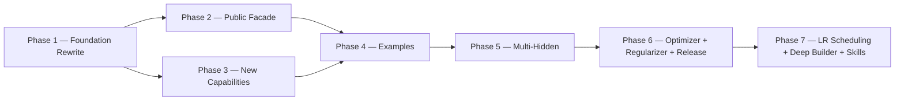

# Implementation Plan

**Version:** 2.0.0
**Project Version:** 0.6.0 (v0.6 released; Phase 7 scoped)
**Generated:** 2026-04-29
**Last Updated:** 2026-05-10
**Based on:** .design/INDEX.md v2.5.0
**Based on RULES:** .design/RULES.md v1.3.0
**Based on ROADMAP:** .design/ROADMAP.md v1.0.0
**Status:** Active

## Overview

GoNN library implementation plan derived from `ROADMAP.md` Hybrid Path. Phase ordering follows the build graph: Foundation Rewrite → Public Facade → New Capabilities → Examples. Already-Stable subsystems (`pkg/activation`, `pkg/loss`, `pkg/utils/float.go`, `pkg/utils/logger.go`) are excluded from active phases — they are catalogued in Phase 0.

## Phase 0 — Concept Foundations (Already in Place)

*Layer-1 abstract contracts and Layer-2 specs whose code is already Stable in the repository.*

- [x] **Math Functions Framework** ([l1-math-functions.md](specifications/l1-math-functions.md)) [L1, Stable v1.0.0]
- [x] **Weight Initialization Contract** ([l1-weight-initialization.md](specifications/l1-weight-initialization.md)) [L1, Stable v1.0.0]
- [x] **Error Taxonomy Contract** ([l1-error-taxonomy.md](specifications/l1-error-taxonomy.md)) [L1, Stable v1.0.0]
- [x] **Activation Functions** ([l2-activation-functions.md](specifications/l2-activation-functions.md)) [L2, Stable v1.0.0] — `pkg/activation/` retained
- [x] **Loss Functions** ([l2-loss-functions.md](specifications/l2-loss-functions.md)) [L2, Stable v1.0.0] — `pkg/loss/` retained

## Phase 1 — Foundation Rewrite (Track A) ✓ Done

*Rewrites the broken core under the fresh L2 contracts. Blocking constraint C-001 resolved 2026-04-29.*

**Subsystem:** `pkg/utils`, `pkg/neuron`, `pkg/layer`, `pkg/network`
**Build order:** errors+init (parallel) → cell+axon → layer → network
**Tasks file:** [tasks/phase-1.md](tasks/phase-1.md)

- [x] **Error Taxonomy Implementation** ([l2-errors-impl.md](specifications/l2-errors-impl.md)) [L2, Stable v1.0.0]
- [x] **Weight-Init Implementation** ([l2-init-impl.md](specifications/l2-init-impl.md)) [L2, Stable v1.0.0]
- [x] **Neuron Model Rewrite** ([l2-neuron-model.md](specifications/l2-neuron-model.md)) [L2, Stable v1.1.0]
- [x] **Layer Types Rewrite** ([l2-layer-types.md](specifications/l2-layer-types.md)) [L2, Stable v1.1.0]
- [x] **Network Graph Rewrite** ([l2-network-graph.md](specifications/l2-network-graph.md)) [L2, Stable v1.1.0]

## Phase 2 — Public Facade Restoration (Track B) ✓ Done

*Restores the public `pkg/nn` API on top of the Phase-1 foundation. Closed 2026-04-30.*

**Subsystem:** `pkg/nn`
**Requires:** Phase 1 ✓
**Tasks file:** [tasks/phase-2.md](tasks/phase-2.md)
**Outcome:** Builder + Functional Options dual-style fluent API converging on `compile()`. XOR converges via the public facade. Pause/Resume/Stop race-clean under `-race`. Single-hidden v0.5 limitation logged for v0.6 multi-hidden patch.

- [x] **NN Public Facade** ([l2-nn-facade.md](specifications/l2-nn-facade.md)) [L2, Stable v2.0.0]
- [x] **Training Loop Implementation** ([l2-training-loop.md](specifications/l2-training-loop.md)) [L2, Stable v1.0.0]
- [x] **Training Control Implementation** ([l2-control-impl.md](specifications/l2-control-impl.md)) [L2, Stable v1.0.0]

## Phase 3 — New Capability Packages (Track C) ✓ Done

*Adds capabilities not present in the legacy code. Closed 2026-05-01. All five new packages ship with ≥ 80 % line coverage and race-clean tests.*

**Subsystem:** `pkg/persistence`, `pkg/checkpoint`, `pkg/dataset`, `pkg/compute`, `pkg/network` (perf)
**Requires:** Phase 1 complete (Track E also needs Phase 2)
**Tasks file:** [tasks/phase-3.md](tasks/phase-3.md)
**Outcome:** 15 atomic tasks + 4 gate checks executed across Tracks A–E. PERF-4 backward-pass at 0 allocs/op; pprof opt-in via `WithProfiling`.

- [x] **[A] Persistence** ([l2-persistence-impl.md](specifications/l2-persistence-impl.md)) [L2, Stable v1.0.0] — `pkg/persistence/` JSON round-trip, PERS-1..4
- [x] **[B] Checkpointing** ([l2-checkpointing-impl.md](specifications/l2-checkpointing-impl.md)) [L2, Stable v1.0.0] — `pkg/checkpoint/` atomic write, retention, CHK-1..4
- [x] **[C] Data Streaming** ([l2-streaming-impl.md](specifications/l2-streaming-impl.md)) [L2, Stable v1.0.0] — `pkg/dataset/` iterator + prefetch, DAT-1..4
- [x] **[D] CPU Compute Backend** ([l2-backend-cpu.md](specifications/l2-backend-cpu.md)) [L2, Stable v1.0.0] — `pkg/compute/cpu/` reference path, COMP-1..4
- [x] **[E] Performance Harness** ([l2-perf-impl.md](specifications/l2-perf-impl.md)) [L2, Stable v1.0.0] — sync.Pool + benchmarks, PERF-1..5

## Phase 5 — Multi-Hidden Topology (v0.6) ✓ Done

*Lifts the v0.5 single-hidden constraint baked into `pkg/nn.compile()`. Closed 2026-05-06. All 23 tasks green; gate T-5Z01..T-5Z04 passed.*

**Subsystem:** `pkg/network`, `pkg/nn`, `pkg/persistence`, `examples/`
**Requires:** Phase 1 + 2 + 3 + 4 ✓
**Tasks file:** [tasks/phase-5.md](tasks/phase-5.md)
**Outcome:** Network[T] storage generalised to slice-shaped hidden chain; compile() gate removed; pkg/persistence SchemaVersion 1.1.0; 6 v0.6 catalog examples (E03/E04/E05/E07/E08/E13) green; coverage pkg/nn 85.2 %, pkg/network 95.7 %, pkg/persistence 81.4 %. Known debt: axon.New[T] ignores WeightInit — addressed in Phase 6 Track B.

- [x] **Multi-Hidden Topology** ([l2-multihidden-impl.md](specifications/l2-multihidden-impl.md)) [L2, Stable v1.0.0] — `pkg/network` slice generalisation, `pkg/nn` compile() gate lift, weights schema 1.0.0 → 1.1.0, six v0.6 catalog examples (E03, E04, E05, E07, E08, E13).

## Phase 4 — Examples Catalog (Track D) ✓ Done

*Smoke-test catalog validating every track end-to-end. Closed 2026-05-02. v0.5 scope is 7 single-hidden examples + smoke-test pattern + coverage audit. The 8 multi-hidden / AndTrain / MNIST entries stay in the spec but defer to v0.6.*

**Subsystem:** `examples/`
**Requires:** Phase 2 + Phase 3 complete ✓
**Tasks file:** [tasks/phase-4.md](tasks/phase-4.md)
**Outcome:** 10 feature tasks + 4 gate checks executed. All seven new example modules build, test, and race-clean. Coverage matrix audit at the bottom of `examples/README.md` flags 6 v0.6-gated API surfaces (`Sequential`, `DeepNetwork`, `PresetMNIST`, `PresetRegression`, `Verify`, `AndTrain`).

- [x] **Usage Examples Catalog (v0.5 scope: 7 entries)** ([l2-usage-examples.md](specifications/l2-usage-examples.md)) [L2, Stable v1.0.0] — E01, E02, E09, E11, E12, E14 (adapted), E15

## Phase 6 — Feature Expansion + v0.6 Release ✓ Done

*Adds optimizer pluggability, regularization, and closes the v0.6.0 release gate. Closed 2026-05-08. All 19 tasks green; gate T-6Z01..T-6Z02 passed.*

**Subsystem:** `pkg/optimizer/` (new), `pkg/regularizer/` (new), `pkg/nn`, `pkg/neuron/axon`, root docs
**Requires:** Phase 5 ✓
**Tasks file:** [tasks/phase-6.md](tasks/phase-6.md)
**Outcome:** `pkg/optimizer/` (SGD/Adam/RMSProp/Momentum); `pkg/regularizer/` (L1/L2/Dropout/Compose); WeightInit debt fix; CHANGELOG.md v0.6.0; v0.6.0 tag. Coverage: optimizer 98.9%, regularizer 80.0%.

- [x] **[A] Optimizer Strategies** ([l1-optimizer-strategies.md](specifications/l1-optimizer-strategies.md) + [l2-optimizer-impl.md](specifications/l2-optimizer-impl.md)) [L1+L2, Stable v1.0.0]
- [x] **[B] Regularization** ([l1-regularization.md](specifications/l1-regularization.md) + [l2-regularization-impl.md](specifications/l2-regularization-impl.md)) [L1+L2, Stable v1.0.0]
- [x] **[C] v0.6.0 Release Preparation** ([l1-release-policy.md](specifications/l1-release-policy.md)) [L1, Stable v1.0.0]

## Phase 7 — Deep Builder + LR Scheduling + Developer Skills ✓ Done

*Adds LR scheduler contract, bulk topology constructors for deep networks, and AI developer skills. Closed 2026-05-10. All 16 tasks green; gate T-7Z01 passed.*

**Subsystem:** `pkg/optimizer/` (scheduler extension), `pkg/nn` (builder ergonomics), `skills/gonn/`
**Requires:** Phase 6 ✓
**Tasks file:** [tasks/phase-7.md](tasks/phase-7.md)
**Track order:** A (L1-first LR scheduling) → B (L2, deep builder after A); C (L2, skills, parallel); T-7T01/T-7T02 validation; Gate T-7Z.
**Outcome:** `pkg/optimizer/` extended with Scheduler[T] interface, BindScheduler, LearningRateSetter[T] optional extension, and four scheduler implementations (StepLR, WarmUpLR, CosineAnnealingLR, ChainScheduler). All four optimizers (SGD/Adam/RMSProp/SGDMomentum) implement LearningRateSetter[T]. `pkg/nn` extended with Repeat/Pattern/HiddenLayers bulk constructors (Builder) and Repeat/Pattern/WithHiddenLayers (Options); WithScheduler on both APIs; train.go dispatches Step() per Granularity(). Coverage: optimizer 88.9%, nn 86.4%. skills/gonn/ ships SKILL.md + 3 examples + 2 resources.

- [x] **[A] LR Scheduling** ([l1-lr-scheduling.md](specifications/l1-lr-scheduling.md)) [L1, Stable v1.0.0] — `pkg/optimizer/` scheduler extension; StepLR/WarmUpLR/CosineAnnealingLR/ChainScheduler; `WithScheduler` option; train.go integration.
- [x] **[B] Deep Builder Ergonomics** ([l2-deep-builder.md](specifications/l2-deep-builder.md)) [L2, Stable v1.0.0] — `Repeat`/`Pattern`/`HiddenLayers` bulk constructors on both Builder and Options APIs.
- [x] **[C] GoNN Developer Skills** ([l2-gonn-skills.md](specifications/l2-gonn-skills.md)) [L2, Stable v1.0.0] — `skills/gonn/SKILL.md` + examples + API reference for AI-assisted code generation.

## Backlog

*Specs registered but not in the active plan. Pulled into a phase when their parent L1 is Stable, an explicit user request promotes them, or a downstream consumer requires them.*

### L1 Concept (deferred — no L2 spec yet)

- [l1-dynamic-topology.md](specifications/l1-dynamic-topology.md) — Stable v0.2.0 (promoted 2026-05-07; 5 open TBDs in §5.5; no L2 spec yet — gated on follow-up l2-dynamic-topology-impl)
- [l1-meta-learning-hooks.md](specifications/l1-meta-learning-hooks.md) — Draft v0.2.0 (universal ParamAccessor; 8 open TBDs in §5.6; explicitly pre-RFC; no L2 spec yet)

### L2 Implementation (deferred — post-Phase 6)

- [l2-visualization-api.md](specifications/l2-visualization-api.md) — Stable v0.1.0 (promoted 2026-05-07; HTTP/JSON observability API; gated on a separate visualizer repo)
- [l2-logging-strategy.md](specifications/l2-logging-strategy.md) — Stable v0.1.0 (promoted 2026-05-07; slog-based structured logging; baseline pkg/utils/logger.go sufficient for now)
- [l2-cli-client.md](specifications/l2-cli-client.md) — RFC v0.1.0 (CLI binary, post-MVP)
- [l2-ai-doc-metadata.md](specifications/l2-ai-doc-metadata.md) — RFC v0.1.0 (AI-Meta trailing block convention; gated on cmd/lint-aimeta delivery; rollout phased per §8)

### L1 Concept (tracked — promoted to Stable 2026-05-01, parents of active Phase 3 specs)

- [l1-neural-network-architecture.md](specifications/l1-neural-network-architecture.md) — Stable v2.0.0
- [l1-training-semantics.md](specifications/l1-training-semantics.md) — Stable v1.0.0
- [l1-training-control.md](specifications/l1-training-control.md) — Stable v1.0.0
- [l1-network-persistence.md](specifications/l1-network-persistence.md) — Stable v1.0.0
- [l1-checkpointing.md](specifications/l1-checkpointing.md) — Stable v1.0.0
- [l1-observability-protocol.md](specifications/l1-observability-protocol.md) — Stable v1.0.0
- [l1-performance-contract.md](specifications/l1-performance-contract.md) — Stable v1.0.0
- [l1-data-streaming.md](specifications/l1-data-streaming.md) — Stable v1.0.0
- [l1-compute-backend.md](specifications/l1-compute-backend.md) — Stable v1.0.0

### Phase 4 → Phase 5 promotion (multi-hidden)

Six of the eight original v0.6-gated catalog entries (E03, E04, E05, E07, E08, E13) move from backlog into active Phase 5 work. E06 (MNIST preset — needs dataset-loader spec) and E10 (continuation — needs `AndTrain` API surface) stay deferred until their respective spec authoring lands.

## Build Order Diagram

## Document History

| Version | Date | Description |
| :--- | :--- | :--- |
| 1.0.0 | 2026-04-29 | Initial plan derived from ROADMAP.md v1.0.0; Tracks A–D mapped to Phases 1–4. |
| 1.1.0 | 2026-04-30 | Phase 1 marked Done (C-001 resolved). l2-errors-impl + l2-init-impl promoted to Stable v1.0.0. Phase 2 activated with [Bootstrap] markers (RFC source specs). Phases 3 + 4 remain Blocked. |
| 1.2.0 | 2026-04-30 | Phase 2 marked Done. l2-nn-facade promoted RFC → Stable v2.0.0; l2-training-loop + l2-control-impl promoted Draft → Stable v1.0.0. Phase 3 unblock pending L1 parent promotion via magic.spec; Phase 4 still waits Phase 3. |
| 1.3.0 | 2026-05-01 | Phase 3 unblocked and decomposed. Batch Stabilization (magic.spec) promoted 9 L1 RFC + 5 L2 Draft → Stable. Phase 3 split into Tracks A–E with 15 atomic tasks + 4 gate checks. Backlog cleaned. Based on INDEX.md v2.0.0. |
| 1.4.0 | 2026-05-01 | Phase 3 marked Done. Tracks A–E closed; Phase Gate T-3Z01..T-3Z04 green. New packages: `pkg/persistence`, `pkg/checkpoint`, `pkg/dataset`, `pkg/compute` (+`cpu`), perf hooks in `pkg/network`/`pkg/nn`. All ≥80 % coverage, race-clean. Phase 4 unblocked. |
| 1.5.0 | 2026-05-02 | Phase 4 activated and decomposed. l2-usage-examples promoted RFC → Stable v1.0.0 (E09 ungated). 14 atomic tasks across Tracks A–E + 4 gate checks scoped to v0.5's single-hidden constraint. 8 multi-hidden / AndTrain / MNIST entries split out as v0.6 backlog. Based on INDEX.md v2.1.0. |
| 1.6.0 | 2026-05-02 | Phase 4 marked Done. All 7 example modules (xor, style_showcase, logic_gates, callbacks, persistence, shared_options, precision) build, test, and race-clean. Phase Gate T-4Z01..T-4Z04 green. v0.5 release-ready bar reached; v0.6 backlog (multi-hidden + AndTrain + MNIST loader) ready for next planning cycle. |
| 1.7.0 | 2026-05-03 | Phase 5 activated and decomposed. l2-multihidden-impl promoted Draft → Stable v1.0.0. 19 atomic tasks across Tracks A–D + 4 gate checks. Track A → B serial; C, D parallel after B. v0.6 catalog promotion: E03/E04/E05/E07/E08/E13 (six of eight backlog entries) move into Phase 5; E06 + E10 stay deferred. Based on INDEX.md v2.3.0. |
| 1.8.0 | 2026-05-07 | Phase 5 marked Done. Phase 6 scoped: Track A (Optimizer), Track B (Regularization), Track C (v0.6 Release). Pre-Plan: 3 Draft specs promoted Stable; 5 new Phase 6 specs authored directly as Stable v1.0.0 (Trust Mode). Backlog reorganised. Based on INDEX.md v2.4.0. |
| 1.9.0 | 2026-05-08 | Sync update: l2-ai-doc-metadata (RFC v0.1.0) added to Backlog (orphan resolved). RULES.md parity updated v1.2.0 → v1.3.0 (C33 AI-Meta Annotation). INDEX.md sync v2.4.0 → v2.5.0. Phase 6 plan unchanged. |
| 2.0.0 | 2026-05-08 | Phase 6 marked Done. Phase 7 scoped: Track A (LR Scheduling), Track B (Deep Builder), Track C (GoNN Skills). 3 orphaned specs resolved. Based on INDEX.md v2.5.0. |
| 2.1.0 | 2026-05-10 | Phase 7 marked Done. All 16 tasks green. pkg/optimizer extended with Scheduler[T]/BindScheduler/LearningRateSetter[T] + 4 scheduler types. pkg/nn: Repeat/Pattern/HiddenLayers/WithScheduler on Builder and Options APIs. skills/gonn/ created. Coverage optimizer 88.9%, nn 86.4%. Gate T-7Z01 passed. |
