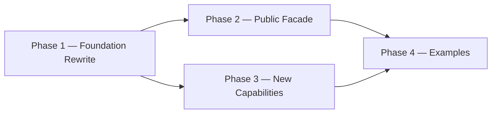

# Implementation Plan

**Version:** 1.0.0
**Project Version:** 0.1.0 (initial release target — semver baseline)
**Generated:** 2026-04-29
**Based on:** .design/INDEX.md v1.7.0
**Based on RULES:** .design/RULES.md v1.2.0
**Based on ROADMAP:** .design/ROADMAP.md v1.0.0
**Status:** Active

## Overview

GoNN library implementation plan derived from `ROADMAP.md` Hybrid Path. Phase ordering follows the build graph: Foundation Rewrite → Public Facade → New Capabilities → Examples. Already-Stable subsystems (`pkg/activation`, `pkg/loss`, `pkg/utils/float.go`, `pkg/utils/logger.go`) are excluded from active phases — they are catalogued in Phase 0.

## Phase 0 — Concept Foundations (Already in Place)

*Layer-1 abstract contracts and Layer-2 specs whose code is already Stable in the repository.*

- [x] **Math Functions Framework** ([l1-math-functions.md](specifications/l1-math-functions.md)) [L1, Stable v1.0.0]
- [x] **Weight Initialization Contract** ([l1-weight-initialization.md](specifications/l1-weight-initialization.md)) [L1, Stable v1.0.0]
- [x] **Error Taxonomy Contract** ([l1-error-taxonomy.md](specifications/l1-error-taxonomy.md)) [L1, Stable v1.0.0]
- [x] **Activation Functions** ([l2-activation-functions.md](specifications/l2-activation-functions.md)) [L2, Stable v1.0.0] — `pkg/activation/` retained
- [x] **Loss Functions** ([l2-loss-functions.md](specifications/l2-loss-functions.md)) [L2, Stable v1.0.0] — `pkg/loss/` retained

## Phase 1 — Foundation Rewrite (Track A)

*Rewrites the broken core under the fresh L2 contracts. Blocking constraint C-001 is resolved here.*

**Subsystem:** `pkg/utils`, `pkg/neuron`, `pkg/layer`, `pkg/network`
**Build order:** errors+init (parallel) → cell+axon → layer → network
**Tasks file:** [tasks/phase-1.md](tasks/phase-1.md)

- [ ] **Error Taxonomy Implementation** ([l2-errors-impl.md](specifications/l2-errors-impl.md)) [L2, RFC v0.2.0]
- [ ] **Weight-Init Implementation** ([l2-init-impl.md](specifications/l2-init-impl.md)) [L2, RFC v0.2.0]
- [ ] **Neuron Model Rewrite** ([l2-neuron-model.md](specifications/l2-neuron-model.md)) [L2, Stable v1.1.0]
- [ ] **Layer Types Rewrite** ([l2-layer-types.md](specifications/l2-layer-types.md)) [L2, Stable v1.1.0]
- [ ] **Network Graph Rewrite** ([l2-network-graph.md](specifications/l2-network-graph.md)) [L2, Stable v1.1.0]

## Phase 2 — Public Facade Restoration (Track B)

*Restores the public `pkg/nn` API on top of the Phase-1 foundation.*

**Subsystem:** `pkg/nn`
**Requires:** Phase 1 complete
**Tasks file:** [tasks/phase-2.md](tasks/phase-2.md)

- [ ] **NN Public Facade** ([l2-nn-facade.md](specifications/l2-nn-facade.md)) [L2, RFC v2.0.0]
- [ ] **Training Loop Implementation** ([l2-training-loop.md](specifications/l2-training-loop.md)) [L2, Draft v0.1.0]
- [ ] **Training Control Implementation** ([l2-control-impl.md](specifications/l2-control-impl.md)) [L2, Draft v0.1.0]

## Phase 3 — New Capability Packages (Track C)

*Adds capabilities not present in the legacy code. Independent of Phase 2 — runs in parallel once Phase 1 is green.*

**Subsystem:** `pkg/persistence`, `pkg/checkpoint`, `pkg/dataset`, `pkg/compute`
**Requires:** Phase 1 complete (parallel with Phase 2)
**Tasks file:** [tasks/phase-3.md](tasks/phase-3.md)

- [ ] **Persistence Implementation** ([l2-persistence-impl.md](specifications/l2-persistence-impl.md)) [L2, Draft v0.1.0]
- [ ] **Checkpointing Implementation** ([l2-checkpointing-impl.md](specifications/l2-checkpointing-impl.md)) [L2, Draft v0.1.0]
- [ ] **Data Streaming Implementation** ([l2-streaming-impl.md](specifications/l2-streaming-impl.md)) [L2, Draft v0.1.0]
- [ ] **Compute Backend (CPU)** ([l2-backend-cpu.md](specifications/l2-backend-cpu.md)) [L2, Draft v0.1.0]
- [ ] **Performance Implementation** ([l2-perf-impl.md](specifications/l2-perf-impl.md)) [L2, Draft v0.1.0]

## Phase 4 — Examples Catalog (Track D)

*Smoke-test catalog validating every track end-to-end.*

**Subsystem:** `examples/`
**Requires:** Phase 2 + Phase 3 complete
**Tasks file:** [tasks/phase-4.md](tasks/phase-4.md)

- [ ] **Usage Examples Catalog (15 entries)** ([l2-usage-examples.md](specifications/l2-usage-examples.md)) [L2, RFC v1.0.0]

## Backlog

*Specs registered but not in the active plan. Pulled into a phase when their parent L1 is Stable, an explicit user request promotes them, or a downstream consumer requires them.*

### L1 Concept (deferred)

- [l1-neural-network-architecture.md](specifications/l1-neural-network-architecture.md) — RFC v2.0.0 (TopologyMode amendment under review)
- [l1-training-semantics.md](specifications/l1-training-semantics.md) — RFC v0.1.0 (parent of l2-training-loop)
- [l1-network-persistence.md](specifications/l1-network-persistence.md) — RFC v0.1.0 (parent of l2-persistence-impl)
- [l1-training-control.md](specifications/l1-training-control.md) — RFC v0.1.0 (parent of l2-control-impl)
- [l1-checkpointing.md](specifications/l1-checkpointing.md) — RFC v0.1.0 (parent of l2-checkpointing-impl)
- [l1-observability-protocol.md](specifications/l1-observability-protocol.md) — RFC v0.1.0
- [l1-performance-contract.md](specifications/l1-performance-contract.md) — RFC v0.1.0 (parent of l2-perf-impl)
- [l1-data-streaming.md](specifications/l1-data-streaming.md) — RFC v0.1.0 (parent of l2-streaming-impl)
- [l1-compute-backend.md](specifications/l1-compute-backend.md) — RFC v0.1.0 (parent of l2-backend-cpu)
- [l1-dynamic-topology.md](specifications/l1-dynamic-topology.md) — Draft v0.1.0
- [l1-meta-learning-hooks.md](specifications/l1-meta-learning-hooks.md) — Draft v0.1.0

### L2 Implementation (deferred)

- [l2-cli-client.md](specifications/l2-cli-client.md) — RFC v0.1.0 (CLI binary, post-MVP)
- [l2-visualization-api.md](specifications/l2-visualization-api.md) — Draft v0.1.0
- [l2-logging-strategy.md](specifications/l2-logging-strategy.md) — Draft v0.1.0 (`pkg/utils/logger.go` already provides baseline `slog` wrapper)

## Build Order Diagram

## Document History

| Version | Date | Description |
| :--- | :--- | :--- |
| 1.0.0 | 2026-04-29 | Initial plan derived from ROADMAP.md v1.0.0; Tracks A–D mapped to Phases 1–4. |
