# Implementation Plan

**Version:** 2.19.0
**Project Version:** 0.11.0 released; 0.12.0 RC ready (Phase 14 Done — pending `git tag -a v0.12.0`); 0.13.0 RC ready (Phase 15 Done — pending `git tag -a v0.13.0`); 0.14.0 RC ready (Phase 16 Done — pending `git tag -a v0.14.0`); 0.15.0 RC ready (Phase 17 Done — pending `git tag -a v0.15.0`); 0.16.0 target (Phase 18 active)
**Generated:** 2026-04-29
**Last Updated:** 2026-05-20
**Based on:** .design/main/INDEX.md v2.17.0
**Based on RULES:** .design/RULES.md v1.3.0
**Based on ROADMAP:** .design/main/ROADMAP.md v1.0.0
**Status:** Active

## Overview

GoNN library implementation plan derived from `ROADMAP.md` Hybrid Path. Phase ordering follows the build graph: Foundation Rewrite → Public Facade → New Capabilities → Examples. Already-Stable subsystems (`pkg/activation`, `pkg/loss`, `pkg/utils/float.go`, `pkg/utils/logger.go`) are excluded from active phases — they are catalogued in Phase 0.

## Phase 0 — Concept Foundations (Already in Place)

*Layer-1 abstract contracts and Layer-2 specs whose code is already Stable in the repository.*

- [x] **Math Functions Framework** ([l1-math-functions.md](specifications/l1-math-functions.md)) [L1, Stable v1.0.0]
- [x] **Weight Initialization Contract** ([l1-weight-initialization.md](specifications/l1-weight-initialization.md)) [L1, Stable v1.0.0]
- [x] **Error Taxonomy Contract** ([l1-error-taxonomy.md](specifications/l1-error-taxonomy.md)) [L1, Stable v1.0.0]
- [x] **Activation Functions** ([l2-activation-functions.md](specifications/l2-activation-functions.md)) [L2, Stable v1.0.0] — `pkg/activation/` retained
- [x] **Loss Functions** ([l2-loss-functions.md](specifications/l2-loss-functions.md)) [L2, Stable v1.0.0] — `pkg/loss/` retained

## Phase 1 — Foundation Rewrite (Track A) ✓ Done

*Rewrites the broken core under the fresh L2 contracts. Blocking constraint C-001 resolved 2026-04-29.*

**Subsystem:** `pkg/utils`, `pkg/neuron`, `pkg/layer`, `pkg/network`
**Build order:** errors+init (parallel) → cell+axon → layer → network
**Tasks file:** [tasks/phase-1.md](tasks/phase-1.md)

- [x] **Error Taxonomy Implementation** ([l2-errors-impl.md](specifications/l2-errors-impl.md)) [L2, Stable v1.0.0]
- [x] **Weight-Init Implementation** ([l2-init-impl.md](specifications/l2-init-impl.md)) [L2, Stable v1.0.0]
- [x] **Neuron Model Rewrite** ([l2-neuron-model.md](specifications/l2-neuron-model.md)) [L2, Stable v1.1.0]
- [x] **Layer Types Rewrite** ([l2-layer-types.md](specifications/l2-layer-types.md)) [L2, Stable v1.1.0]
- [x] **Network Graph Rewrite** ([l2-network-graph.md](specifications/l2-network-graph.md)) [L2, Stable v1.1.0]

## Phase 2 — Public Facade Restoration (Track B) ✓ Done

*Restores the public `pkg/nn` API on top of the Phase-1 foundation. Closed 2026-04-30.*

**Subsystem:** `pkg/nn`
**Requires:** Phase 1 ✓
**Tasks file:** [tasks/phase-2.md](tasks/phase-2.md)
**Outcome:** Builder + Functional Options dual-style fluent API converging on `compile()`. XOR converges via the public facade. Pause/Resume/Stop race-clean under `-race`. Single-hidden v0.5 limitation logged for v0.6 multi-hidden patch.

- [x] **NN Public Facade** ([l2-nn-facade.md](specifications/l2-nn-facade.md)) [L2, Stable v2.0.0]
- [x] **Training Loop Implementation** ([l2-training-loop.md](specifications/l2-training-loop.md)) [L2, Stable v1.0.0]
- [x] **Training Control Implementation** ([l2-control-impl.md](specifications/l2-control-impl.md)) [L2, Stable v1.0.0]

## Phase 3 — New Capability Packages (Track C) ✓ Done

*Adds capabilities not present in the legacy code. Closed 2026-05-01. All five new packages ship with ≥ 80 % line coverage and race-clean tests.*

**Subsystem:** `pkg/persistence`, `pkg/checkpoint`, `pkg/dataset`, `pkg/compute`, `pkg/network` (perf)
**Requires:** Phase 1 complete (Track E also needs Phase 2)
**Tasks file:** [tasks/phase-3.md](tasks/phase-3.md)
**Outcome:** 15 atomic tasks + 4 gate checks executed across Tracks A–E. PERF-4 backward-pass at 0 allocs/op; pprof opt-in via `WithProfiling`.

- [x] **[A] Persistence** ([l2-persistence-impl.md](specifications/l2-persistence-impl.md)) [L2, Stable v1.0.0] — `pkg/persistence/` JSON round-trip, PERS-1..4
- [x] **[B] Checkpointing** ([l2-checkpointing-impl.md](specifications/l2-checkpointing-impl.md)) [L2, Stable v1.0.0] — `pkg/checkpoint/` atomic write, retention, CHK-1..4
- [x] **[C] Data Streaming** ([l2-streaming-impl.md](specifications/l2-streaming-impl.md)) [L2, Stable v1.0.0] — `pkg/dataset/` iterator + prefetch, DAT-1..4
- [x] **[D] CPU Compute Backend** ([l2-backend-cpu.md](specifications/l2-backend-cpu.md)) [L2, Stable v1.0.0] — `pkg/compute/cpu/` reference path, COMP-1..4
- [x] **[E] Performance Harness** ([l2-perf-impl.md](specifications/l2-perf-impl.md)) [L2, Stable v1.0.0] — sync.Pool + benchmarks, PERF-1..5

## Phase 5 — Multi-Hidden Topology (v0.6) ✓ Done

*Lifts the v0.5 single-hidden constraint baked into `pkg/nn.compile()`. Closed 2026-05-06. All 23 tasks green; gate T-5Z01..T-5Z04 passed.*

**Subsystem:** `pkg/network`, `pkg/nn`, `pkg/persistence`, `examples/`
**Requires:** Phase 1 + 2 + 3 + 4 ✓
**Tasks file:** [tasks/phase-5.md](tasks/phase-5.md)
**Outcome:** Network[T] storage generalised to slice-shaped hidden chain; compile() gate removed; pkg/persistence SchemaVersion 1.1.0; 6 v0.6 catalog examples (E03/E04/E05/E07/E08/E13) green; coverage pkg/nn 85.2 %, pkg/network 95.7 %, pkg/persistence 81.4 %. Known debt: axon.New[T] ignores WeightInit — addressed in Phase 6 Track B.

- [x] **Multi-Hidden Topology** ([l2-multihidden-impl.md](specifications/l2-multihidden-impl.md)) [L2, Stable v1.0.0] — `pkg/network` slice generalisation, `pkg/nn` compile() gate lift, weights schema 1.0.0 → 1.1.0, six v0.6 catalog examples (E03, E04, E05, E07, E08, E13).

## Phase 4 — Examples Catalog (Track D) ✓ Done

*Smoke-test catalog validating every track end-to-end. Closed 2026-05-02. v0.5 scope is 7 single-hidden examples + smoke-test pattern + coverage audit. The 8 multi-hidden / AndTrain / MNIST entries stay in the spec but defer to v0.6.*

**Subsystem:** `examples/`
**Requires:** Phase 2 + Phase 3 complete ✓
**Tasks file:** [tasks/phase-4.md](tasks/phase-4.md)
**Outcome:** 10 feature tasks + 4 gate checks executed. All seven new example modules build, test, and race-clean. Coverage matrix audit at the bottom of `examples/README.md` flags 6 v0.6-gated API surfaces (`Sequential`, `DeepNetwork`, `PresetMNIST`, `PresetRegression`, `Verify`, `AndTrain`).

- [x] **Usage Examples Catalog (v0.5 scope: 7 entries)** ([l2-usage-examples.md](specifications/l2-usage-examples.md)) [L2, Stable v1.0.0] — E01, E02, E09, E11, E12, E14 (adapted), E15

## Phase 6 — Feature Expansion + v0.6 Release ✓ Done

*Adds optimizer pluggability, regularization, and closes the v0.6.0 release gate. Closed 2026-05-08. All 19 tasks green; gate T-6Z01..T-6Z02 passed.*

**Subsystem:** `pkg/optimizer/` (new), `pkg/regularizer/` (new), `pkg/nn`, `pkg/neuron/axon`, root docs
**Requires:** Phase 5 ✓
**Tasks file:** [tasks/phase-6.md](tasks/phase-6.md)
**Outcome:** `pkg/optimizer/` (SGD/Adam/RMSProp/Momentum); `pkg/regularizer/` (L1/L2/Dropout/Compose); WeightInit debt fix; CHANGELOG.md v0.6.0; v0.6.0 tag. Coverage: optimizer 98.9%, regularizer 80.0%.

- [x] **[A] Optimizer Strategies** ([l1-optimizer-strategies.md](specifications/l1-optimizer-strategies.md) + [l2-optimizer-impl.md](specifications/l2-optimizer-impl.md)) [L1+L2, Stable v1.0.0]
- [x] **[B] Regularization** ([l1-regularization.md](specifications/l1-regularization.md) + [l2-regularization-impl.md](specifications/l2-regularization-impl.md)) [L1+L2, Stable v1.0.0]
- [x] **[C] v0.6.0 Release Preparation** ([l1-release-policy.md](specifications/l1-release-policy.md)) [L1, Stable v1.0.0]

## Phase 7 — Deep Builder + LR Scheduling + Developer Skills ✓ Done

*Adds LR scheduler contract, bulk topology constructors for deep networks, and AI developer skills. Closed 2026-05-10. All 16 tasks green; gate T-7Z01 passed.*

**Subsystem:** `pkg/optimizer/` (scheduler extension), `pkg/nn` (builder ergonomics), `skills/gonn/`
**Requires:** Phase 6 ✓
**Tasks file:** [tasks/phase-7.md](tasks/phase-7.md)
**Track order:** A (L1-first LR scheduling) → B (L2, deep builder after A); C (L2, skills, parallel); T-7T01/T-7T02 validation; Gate T-7Z.
**Outcome:** `pkg/optimizer/` extended with Scheduler[T] interface, BindScheduler, LearningRateSetter[T] optional extension, and four scheduler implementations (StepLR, WarmUpLR, CosineAnnealingLR, ChainScheduler). All four optimizers (SGD/Adam/RMSProp/SGDMomentum) implement LearningRateSetter[T]. `pkg/nn` extended with Repeat/Pattern/HiddenLayers bulk constructors (Builder) and Repeat/Pattern/WithHiddenLayers (Options); WithScheduler on both APIs; train.go dispatches Step() per Granularity(). Coverage: optimizer 88.9%, nn 86.4%. skills/gonn/ ships SKILL.md + 3 examples + 2 resources.

- [x] **[A] LR Scheduling** ([l1-lr-scheduling.md](specifications/l1-lr-scheduling.md)) [L1, Stable v1.0.0] — `pkg/optimizer/` scheduler extension; StepLR/WarmUpLR/CosineAnnealingLR/ChainScheduler; `WithScheduler` option; train.go integration.
- [x] **[B] Deep Builder Ergonomics** ([l2-deep-builder.md](specifications/l2-deep-builder.md)) [L2, Stable v1.0.0] — `Repeat`/`Pattern`/`HiddenLayers` bulk constructors on both Builder and Options APIs.
- [x] **[C] GoNN Developer Skills** ([l2-gonn-skills.md](specifications/l2-gonn-skills.md)) [L2, Stable v1.0.0] — `skills/gonn/SKILL.md` + examples + API reference for AI-assisted code generation.

## Phase 8 — LR Scheduling Extension + CLI Binary (v0.7.0) ✓ Done

*Closes LR scheduling registry gap (ExponentialLR) and delivers the standalone `gonn` CLI binary. v0.7.0 release gate included. Closed 2026-05-10. All 9 tasks green; gate T-8Z01 passed.*

**Subsystem:** `pkg/optimizer/` (LR extension), `cmd/gonn/` (new CLI binary)
**Requires:** Phase 7 ✓
**Tasks file:** [tasks/phase-8.md](tasks/phase-8.md)
**Track order:** A (ExponentialLR) and B (CLI binary) in parallel; T tests after each track; Gate T-8Z01.
**Outcome:** `pkg/optimizer/exponential_lr.go` — `ExponentialLR[T]` (lr₀×gamma^t), LRS-1..6, PerEpoch default, coverage 88.2%. `cmd/gonn/` — 8 files, `train`/`query`/`verify`/`version`, `--precision float32|float64`, 64 MB streaming, `--json`, exit-code contract (0-7), XOR smoke test, coverage 83.7%. l2-lr-scheduling-impl.md bumped v1.1.0. CHANGELOG.md v0.7.0. v0.7.0 tag created.

- [x] **[A] LR Scheduling Extension** ([l2-lr-scheduling-impl.md](specifications/l2-lr-scheduling-impl.md)) [L2, Stable v1.1.0] — `ExponentialLR[T]`: lr₀ × gamma^t decay, LRS-1..LRS-6 compliant. Closes `pkg/optimizer/` scheduler taxonomy gap.
- [x] **[B] CLI Binary** ([l2-cli-client.md](specifications/l2-cli-client.md)) [L2, Stable v0.2.0] — `cmd/gonn/`: `train`/`query`/`verify`/`version` subcommands; CSV streaming (64 MB threshold); exit-code contract; `--json` output.

## Phase 9 — Metric Schedulers + Dynamic Topology + Observability Stack (v0.8.0) ✓ Done

*Three parallel tracks closing the Creative Spark backlog from Phase 8. Closed 2026-05-10. All 15 tasks green; gate T-9Z01 passed.*

**Subsystem:** `pkg/optimizer/` (metric schedulers), `pkg/network/` (topology), `pkg/utils/` (slog), `pkg/visualization/` (new), `pkg/nn/` (option wiring)
**Requires:** Phase 8 ✓
**Tasks file:** [tasks/phase-9.md](tasks/phase-9.md)
**Track order:** A, B, C fully parallel (no shared write paths); T-9T01/T-9T02/T-9T03 after each; Gate T-9Z01.
**Outcome:** `MetricScheduler[T]` interface + `ReduceOnPlateau[T]` + `OneCycleLR[T]` in `pkg/optimizer/`; `topologyTx` rollback + 4 mutation methods on `Network[T]`; `pkg/visualization/` HTTP server + 6 handlers; `pkg/utils/logger.go` slog upgrade with `LevelTrace`; `l2-lr-scheduling-impl.md` bumped v1.2.0. v0.8.0 tagged.

- [x] **[A] Metric Schedulers** ([l2-metric-scheduler-impl.md](specifications/l2-metric-scheduler-impl.md)) [L2, Stable v0.1.0] — `MetricScheduler[T]` interface; `ReduceOnPlateau[T]`; `OneCycleLR[T]`; `pkg/nn/train.go` metric dispatch patch.
- [x] **[B] Dynamic Topology** ([l2-dynamic-topology-impl.md](specifications/l2-dynamic-topology-impl.md)) [L2, Stable v0.2.0] — `TopologyMode` enum, mutation methods on `Network[T]`, `topologyTx` rollback, `rebalance`, `TopologyVersion()`, new error sentinels.
- [x] **[C] Observability Stack** ([l2-visualization-api.md](specifications/l2-visualization-api.md) + [l2-logging-strategy.md](specifications/l2-logging-strategy.md)) [L2, Stable v0.2.0] — `pkg/visualization/server.go` + handlers; `pkg/utils/logger.go` slog upgrade with `LevelTrace`; `WithLogger`/`WithVisualizationEndpoint` option wiring.

## Phase 10 — Normalization Layers + Training Callbacks (v0.9.0) ✓ Done

*Two parallel tracks delivering the normalization layer package and the callback event system.
Track A: BatchNorm/LayerNorm/GroupNorm in pkg/layer/norm/. Track B: CallbackRegistry[T] wired
into pkg/nn/train.go. Light coordination on pkg/nn/train.go (Track B owns it; Track A merges after).*

**Subsystem:** `pkg/layer/norm/` (new), `pkg/nn/` (callbacks + options + train), `pkg/utils/` (sentinel)
**Requires:** Phase 9 ✓
**Tasks file:** [tasks/phase-10.md](tasks/phase-10.md)
**Track order:** A and B mostly parallel; Track B completes train.go changes first; T-10T01 after A, T-10T02 after B; Gate T-10Z01.
**Outcome:** `pkg/layer/norm/` — `Normalizer[T]` interface + `BatchNorm/LayerNorm/GroupNorm[T]` + JSON round-trip; `pkg/nn/callbacks.go` — `CallbackRegistry[T]`, `ErrStopTraining`, panic-safe `invokeOne`, `WithOnIterationEnd/WithOnImprovementFound/WithOnTrainEnd` options; `BenchmarkNoCallbacks` at 0 allocs/op. Gate T-10Z01 green. v0.9.0 tagged.

- [x] **[A] Normalization Layers** ([l1-normalization-layers.md](specifications/l1-normalization-layers.md) + [l2-normalization-impl.md](specifications/l2-normalization-impl.md)) [L1+L2, Stable v1.0.0 / v0.1.0] — `pkg/layer/norm/`: `Normalizer[T]` interface; `BatchNorm/LayerNorm/GroupNorm[T]`; `WithBatchNorm`/`WithLayerNorm` options; `SetTrain`/`SetEval` propagation; JSON round-trip.
- [x] **[B] Training Callbacks** ([l1-training-callbacks.md](specifications/l1-training-callbacks.md) + [l2-callbacks-impl.md](specifications/l2-callbacks-impl.md)) [L1+L2, Stable v1.0.0 / v0.1.0] — `pkg/nn/callbacks.go`: `CallbackRegistry[T]`; `ErrStopTraining`; panic recovery; `defer fireOnTrainEnd`; `WithOnIterationEnd`/`WithOnImprovementFound`/`WithOnTrainEnd` options; 0-alloc benchmark.

## Backlog

*Specs registered but not in the active plan. Pulled into a phase when their parent L1 is Stable, an explicit user request promotes them, or a downstream consumer requires them.*

### L1 Concept (promoted to Phase 12)

- [l1-meta-learning-hooks.md](specifications/l1-meta-learning-hooks.md) — Stable v1.0.0 (promoted 2026-05-17 via magic-spec; active in Phase 12 Track A)

### L2 Implementation (rollout in progress)

- [l2-ai-doc-metadata.md](specifications/l2-ai-doc-metadata.md) — Stable v1.0.0 (AI-Meta trailing block convention; cmd/lint-aimeta delivered Phase 15 Track C; rollout phases 2-5 deferred to Phase 16+ per §8)

### L1 Concept (tracked — promoted to Stable, parents of active Phase 3–10 specs)

- [l1-neural-network-architecture.md](specifications/l1-neural-network-architecture.md) — Stable v2.0.0
- [l1-training-semantics.md](specifications/l1-training-semantics.md) — Stable v1.0.0
- [l1-training-control.md](specifications/l1-training-control.md) — Stable v1.0.0
- [l1-network-persistence.md](specifications/l1-network-persistence.md) — Stable v1.0.0
- [l1-checkpointing.md](specifications/l1-checkpointing.md) — Stable v1.0.0
- [l1-observability-protocol.md](specifications/l1-observability-protocol.md) — Stable v1.0.0
- [l1-performance-contract.md](specifications/l1-performance-contract.md) — Stable v1.0.0
- [l1-data-streaming.md](specifications/l1-data-streaming.md) — Stable v1.0.0
- [l1-compute-backend.md](specifications/l1-compute-backend.md) — Stable v1.0.0
- [l1-dynamic-topology.md](specifications/l1-dynamic-topology.md) — Stable v0.2.0 (parent of l2-dynamic-topology-impl.md, Phase 9 Track B; orphan resolved 2026-05-12)

### Phase 18 — Transformer Block Implementation (promoted to active plan 2026-05-20)

- [l1-transformer-block.md](specifications/l1-transformer-block.md) — Stable v0.1.0 — **promoted to active Phase 18** after Phase 17 gate T-17Z01 closed
- [l2-transformer-impl.md](specifications/l2-transformer-impl.md) — Stable v0.1.0 — **promoted to active Phase 18**; decomposed into 14 atomic tasks (T-18A01..A11 + T01..T02 + Z01)

### Phase 19+ — Quantization Implementation (L2 deferred per L1 author note)

- [l1-quantization.md](specifications/l1-quantization.md) — Stable v0.1.0 (post-training int8 quantization contract — affine scheme, per-tensor/per-channel granularity, calibration protocol, .qnn.json sibling artifact, side-by-side evaluator; 10 invariants QUANT-1..10; L2 implementation reserved for Phase 19+)

> **Phase 19+ scoping conditions**: L1 contract is complete and Stable; L2 implementation explicitly deferred per `l1-quantization.md §6` because canonical L2 requires int8-GEMM kernel integration with `pkg/compute/cpu/` (and optionally `pkg/compute/gpu/`) — both significant work that benefits from Phase 18 (Transformer Block) closeout first. L1 alone is sufficient for users to author their own quantization on top of the existing library — the math, persistence schema (.qnn.json), and accuracy-evaluator contract are all defined. Activate with `/magic-task` after Phase 18 Done AND user-supplied L2 implementation plan.

### Phase 4 → Phase 5 promotion (multi-hidden)

Six of the eight original v0.6-gated catalog entries (E03, E04, E05, E07, E08, E13) move from backlog into active Phase 5 work. E06 (MNIST preset) and E10 (AndTrain continuation) promoted to Phase 11 Track C once l1-dataset-formats.md reaches Stable.

## Phase 11 — Meta-Learning Hooks + Convolutional Layers + Dataset Formats (v0.10.0) ✓ Done

*Three parallel tracks. Tracks B and C closed 2026-05-17 with gate T-11Z01 green;
Track A (Meta-Learning) deferred to Phase 12 — l1-meta-learning-hooks remains RFC
v0.3.0 pending magic-spec promotion review.*

**Subsystem:** `pkg/nn/` (andtrain + conv prefix integration), `pkg/layer/conv/` (new), `pkg/dataset/` (mnist), `pkg/network/` (AppendInputGradient), `examples/E06`, `examples/E10`
**Requires:** Phase 10 ✓
**Tasks file:** [tasks/phase-11.md](tasks/phase-11.md)
**Track order:** B and C fully parallel; T-11T02/T-11T03 after each track; Gate T-11Z01 closed 2026-05-17.
**Outcome:** `pkg/layer/conv/` — `Conv1D[T]`, `MaxPool1D[T]`, `AvgPool1D[T]`, `Flatten[T]` with PadValid/PadSame, JSON round-trip (CONV-7), gradient finite-difference (CONV-4); coverage 83.3%. `pkg/dataset/` — `IDXReader` (6 IDX dtypes), `MNISTLoader[T]` implementing `Dataset[T]` (batch streaming, normalisation); coverage 85.2%. `pkg/nn/` — `AndTrain` continuation API (snapshot+restore), conv prefix integration (`WithConv1D`/`WithMaxPool1D`/`WithAvgPool1D`/`WithFlatten`), `runConvForward`/`applyConvBackward`/`applyConvSGD`; coverage 81.5%. `pkg/network/` — `AppendInputGradient`. `examples/continuation/` + `examples/mnist/` shipped; v0.10.0 tagged. CHANGELOG.md v0.10.0 entry written. Track A deferred to Phase 12.

- [ ] **[A] Meta-Learning Hooks** ([l1-meta-learning-hooks.md](specifications/l1-meta-learning-hooks.md) + [l2-meta-learning-impl.md](specifications/l2-meta-learning-impl.md)) [L1 RFC v0.3.0, L2 Draft v0.1.0] — *Deferred to Phase 12 at gate T-11Z01: l1-meta-learning-hooks remains RFC; run `/magic-spec` to promote RFC→Stable, then `/magic-task` to re-scope into Phase 12.*
- [x] **[B] Convolutional Layers** ([l1-conv-layers.md](specifications/l1-conv-layers.md) + [l2-conv-layers-impl.md](specifications/l2-conv-layers-impl.md)) [L1 Stable v1.0.0, L2 Stable v0.1.0] — Done 2026-05-14. `pkg/layer/conv/`: `Conv1D[T]`, `MaxPool1D[T]`, `AvgPool1D[T]`, `Flatten[T]`; integrated as conv prefix before Input layer via `WithConv1D`/`WithMaxPool1D`/`WithAvgPool1D`/`WithFlatten` options; JSON round-trip; 83.3% coverage.
- [x] **[C] Dataset Formats + Deferred Examples** ([l1-dataset-formats.md](specifications/l1-dataset-formats.md) + [l2-dataset-loader-impl.md](specifications/l2-dataset-loader-impl.md)) [L1 Stable v1.0.0, L2 Stable v0.1.0] — Done 2026-05-17. `pkg/dataset/mnist.go`: `IDXReader`, `MNISTLoader[T]`; `pkg/nn/andtrain.go`: `AndTrain` continuation API; `examples/continuation/` (E10) shipped; `examples/mnist/` (E06) code+README shipped (smoke-run deferred — IDX data not committed).

## Phase 12 — Meta-Learning Hooks (v0.11.0) ✓ Done

*Single-track phase delivering the deferred Phase 11 Track A: ParamAccessor[T] +
ScalarParam[T] + SliceParam[T] + MetaLearner[T] in pkg/nn/meta.go, with
WithMetaLearner option and train.go hook. Closed 2026-05-17 with gate T-12Z01 green;
v0.11.0 tagged (pending user `git tag -a v0.11.0`).*

**Subsystem:** `pkg/nn/` (new meta.go), `pkg/utils/` (sentinels)
**Requires:** Phase 11 ✓; l1-meta-learning-hooks Stable v1.0.0 ✓; l2-meta-learning-impl Stable v0.1.0 ✓
**Tasks file:** [archives/tasks/phase-12.md](archives/tasks/phase-12.md)
**Track order:** Single track A (no parallel work); T-12T01 validation after A; Gate T-12Z01 (v0.11.0 release).
**Outcome:** `pkg/nn/meta.go` — `ParamAccessor[T]` interface, `ScalarParam[T]` / `SliceParam[T]` adapters, `FeatureFunc[T]` / `DefaultFeatureFunc[T]`, `MetaLearner[T]` with continue-on-error `step()`; `pkg/utils/errors.go` — `ErrMetaLearnerShape`, `ErrMetaLearnerRunning`; `pkg/nn/config.go` + `options.go` — `MetaLearner` field, `WithMetaLearner[T]` option, `ErrMetaLearnerRunning` compile guard; `pkg/nn/train.go` — advisory hook in Fit after `opt.Step` before `OnIterationEnd`; `pkg/nn/meta_test.go` — 14 tests; `pkg/nn` coverage 82.2 %. CHANGELOG.md v0.11.0 written.

- [x] **[A] Meta-Learning Hooks** ([l1-meta-learning-hooks.md](specifications/l1-meta-learning-hooks.md) + [l2-meta-learning-impl.md](specifications/l2-meta-learning-impl.md)) [L1 Stable v1.0.0, L2 Stable v0.1.0] — `pkg/nn/meta.go`: `ParamAccessor[T]`, `ScalarParam[T]`, `SliceParam[T]`, `MetaLearner[T]` (with `FeatureFunc[T]`); `pkg/nn/options.go`: `WithMetaLearner[T]` option; `pkg/nn/config.go`: `MetaLearner *MetaLearner[T]` field; `pkg/nn/train.go`: single-line hook after `opt.Step`, before `fireEvent(OnIterationEnd)`; `pkg/utils/errors.go`: `ErrMetaLearnerShape`, `ErrMetaLearnerRunning` sentinels.

## Phase 13 — Convolutional 2-D Foundation (v0.12.0)

*Scoping phase that finalises the 2-D convolutional layer L1 contract and queues
L2 implementation spec authoring. Sibling of the Conv1D foundation closed in
Phase 11 Track B. Implementation tracks (`pkg/layer/conv/` 2-D primitives, MNIST
2-D dataset adapter, CV examples) will be added by a follow-up `/magic-task`
pass after the L2 spec is authored — see T-13A01.*

**Subsystem:** `.design/main/specifications/` (L2 authoring); future `pkg/layer/conv/`, `pkg/dataset/`, `examples/`
**Requires:** Phase 11 ✓; Phase 12 ✓; l1-conv-2d-layers Stable v0.2.0 ✓; sibling l1-conv-layers Stable v1.0.0 ✓
**Tasks file:** [archives/tasks/phase-13.md](archives/tasks/phase-13.md)
**Track order:** Single track A (L2 spec authoring) → T-13T01 validation → Gate T-13Z01. Implementation expansion deferred to follow-up phase / re-scoping.

**Outcome:** `l1-conv-2d-layers` Stable v0.2.0 (9 invariants CONV2D-1..9); `l2-conv-2d-impl` Stable v0.1.0 (CHW filter-major flat `[]T`, all 9 invariants mapped, MNIST adapter requirement documented). Implementation tracks (Phase 14) scoped by next `/magic-task main`.

- [x] **[A] 2-D Convolutional Layer Contract** ([l1-conv-2d-layers.md](specifications/l1-conv-2d-layers.md)) [L1, Stable v0.2.0] — CONV2D-1..CONV2D-9 invariants finalised; CHW layout fixed; sibling to existing 1-D `l1-conv-layers.md` Stable v1.0.0. L2 implementation spec `l2-conv-2d-impl.md` authored Stable v0.1.0 — implementation packages (`pkg/layer/conv/conv2d.go` and friends) follow in Phase 14.

## Phase 14 — Conv2D Implementation + MNIST CNN Example (v0.12.0) ✓ Done

*Implementation phase that realises `l2-conv-2d-impl.md` Stable v0.1.0 as
`pkg/layer/conv/conv2d.go` + `pool2d.go` + `flatten2d.go`, wires the four new
`WithConv2D`/`WithMaxPool2D`/`WithAvgPool2D`/`WithFlatten2D` options through
`pkg/nn/`, adds the MNIST 2-D adapter (`WithImageShape`) to `pkg/dataset/`,
and ships `examples/mnist_cnn/` (E16) as the canonical CV demo. Closed 2026-05-17.
All 12 tasks green; gate T-14Z01 passed; v0.12.0 RC ready (pending `git tag -a v0.12.0`).*

**Subsystem:** `pkg/layer/conv/` (new conv2d/pool2d/flatten2d), `pkg/nn/` (options + compile), `pkg/dataset/` (MNIST adapter), `examples/mnist_cnn/`
**Requires:** Phase 13 ✓; l1-conv-2d-layers Stable v0.2.0 ✓; l2-conv-2d-impl Stable v0.1.0 ✓; sibling `pkg/layer/conv/` (Conv1D) Stable from Phase 11 ✓
**Tasks file:** [archives/tasks/phase-14.md](archives/tasks/phase-14.md)
**Track order:** Tracks A and C parallel (independent files); Track B serial after A (needs Conv2D types); Track D serial after A+B+C (CNN example needs full stack); T-14T01 gated on Track A complete; Gate T-14Z01.
**Outcome:** `pkg/layer/conv/` — `conv2d.go` (Conv2D[T] Forward/Backward/Init/JSON, CONV2D-C9 CHW filter-major flat `[]T`, PERF-4 zero-alloc Backward), `pool2d.go` (MaxPool2D argmax routing + AvgPool2D even distribution), `flatten2d.go` (stateless identity reshape); coverage 81.9%. `pkg/nn/` — `WithConv2D/MaxPool2D/AvgPool2D/Flatten2D/InputShape` options + `setupConv2DShapes` CHW pre-pass in compile(), isqrt auto-inference (MNIST 784→1×28×28); coverage 77.1% (pre-existing). `pkg/dataset/` — `ImageShaper` interface + `WithImageShape`/`ImageShape()` on MNISTLoader; coverage 85.9%. `examples/mnist_cnn/` E16 (LeNet-style: Conv2D(8,1,3,3)→MaxPool2D(2,2)→Conv2D(16,8,3,3)→MaxPool2D(2,2)→Flatten2D→Dense(64)→Output(10)) with two-epoch Fit+AndTrain. T-14T01 4-case finite-difference gradient check all PASS. Gate T-14Z01: `go build ./...` clean; all 19 packages green. Spec amendments: `l2-dataset-loader-impl.md` v0.1.0→v0.1.1, `l2-usage-examples.md` v1.0.0→v1.1.0. CHANGELOG.md v0.12.0 written. v0.12.0 tag pending user.

- [x] **[A] Conv2D Primitives** ([l2-conv-2d-impl.md](specifications/l2-conv-2d-impl.md)) [L2, Stable v0.1.0] — `pkg/layer/conv/conv2d.go`: `Conv2D[T]` with CHW filter-major flat `[]T` storage (CONV2D-2/C9), Forward (CONV2D-3), Backward (CONV2D-4), Init via `utils.HeNormal` (CONV2D-8), MarshalJSON/UnmarshalJSON (CONV2D-7), Validate, `outputShape` helper (CONV2D-1). `pkg/layer/conv/pool2d.go`: `MaxPool2D[T]` + `AvgPool2D[T]` (CONV2D-5) with argmax tracking for max backward, even distribution for avg backward. `pkg/layer/conv/flatten2d.go`: `Flatten2D[T]` (CONV2D-6) stateless CHW collapse + reshape backward. All four types satisfy `layer.Layer[T]` (CONV2D-9) with compile-time `var _ layer.Layer[float64] = (*Conv2D[float64])(nil)` assertions.
- [x] **[B] NN Integration** ([l2-nn-facade.md](specifications/l2-nn-facade.md)) [L2, Stable v2.0.0] — `pkg/nn/options.go` + `pkg/nn/config.go`: `WithConv2D[T]` / `WithMaxPool2D[T]` / `WithAvgPool2D[T]` / `WithFlatten2D[T]` functional options; `Conv2DPrefix []layer.Layer[T]` field on `config`. `pkg/nn/compile.go`: prepend Conv2D prefix before Conv1D + Dense stack; chain `outputShape()` calls to size the first Dense layer; propagate `ErrConv2DShapeMismatch` on invariant violation.
- [x] **[C] MNIST 2-D Adapter** ([l2-dataset-loader-impl.md](specifications/l2-dataset-loader-impl.md)) [L2, Stable v0.1.1] — amended §Detailed Design with `WithImageShape(channels, height, width int)` requirement; implemented in `pkg/dataset/mnist.go` as a decorator that wraps the flat 784-byte tensor into a CHW `(1, 28, 28)` view without copying; round-trip test (flat → CHW → flat); coverage maintained ≥80%.
- [x] **[D] MNIST CNN Example** ([l2-usage-examples.md](specifications/l2-usage-examples.md)) [L2, Stable v1.1.0] — `examples/mnist_cnn/main.go` + `examples/mnist_cnn/README.md`: full E16 CNN — `Conv2D(8, 1, 3, 3, 1, 1, PadValid)` → `MaxPool2D(2, 2)` → `Conv2D(16, 8, 3, 3, 1, 1, PadValid)` → `MaxPool2D(2, 2)` → `Flatten2D` → `Dense(64)` → `Output(10)`; end-to-end training over MNIST; smoke-run deferred to user-supplied IDX data (same pattern as E06). E16 registered in `l2-usage-examples.md`.

## Phase 15 — Recurrent Foundation + GPU Backend Skeleton + AI-Meta Linter (v0.13.0)

*Three parallel foundation tracks scoping the next release. Track A delivers `SimpleRNN[T]`
and `LSTM[T]` end-to-end (BPTT + orthogonal init). Track B delivers the `pkg/compute/gpu/`
umbrella with OpenCL skeleton and Dense Forward kernel cross-referenced vs CPU. Track C
delivers `pkg/aimeta` grammar with `cmd/lint-aimeta` CLI plus the first per-package
`TestAIMetaCompliance` hook in `pkg/utils`. Secondary scope (GRU, LastStep,
`WithGradClipNorm`, `optimizer.ClipByGlobalNorm`, `pkg/nn` recurrent options + compile
wiring, OpenCL Backward, CUDA, GPU perf gate, `--resolve` flag, `TestAIMetaCompliance`
rollout phases 3-5) explicitly deferred to Phase 16+.*

**Subsystem:** `pkg/layer/recurrent/` (new SimpleRNN + LSTM), `pkg/compute/gpu/` (new umbrella + opencl skeleton), `pkg/aimeta/` (new), `cmd/lint-aimeta/` (new), `pkg/utils/` (Orthogonal helper + sentinels + AI-Meta annotations)
**Requires:** Phase 14 ✓; l1-recurrent-layers Stable v0.1.0 ✓; l2-recurrent-impl Stable v0.1.0 ✓; l2-backend-gpu Stable v0.1.0 ✓; l2-aimeta-linter Stable v0.1.0 ✓; l2-ai-doc-metadata Stable v1.0.0 ✓; l1-compute-backend Stable v1.0.0 ✓
**Tasks file:** [tasks/phase-15.md](tasks/phase-15.md)
**Track order:** Tracks A, B, C fully parallel (no shared write paths between tracks); within Track A: A01 → A02 → (A03 ∥ A04); within Track B: B01 → B02 → B03; within Track C: C01 → C02 → C03. T-15T01/T-15T02/T-15T03 after each track's foundation lands; Gate T-15Z01.
**@role:planner audit:** Optimism Bias — Track A's full 8-phase plan (α-θ) compressed to 4 tasks (α, β, γ, δ) defers GRU/LastStep/clip/nn-options. Track B's full 7-phase plan (A-G) compressed to 3 tasks (A, B, C) defers Backward/CUDA/fallback/perf — Backward path is the largest deferred work. Track C's full 4-phase plan (A-D) maps 1:1 (resolver Phase C deferred — flag accepted but ignored). Hidden Dependencies — all three tracks add sentinels to `pkg/utils/errors.go`; additive, no overlapping edits expected. Cascade Risk — each track is independently mergeable; no downstream phase depends on any of the three.

- [x] **[A] Recurrent Foundation** ([l1-recurrent-layers.md](specifications/l1-recurrent-layers.md) + [l2-recurrent-impl.md](specifications/l2-recurrent-impl.md)) [L1 + L2, Stable v0.1.0 each] — `pkg/utils/init.go`: `Orthogonal[T](rng, n)` helper via modified Gram-Schmidt (T-15A01). `pkg/layer/recurrent/cell.go` + `doc.go`: shared helpers — sigmoid/tanh fused, state cache buffers, layer-interface boilerplate (T-15A02). `pkg/layer/recurrent/simple_rnn.go`: `SimpleRNN[T]` Forward + Backward + Init (Xavier + Orthogonal) + Step + JSON (T-15A03). `pkg/layer/recurrent/lstm.go`: `LSTM[T]` 4-gate fused-matmul Forward + Backward + Init (with forget-bias=1.0) + Step + JSON (T-15A04). Coverage 97.2%. Deferred to Phase 16: GRU, LastStep, WithGradClipNorm, optimizer.ClipByGlobalNorm, pkg/nn recurrent options + compile wiring.
- [x] **[B] GPU Backend Skeleton** ([l2-backend-gpu.md](specifications/l2-backend-gpu.md)) [L2, Stable v0.1.0] — `pkg/compute/gpu/`: umbrella `doc.go` + `unavailable.go` shim returning `ErrBackendUnavailable`, sentinel additions `ErrBackendUnavailable`/`ErrBackendTransfer`/`ErrBackendKernel` to `pkg/utils/errors.go` (T-15B01). `pkg/compute/gpu/opencl/`: cgo bindings + buffer Allocate/Free/Write/Read (build tag `cgo,opencl`) (T-15B02). `pkg/compute/gpu/opencl/kernels.{cl,go}`: Dense Forward kernel cross-referenced vs CPU within tolerance (T-15B03). Coverage 90.0%. Deferred to Phase 16: OpenCL Backward, CUDA mirror, `pkg/nn/compile.go` fallback wiring, perf benchmark gate.
- [x] **[C] AI-Meta Linter** ([l2-aimeta-linter.md](specifications/l2-aimeta-linter.md)) [L2, Stable v0.1.0] — `pkg/aimeta/`: grammar package — `vocab.go` + `grammar.go` + `ast.go` + `violation.go` with 9 rule codes (LABEL/INDENT/CAP/LAST/VOCAB/TIER/MULTI/ENUM/ARTIFACT); golden-file fixtures in `testdata/` (T-15C01). `cmd/lint-aimeta/`: CLI binary — text + JSON output, exit-code contract per l2-cli-client §5.3 (T-15C02). `pkg/utils/aimeta_test.go`: first `TestAIMetaCompliance` hook + AI-Meta annotations on `pkg/utils/` exported symbols (T-15C03). Coverage 82.9%. Deferred to Phase 16: `--resolve` flag wiring, RESOLVE rule code, `TestAIMetaCompliance` rollout phases 3-5 (`pkg/activation`, `pkg/loss`, `pkg/neuron`+`pkg/layer`, `pkg/network`, `pkg/dataset`+`pkg/checkpoint`+`pkg/compute`+`pkg/persistence`, `pkg/nn`).

**Outcome:** `pkg/layer/recurrent/` — `SimpleRNN[T]` (Xavier+Orthogonal init, BPTT, Step, JSON) + `LSTM[T]` (4-gate fused-matmul, forget-bias=1.0, BPTT, Step, JSON) + `cell.go` shared sigmoid/tanh fused helpers; coverage 97.2%. `pkg/utils/init.go` — `Orthogonal[T](rng, n)` Gram-Schmidt; Q·Q^T Frobenius < 1e-10. `pkg/compute/gpu/` — `unavailable.go` shim + `ErrBackendUnavailable`/`ErrBackendTransfer`/`ErrBackendKernel` sentinels; `pkg/compute/gpu/opencl/` — cgo `bindings.go` + `buffer.go` Buffer[T] + `kernels.go`/`kernels.cl` Dense Forward; coverage 90.0%. `pkg/aimeta/` — 9-rule-code grammar package + `lint.go` Check() + golden-file testdata/; coverage 82.9%. `cmd/lint-aimeta/` — text+JSON output, 0/1/2/3 exit-code, testdata/clean_pkg + testdata/violating_pkg. `pkg/utils/aimeta_test.go` — TestAIMetaCompliance hook (template for Phase 16+ rollout). CHANGELOG.md v0.13.0 entry. v0.13.0 RC pending `git tag -a v0.13.0`.

## Phase 16 — Recurrent Completion + GPU Backward + AI-Meta Rollout (v0.14.0)

*Three parallel closeout tracks consuming Phase 15's deferred scope. Track A finishes
`pkg/layer/recurrent/` with `GRU[T]`, `LastStep[T]`, `ClipByGlobalNorm[T]` + `WithGradClipNorm`,
and wires `WithSimpleRNN/LSTM/GRU/LastStep` options through `pkg/nn/`. Track B adds the
OpenCL Dense Backward kernel + `WithBackend(...)` graceful-fallback wiring + perf benchmark gate.
Track C ships `--resolve` flag + RESOLVE rule code in the linter, then rolls
`TestAIMetaCompliance` hooks across the remaining 10 packages (rollout phases 3+4+5 per
`l2-aimeta-linter.md §8`). CUDA mirror, recurrent Dropout, and `pkg/aimeta` perf bench
explicitly deferred to Phase 18+ per @role:planner audit.*

**Subsystem:** `pkg/layer/recurrent/` (GRU + LastStep), `pkg/optimizer/` (ClipByGlobalNorm), `pkg/nn/` (recurrent options + WithBackend + WithGradClipNorm + compile wiring), `pkg/compute/gpu/opencl/` (Dense Backward kernel + bench), `cmd/lint-aimeta/` + `pkg/aimeta/` (--resolve + RESOLVE rule), `pkg/activation`, `pkg/loss`, `pkg/neuron`, `pkg/layer`, `pkg/network`, `pkg/dataset`, `pkg/checkpoint`, `pkg/compute`, `pkg/persistence`, `pkg/nn` (AI-Meta annotations + TestAIMetaCompliance hooks rollout phases 3-5)
**Requires:** Phase 15 ✓; l1-recurrent-layers + l2-recurrent-impl Stable v0.1.0 ✓; l2-backend-gpu Stable v0.1.0 ✓; l2-aimeta-linter Stable v0.1.0 ✓; l2-ai-doc-metadata Stable v1.0.0 ✓
**Tasks file:** [tasks/phase-16.md](tasks/phase-16.md)
**Track order:** Track A internal — A01 ∥ A02 ∥ A03 → A04 (A04 needs all three siblings). Track B internal — B01 → (B02 ∥ B03). Track C internal — C01 → (C02 ∥ C03). Cross-track sequence — A04 must commit before B02 (both touch `pkg/nn/options.go` + `compile.go`). Tracks C is fully independent. T-16T01/T-16T02/T-16T03 after each track's foundation lands; Gate T-16Z01 (v0.14.0 RC).
**@role:planner audit:** Optimism Bias — 8 of 9 Phase-15 deferred items packed in; CUDA mirror explicitly held back to Phase 18+. Hidden Dependencies — A04 and B02 share `pkg/nn/options.go` + `compile.go` (sequential within phase); Track C is independent. Cascade Risk — B02 is highest-risk single task (`compile.go` backend fallback wiring); mitigated by `compute.CPUBackend[T]()` default + opt-in `WithBackend()` pattern; A04 medium-risk, mitigated by Phase 14's proven Conv2D prefix template.

- [x] **[A] Recurrent Completion** ([l1-recurrent-layers.md](specifications/l1-recurrent-layers.md) + [l2-recurrent-impl.md](specifications/l2-recurrent-impl.md)) [L1+L2, Stable v0.1.0 each] — Done 2026-05-19. `pkg/layer/recurrent/gru.go` (`GRU[T]` 3-gate Forward/Backward/Init/Step/JSON, T-16A01). `pkg/layer/recurrent/laststep.go` (`LastStep[T]` stateless sequence→vector collapse, T-16A02). `pkg/optimizer/clip.go` + `pkg/nn/options.go` (`ClipByGlobalNorm[T]` + `WithGradClipNorm[T]` + train.go pre-step hook, T-16A03). `pkg/nn/options.go` + `pkg/nn/compile.go` (`WithSimpleRNN/LSTM/GRU/LastStep` options + recurrent stack prepend + `setupRecurrentShapes` time-major pre-pass, T-16A04). Coverage 96.0%.
- [x] **[B] GPU Backward + Fallback Wiring** ([l2-backend-gpu.md](specifications/l2-backend-gpu.md)) [L2, Stable v0.1.0] — Done 2026-05-19. `pkg/compute/gpu/opencl/kernels.cl` + `kernels.go` (Dense Backward kernel pair: dense_grad_w + dense_grad_x; cross-referenced vs CPU within 1e-4, T-16B01). `pkg/nn/options.go` + `pkg/nn/compile.go` (`WithBackend(compute.Backend[T])` + `ErrBackendUnavailable` graceful CPU fallback + Warn log, T-16B02). `pkg/compute/gpu/opencl/bench_test.go` (Dense Forward+Backward GPU vs CPU benchmark gate documenting ≥2× speedup floor for ≥256×256 matrices, T-16B03). Coverage 90.0%.
- [x] **[C] AI-Meta Rollout + --resolve** ([l2-aimeta-linter.md](specifications/l2-aimeta-linter.md) + [l2-ai-doc-metadata.md](specifications/l2-ai-doc-metadata.md)) [L2, Stable v0.1.0 / v1.0.0] — Done 2026-05-19. `pkg/aimeta/resolver.go` + `cmd/lint-aimeta/main.go` + `cmd/lint-aimeta/resolve.go` (`--resolve` flag + RESOLVE rule code + known-recipe fixes: INDENT, LABEL Title-Case, missing terminal newline, T-16C01). Rollout phase 3+4+5 across 10 packages (pkg/activation/loss/neuron/layer/network/dataset/checkpoint/compute/persistence/nn) — ~180 ENUM/TIER annotation fixes; `pkg/aimeta/` 86.6%, `pkg/nn/` 77.2%. Gate T-16Z01 green.

**Phase 16 Outcome:** All 14 tasks Done; v0.14.0 RC ready (pending `git tag -a v0.14.0`). Track A: GRU[T] 3-gate BPTT + LastStep[T] sequence collapser + ClipByGlobalNorm[T] + WithSimpleRNN/LSTM/GRU/LastStep/GradClipNorm options + setupRecurrentShapes compile pre-pass. Track B: OpenCL Dense Backward kernels + WithBackend graceful CPU fallback + GPU vs CPU perf bench. Track C: --resolve flag + Resolver (INDENT/LABEL/LAST auto-fix) + TestAIMetaCompliance rollout to 10 packages. CHANGELOG.md v0.13.0+v0.14.0 written.

## Phase 17 — NLP Foundation: Attention Implementation + Embedding Layers (v0.15.0)

*Two fully parallel tracks delivering the next major NLP-stack primitive layer. Track A
realizes `l2-attention-impl.md §6 α-ε` as `pkg/layer/attention/` — single canonical
`MultiHeadAttention[T]` covering all three L1 conceptual variants via `NumHeads` field;
head-major flat layout for zero-copy multi-head reshape; row-wise softmax + masked +
backward helpers in `cell.go`; `MaskedLayer[T]` interface for runtime padding mask. Track B
realizes `l2-embedding-impl.md §6 α-β-γ` as `pkg/layer/embedding/` — `TokenEmbedding[T]`
with sparse-gradient update (EMB-9), single `PositionalEncoding[T]` struct with
`PositionalMode` enum (sinusoidal regenerates from formula on load), `EmbeddingStack[T]`
additive composition; new `IDLayer[T]` sub-interface for integer-ID input; new
`SparseParamAccessor[T]` optimizer extension. Phase 18 (Transformer Block — composes
`MultiHeadAttention[T]` + LayerNorm + Dense + Dropout + residual) gated on this phase's
closeout. Quantization L2 (l1-quantization §6) deferred to Phase 19+ per L1 author note.*

**Subsystem:** `pkg/layer/attention/` (new), `pkg/layer/embedding/` (new), `pkg/layer/core.go` (new IDLayer[T] sub-interface), `pkg/optimizer/sparse.go` (new SparseParamAccessor[T] extension), `pkg/utils/errors.go` (ErrVocabOutOfRange sentinel), `pkg/nn/options.go` + `compile.go` (six new options + attention prefix + embedding-as-input-layer dispatch)
**Requires:** Phase 16 ✓; l1-attention Stable v0.1.0 ✓; l2-attention-impl Stable v0.1.0 ✓; l1-embedding-layers Stable v0.1.0 ✓; l2-embedding-impl Stable v0.1.0 ✓; utils.Xavier from l2-init-impl Stable v1.0.0 ✓
**Tasks file:** [tasks/phase-17.md](tasks/phase-17.md)
**Track order:** Tracks A and B fully parallel (no shared write paths internally). Within Track A: A01 ∥ A02 → A03 → A04 → A05. Within Track B: B01 ∥ B02 → B03 → B04 → B05 → B06. **Cross-track sequence**: T-17A05 (attention options/compile) MUST commit before T-17B06 (embedding options/compile) — both modify `pkg/nn/options.go` + `compile.go`. T-17T01/T-17T02 after each track lands; Gate T-17Z01 (v0.15.0 RC).
**@role:planner audit (2026-05-19):** **Optimism Bias** — 15 atomic tasks (5A + 7B + 2T + 1Z) versus Phase 15/16 baselines of 14 each; comparable scope with two parallel tracks. Track B has one extra task (B02 sparse-grad helper) that has no Track A analog — accepted for EMB-9 correctness. **Hidden Dependencies** — `pkg/nn/options.go` + `compile.go` shared between A05 and B06 (resolved via sequential constraint within phase). `pkg/utils/errors.go` additive only (Track B adds ErrVocabOutOfRange; Track A reuses existing ATT sentinels from l2-attention-impl). No backend / kernel dependencies (no GPU work). **Cascade Risk** — Track A failure blocks Phase 18 (Transformer Block consumes `MultiHeadAttention[T]` as inner primitive); higher impact than Track B (NLP examples blocked but library core unaffected). Mitigation: order is Attention-first within a single PR; Track A can ship standalone if Track B slips. Validation Test T-17T01 ATT-3 entropy bound is the highest-leverage correctness gate — softmax saturation from missing-scale is the most common attention-divergence cause.

- [ ] **[A] Attention Implementation** ([l1-attention.md](specifications/l1-attention.md) + [l2-attention-impl.md](specifications/l2-attention-impl.md)) [L1+L2, Stable v0.1.0 each] — `pkg/layer/attention/cell.go` + `doc.go` (softmax row-wise + masked + backward helpers; scaling factor precompute; head-major reshape arithmetic, T-17A01). `pkg/layer/attention/multihead.go` (MultiHeadAttention[T] struct + Forward + Init per ATT-1/2/3/4/8, T-17A02). `multihead.go` Backward per ATT-7 four-path (T-17A03). `pkg/layer/attention/masked_layer.go` (MaskedLayer[T] interface + SetPaddingMask + causal/padding mask helpers per ATT-5/6, T-17A04). `multihead.go` JSON + `pkg/nn/options.go` + `compile.go` (WithAttention/WithMultiHeadAttention/WithCausalAttention + attention prefix slot per ATT-9/10, T-17A05).
- [ ] **[B] Embedding Implementation** ([l1-embedding-layers.md](specifications/l1-embedding-layers.md) + [l2-embedding-impl.md](specifications/l2-embedding-impl.md)) [L1+L2, Stable v0.1.0 each] — `pkg/utils/errors.go` (ErrVocabOutOfRange sentinel) + `pkg/layer/core.go` (IDLayer[T] sub-interface, T-17B01). `pkg/layer/embedding/sparse.go` + `doc.go` (sparseGrad[T] with touched-rows bitset + add/iter/reset, T-17B02). `pkg/layer/embedding/token.go` (TokenEmbedding[T] + ForwardIDs + sparse Backward + Init + JSON per EMB-1/2/7/8/9, T-17B03). `pkg/layer/embedding/table.go` + `positional.go` (buildSinusoidalTable + PositionalEncoding[T] single-struct with PositionalMode enum per EMB-3/4/5/8, T-17B04). `pkg/layer/embedding/stack.go` (EmbeddingStack[T] additive composition per EMB-6, T-17B05). `pkg/nn/options.go` + `compile.go` + `pkg/optimizer/sparse.go` (three pkg/nn options + IDLayer dispatch + SparseParamAccessor[T] extension + SGD baseline integration, T-17B06).

## Phase 18 — Transformer Block Implementation (v0.16.0)

*Single sequential track delivering the composite Transformer-block primitive. Realizes
`l2-transformer-impl.md §6 α-β-γ` as the new `pkg/layer/transformer/` package — three exported
types `EncoderBlock[T]` (bidirectional self-attention + FFN + two residuals + two LayerNorms),
`DecoderBlock[T]` (same wiring, causal masking forwarded to the inner MHA), and `Stack[T]` (N
homogeneous blocks routed sequentially). Composes the existing Stable primitives —
`attention.MultiHeadAttention[T]` (Phase 17), `norm.LayerNorm[T]` (Phase 10),
`regularizer.Dropout[T]` (Phase 6), the `activation` dispatcher — via typed child ownership and a
private `Block[T]` interface. Pre-norm vs post-norm is a construction-time boolean (TRANS-C6);
persistence delegates to children per TRANS-9. The L2 §6 plan runs strictly sequentially: α
(EncoderBlock post-norm baseline) → β (pre-norm + Dropout) → γ (DecoderBlock + Stack + options).
Quantization L2 (l1-quantization §6) stays deferred to Phase 19+ per the L1 author note.*

**Subsystem:** `pkg/layer/transformer/` (new — `config.go`, `block.go` incl. internal FFN primitive, `encoder.go`, `decoder.go`, `stack.go`, `doc.go` + 5 test files); `pkg/layer/norm/layernorm.go` (additive `Backward` + `ApplyGradSGD` — `GradSlots()` buffers already exist); `pkg/nn/options.go` + `train.go` (four new options appended to `ConvPrefix` + `applyConvBackward` switch cases)
**Requires:** Phase 17 ✓ (v0.15.0 RC — `MultiHeadAttention[T]` + `EmbeddingStack[T]`); l1-transformer-block Stable v0.1.0 ✓; l2-transformer-impl Stable v0.1.0 ✓; l2-attention-impl Stable v0.1.0 ✓; l2-normalization-impl Stable v0.1.0 ✓; l2-regularization-impl Stable v1.0.0 ✓; l2-activation-functions Stable v1.0.0 ✓; l2-init-impl Stable v1.0.0 ✓
**Tasks file:** [tasks/phase-18.md](tasks/phase-18.md)
**Track order:** Single sequential track A — A01 → A02 → … → A11 (the L2 spec downstream-agent instruction mandates α before β before γ; no parallelism). T-18T01/T-18T02 after Track A lands; Gate T-18Z01 (v0.16.0 RC).
**@role:planner audit (2026-05-20):** **Optimism Bias** — 14 atomic tasks (11A + 2T + 1Z), consistent with the Phase 15/16/17 baseline of 14-15. The L2 §6 estimates α at 4-5 tasks; realized α-equivalent is A01-A06 = 6 because two prerequisites (A01 `LayerNorm.Backward`, A03 internal FFN primitive) are NOT in the spec plan — discovered during this planning pass. Single sequential track ⇒ critical path is all 11 A-tasks. **Hidden Dependencies** — (1) `norm.LayerNorm[T]` has `Forward` + `GradSlots()` but no `Backward`; TRANS-8 needs it — T-18A01 adds it (additive). (2) `pkg/layer.Dense[T]` is a `Network[T]`-graph layer, not a composable `Forward([]T)[]T` matrix — the FFN cannot reuse it; T-18A03 builds an internal FFN primitive, mirroring how Phase 17 attention built its own `Wq/Wk/Wv/Wo`. (3) `regularizer.Dropout[T]` exposes `ApplyMask`, not `Forward` — mechanical. (4) `activation` has a `Type` enum + scalar dispatcher — no `Kind`/`ApplyInPlace`; T-18A02 adds a slice-wise helper. The L2 §5 `[REFERENCE]` sketches use `Forward([]T)([]T,error)` and import paths that do not match the codebase — implementation follows the actual `layer.Layer[T]` contract; `[REFERENCE]` blocks are explicitly illustrative, so no spec amendment is required. **Cascade Risk** — T-18A01 + T-18A03 are foundational: a failed FD check on either makes every block backward (TRANS-8) suspect — each ships its own finite-difference check before block code. The TRANS-6 residual-identity test (T-18T01) is the single highest-leverage gate and must run first in CI.

- [ ] **[A] Transformer Block Implementation** ([l1-transformer-block.md](specifications/l1-transformer-block.md) + [l2-transformer-impl.md](specifications/l2-transformer-impl.md)) [L1+L2, Stable v0.1.0 each] — **Phase α:** `pkg/layer/norm/layernorm.go` (`LayerNorm[T].Backward` + `ApplyGradSGD`, T-18A01); `pkg/layer/transformer/config.go` + `doc.go` (`TransformerConfig[T]` + `Mode` enum + `applyActivationInPlace` helper, T-18A02); `block.go` (`Block[T]` interface + `addInPlace` + internal FFN primitive, T-18A03); `encoder.go` (`EncoderBlock[T]` struct + post-norm `Forward` + `Init`, T-18A04; post-norm `Backward` + `GradSlots` + `ApplyGradSGD`, T-18A05; JSON + `SetPaddingMask` + interface assertions, T-18A06). **Phase β:** `encoder.go` (`PreNorm` branch per TRANS-3, T-18A07; three Dropout positions per TRANS-C7, T-18A08). **Phase γ:** `decoder.go` (`DecoderBlock[T]` causal, T-18A09); `stack.go` (`Stack[T]` + `NewStack` + sequential Forward/Backward, T-18A10); `pkg/nn/options.go` + `train.go` (four `With*` options → `ConvPrefix` + `applyConvBackward` switch cases, T-18A11).

## Build Order Diagram

```mermaid
graph LR
  A1[Phase 1 — Foundation Rewrite] --> B1[Phase 2 — Public Facade]
  A1 --> C1[Phase 3 — New Capabilities]
  B1 --> D1[Phase 4 — Examples]
  C1 --> D1
  D1 --> E1[Phase 5 — Multi-Hidden]
  E1 --> F1[Phase 6 — Optimizer + Regularizer + Release]
  F1 --> G1[Phase 7 — LR Scheduling + Deep Builder + Skills]
  G1 --> H1[Phase 8 — LR Extension + CLI Binary]
  H1 --> I1[Phase 9 — Metric Schedulers + Dynamic Topology + Observability]
  I1 --> J1[Phase 10 — Normalization Layers + Training Callbacks]
  J1 --> K1[Phase 11 — Conv Layers + Dataset Formats]
  K1 --> L1[Phase 12 — Meta-Learning Hooks]
  L1 --> M1[Phase 13 — Convolutional 2-D Foundation]
  M1 --> N1[Phase 14 — Conv2D Implementation + MNIST CNN]
  N1 --> O1[Phase 15 — Recurrent Foundation + GPU Skeleton + AI-Meta Linter]
  O1 --> P1[Phase 16 — Recurrent Completion + GPU Backward + AI-Meta Rollout]
  P1 --> Q1[Phase 17 — NLP Foundation: Attention Impl + Embedding Layers]
  Q1 --> R1[Phase 18 — Transformer Block Implementation]
  R1 -.-> S1[Phase 19+ — Quantization L2 Implementation, deferred per L1 §6]
```

## Document History

| Version | Date | Description |
| :--- | :--- | :--- |
| 1.0.0 | 2026-04-29 | Initial plan derived from ROADMAP.md v1.0.0; Tracks A–D mapped to Phases 1–4. |
| 1.1.0 | 2026-04-30 | Phase 1 marked Done (C-001 resolved). l2-errors-impl + l2-init-impl promoted to Stable v1.0.0. Phase 2 activated with [Bootstrap] markers (RFC source specs). Phases 3 + 4 remain Blocked. |
| 1.2.0 | 2026-04-30 | Phase 2 marked Done. l2-nn-facade promoted RFC → Stable v2.0.0; l2-training-loop + l2-control-impl promoted Draft → Stable v1.0.0. Phase 3 unblock pending L1 parent promotion via magic.spec; Phase 4 still waits Phase 3. |
| 1.3.0 | 2026-05-01 | Phase 3 unblocked and decomposed. Batch Stabilization (magic.spec) promoted 9 L1 RFC + 5 L2 Draft → Stable. Phase 3 split into Tracks A–E with 15 atomic tasks + 4 gate checks. Backlog cleaned. Based on INDEX.md v2.0.0. |
| 1.4.0 | 2026-05-01 | Phase 3 marked Done. Tracks A–E closed; Phase Gate T-3Z01..T-3Z04 green. New packages: `pkg/persistence`, `pkg/checkpoint`, `pkg/dataset`, `pkg/compute` (+`cpu`), perf hooks in `pkg/network`/`pkg/nn`. All ≥80 % coverage, race-clean. Phase 4 unblocked. |
| 1.5.0 | 2026-05-02 | Phase 4 activated and decomposed. l2-usage-examples promoted RFC → Stable v1.0.0 (E09 ungated). 14 atomic tasks across Tracks A–E + 4 gate checks scoped to v0.5's single-hidden constraint. 8 multi-hidden / AndTrain / MNIST entries split out as v0.6 backlog. Based on INDEX.md v2.1.0. |
| 1.6.0 | 2026-05-02 | Phase 4 marked Done. All 7 example modules (xor, style_showcase, logic_gates, callbacks, persistence, shared_options, precision) build, test, and race-clean. Phase Gate T-4Z01..T-4Z04 green. v0.5 release-ready bar reached; v0.6 backlog (multi-hidden + AndTrain + MNIST loader) ready for next planning cycle. |
| 1.7.0 | 2026-05-03 | Phase 5 activated and decomposed. l2-multihidden-impl promoted Draft → Stable v1.0.0. 19 atomic tasks across Tracks A–D + 4 gate checks. Track A → B serial; C, D parallel after B. v0.6 catalog promotion: E03/E04/E05/E07/E08/E13 (six of eight backlog entries) move into Phase 5; E06 + E10 stay deferred. Based on INDEX.md v2.3.0. |
| 1.8.0 | 2026-05-07 | Phase 5 marked Done. Phase 6 scoped: Track A (Optimizer), Track B (Regularization), Track C (v0.6 Release). Pre-Plan: 3 Draft specs promoted Stable; 5 new Phase 6 specs authored directly as Stable v1.0.0 (Trust Mode). Backlog reorganised. Based on INDEX.md v2.4.0. |
| 1.9.0 | 2026-05-08 | Sync update: l2-ai-doc-metadata (RFC v0.1.0) added to Backlog (orphan resolved). RULES.md parity updated v1.2.0 → v1.3.0 (C33 AI-Meta Annotation). INDEX.md sync v2.4.0 → v2.5.0. Phase 6 plan unchanged. |
| 2.0.0 | 2026-05-08 | Phase 6 marked Done. Phase 7 scoped: Track A (LR Scheduling), Track B (Deep Builder), Track C (GoNN Skills). 3 orphaned specs resolved. Based on INDEX.md v2.5.0. |
| 2.1.0 | 2026-05-10 | Phase 7 marked Done. All 16 tasks green. pkg/optimizer extended with Scheduler[T]/BindScheduler/LearningRateSetter[T] + 4 scheduler types. pkg/nn: Repeat/Pattern/HiddenLayers/WithScheduler on Builder and Options APIs. skills/gonn/ created. Coverage optimizer 88.9%, nn 86.4%. Gate T-7Z01 passed. |
| 2.2.0 | 2026-05-10 | Phase 8 scoped: Track A (ExponentialLR, closes scheduler gap), Track B (gonn CLI binary). l2-lr-scheduling-impl + l2-dynamic-topology-impl orphans resolved. l2-cli-client promoted from Backlog (RFC→Stable). Backlog updated: l2-dynamic-topology-impl Draft added; deferred scheduler types (ReduceOnPlateau, OneCycleLR) noted. Based on INDEX.md v2.5.0. |
| 2.3.0 | 2026-05-10 | Phase 8 marked Done (v0.7.0 tagged). Phase 9 scoped: Track A (MetricScheduler/ReduceOnPlateau/OneCycleLR), Track B (Dynamic Topology mutations), Track C (slog logging + viz HTTP server). Backlog: Dynamic Topology + MetricScheduler + Observability items moved to Phase 9. Based on INDEX.md v2.6.0. |
| 2.4.0 | 2026-05-11 | Phase 9 marked Done (v0.8.0 tagged). Phase 10 scoped: Track A (normalization layers: BatchNorm/LayerNorm/GroupNorm), Track B (training callbacks: CallbackRegistry/ErrStopTraining). l1-meta-learning-hooks promoted Draft→RFC v0.3.0 (moved to Backlog). VERSION_DRIFT l2-lr-scheduling-impl synced v1.1.0→v1.2.0. Based on INDEX.md v2.7.0. |
| 2.5.0 | 2026-05-12 | Phase 10 marked Done (v0.9.0 tagged). Orphan l1-dynamic-topology.md resolved (added to tracked Backlog). Phase 11 scoped: Track A (Meta-Learning Hooks), Track B (Convolutional Layers), Track C (Dataset Formats + E06/E10). 5 new Draft specs registered. Based on INDEX.md v2.8.0. |
| 2.6.0 | 2026-05-14 | Sync update via magic.task: Trust Mode batch promoted 4 Phase 11 specs to Stable (l1-conv-layers v1.0.0, l1-dataset-formats v1.0.0, l2-conv-layers-impl v0.1.0, l2-dataset-loader-impl v0.1.0). Tracks B + C unblocked for execution. Track A remains Blocked (l2-meta-learning-impl still Draft pending l1-meta-learning-hooks RFC review). Closes SYNC_GAP. Based on INDEX.md v2.9.0. |
| 2.6.1 | 2026-05-17 | Sync via magic.task (no scope change): aligned header timestamp with TASKS.md v2.5.1 + STATE.md repair. PLAN.md spec checkboxes for Phase 11 remain `[ ]` per C10 (binary-on-phase-close); aggregate task progress (8/14) lives in TASKS.md row + phase-11.md frontmatter. No spec promotions; l2-meta-learning-impl stays Draft (parent l1-meta-learning-hooks still RFC). Engine drift 2.1.25→2.1.27 acknowledged but snapshot held stale per §1 n-branch. |
| 2.7.0 | 2026-05-17 | Phase 11 closed (v0.10.0 tagged). C10 binary-on-phase-close: Track B (Conv) `[x]`, Track C (Dataset+Examples) `[x]`, Track A (Meta-Learning) remains `[ ]` — explicitly deferred to Phase 12 pending l1-meta-learning-hooks RFC→Stable promotion. Outcome line added. Pre-flight clean; Trust Mode batch: 1 Draft (l2-meta-learning-impl) skipped per Layer constraint — L1 parent is RFC. Phase 12 scoping deferred: no new Stable specs to plan; user must run `/magic-spec` to either promote l1-meta-learning-hooks RFC→Stable or author a conv-optimizer-pluggability spec before next `/magic-task`. Based on INDEX.md v2.9.0. |
| 2.8.0 | 2026-05-17 | Phase 12 scoped (v0.11.0 target). Single-track A — Meta-Learning Hooks — unblocked by magic-spec cascade promotion (l1-meta-learning-hooks v1.0.0 + l2-meta-learning-impl v0.1.0 both Stable). 3 atomic tasks (T-12A01..A03) + 1 validation (T-12T01) + 1 gate (T-12Z01) = 5 total. l1-meta-learning-hooks moved from Backlog into active Phase 12. SYNC_GAP (PLAN base v2.9.0 → INDEX v2.10.0) resolved. Based on INDEX.md v2.10.0. |
| 2.9.0 | 2026-05-17 | Phase 12 marked Done (v0.11.0 release-ready). Phase 13 scoped: Convolutional 2-D Foundation. Pre-Planning Stabilization: 1 Draft promoted Stable (l1-conv-2d-layers v0.2.0) via Trust Mode batch (no RULES conflicts, no cycles, MVC satisfied). Single track A authoring task (T-13A01 — delegate L2 spec to `/magic-spec`) + validation (T-13T01) + gate (T-13Z01). Implementation tracks (B/C) deferred to follow-up phase after L2 stabilises. ORPHANED_SPEC + SYNC_GAP warnings resolved (PLAN base v2.10.0 → INDEX v2.12.0). Based on INDEX.md v2.12.0. |
| 2.10.0 | 2026-05-17 | Phase 13 marked Done. `l2-conv-2d-impl` Stable v0.1.0 authored (T-13A01); all 9 CONV2D invariants mapped + spec-critic clean (T-13T01); gate T-13Z01 passed. Provides: `l1-conv-2d-layers` Stable v0.2.0 + `l2-conv-2d-impl` Stable v0.1.0. Phase 14 (Conv2D Implementation) deferred to next `/magic-task main`. SYNC_GAP resolved. Based on INDEX.md v2.13.0. |
| 2.11.0 | 2026-05-17 | Phase 14 scoped: Conv2D Implementation + MNIST CNN Example (v0.12.0 target). Four tracks: A (Conv2D primitives — conv2d/pool2d/flatten2d), B (NN integration — options + compile), C (MNIST 2-D adapter — `WithImageShape` + `l2-dataset-loader-impl` patch), D (E16 MNIST CNN example + `l2-usage-examples` minor). Tracks A+C parallel; B serial after A; D serial after A+B+C. 12 atomic tasks (T-14A01..A04 + B01..B02 + C01..C02 + D01..D02 + T01 + Z01). `@role:planner` audit: Conv2D backward 6-level loop nesting flagged as 2-3× Conv1D complexity (split into T-14A02 alone); MNIST CNN cascade risk mitigated by mandatory finite-difference gradient check in T-14T01. Based on INDEX.md v2.13.0. |
| 2.12.0 | 2026-05-18 | Phase 14 marked Done (v0.12.0 RC ready). All 12 tasks green; gate T-14Z01 passed; spec amendments l2-dataset-loader-impl v0.1.1 + l2-usage-examples v1.1.0 promoted via Trust Mode (VERSION_DRIFT reconciled in INDEX). Engine snapshot drift resolved: 2.1.25 → 2.1.27. Pre-Planning Stabilization: zero Draft promotions (no Drafts in INDEX); single RFC remains (l2-ai-doc-metadata gated on cmd/lint-aimeta delivery). No new phase scoped — all 57 Stable specs covered by Phases 1-14; next scope requires `/magic-spec` to author new specs. Based on INDEX.md v2.13.1. |
| 2.13.0 | 2026-05-18 | Phase 15 scoped: Recurrent Foundation + GPU Backend Skeleton + AI-Meta Linter (v0.13.0 target). Three fully parallel foundation tracks: A (Recurrent — SimpleRNN+LSTM with BPTT and orthogonal init), B (GPU — pkg/compute/gpu/ umbrella + opencl/ skeleton + Dense Forward kernel), C (Linter — pkg/aimeta grammar + cmd/lint-aimeta CLI + first per-package compliance hook in pkg/utils). 14 atomic tasks (T-15A01..A04 + B01..B03 + C01..C03 + T01..T03 + Z01). Pre-Planning Stabilization: zero Draft promotions (all 4 new specs already Stable via Trust Mode in prior `/magic-spec`); RFC count 1→0 (l2-ai-doc-metadata promoted in same `/magic-spec` run). @role:planner audit recorded under Phase 15: Optimism Bias (3 spec implementation plans compressed; GRU/CUDA/perf-gate/resolver deferred to Phase 16+); Hidden Dependencies (all 3 tracks add sentinels to pkg/utils/errors.go — additive, non-overlapping); Cascade Risk (each track independently mergeable, none gates downstream). Based on INDEX.md v2.14.0. |
| 2.13.1 | 2026-05-18 | Sync patch: Phase 15 In Progress (4/14 — Track C C01+C02+C03+T02 done). Backlog l2-ai-doc-metadata updated RFC v0.1.0 → Stable v1.0.0 with rollout-phases-2-5 note. |
| 2.14.0 | 2026-05-18 | Sync via magic-task post `/magic-spec` Blank Trigger: added l1-attention.md Stable v0.1.0 (Attention mechanism — scaled dot-product, Self/Multi-Head, causal + padding masks; 10 invariants ATT-1..10) into new Backlog category "L1 Concept (Stable, awaiting L2 authoring)". @role:planner audit recorded: Optimism Bias (Phase 16 scoping deferred — Phase 15 at 28% complete with Tracks A+B blocking); Hidden Dependencies (ATT-7 softmax-backward + ATT-4 zero-copy multi-head reshape not covered by existing helpers — flagged for future L2); Cascade Risk (Phase-15 closeouts + Attention L2 in one phase = 8-track risk — recommend split into Phase 16 closeouts + Phase 17 attention). ORPHANED_SPEC + SYNC_GAP warnings resolved. Phase 15 row unchanged (4/14). Based on INDEX.md v2.15.0. |
| 2.15.0 | 2026-05-19 | Sync via magic-task post `/magic-spec` (L2 sibling authoring): l2-attention-impl.md Stable v0.1.0 added — closes the Hidden Dependencies gap flagged by previous audit (ATT-7 softmax-backward + ATT-4 head-major flat layout both explicitly mapped in §4 Invariant Compliance; softmax helpers in `pkg/layer/attention/cell.go` per §5.5). Backlog restructured: "L1 Concept (Stable, awaiting L2 authoring)" merged into new "Attention Foundation (Stable L1+L2 pair — Phase 17 scoping deferred)" section with explicit unblock condition (Phase 15 gate T-15Z01). @role:planner re-audit 2026-05-19: defer rationale holds — Phase 15 still 4/14, capacity contention with future Phase 16 closeouts unchanged, `pkg/utils/errors.go` + `pkg/nn/options.go` resource overlap unresolved. SYNC_GAP warning resolved. Phase 15 row unchanged. Based on INDEX.md v2.16.0. |
| 2.16.0 | 2026-05-19 | Phase 15 marked Done (v0.13.0 RC ready). Track A: `pkg/layer/recurrent/` — SimpleRNN[T]+LSTM[T] BPTT+orthogonal init (97.2% coverage); `pkg/utils/init.go` — Orthogonal[T] helper. Track B: `pkg/compute/gpu/` umbrella+shim+sentinels; `pkg/compute/gpu/opencl/` cgo bindings+Buffer[T]+Dense Forward kernel (90.0%). Track C: `pkg/aimeta/` grammar+lint (82.9%); `cmd/lint-aimeta/` CLI; `pkg/utils/aimeta_test.go` compliance hook. Gate T-15Z01: `go build ./...` clean; new packages individually green (full `go test ./...` skips on Windows VA pressure — documented alongside -race caveat); all new packages ≥80% coverage. Attention Foundation Phase 17 scoping condition now met (T-15Z01 passed). Backlog note updated. Based on INDEX.md v2.16.0. |
| 2.17.0 | 2026-05-19 | Phase 16 scoped: Recurrent Completion + GPU Backward + AI-Meta Rollout (v0.14.0 target). Three closeout tracks consuming 8 of 9 Phase-15 deferred items (CUDA mirror explicitly held back to Phase 18+ per @role:planner audit). Track A (4 tasks): GRU + LastStep + ClipByGlobalNorm + WithSimpleRNN/LSTM/GRU/LastStep options. Track B (3 tasks): OpenCL Dense Backward kernel + `WithBackend(...)` graceful CPU fallback + perf bench gate. Track C (3 tasks): `--resolve` flag + RESOLVE rule + TestAIMetaCompliance rollout phases 3+4+5 across 10 remaining packages. 14 atomic tasks (T-16A01..A04 + B01..B03 + C01..C03 + T01..T03 + Z01). Sequential constraint within phase: A04 must commit before B02 (shared `pkg/nn/options.go` + `compile.go`). Phase 17 (Attention implementation) scoping condition tightened: now gated on Phase 16 closeout gate T-16Z01. Pre-Planning Stabilization: zero Draft promotions (all 63 specs already Stable). No new specs registered. Based on INDEX.md v2.16.0. |
| 2.18.0 | 2026-05-19 | Phase 16 marked Done (v0.14.0 RC ready). All 14 tasks Done via /magic-run; Track A (GRU+LastStep+ClipByGlobalNorm+recurrent options) coverage 96.0%; Track B (OpenCL Dense Backward+graceful fallback+perf bench) coverage 90.0%; Track C (--resolve+RESOLVE rule+rollout 10 packages) `pkg/aimeta/` 86.6%, `pkg/nn/` 77.2%. Gate T-16Z01 green; CHANGELOG.md v0.14.0 written. Phase 17 scoped: NLP Foundation — Attention Implementation + Embedding Layers (v0.15.0 target). Two fully parallel tracks: A (Attention — l2-attention-impl §6 α-ε realized as `pkg/layer/attention/` with single MultiHeadAttention[T] struct, MaskedLayer[T] interface, softmax helpers in cell.go), B (Embedding — l2-embedding-impl §6 α-β-γ realized as `pkg/layer/embedding/` with TokenEmbedding[T]+sparse-grad, single PositionalEncoding[T] with PositionalMode enum, EmbeddingStack[T]; new IDLayer[T] sub-interface + SparseParamAccessor[T] optimizer extension). 15 atomic tasks (T-17A01..A05 + T-17B01..B06 + T01..T02 + Z01). Cross-track sequence: T-17A05 must commit before T-17B06 (shared `pkg/nn/options.go` + `compile.go`). @role:planner audit: Optimism Bias clean (15 tasks comparable to Phase 15/16 baselines of 14); Hidden Dependencies (shared options.go/compile.go — resolved via sequencing); Cascade Risk (Track A blocks Phase 18 Transformer Block; mitigated by Attention-first commit order). Backlog restructured: previous "Attention Foundation" section removed (now active in Phase 17); new "Phase 18 — Transformer Block" backlog entry with scoping condition (Phase 17 T-17Z01); new "Phase 19+ — Quantization L2" backlog entry (L2 deferred per L1 §6). Pre-Planning Stabilization: zero Draft promotions (all 68 specs already Stable; 5 new specs authored Stable in same-day /magic-spec session). ORPHANED_SPEC (5 entries) + SYNC_GAP warnings resolved (INDEX base v2.16.0 → v2.17.0). Based on INDEX.md v2.17.0. |
| 2.19.0 | 2026-05-20 | Phase 18 scoped: Transformer Block Implementation (v0.16.0 target). Single sequential track A realizing `l2-transformer-impl.md §6 α-β-γ` as the new `pkg/layer/transformer/` package — `EncoderBlock[T]` + `DecoderBlock[T]` + `Stack[T]` composing `attention.MultiHeadAttention[T]` + `norm.LayerNorm[T]` + `regularizer.Dropout[T]` + the `activation` dispatcher via typed child ownership and a private `Block[T]` interface. 14 atomic tasks (T-18A01..A11 + T01..T02 + Z01). @role:planner audit: **Optimism Bias** — 14 tasks consistent with the 14-15 baseline; α-equivalent grew to 6 tasks (A01-A06) because two prerequisites are NOT in the L2 §6 plan. **Hidden Dependencies** — (1) `norm.LayerNorm[T]` has no `Backward` → T-18A01 adds it (additive; `GradSlots()` buffers already exist); (2) `pkg/layer.Dense[T]` is a `Network[T]`-graph layer, not a composable matrix op → T-18A03 builds an internal FFN primitive mirroring Phase 17 attention's own projections; (3) `regularizer.Dropout[T]` uses `ApplyMask`, not `Forward`; (4) `activation` has a `Type` enum + scalar dispatcher, no `Kind`/`ApplyInPlace` → T-18A02 adds a slice-wise helper. The L2 §5 `[REFERENCE]` sketches use `Forward([]T)([]T,error)` + import paths that do not match the codebase — implementation follows the actual `layer.Layer[T]` contract; `[REFERENCE]` blocks are illustrative, no spec amendment required. **Cascade Risk** — T-18A01 + T-18A03 foundational; each ships its own FD check before block code; TRANS-6 residual-identity test (T-18T01) is the highest-leverage gate, runs first in CI. Backlog: "Phase 18 — Transformer Block" entry promoted to the active plan; "Phase 19+ — Quantization L2" remains deferred per `l1-quantization.md §6`. Build Order diagram edge Q1→R1 promoted from dotted to solid. Pre-Planning Stabilization: zero Draft promotions (all 68 specs already Stable; INDEX v2.17.0 unchanged — no new specs). No orphans. Based on INDEX.md v2.17.0. |
