# Implementation Plan

**Version:** 2.11.0
**Project Version:** 0.11.0 (released; 0.12.0 in progress — Phase 13 Done; Phase 14 Conv2D Implementation scoped)
**Generated:** 2026-04-29
**Last Updated:** 2026-05-17
**Based on:** .design/main/INDEX.md v2.13.0
**Based on RULES:** .design/RULES.md v1.3.0
**Based on ROADMAP:** .design/main/ROADMAP.md v1.0.0
**Status:** Active

## Overview

GoNN library implementation plan derived from `ROADMAP.md` Hybrid Path. Phase ordering follows the build graph: Foundation Rewrite → Public Facade → New Capabilities → Examples. Already-Stable subsystems (`pkg/activation`, `pkg/loss`, `pkg/utils/float.go`, `pkg/utils/logger.go`) are excluded from active phases — they are catalogued in Phase 0.

## Phase 0 — Concept Foundations (Already in Place)

*Layer-1 abstract contracts and Layer-2 specs whose code is already Stable in the repository.*

- [x] **Math Functions Framework** ([l1-math-functions.md](specifications/l1-math-functions.md)) [L1, Stable v1.0.0]
- [x] **Weight Initialization Contract** ([l1-weight-initialization.md](specifications/l1-weight-initialization.md)) [L1, Stable v1.0.0]
- [x] **Error Taxonomy Contract** ([l1-error-taxonomy.md](specifications/l1-error-taxonomy.md)) [L1, Stable v1.0.0]
- [x] **Activation Functions** ([l2-activation-functions.md](specifications/l2-activation-functions.md)) [L2, Stable v1.0.0] — `pkg/activation/` retained
- [x] **Loss Functions** ([l2-loss-functions.md](specifications/l2-loss-functions.md)) [L2, Stable v1.0.0] — `pkg/loss/` retained

## Phase 1 — Foundation Rewrite (Track A) ✓ Done

*Rewrites the broken core under the fresh L2 contracts. Blocking constraint C-001 resolved 2026-04-29.*

**Subsystem:** `pkg/utils`, `pkg/neuron`, `pkg/layer`, `pkg/network`
**Build order:** errors+init (parallel) → cell+axon → layer → network
**Tasks file:** [tasks/phase-1.md](tasks/phase-1.md)

- [x] **Error Taxonomy Implementation** ([l2-errors-impl.md](specifications/l2-errors-impl.md)) [L2, Stable v1.0.0]
- [x] **Weight-Init Implementation** ([l2-init-impl.md](specifications/l2-init-impl.md)) [L2, Stable v1.0.0]
- [x] **Neuron Model Rewrite** ([l2-neuron-model.md](specifications/l2-neuron-model.md)) [L2, Stable v1.1.0]
- [x] **Layer Types Rewrite** ([l2-layer-types.md](specifications/l2-layer-types.md)) [L2, Stable v1.1.0]
- [x] **Network Graph Rewrite** ([l2-network-graph.md](specifications/l2-network-graph.md)) [L2, Stable v1.1.0]

## Phase 2 — Public Facade Restoration (Track B) ✓ Done

*Restores the public `pkg/nn` API on top of the Phase-1 foundation. Closed 2026-04-30.*

**Subsystem:** `pkg/nn`
**Requires:** Phase 1 ✓
**Tasks file:** [tasks/phase-2.md](tasks/phase-2.md)
**Outcome:** Builder + Functional Options dual-style fluent API converging on `compile()`. XOR converges via the public facade. Pause/Resume/Stop race-clean under `-race`. Single-hidden v0.5 limitation logged for v0.6 multi-hidden patch.

- [x] **NN Public Facade** ([l2-nn-facade.md](specifications/l2-nn-facade.md)) [L2, Stable v2.0.0]
- [x] **Training Loop Implementation** ([l2-training-loop.md](specifications/l2-training-loop.md)) [L2, Stable v1.0.0]
- [x] **Training Control Implementation** ([l2-control-impl.md](specifications/l2-control-impl.md)) [L2, Stable v1.0.0]

## Phase 3 — New Capability Packages (Track C) ✓ Done

*Adds capabilities not present in the legacy code. Closed 2026-05-01. All five new packages ship with ≥ 80 % line coverage and race-clean tests.*

**Subsystem:** `pkg/persistence`, `pkg/checkpoint`, `pkg/dataset`, `pkg/compute`, `pkg/network` (perf)
**Requires:** Phase 1 complete (Track E also needs Phase 2)
**Tasks file:** [tasks/phase-3.md](tasks/phase-3.md)
**Outcome:** 15 atomic tasks + 4 gate checks executed across Tracks A–E. PERF-4 backward-pass at 0 allocs/op; pprof opt-in via `WithProfiling`.

- [x] **[A] Persistence** ([l2-persistence-impl.md](specifications/l2-persistence-impl.md)) [L2, Stable v1.0.0] — `pkg/persistence/` JSON round-trip, PERS-1..4
- [x] **[B] Checkpointing** ([l2-checkpointing-impl.md](specifications/l2-checkpointing-impl.md)) [L2, Stable v1.0.0] — `pkg/checkpoint/` atomic write, retention, CHK-1..4
- [x] **[C] Data Streaming** ([l2-streaming-impl.md](specifications/l2-streaming-impl.md)) [L2, Stable v1.0.0] — `pkg/dataset/` iterator + prefetch, DAT-1..4
- [x] **[D] CPU Compute Backend** ([l2-backend-cpu.md](specifications/l2-backend-cpu.md)) [L2, Stable v1.0.0] — `pkg/compute/cpu/` reference path, COMP-1..4
- [x] **[E] Performance Harness** ([l2-perf-impl.md](specifications/l2-perf-impl.md)) [L2, Stable v1.0.0] — sync.Pool + benchmarks, PERF-1..5

## Phase 5 — Multi-Hidden Topology (v0.6) ✓ Done

*Lifts the v0.5 single-hidden constraint baked into `pkg/nn.compile()`. Closed 2026-05-06. All 23 tasks green; gate T-5Z01..T-5Z04 passed.*

**Subsystem:** `pkg/network`, `pkg/nn`, `pkg/persistence`, `examples/`
**Requires:** Phase 1 + 2 + 3 + 4 ✓
**Tasks file:** [tasks/phase-5.md](tasks/phase-5.md)
**Outcome:** Network[T] storage generalised to slice-shaped hidden chain; compile() gate removed; pkg/persistence SchemaVersion 1.1.0; 6 v0.6 catalog examples (E03/E04/E05/E07/E08/E13) green; coverage pkg/nn 85.2 %, pkg/network 95.7 %, pkg/persistence 81.4 %. Known debt: axon.New[T] ignores WeightInit — addressed in Phase 6 Track B.

- [x] **Multi-Hidden Topology** ([l2-multihidden-impl.md](specifications/l2-multihidden-impl.md)) [L2, Stable v1.0.0] — `pkg/network` slice generalisation, `pkg/nn` compile() gate lift, weights schema 1.0.0 → 1.1.0, six v0.6 catalog examples (E03, E04, E05, E07, E08, E13).

## Phase 4 — Examples Catalog (Track D) ✓ Done

*Smoke-test catalog validating every track end-to-end. Closed 2026-05-02. v0.5 scope is 7 single-hidden examples + smoke-test pattern + coverage audit. The 8 multi-hidden / AndTrain / MNIST entries stay in the spec but defer to v0.6.*

**Subsystem:** `examples/`
**Requires:** Phase 2 + Phase 3 complete ✓
**Tasks file:** [tasks/phase-4.md](tasks/phase-4.md)
**Outcome:** 10 feature tasks + 4 gate checks executed. All seven new example modules build, test, and race-clean. Coverage matrix audit at the bottom of `examples/README.md` flags 6 v0.6-gated API surfaces (`Sequential`, `DeepNetwork`, `PresetMNIST`, `PresetRegression`, `Verify`, `AndTrain`).

- [x] **Usage Examples Catalog (v0.5 scope: 7 entries)** ([l2-usage-examples.md](specifications/l2-usage-examples.md)) [L2, Stable v1.0.0] — E01, E02, E09, E11, E12, E14 (adapted), E15

## Phase 6 — Feature Expansion + v0.6 Release ✓ Done

*Adds optimizer pluggability, regularization, and closes the v0.6.0 release gate. Closed 2026-05-08. All 19 tasks green; gate T-6Z01..T-6Z02 passed.*

**Subsystem:** `pkg/optimizer/` (new), `pkg/regularizer/` (new), `pkg/nn`, `pkg/neuron/axon`, root docs
**Requires:** Phase 5 ✓
**Tasks file:** [tasks/phase-6.md](tasks/phase-6.md)
**Outcome:** `pkg/optimizer/` (SGD/Adam/RMSProp/Momentum); `pkg/regularizer/` (L1/L2/Dropout/Compose); WeightInit debt fix; CHANGELOG.md v0.6.0; v0.6.0 tag. Coverage: optimizer 98.9%, regularizer 80.0%.

- [x] **[A] Optimizer Strategies** ([l1-optimizer-strategies.md](specifications/l1-optimizer-strategies.md) + [l2-optimizer-impl.md](specifications/l2-optimizer-impl.md)) [L1+L2, Stable v1.0.0]
- [x] **[B] Regularization** ([l1-regularization.md](specifications/l1-regularization.md) + [l2-regularization-impl.md](specifications/l2-regularization-impl.md)) [L1+L2, Stable v1.0.0]
- [x] **[C] v0.6.0 Release Preparation** ([l1-release-policy.md](specifications/l1-release-policy.md)) [L1, Stable v1.0.0]

## Phase 7 — Deep Builder + LR Scheduling + Developer Skills ✓ Done

*Adds LR scheduler contract, bulk topology constructors for deep networks, and AI developer skills. Closed 2026-05-10. All 16 tasks green; gate T-7Z01 passed.*

**Subsystem:** `pkg/optimizer/` (scheduler extension), `pkg/nn` (builder ergonomics), `skills/gonn/`
**Requires:** Phase 6 ✓
**Tasks file:** [tasks/phase-7.md](tasks/phase-7.md)
**Track order:** A (L1-first LR scheduling) → B (L2, deep builder after A); C (L2, skills, parallel); T-7T01/T-7T02 validation; Gate T-7Z.
**Outcome:** `pkg/optimizer/` extended with Scheduler[T] interface, BindScheduler, LearningRateSetter[T] optional extension, and four scheduler implementations (StepLR, WarmUpLR, CosineAnnealingLR, ChainScheduler). All four optimizers (SGD/Adam/RMSProp/SGDMomentum) implement LearningRateSetter[T]. `pkg/nn` extended with Repeat/Pattern/HiddenLayers bulk constructors (Builder) and Repeat/Pattern/WithHiddenLayers (Options); WithScheduler on both APIs; train.go dispatches Step() per Granularity(). Coverage: optimizer 88.9%, nn 86.4%. skills/gonn/ ships SKILL.md + 3 examples + 2 resources.

- [x] **[A] LR Scheduling** ([l1-lr-scheduling.md](specifications/l1-lr-scheduling.md)) [L1, Stable v1.0.0] — `pkg/optimizer/` scheduler extension; StepLR/WarmUpLR/CosineAnnealingLR/ChainScheduler; `WithScheduler` option; train.go integration.
- [x] **[B] Deep Builder Ergonomics** ([l2-deep-builder.md](specifications/l2-deep-builder.md)) [L2, Stable v1.0.0] — `Repeat`/`Pattern`/`HiddenLayers` bulk constructors on both Builder and Options APIs.
- [x] **[C] GoNN Developer Skills** ([l2-gonn-skills.md](specifications/l2-gonn-skills.md)) [L2, Stable v1.0.0] — `skills/gonn/SKILL.md` + examples + API reference for AI-assisted code generation.

## Phase 8 — LR Scheduling Extension + CLI Binary (v0.7.0) ✓ Done

*Closes LR scheduling registry gap (ExponentialLR) and delivers the standalone `gonn` CLI binary. v0.7.0 release gate included. Closed 2026-05-10. All 9 tasks green; gate T-8Z01 passed.*

**Subsystem:** `pkg/optimizer/` (LR extension), `cmd/gonn/` (new CLI binary)
**Requires:** Phase 7 ✓
**Tasks file:** [tasks/phase-8.md](tasks/phase-8.md)
**Track order:** A (ExponentialLR) and B (CLI binary) in parallel; T tests after each track; Gate T-8Z01.
**Outcome:** `pkg/optimizer/exponential_lr.go` — `ExponentialLR[T]` (lr₀×gamma^t), LRS-1..6, PerEpoch default, coverage 88.2%. `cmd/gonn/` — 8 files, `train`/`query`/`verify`/`version`, `--precision float32|float64`, 64 MB streaming, `--json`, exit-code contract (0-7), XOR smoke test, coverage 83.7%. l2-lr-scheduling-impl.md bumped v1.1.0. CHANGELOG.md v0.7.0. v0.7.0 tag created.

- [x] **[A] LR Scheduling Extension** ([l2-lr-scheduling-impl.md](specifications/l2-lr-scheduling-impl.md)) [L2, Stable v1.1.0] — `ExponentialLR[T]`: lr₀ × gamma^t decay, LRS-1..LRS-6 compliant. Closes `pkg/optimizer/` scheduler taxonomy gap.
- [x] **[B] CLI Binary** ([l2-cli-client.md](specifications/l2-cli-client.md)) [L2, Stable v0.2.0] — `cmd/gonn/`: `train`/`query`/`verify`/`version` subcommands; CSV streaming (64 MB threshold); exit-code contract; `--json` output.

## Phase 9 — Metric Schedulers + Dynamic Topology + Observability Stack (v0.8.0) ✓ Done

*Three parallel tracks closing the Creative Spark backlog from Phase 8. Closed 2026-05-10. All 15 tasks green; gate T-9Z01 passed.*

**Subsystem:** `pkg/optimizer/` (metric schedulers), `pkg/network/` (topology), `pkg/utils/` (slog), `pkg/visualization/` (new), `pkg/nn/` (option wiring)
**Requires:** Phase 8 ✓
**Tasks file:** [tasks/phase-9.md](tasks/phase-9.md)
**Track order:** A, B, C fully parallel (no shared write paths); T-9T01/T-9T02/T-9T03 after each; Gate T-9Z01.
**Outcome:** `MetricScheduler[T]` interface + `ReduceOnPlateau[T]` + `OneCycleLR[T]` in `pkg/optimizer/`; `topologyTx` rollback + 4 mutation methods on `Network[T]`; `pkg/visualization/` HTTP server + 6 handlers; `pkg/utils/logger.go` slog upgrade with `LevelTrace`; `l2-lr-scheduling-impl.md` bumped v1.2.0. v0.8.0 tagged.

- [x] **[A] Metric Schedulers** ([l2-metric-scheduler-impl.md](specifications/l2-metric-scheduler-impl.md)) [L2, Stable v0.1.0] — `MetricScheduler[T]` interface; `ReduceOnPlateau[T]`; `OneCycleLR[T]`; `pkg/nn/train.go` metric dispatch patch.
- [x] **[B] Dynamic Topology** ([l2-dynamic-topology-impl.md](specifications/l2-dynamic-topology-impl.md)) [L2, Stable v0.2.0] — `TopologyMode` enum, mutation methods on `Network[T]`, `topologyTx` rollback, `rebalance`, `TopologyVersion()`, new error sentinels.
- [x] **[C] Observability Stack** ([l2-visualization-api.md](specifications/l2-visualization-api.md) + [l2-logging-strategy.md](specifications/l2-logging-strategy.md)) [L2, Stable v0.2.0] — `pkg/visualization/server.go` + handlers; `pkg/utils/logger.go` slog upgrade with `LevelTrace`; `WithLogger`/`WithVisualizationEndpoint` option wiring.

## Phase 10 — Normalization Layers + Training Callbacks (v0.9.0) ✓ Done

*Two parallel tracks delivering the normalization layer package and the callback event system.
Track A: BatchNorm/LayerNorm/GroupNorm in pkg/layer/norm/. Track B: CallbackRegistry[T] wired
into pkg/nn/train.go. Light coordination on pkg/nn/train.go (Track B owns it; Track A merges after).*

**Subsystem:** `pkg/layer/norm/` (new), `pkg/nn/` (callbacks + options + train), `pkg/utils/` (sentinel)
**Requires:** Phase 9 ✓
**Tasks file:** [tasks/phase-10.md](tasks/phase-10.md)
**Track order:** A and B mostly parallel; Track B completes train.go changes first; T-10T01 after A, T-10T02 after B; Gate T-10Z01.
**Outcome:** `pkg/layer/norm/` — `Normalizer[T]` interface + `BatchNorm/LayerNorm/GroupNorm[T]` + JSON round-trip; `pkg/nn/callbacks.go` — `CallbackRegistry[T]`, `ErrStopTraining`, panic-safe `invokeOne`, `WithOnIterationEnd/WithOnImprovementFound/WithOnTrainEnd` options; `BenchmarkNoCallbacks` at 0 allocs/op. Gate T-10Z01 green. v0.9.0 tagged.

- [x] **[A] Normalization Layers** ([l1-normalization-layers.md](specifications/l1-normalization-layers.md) + [l2-normalization-impl.md](specifications/l2-normalization-impl.md)) [L1+L2, Stable v1.0.0 / v0.1.0] — `pkg/layer/norm/`: `Normalizer[T]` interface; `BatchNorm/LayerNorm/GroupNorm[T]`; `WithBatchNorm`/`WithLayerNorm` options; `SetTrain`/`SetEval` propagation; JSON round-trip.
- [x] **[B] Training Callbacks** ([l1-training-callbacks.md](specifications/l1-training-callbacks.md) + [l2-callbacks-impl.md](specifications/l2-callbacks-impl.md)) [L1+L2, Stable v1.0.0 / v0.1.0] — `pkg/nn/callbacks.go`: `CallbackRegistry[T]`; `ErrStopTraining`; panic recovery; `defer fireOnTrainEnd`; `WithOnIterationEnd`/`WithOnImprovementFound`/`WithOnTrainEnd` options; 0-alloc benchmark.

## Backlog

*Specs registered but not in the active plan. Pulled into a phase when their parent L1 is Stable, an explicit user request promotes them, or a downstream consumer requires them.*

### L1 Concept (promoted to Phase 12)

- [l1-meta-learning-hooks.md](specifications/l1-meta-learning-hooks.md) — Stable v1.0.0 (promoted 2026-05-17 via magic-spec; active in Phase 12 Track A)

### L2 Implementation (deferred)

- [l2-ai-doc-metadata.md](specifications/l2-ai-doc-metadata.md) — RFC v0.1.0 (AI-Meta trailing block convention; gated on cmd/lint-aimeta delivery; rollout phased per §8)

### L1 Concept (tracked — promoted to Stable, parents of active Phase 3–10 specs)

- [l1-neural-network-architecture.md](specifications/l1-neural-network-architecture.md) — Stable v2.0.0
- [l1-training-semantics.md](specifications/l1-training-semantics.md) — Stable v1.0.0
- [l1-training-control.md](specifications/l1-training-control.md) — Stable v1.0.0
- [l1-network-persistence.md](specifications/l1-network-persistence.md) — Stable v1.0.0
- [l1-checkpointing.md](specifications/l1-checkpointing.md) — Stable v1.0.0
- [l1-observability-protocol.md](specifications/l1-observability-protocol.md) — Stable v1.0.0
- [l1-performance-contract.md](specifications/l1-performance-contract.md) — Stable v1.0.0
- [l1-data-streaming.md](specifications/l1-data-streaming.md) — Stable v1.0.0
- [l1-compute-backend.md](specifications/l1-compute-backend.md) — Stable v1.0.0
- [l1-dynamic-topology.md](specifications/l1-dynamic-topology.md) — Stable v0.2.0 (parent of l2-dynamic-topology-impl.md, Phase 9 Track B; orphan resolved 2026-05-12)

### Phase 4 → Phase 5 promotion (multi-hidden)

Six of the eight original v0.6-gated catalog entries (E03, E04, E05, E07, E08, E13) move from backlog into active Phase 5 work. E06 (MNIST preset) and E10 (AndTrain continuation) promoted to Phase 11 Track C once l1-dataset-formats.md reaches Stable.

## Phase 11 — Meta-Learning Hooks + Convolutional Layers + Dataset Formats (v0.10.0) ✓ Done

*Three parallel tracks. Tracks B and C closed 2026-05-17 with gate T-11Z01 green;
Track A (Meta-Learning) deferred to Phase 12 — l1-meta-learning-hooks remains RFC
v0.3.0 pending magic-spec promotion review.*

**Subsystem:** `pkg/nn/` (andtrain + conv prefix integration), `pkg/layer/conv/` (new), `pkg/dataset/` (mnist), `pkg/network/` (AppendInputGradient), `examples/E06`, `examples/E10`
**Requires:** Phase 10 ✓
**Tasks file:** [tasks/phase-11.md](tasks/phase-11.md)
**Track order:** B and C fully parallel; T-11T02/T-11T03 after each track; Gate T-11Z01 closed 2026-05-17.
**Outcome:** `pkg/layer/conv/` — `Conv1D[T]`, `MaxPool1D[T]`, `AvgPool1D[T]`, `Flatten[T]` with PadValid/PadSame, JSON round-trip (CONV-7), gradient finite-difference (CONV-4); coverage 83.3%. `pkg/dataset/` — `IDXReader` (6 IDX dtypes), `MNISTLoader[T]` implementing `Dataset[T]` (batch streaming, normalisation); coverage 85.2%. `pkg/nn/` — `AndTrain` continuation API (snapshot+restore), conv prefix integration (`WithConv1D`/`WithMaxPool1D`/`WithAvgPool1D`/`WithFlatten`), `runConvForward`/`applyConvBackward`/`applyConvSGD`; coverage 81.5%. `pkg/network/` — `AppendInputGradient`. `examples/continuation/` + `examples/mnist/` shipped; v0.10.0 tagged. CHANGELOG.md v0.10.0 entry written. Track A deferred to Phase 12.

- [ ] **[A] Meta-Learning Hooks** ([l1-meta-learning-hooks.md](specifications/l1-meta-learning-hooks.md) + [l2-meta-learning-impl.md](specifications/l2-meta-learning-impl.md)) [L1 RFC v0.3.0, L2 Draft v0.1.0] — *Deferred to Phase 12 at gate T-11Z01: l1-meta-learning-hooks remains RFC; run `/magic-spec` to promote RFC→Stable, then `/magic-task` to re-scope into Phase 12.*
- [x] **[B] Convolutional Layers** ([l1-conv-layers.md](specifications/l1-conv-layers.md) + [l2-conv-layers-impl.md](specifications/l2-conv-layers-impl.md)) [L1 Stable v1.0.0, L2 Stable v0.1.0] — Done 2026-05-14. `pkg/layer/conv/`: `Conv1D[T]`, `MaxPool1D[T]`, `AvgPool1D[T]`, `Flatten[T]`; integrated as conv prefix before Input layer via `WithConv1D`/`WithMaxPool1D`/`WithAvgPool1D`/`WithFlatten` options; JSON round-trip; 83.3% coverage.
- [x] **[C] Dataset Formats + Deferred Examples** ([l1-dataset-formats.md](specifications/l1-dataset-formats.md) + [l2-dataset-loader-impl.md](specifications/l2-dataset-loader-impl.md)) [L1 Stable v1.0.0, L2 Stable v0.1.0] — Done 2026-05-17. `pkg/dataset/mnist.go`: `IDXReader`, `MNISTLoader[T]`; `pkg/nn/andtrain.go`: `AndTrain` continuation API; `examples/continuation/` (E10) shipped; `examples/mnist/` (E06) code+README shipped (smoke-run deferred — IDX data not committed).

## Phase 12 — Meta-Learning Hooks (v0.11.0) ✓ Done

*Single-track phase delivering the deferred Phase 11 Track A: ParamAccessor[T] +
ScalarParam[T] + SliceParam[T] + MetaLearner[T] in pkg/nn/meta.go, with
WithMetaLearner option and train.go hook. Closed 2026-05-17 with gate T-12Z01 green;
v0.11.0 tagged (pending user `git tag -a v0.11.0`).*

**Subsystem:** `pkg/nn/` (new meta.go), `pkg/utils/` (sentinels)
**Requires:** Phase 11 ✓; l1-meta-learning-hooks Stable v1.0.0 ✓; l2-meta-learning-impl Stable v0.1.0 ✓
**Tasks file:** [archives/tasks/phase-12.md](archives/tasks/phase-12.md)
**Track order:** Single track A (no parallel work); T-12T01 validation after A; Gate T-12Z01 (v0.11.0 release).
**Outcome:** `pkg/nn/meta.go` — `ParamAccessor[T]` interface, `ScalarParam[T]` / `SliceParam[T]` adapters, `FeatureFunc[T]` / `DefaultFeatureFunc[T]`, `MetaLearner[T]` with continue-on-error `step()`; `pkg/utils/errors.go` — `ErrMetaLearnerShape`, `ErrMetaLearnerRunning`; `pkg/nn/config.go` + `options.go` — `MetaLearner` field, `WithMetaLearner[T]` option, `ErrMetaLearnerRunning` compile guard; `pkg/nn/train.go` — advisory hook in Fit after `opt.Step` before `OnIterationEnd`; `pkg/nn/meta_test.go` — 14 tests; `pkg/nn` coverage 82.2 %. CHANGELOG.md v0.11.0 written.

- [x] **[A] Meta-Learning Hooks** ([l1-meta-learning-hooks.md](specifications/l1-meta-learning-hooks.md) + [l2-meta-learning-impl.md](specifications/l2-meta-learning-impl.md)) [L1 Stable v1.0.0, L2 Stable v0.1.0] — `pkg/nn/meta.go`: `ParamAccessor[T]`, `ScalarParam[T]`, `SliceParam[T]`, `MetaLearner[T]` (with `FeatureFunc[T]`); `pkg/nn/options.go`: `WithMetaLearner[T]` option; `pkg/nn/config.go`: `MetaLearner *MetaLearner[T]` field; `pkg/nn/train.go`: single-line hook after `opt.Step`, before `fireEvent(OnIterationEnd)`; `pkg/utils/errors.go`: `ErrMetaLearnerShape`, `ErrMetaLearnerRunning` sentinels.

## Phase 13 — Convolutional 2-D Foundation (v0.12.0)

*Scoping phase that finalises the 2-D convolutional layer L1 contract and queues
L2 implementation spec authoring. Sibling of the Conv1D foundation closed in
Phase 11 Track B. Implementation tracks (`pkg/layer/conv/` 2-D primitives, MNIST
2-D dataset adapter, CV examples) will be added by a follow-up `/magic-task`
pass after the L2 spec is authored — see T-13A01.*

**Subsystem:** `.design/main/specifications/` (L2 authoring); future `pkg/layer/conv/`, `pkg/dataset/`, `examples/`
**Requires:** Phase 11 ✓; Phase 12 ✓; l1-conv-2d-layers Stable v0.2.0 ✓; sibling l1-conv-layers Stable v1.0.0 ✓
**Tasks file:** [archives/tasks/phase-13.md](archives/tasks/phase-13.md)
**Track order:** Single track A (L2 spec authoring) → T-13T01 validation → Gate T-13Z01. Implementation expansion deferred to follow-up phase / re-scoping.

**Outcome:** `l1-conv-2d-layers` Stable v0.2.0 (9 invariants CONV2D-1..9); `l2-conv-2d-impl` Stable v0.1.0 (CHW filter-major flat `[]T`, all 9 invariants mapped, MNIST adapter requirement documented). Implementation tracks (Phase 14) scoped by next `/magic-task main`.

- [x] **[A] 2-D Convolutional Layer Contract** ([l1-conv-2d-layers.md](specifications/l1-conv-2d-layers.md)) [L1, Stable v0.2.0] — CONV2D-1..CONV2D-9 invariants finalised; CHW layout fixed; sibling to existing 1-D `l1-conv-layers.md` Stable v1.0.0. L2 implementation spec `l2-conv-2d-impl.md` authored Stable v0.1.0 — implementation packages (`pkg/layer/conv/conv2d.go` and friends) follow in Phase 14.

## Phase 14 — Conv2D Implementation + MNIST CNN Example (v0.12.0)

*Implementation phase that realises `l2-conv-2d-impl.md` Stable v0.1.0 as
`pkg/layer/conv/conv2d.go` + `pool2d.go` + `flatten2d.go`, wires the four new
`WithConv2D`/`WithMaxPool2D`/`WithAvgPool2D`/`WithFlatten2D` options through
`pkg/nn/`, adds the MNIST 2-D adapter (`WithImageShape`) to `pkg/dataset/`,
and ships `examples/mnist_cnn/` (E16) as the canonical CV demo. Closes Phase 13
hand-off; targets v0.12.0 release.*

**Subsystem:** `pkg/layer/conv/` (new conv2d/pool2d/flatten2d), `pkg/nn/` (options + compile), `pkg/dataset/` (MNIST adapter), `examples/mnist_cnn/`
**Requires:** Phase 13 ✓; l1-conv-2d-layers Stable v0.2.0 ✓; l2-conv-2d-impl Stable v0.1.0 ✓; sibling `pkg/layer/conv/` (Conv1D) Stable from Phase 11 ✓
**Tasks file:** [tasks/phase-14.md](tasks/phase-14.md)
**Track order:** Tracks A and C parallel (independent files); Track B serial after A (needs Conv2D types); Track D serial after A+B+C (CNN example needs full stack); T-14T01 gated on Track A complete; Gate T-14Z01.

- [ ] **[A] Conv2D Primitives** ([l2-conv-2d-impl.md](specifications/l2-conv-2d-impl.md)) [L2, Stable v0.1.0] — `pkg/layer/conv/conv2d.go`: `Conv2D[T]` with CHW filter-major flat `[]T` storage (CONV2D-2/C9), Forward (CONV2D-3), Backward (CONV2D-4), Init via `utils.HeNormal` (CONV2D-8), MarshalJSON/UnmarshalJSON (CONV2D-7), Validate, `outputShape` helper (CONV2D-1). `pkg/layer/conv/pool2d.go`: `MaxPool2D[T]` + `AvgPool2D[T]` (CONV2D-5) with argmax tracking for max backward, even distribution for avg backward. `pkg/layer/conv/flatten2d.go`: `Flatten2D[T]` (CONV2D-6) stateless CHW collapse + reshape backward. All four types satisfy `layer.Layer[T]` (CONV2D-9) with compile-time `var _ layer.Layer[float64] = (*Conv2D[float64])(nil)` assertions.
- [ ] **[B] NN Integration** ([l2-nn-facade.md](specifications/l2-nn-facade.md)) [L2, Stable v2.0.0] — `pkg/nn/options.go` + `pkg/nn/config.go`: `WithConv2D[T]` / `WithMaxPool2D[T]` / `WithAvgPool2D[T]` / `WithFlatten2D[T]` functional options; `Conv2DPrefix []layer.Layer[T]` field on `config`. `pkg/nn/compile.go`: prepend Conv2D prefix before Conv1D + Dense stack; chain `outputShape()` calls to size the first Dense layer; propagate `ErrConv2DShapeMismatch` on invariant violation.
- [ ] **[C] MNIST 2-D Adapter** ([l2-dataset-loader-impl.md](specifications/l2-dataset-loader-impl.md)) [L2, Stable v0.1.0 → v0.1.1 patch] — amend §Detailed Design with `WithImageShape(channels, height, width int)` requirement; implement in `pkg/dataset/mnist.go` as a decorator that wraps the flat 784-byte tensor into a CHW `(1, 28, 28)` view without copying; round-trip test (flat → CHW → flat); coverage maintained ≥80%.
- [ ] **[D] MNIST CNN Example** ([l2-usage-examples.md](specifications/l2-usage-examples.md)) [L2, Stable v1.0.0 → v1.1.0 minor] — `examples/mnist_cnn/main.go` + `examples/mnist_cnn/README.md`: full E16 CNN — `Conv2D(8, 1, 3, 3, 1, 1, PadValid)` → `MaxPool2D(2, 2)` → `Conv2D(16, 8, 3, 3, 1, 1, PadValid)` → `MaxPool2D(2, 2)` → `Flatten2D` → `Dense(64)` → `Output(10)`; end-to-end training over MNIST; smoke-run deferred to user-supplied IDX data (same pattern as E06). Register E16 in `l2-usage-examples.md`.

## Build Order Diagram

```mermaid
graph LR
  A1[Phase 1 — Foundation Rewrite] --> B1[Phase 2 — Public Facade]
  A1 --> C1[Phase 3 — New Capabilities]
  B1 --> D1[Phase 4 — Examples]
  C1 --> D1
  D1 --> E1[Phase 5 — Multi-Hidden]
  E1 --> F1[Phase 6 — Optimizer + Regularizer + Release]
  F1 --> G1[Phase 7 — LR Scheduling + Deep Builder + Skills]
  G1 --> H1[Phase 8 — LR Extension + CLI Binary]
  H1 --> I1[Phase 9 — Metric Schedulers + Dynamic Topology + Observability]
  I1 --> J1[Phase 10 — Normalization Layers + Training Callbacks]
  J1 --> K1[Phase 11 — Conv Layers + Dataset Formats]
  K1 --> L1[Phase 12 — Meta-Learning Hooks]
  L1 --> M1[Phase 13 — Convolutional 2-D Foundation]
  M1 --> N1[Phase 14 — Conv2D Implementation + MNIST CNN]
```

## Document History

| Version | Date | Description |
| :--- | :--- | :--- |
| 1.0.0 | 2026-04-29 | Initial plan derived from ROADMAP.md v1.0.0; Tracks A–D mapped to Phases 1–4. |
| 1.1.0 | 2026-04-30 | Phase 1 marked Done (C-001 resolved). l2-errors-impl + l2-init-impl promoted to Stable v1.0.0. Phase 2 activated with [Bootstrap] markers (RFC source specs). Phases 3 + 4 remain Blocked. |
| 1.2.0 | 2026-04-30 | Phase 2 marked Done. l2-nn-facade promoted RFC → Stable v2.0.0; l2-training-loop + l2-control-impl promoted Draft → Stable v1.0.0. Phase 3 unblock pending L1 parent promotion via magic.spec; Phase 4 still waits Phase 3. |
| 1.3.0 | 2026-05-01 | Phase 3 unblocked and decomposed. Batch Stabilization (magic.spec) promoted 9 L1 RFC + 5 L2 Draft → Stable. Phase 3 split into Tracks A–E with 15 atomic tasks + 4 gate checks. Backlog cleaned. Based on INDEX.md v2.0.0. |
| 1.4.0 | 2026-05-01 | Phase 3 marked Done. Tracks A–E closed; Phase Gate T-3Z01..T-3Z04 green. New packages: `pkg/persistence`, `pkg/checkpoint`, `pkg/dataset`, `pkg/compute` (+`cpu`), perf hooks in `pkg/network`/`pkg/nn`. All ≥80 % coverage, race-clean. Phase 4 unblocked. |
| 1.5.0 | 2026-05-02 | Phase 4 activated and decomposed. l2-usage-examples promoted RFC → Stable v1.0.0 (E09 ungated). 14 atomic tasks across Tracks A–E + 4 gate checks scoped to v0.5's single-hidden constraint. 8 multi-hidden / AndTrain / MNIST entries split out as v0.6 backlog. Based on INDEX.md v2.1.0. |
| 1.6.0 | 2026-05-02 | Phase 4 marked Done. All 7 example modules (xor, style_showcase, logic_gates, callbacks, persistence, shared_options, precision) build, test, and race-clean. Phase Gate T-4Z01..T-4Z04 green. v0.5 release-ready bar reached; v0.6 backlog (multi-hidden + AndTrain + MNIST loader) ready for next planning cycle. |
| 1.7.0 | 2026-05-03 | Phase 5 activated and decomposed. l2-multihidden-impl promoted Draft → Stable v1.0.0. 19 atomic tasks across Tracks A–D + 4 gate checks. Track A → B serial; C, D parallel after B. v0.6 catalog promotion: E03/E04/E05/E07/E08/E13 (six of eight backlog entries) move into Phase 5; E06 + E10 stay deferred. Based on INDEX.md v2.3.0. |
| 1.8.0 | 2026-05-07 | Phase 5 marked Done. Phase 6 scoped: Track A (Optimizer), Track B (Regularization), Track C (v0.6 Release). Pre-Plan: 3 Draft specs promoted Stable; 5 new Phase 6 specs authored directly as Stable v1.0.0 (Trust Mode). Backlog reorganised. Based on INDEX.md v2.4.0. |
| 1.9.0 | 2026-05-08 | Sync update: l2-ai-doc-metadata (RFC v0.1.0) added to Backlog (orphan resolved). RULES.md parity updated v1.2.0 → v1.3.0 (C33 AI-Meta Annotation). INDEX.md sync v2.4.0 → v2.5.0. Phase 6 plan unchanged. |
| 2.0.0 | 2026-05-08 | Phase 6 marked Done. Phase 7 scoped: Track A (LR Scheduling), Track B (Deep Builder), Track C (GoNN Skills). 3 orphaned specs resolved. Based on INDEX.md v2.5.0. |
| 2.1.0 | 2026-05-10 | Phase 7 marked Done. All 16 tasks green. pkg/optimizer extended with Scheduler[T]/BindScheduler/LearningRateSetter[T] + 4 scheduler types. pkg/nn: Repeat/Pattern/HiddenLayers/WithScheduler on Builder and Options APIs. skills/gonn/ created. Coverage optimizer 88.9%, nn 86.4%. Gate T-7Z01 passed. |
| 2.2.0 | 2026-05-10 | Phase 8 scoped: Track A (ExponentialLR, closes scheduler gap), Track B (gonn CLI binary). l2-lr-scheduling-impl + l2-dynamic-topology-impl orphans resolved. l2-cli-client promoted from Backlog (RFC→Stable). Backlog updated: l2-dynamic-topology-impl Draft added; deferred scheduler types (ReduceOnPlateau, OneCycleLR) noted. Based on INDEX.md v2.5.0. |
| 2.3.0 | 2026-05-10 | Phase 8 marked Done (v0.7.0 tagged). Phase 9 scoped: Track A (MetricScheduler/ReduceOnPlateau/OneCycleLR), Track B (Dynamic Topology mutations), Track C (slog logging + viz HTTP server). Backlog: Dynamic Topology + MetricScheduler + Observability items moved to Phase 9. Based on INDEX.md v2.6.0. |
| 2.4.0 | 2026-05-11 | Phase 9 marked Done (v0.8.0 tagged). Phase 10 scoped: Track A (normalization layers: BatchNorm/LayerNorm/GroupNorm), Track B (training callbacks: CallbackRegistry/ErrStopTraining). l1-meta-learning-hooks promoted Draft→RFC v0.3.0 (moved to Backlog). VERSION_DRIFT l2-lr-scheduling-impl synced v1.1.0→v1.2.0. Based on INDEX.md v2.7.0. |
| 2.5.0 | 2026-05-12 | Phase 10 marked Done (v0.9.0 tagged). Orphan l1-dynamic-topology.md resolved (added to tracked Backlog). Phase 11 scoped: Track A (Meta-Learning Hooks), Track B (Convolutional Layers), Track C (Dataset Formats + E06/E10). 5 new Draft specs registered. Based on INDEX.md v2.8.0. |
| 2.6.0 | 2026-05-14 | Sync update via magic.task: Trust Mode batch promoted 4 Phase 11 specs to Stable (l1-conv-layers v1.0.0, l1-dataset-formats v1.0.0, l2-conv-layers-impl v0.1.0, l2-dataset-loader-impl v0.1.0). Tracks B + C unblocked for execution. Track A remains Blocked (l2-meta-learning-impl still Draft pending l1-meta-learning-hooks RFC review). Closes SYNC_GAP. Based on INDEX.md v2.9.0. |
| 2.6.1 | 2026-05-17 | Sync via magic.task (no scope change): aligned header timestamp with TASKS.md v2.5.1 + STATE.md repair. PLAN.md spec checkboxes for Phase 11 remain `[ ]` per C10 (binary-on-phase-close); aggregate task progress (8/14) lives in TASKS.md row + phase-11.md frontmatter. No spec promotions; l2-meta-learning-impl stays Draft (parent l1-meta-learning-hooks still RFC). Engine drift 2.1.25→2.1.27 acknowledged but snapshot held stale per §1 n-branch. |
| 2.7.0 | 2026-05-17 | Phase 11 closed (v0.10.0 tagged). C10 binary-on-phase-close: Track B (Conv) `[x]`, Track C (Dataset+Examples) `[x]`, Track A (Meta-Learning) remains `[ ]` — explicitly deferred to Phase 12 pending l1-meta-learning-hooks RFC→Stable promotion. Outcome line added. Pre-flight clean; Trust Mode batch: 1 Draft (l2-meta-learning-impl) skipped per Layer constraint — L1 parent is RFC. Phase 12 scoping deferred: no new Stable specs to plan; user must run `/magic-spec` to either promote l1-meta-learning-hooks RFC→Stable or author a conv-optimizer-pluggability spec before next `/magic-task`. Based on INDEX.md v2.9.0. |
| 2.8.0 | 2026-05-17 | Phase 12 scoped (v0.11.0 target). Single-track A — Meta-Learning Hooks — unblocked by magic-spec cascade promotion (l1-meta-learning-hooks v1.0.0 + l2-meta-learning-impl v0.1.0 both Stable). 3 atomic tasks (T-12A01..A03) + 1 validation (T-12T01) + 1 gate (T-12Z01) = 5 total. l1-meta-learning-hooks moved from Backlog into active Phase 12. SYNC_GAP (PLAN base v2.9.0 → INDEX v2.10.0) resolved. Based on INDEX.md v2.10.0. |
| 2.9.0 | 2026-05-17 | Phase 12 marked Done (v0.11.0 release-ready). Phase 13 scoped: Convolutional 2-D Foundation. Pre-Planning Stabilization: 1 Draft promoted Stable (l1-conv-2d-layers v0.2.0) via Trust Mode batch (no RULES conflicts, no cycles, MVC satisfied). Single track A authoring task (T-13A01 — delegate L2 spec to `/magic-spec`) + validation (T-13T01) + gate (T-13Z01). Implementation tracks (B/C) deferred to follow-up phase after L2 stabilises. ORPHANED_SPEC + SYNC_GAP warnings resolved (PLAN base v2.10.0 → INDEX v2.12.0). Based on INDEX.md v2.12.0. |
| 2.10.0 | 2026-05-17 | Phase 13 marked Done. `l2-conv-2d-impl` Stable v0.1.0 authored (T-13A01); all 9 CONV2D invariants mapped + spec-critic clean (T-13T01); gate T-13Z01 passed. Provides: `l1-conv-2d-layers` Stable v0.2.0 + `l2-conv-2d-impl` Stable v0.1.0. Phase 14 (Conv2D Implementation) deferred to next `/magic-task main`. SYNC_GAP resolved. Based on INDEX.md v2.13.0. |
| 2.11.0 | 2026-05-17 | Phase 14 scoped: Conv2D Implementation + MNIST CNN Example (v0.12.0 target). Four tracks: A (Conv2D primitives — conv2d/pool2d/flatten2d), B (NN integration — options + compile), C (MNIST 2-D adapter — `WithImageShape` + `l2-dataset-loader-impl` patch), D (E16 MNIST CNN example + `l2-usage-examples` minor). Tracks A+C parallel; B serial after A; D serial after A+B+C. 12 atomic tasks (T-14A01..A04 + B01..B02 + C01..C02 + D01..D02 + T01 + Z01). `@role:planner` audit: Conv2D backward 6-level loop nesting flagged as 2-3× Conv1D complexity (split into T-14A02 alone); MNIST CNN cascade risk mitigated by mandatory finite-difference gradient check in T-14T01. Based on INDEX.md v2.13.0. |
