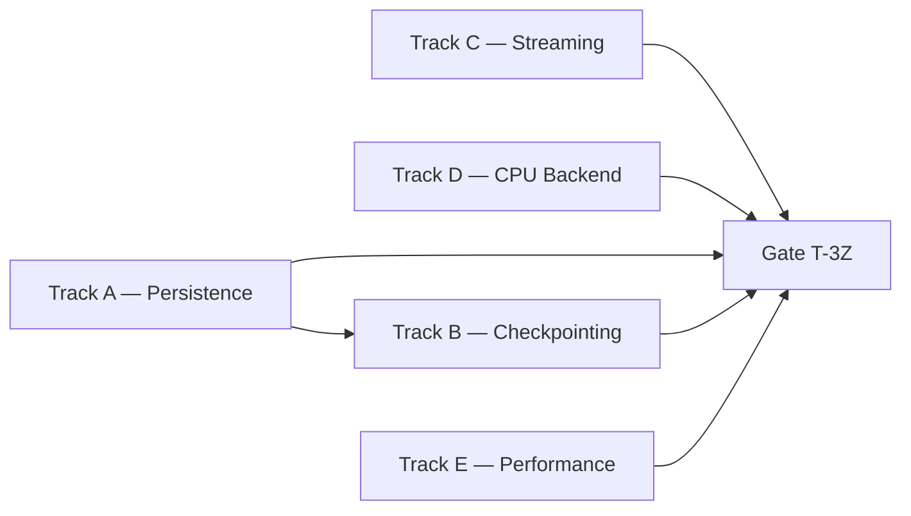

# Phase 3 Tasks — New Capability Packages (Track C)

**Phase:** 3
**Status:** `Done` (2026-05-01)
**Strategic Goal:** Add `pkg/persistence`, `pkg/checkpoint`, `pkg/dataset`, `pkg/compute/cpu`, and the performance harness — capabilities not present in the legacy code. All L1 parent specs Stable since 2026-05-01 Batch Stabilization. Closed 2026-05-01 via /magic.run with all 15 atomic tasks + 4 gate checks green.

## Track A — Persistence (`pkg/persistence`)

**Spec:** [l2-persistence-impl.md](../specifications/l2-persistence-impl.md) Stable v1.0.0
**L1 Parent:** l1-network-persistence.md Stable v1.0.0
**Depends on:** Phase 1 (pkg/utils/errors.go, pkg/nn Config[T])

- [x] **T-3A01** — `pkg/persistence/config.go`: `ConfigDoc[T]` struct with JSON snake_case tags; `WriteConfig[T](path, cfg) error` (atomic: tmp → Sync → Rename, PERS-2 canonicalization); `ReadConfig[T](path) (ConfigDoc[T], error)` (PERS-1 schema_version check).
- [x] **T-3A02** — `pkg/persistence/weights.go`: `WeightsDoc[T]` struct; `WriteWeights[T](path, cfg, w) error` (embeds `config_hash` SHA-256, PERS-3); `ReadWeights[T](cfgPath, wPath) (ConfigDoc[T], WeightsDoc[T], error)` (hash verify, PERS-4 ULP check for f32).
- [x] **T-3A03** — `pkg/persistence/persistence_test.go`: round-trip config + weights (float32 + float64), hash mismatch → ErrIntegrity, schema major mismatch → ErrUserConfig, determinism (double Write → byte-identical), ≥80% line coverage, `go test -race`.

## Track B — Checkpointing (`pkg/checkpoint`)

**Spec:** [l2-checkpointing-impl.md](../specifications/l2-checkpointing-impl.md) Stable v1.0.0
**L1 Parent:** l1-checkpointing.md Stable v1.0.0
**Depends on:** Track A (reuses persistence schema)

- [x] **T-3B01** — `pkg/checkpoint/snapshot.go` + `writer.go`: `Snapshot[T]` struct (`schema_version`, `iter`, `loss`, `min_loss_state`, `rng_state []byte`, `config`, `weights`, `timestamp`); `WriteSnapshot[T](dir, snap) error` atomic write (CHK-1); `compress/gzip` cold-tier helper (CHK-3).
- [x] **T-3B02** — `pkg/checkpoint/reader.go` + `retention.go`: `LoadLatest[T](dir) (Snapshot[T], error)` (plain/gzip auto-detect); `migrate(from, to, raw)` registry entry for schema 1.0; `sweep(dir, hotN, coldM)` retention goroutine on `time.Ticker` (CHK-3, CHK-4).
- [x] **T-3B03** — `pkg/checkpoint/checkpoint_test.go`: atomic write integrity (truncated file → rejected), gzip round-trip, retention sweep via `t.TempDir()`, schema versioning; ≥80% line coverage, `go test -race`.

## Track C — Data Streaming (`pkg/dataset`)

**Spec:** [l2-streaming-impl.md](../specifications/l2-streaming-impl.md) Stable v1.0.0
**L1 Parent:** l1-data-streaming.md Stable v1.0.0
**Depends on:** Phase 1 (pkg/utils/errors.go). Independent of Tracks A/B/D.

- [x] **T-3C01** — `pkg/dataset/dataset.go` + `slice.go`: `Dataset[T]` interface (`Next(ctx) (Batch[T], error)`, `Reset(ctx) error`, `Len() (int, bool)`); `Batch[T]` struct; `NewSliceDataset[T](inputs, targets [][]T, batchSize int) Dataset[T]` (DAT-1, DAT-2).
- [x] **T-3C02** — `pkg/dataset/csv.go` + `prefetch.go`: `NewCSVDataset[T](path, batchSize int) (Dataset[T], error)` (`bufio.Scanner`, `encoding/csv`); `Prefetch[T](inner Dataset[T], k int) Dataset[T]` channel-based decorator with backpressure `make(chan result[T], k+1)` (DAT-3, DAT-4).
- [x] **T-3C03** — `pkg/dataset/dataset_test.go`: slice adapter (all samples consumed, EOF correct), CSV parse (happy + malformed), prefetch backpressure, context cancellation, `ErrInputData` wrapping (DAT-4); ≥80% coverage, `go test -race`.

## Track D — CPU Compute Backend (`pkg/compute`)

**Spec:** [l2-backend-cpu.md](../specifications/l2-backend-cpu.md) Stable v1.0.0
**L1 Parent:** l1-compute-backend.md Stable v1.0.0
**Depends on:** Phase 1. Independent of Tracks A/B/C.

- [x] **T-3D01** — `pkg/compute/backend.go` + `registry.go`: `Backend[T utils.Float]` interface (`Name() string`, `Forward`, `Backward`, `UpdateWeights`, `Allocate`, `Free`); `Buffer[T]` handle; `Register(name, factory)` and `Get[T](name) (Backend[T], error)` registry (COMP-2).
- [x] **T-3D02** — `pkg/compute/cpu/cpu.go` + `kernels.go` + `buffer.go`: `Backend[T]{}` implementing all interface methods; `ToleranceF32 = 1e-5`, `ToleranceF64 = 1e-12` exported constants (COMP-1); `init()` registration; blank import anchor in `pkg/nn/init.go` (COMP-3 fallback chain, COMP-4 explicit transfer).
- [x] **T-3D03** — `pkg/compute/cpu/cpu_test.go`: Forward kernel vs hand-computed XOR weights, Backward delta accumulation, UpdateWeights step, Allocate/Free lifecycle, tolerance constant usage; ≥80% coverage, `go test -race`.

## Track E — Performance Harness (`pkg/network`, `pkg/nn`)

**Spec:** [l2-perf-impl.md](../specifications/l2-perf-impl.md) Stable v1.0.0
**L1 Parent:** l1-performance-contract.md Stable v1.0.0
**Depends on:** Phase 1 + Phase 2 complete. Runs after Tracks A–D (modifies existing packages).

- [x] **T-3E01** — `pkg/network/pool.go`: `sync.Pool` for `[]T` activation buffers (`acquireActivations`, `releaseActivations` with zero-before-return); preallocate `weightStorage`, `activationStorage`, `gradientStorage`, `biasStorage` flat slices at `Compile()` time (PERF-2, PERF-4). `WithProfiling[T](addr string) Option[T]` in `pkg/nn/options.go` spawning `net/http/pprof` listener (PERF-5).
- [x] **T-3E02** — `pkg/network/bench_network_test.go` + `pkg/nn/bench_nn_test.go`: `BenchmarkForward_XOR_f32`, `BenchmarkBackward_XOR_f32`, `BenchmarkCompile_DeepNetwork_f32`, `BenchmarkSnapshotWrite_f32`; `b.ReportAllocs()` on each; `GOMAXPROCS`-bounded worker pool stub in `pkg/network/worker.go` (PERF-3).
- [x] **T-3E03** — Run `go test -bench=. -benchmem -count=5 ./...` via PowerShell; record baseline in CHANGELOG; confirm inner loop allocations == 0 for warm path; verify `WithProfiling` starts HTTP server without crash.

## Phase Gate (T-3Z)

- [x] **T-3Z01** — `go build ./...` — green with all 5 new packages (`pkg/persistence`, `pkg/checkpoint`, `pkg/dataset`, `pkg/compute`, `pkg/compute/cpu`).
- [x] **T-3Z02** — `go test -cover ./...` — new packages ≥80% line coverage each; no existing package regresses below its Phase 2 baseline.
- [x] **T-3Z03** — `go test -race ./...` — race-clean on all packages (run via PowerShell for gcc access).
- [x] **T-3Z04** — STATE.md updated; CHANGELOG.md Phase 3 entry; PLAN.md Phase 3 → ✓ Done; Phase 4 unblocked.

## Track Execution Order

Track A → B (serial). Tracks C and D parallel with A. Track E last (modifies existing pkgs). Gate validates all.
