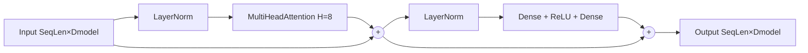

# Attention Mechanism

**Version:** 0.1.0
**Status:** Stable
**Layer:** concept

## Overview

Defines the contract for **attention layers** — sequence-processing primitives that compute weighted aggregations over context positions using query/key/value projections. Covers three composable primitives: `Attention` (single-head scaled dot-product), `SelfAttention` (Q/K/V derived from one input via separate projections), and `MultiHeadAttention` (parallel heads concatenated through an output projection). All three obey a uniform `(SeqLen × Dmodel) → (SeqLen × Dmodel)` shape contract, integrate with the existing topology model via the same `Layer[T]` interface as Dense / Conv / Recurrent, and support back-propagation through the softmax / scaled-matmul cascade.

Scope is intentionally limited to **dense scaled-dot-product self-attention with optional causal and padding masks**. Cross-attention (separate key/value source), positional encoding (input-side), relative-position bias, and sparse / linear attention variants are deferred to future spec amendments.

## Related Specifications

- [l1-neural-network-architecture.md](l1-neural-network-architecture.md) — Parent topology model; attention layers extend the layer category hierarchy
- [l1-recurrent-layers.md](l1-recurrent-layers.md) — Sibling sequence primitive (alternative paradigm; attention parallelizes what RNN serializes)
- [l1-conv-layers.md](l1-conv-layers.md) — Sibling sequence primitive (1-D conv with bounded receptive field; attention has unbounded receptive field)
- [l1-training-semantics.md](l1-training-semantics.md) — Attention layers participate in the forward/backward convergence loop; backward extends through softmax and scaled matmul
- [l1-weight-initialization.md](l1-weight-initialization.md) — Projection matrices use Xavier initialization
- [l1-network-persistence.md](l1-network-persistence.md) — Projection weights and biases must survive JSON round-trip
- [l1-normalization-layers.md](l1-normalization-layers.md) — LayerNorm is the canonical pre/post-attention normalization (BatchNorm is unsafe across sequence positions, same rationale as REC-C7)
- [l1-regularization.md](l1-regularization.md) — Optional Dropout on attention weights (post-softmax) is the canonical attention regularizer
- [l1-dynamic-topology.md](l1-dynamic-topology.md) — Attention layers can be inserted/removed at topology safe-points

## 1. Motivation

GoNN currently supports Dense, Conv1D / Conv2D, Norm, and (in flight per Phase 15 Track A) Recurrent layers. This covers tabular, image, time-series, and short-range sequence tasks via RNN / CNN approaches. Attention adds capabilities that neither RNN nor CNN cover well:

- **Long-range dependencies in parallel** — RNN processes sequences serially with `O(SeqLen)` sequential ops and gradient decay over long unrolls. Attention processes all positions in parallel with `O(SeqLen²)` work but no sequential dependency, so gradient flow is direct between any two positions.
- **Modern NLP architectures** — Transformer (encoder-decoder), BERT (bidirectional encoder), GPT (decoder-only causal) all rest on attention as the core primitive. Without an attention contract the library cannot host these architectures.
- **Content-based interactions** — RNN compresses history into a fixed-size hidden state; attention queries the full context per output position using learned similarity. This is a different inductive bias suited to dictionary-like / retrieval-like tasks.

Adding `Attention`, `SelfAttention`, and `MultiHeadAttention` as first-class layer types:

1. Completes the modern sequence-processing trio Conv + RNN + Attention in a single library.
2. Provides composable primitives for Transformer encoder / decoder blocks (built from MultiHeadAttention + LayerNorm + Dense + residual connections — already-existing primitives plus this spec).
3. Integrates with the existing `Layer[T]` interface so the rest of the topology model is unchanged.
4. Unlocks E17+ catalog examples (text classification, sentiment, sequence-to-sequence translation skeleton).

## 2. Constraints & Assumptions

- **ATT-C1 (Scaled dot-product only)**: Attention scoring is `QKᵀ / sqrt(Dk)` followed by softmax. Additive (Bahdanau) and cosine-similarity scoring are deferred.
- **ATT-C2 (Self-attention scope)**: v0.1 covers self-attention only — Q, K, V all derive from the same input tensor via three separate learned projections. Cross-attention (Q from one stream, K/V from another) is deferred.
- **ATT-C3 (Multi-head divisibility)**: For MultiHeadAttention with `H` heads, the model dimension `Dmodel` MUST be divisible by `H`. Per-head dimension is `Dk = Dmodel / H`. Construction with non-divisible `Dmodel` is a configuration error.
- **ATT-C4 (Causal masking is opt-in)**: A construction-time boolean flag enables future-position masking. Default is bidirectional (no causal mask). The mask is derived from sequence length internally — no user-supplied causal mask in v0.1.
- **ATT-C5 (Padding mask is opt-in)**: A per-forward boolean vector of length `SeqLen` (1 = valid, 0 = padding) MAY be supplied to mask padding positions. Default is all-valid.
- **ATT-C6 (No positional encoding internally)**: Position information is the caller's responsibility (sinusoidal or learned positional embedding — future sibling spec). Attention without positional encoding is permutation-equivariant by design; injecting position into the attention math here would over-couple two concerns.
- **ATT-C7 (Attention-weight dropout is opt-in)**: Per-position dropout applied to the post-softmax attention weights is the canonical attention regularizer (Vaswani et al. 2017). Defaults to disabled. Realized via the existing `Dropout` primitive from `l1-regularization.md` — this spec only declares the integration point, not a new regularizer.
- **ATT-C8 (Single-precision math)**: Attention math assumes float32 / float64 dense linear algebra. Lower-precision (FP16/BF16) attention with gradient scaling is a future amendment cross-cutting with a mixed-precision L1 spec.

## 3. Core Invariants

- **ATT-1 (Forward shape contract)**: For input `X ∈ (SeqLen, Dmodel)`, the layer produces output `Y ∈ (SeqLen, Dmodel)`. The output at position `i` is a weighted sum over ALL input positions (or all causally-valid positions if ATT-C4 is enabled). Shape is preserved end-to-end so attention layers stack uniformly with each other and with Dense / Conv / RNN siblings.

- **ATT-2 (Projection matrices)**: Three input projections produce per-position query, key, and value vectors:
  - `Q = X · W_q + b_q`,   `W_q ∈ (Dmodel, Dmodel)`,  `b_q ∈ (Dmodel,)`
  - `K = X · W_k + b_k`,   `W_k ∈ (Dmodel, Dmodel)`,  `b_k ∈ (Dmodel,)`
  - `V = X · W_v + b_v`,   `W_v ∈ (Dmodel, Dmodel)`,  `b_v ∈ (Dmodel,)`

  The attention output is projected back to model space:
  - `Y = (heads_concat) · W_o + b_o`,   `W_o ∈ (Dmodel, Dmodel)`,  `b_o ∈ (Dmodel,)`

- **ATT-3 (Scaled dot-product score)**: Attention scores and weights are:
  - `scores = Q · Kᵀ / sqrt(Dk)`,   `scores ∈ (SeqLen, SeqLen)`
  - `A = softmax(scores, axis = -1)`,   `A ∈ (SeqLen, SeqLen)`,   row-stochastic
  - `H = A · V`,   `H ∈ (SeqLen, Dv)`

  The `1 / sqrt(Dk)` factor is mandatory: omitting it causes softmax saturation as Dk grows, freezing gradient flow. The L2 implementation MUST verify the scaling via a unit test that bounds softmax entropy from below at moderate Dk.

- **ATT-4 (Multi-head split)**: For `H ≥ 1` heads (default H = 1), Dmodel splits into H per-head channels of size `Dk = Dmodel / H`. Per-head Q, K, V are obtained by reshaping the projection outputs from `(SeqLen, Dmodel)` to `(H, SeqLen, Dk)` — view-only, no copy. Scaled dot-product attention is computed independently per head, results are concatenated back to `(SeqLen, Dmodel)`, then the output projection `W_o` mixes information across heads.

- **ATT-5 (Causal masking)**: When ATT-C4 is enabled, before softmax the scores tensor is masked so position `i` cannot attend to positions `j > i`:
  `scores[i, j] ← -∞  if  j > i`
  This drives the corresponding softmax weights to zero. The mask is shape `(SeqLen, SeqLen)`, strictly upper-triangular (the diagonal is NOT masked — position `i` may attend to itself).

- **ATT-6 (Padding masking)**: When a per-forward padding mask `m ∈ {0, 1}^SeqLen` is supplied, before softmax the scores tensor is masked so attention to padded key positions is excluded:
  `scores[i, j] ← -∞  if  m[j] = 0,   ∀ i`
  Both masks compose additively — sum of two `-∞` terms is `-∞`, sum of `-∞` and `0` is `-∞` — so causal + padding masking on the same call is well-defined.

- **ATT-7 (Backward correctness)**: Gradient flow through the attention cascade obeys standard matmul and softmax chain rule. For `Y = (softmax(QKᵀ / sqrt(Dk))) V` the implementation MUST correctly accumulate gradients into `W_q`, `W_k`, `W_v`, `W_o` and their biases via the four-path decomposition:
  - through `V` → `W_v`
  - through `A` → softmax-backward → `Q` → `W_q`
  - through `A` → softmax-backward → `K` → `W_k`
  - through output projection → `W_o`
  
  Plus the input-gradient `∂L/∂X` accumulates from the three input-projection paths. This invariant is necessary for convergence.

- **ATT-8 (Weight initialization)**: All four projection matrices (`W_q`, `W_k`, `W_v`, `W_o`) MUST use Xavier initialization from `l1-weight-initialization.md`. Biases initialize to zero. Per-head view inherits the parent matrix's initialization — there is no re-init after the reshape.

- **ATT-9 (Persistence)**: All projection weight matrices and bias vectors must survive a JSON round-trip identically (l1-network-persistence contract). The construction-time mask flag (causal vs bidirectional), `Dmodel`, and `H` are part of the layer config and ARE persisted. Per-forward padding masks are runtime input only and are NOT persisted.

- **ATT-10 (Layer interface compatibility)**: All three attention types (`Attention`, `SelfAttention`, `MultiHeadAttention`) must satisfy the same `Layer[T]` interface as Dense / Conv / Recurrent so the network graph treats them uniformly. The `Forward(input)` signature accepts `(SeqLen, Dmodel)` and returns `(SeqLen, Dmodel)`. The padding mask is an optional auxiliary input — when not supplied the layer behaves as fully bidirectional / fully valid.

## 4. Detailed Design

### 4.1 Transformer Encoder Block (User-Composed Pattern)



This is the canonical Transformer **encoder block** built from one MultiHeadAttention + two LayerNorm + two Dense + two residual additions. The encoder block is NOT itself an L1 layer in this spec — it is a user-composed pattern. The L1 contract delivers MultiHeadAttention only; LayerNorm and Dense already exist as siblings.

Stacked attention layers feed the upper layer's `(SeqLen × Dmodel)` output directly as the lower layer's input — same shape contract preserved.

### 4.2 Shape Propagation Example

Input: `(SeqLen = 64, Dmodel = 128)`, `H = 8` heads, so `Dk = 16`.

- Q/K/V projections (each `Dmodel × Dmodel + Dmodel`): `128 · 128 + 128 = 16,512` parameters each. Total Q+K+V: `49,536`.
- Per-head reshape (view only, zero parameters): Q, K, V viewed as `(8, 64, 16)`.
- Scores per head: `(8, 64, 64)` (compute, not parameters).
- Softmax over last axis: `(8, 64, 64)`.
- Per-head output `A · V`: `(8, 64, 16)`.
- Concatenated heads: `(64, 128)`.
- Output projection `W_o, b_o`: `16,512` parameters.

**Total trainable parameters**: `4 × 16,512 = 66,048` per MultiHeadAttention layer.

### 4.3 Backward Pass

Forward pass caches: the Q/K/V projection outputs, the per-head reshape view, the softmax output (attention weights `A`), and the input tensor `X`. Backward walks the chain in reverse:

1. Upstream gradient `∂L/∂Y` flows back through the output projection → `∂L/∂(heads_concat)`, `∂L/∂W_o`, `∂L/∂b_o`.
2. Split per-head: `∂L/∂(A · V)` per head, shape `(SeqLen, Dk)`.
3. `∂L/∂A = ∂L/∂(A · V) · Vᵀ`,   `∂L/∂V_head = Aᵀ · ∂L/∂(A · V)`.
4. `∂L/∂A` → softmax-backward → `∂L/∂scores`. Softmax-backward for row-wise softmax: `∂L/∂scores[i, :] = (∂L/∂A[i, :] - <∂L/∂A[i, :], A[i, :]>) ⊙ A[i, :]`.
5. `∂L/∂Q_head = ∂L/∂scores · K_head / sqrt(Dk)`,   `∂L/∂K_head = ∂L/∂scoresᵀ · Q_head / sqrt(Dk)`.
6. Concatenate per-head gradients back to `(SeqLen, Dmodel)` — inverse of the multi-head reshape.
7. Project back through Q, K, V → `∂L/∂W_q`, `∂L/∂W_k`, `∂L/∂W_v`, biases, and `∂L/∂X` accumulating from the three input-projection paths.

The forward-cache buffer for the attention weights `A` is `O(H × SeqLen²)` per layer; for long sequences this dominates memory. The L2 implementation SHOULD log a warning when `H × SeqLen² × elementSize` exceeds a configurable threshold (suggested: 128 MiB) and SHOULD permit a future amendment to introduce flash-attention-style on-the-fly recomputation.

### 4.4 Masking Semantics

**Causal mask** is a static `SeqLen × SeqLen` strictly-upper-triangular boolean tensor (1 = mask out, 0 = keep). The L2 implementation MAY materialize it once per construction or apply a lazy upper-triangular check inside the scoring loop. Both implementations are observably equivalent.

**Padding mask** is a per-forward `SeqLen` boolean vector. The L2 implementation broadcasts it over the query axis before scoring:
`scores += (1 - m[None, :]) · -∞`
i.e. every query row receives the same column-wise mask. The query-axis padding (`m[:, None]`) is intentionally NOT applied at the scoring stage — masked-query rows still produce output, which is then ignored by the loss function (loss layer's responsibility, not attention's).

Both masks compose additively. When both are present the score tensor receives both `-∞` injections before softmax; the row-stochastic softmax then drives masked weights to zero exactly.

### 4.5 Add & Norm Composition

The canonical "Add & Norm" pattern from the Transformer paper has two variants:

```text
y_post = LayerNorm(X + MultiHeadAttention(X))    // post-norm (original 2017)
y_pre  = X + MultiHeadAttention(LayerNorm(X))    // pre-norm (more stable for deep stacks)
```

The pre-norm variant is more stable in deep stacks (gradients flow through the residual without going through the norm). The post-norm variant matches the original Transformer paper. Users compose either externally — the spec does NOT bake LayerNorm into the attention layer.

## 6. Implementation Notes

L2 realization should land in three sub-phases:

1. **L2-A — Single-head Attention baseline**: smallest surface; validates the `Layer[T]` integration, scaled-dot-product correctness via finite-difference gradient check, softmax-backward correctness, and JSON round-trip. Foundation for multi-head.
2. **L2-B — MultiHeadAttention**: reshape logic for splitting `Dmodel → (H, Dk)` (view only, no copy), per-head independent scoring, concatenation. Reuses L2-A scoring code.
3. **L2-C — Mask integration**: causal mask (static, construction-time flag) plus padding mask (runtime per-forward input). Verified via masked-vs-unmasked gradient equality on the unmasked positions and via row-stochasticity of `A` under both masks.

All three sub-phases share helper utilities (batched matmul wrappers, softmax-with-mask, projection wrappers). Package internal helpers SHOULD live in a single `cell.go` file mirroring the pattern established by `pkg/layer/recurrent/cell.go`.

## 7. Drawbacks & Alternatives

- **Alternative: Encoder block (MHA + LN + FFN + residual) as a single L1 layer** — rejected. Reduces composability. Users frequently customize the block (pre-norm vs post-norm, gated FFN, different activation in FFN, residual gating). Exposing MultiHeadAttention as a standalone primitive lets users assemble blocks; the cost is two extra Add+Norm wiring statements per block, which is acceptable for the flexibility gain.
- **Alternative: Cross-attention in v0.1** — rejected. Encoder-decoder architectures need it, but the spec doubles in surface (Q from one stream, K and V from another, with separate sequence lengths Lq ≠ Lk). v0.1 targets self-attention transformer encoders; cross-attention is a v0.2 amendment that splits ATT-1 into two cases (Lq = Lk for self, Lq ≠ Lk for cross).
- **Alternative: Sparse / linear attention (Performer, Linformer, Reformer, Longformer)** — out of scope. v0.1 is dense quadratic attention. Sparse variants are future amendments with their own invariant sets and their own approximation tradeoffs.
- **Bundling positional encoding into the layer** — rejected. Positional encoding is an input-side concern (added to the embedding tensor before attention) and orthogonal to the attention math. Sinusoidal positional embedding is a future sibling spec.
- **Per-head heterogeneous head sizes** — rejected. The standard formulation uses uniform head sizes `Dk = Dmodel / H`. Heterogeneous heads are an active research direction without a single dominant design; revisit when consensus emerges.
- **Flash-attention / fused softmax-matmul** — out of scope for L1. The contract permits but does not require the L2 implementation to fuse the softmax / matmul kernels. Flash-attention is a future L2 amendment cross-cutting with `l2-backend-gpu.md`.

## Canonical References

| Alias | Path | Purpose |
| :--- | :--- | :--- |
| `[ARCH-PARENT]` | `.design/main/specifications/l1-neural-network-architecture.md` | Parent topology model — attention layers slot into the Layer category hierarchy |
| `[REC-SIBLING]` | `.design/main/specifications/l1-recurrent-layers.md` | Sibling sequence primitive — attention is the modern alternative to RNN / LSTM / GRU; shares `(SeqLen × Features)` input shape pattern |
| `[CONV-SIBLING]` | `.design/main/specifications/l1-conv-layers.md` | Sibling sequence primitive — Conv1D shares the `(SeqLen × Features)` input shape pattern |
| `[TRAIN-SEM]` | `.design/main/specifications/l1-training-semantics.md` | Backward pass — attention extends the standard backward contract through softmax + scaled matmul |
| `[INIT-CONTRACT]` | `.design/main/specifications/l1-weight-initialization.md` | Xavier init on all four projection matrices per ATT-8 |
| `[PERSIST]` | `.design/main/specifications/l1-network-persistence.md` | JSON round-trip contract per ATT-9 |
| `[NORM-LAYER]` | `.design/main/specifications/l1-normalization-layers.md` | LayerNorm as canonical pre/post-attention norm per §4.5; BatchNorm-unsafe across sequence positions (same rationale as REC-C7) |
| `[REGULARIZER]` | `.design/main/specifications/l1-regularization.md` | Optional Dropout on post-softmax attention weights per ATT-C7 |
| `[DYN-TOPO]` | `.design/main/specifications/l1-dynamic-topology.md` | Safe-point insertion / removal rules for attention layers |

<!-- Downstream agent instruction: ATT-1..ATT-10 are the normative invariants. ATT-3 (scaling factor sqrt(Dk)) is the single most common source of training-divergence bugs in attention code — forgetting the scale causes softmax saturation for any Dk > 4. The L2 implementation MUST verify the scale via a unit test that confirms softmax output entropy stays bounded away from 0 for moderate Dk (e.g., Dk = 64). -->

## Document History

| Version | Date | Description |
| :--- | :--- | :--- |
| 0.1.0 | 2026-05-18 | Initial spec authored via `/magic-spec` Blank Trigger (Creative Spark 1). 10 invariants (ATT-1..ATT-10) covering scaled-dot-product attention, Q/K/V/O projection matrices, multi-head split (Dmodel = H × Dk), causal + padding masking, four-path backward, Xavier init on projections, JSON persistence of config + weights, and `Layer[T]` interface compatibility. 8 constraints (ATT-C1..ATT-C8) bounding scope to dense self-attention with optional masking; cross-attention / positional encoding / sparse variants / mixed precision deferred to future amendments. 3-phase L2 implementation plan (single-head baseline → multi-head split → mask integration). Promoted Draft → Stable via Trust Mode (C9): MVC satisfied (Overview + §3 Core Invariants + §4 Detailed Design); no RULES.md conflicts; no circular dependencies; technology-agnostic — no Go types, no concrete package paths in invariants. |
