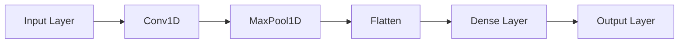

# Convolutional Layers

**Version:** 0.1.0
**Status:** Draft
**Layer:** concept

## Overview

Defines the contract for 1-D convolutional layers that process vector sequences and time-series
data. Covers three composable primitives: `Conv1D` (parameterised sliding-window feature
extraction), `MaxPool1D` / `AvgPool1D` (non-parametric spatial downsampling), and `Flatten`
(shape collapse to a 1-D vector compatible with existing Dense layers). Scope is intentionally
limited to 1-D; 2-D image convolutions are deferred pending an image dataset-loader spec.

## Related Specifications

- [l1-neural-network-architecture.md](l1-neural-network-architecture.md) — topology model; conv layers extend the layer category hierarchy
- [l2-layer-types.md](l2-layer-types.md) — L2 implementation target; Conv1D joins Input/Dense/Output hierarchy
- [l1-normalization-layers.md](l1-normalization-layers.md) — peer composable primitive; Conv+BatchNorm is a common pattern
- [l1-training-semantics.md](l1-training-semantics.md) — conv layers participate in the forward/backward convergence loop
- [l1-weight-initialization.md](l1-weight-initialization.md) — kernel weights require initialization (Xavier/He/Random)
- [l1-network-persistence.md](l1-network-persistence.md) — kernel weights + biases must survive JSON round-trip
- [l1-dynamic-topology.md](l1-dynamic-topology.md) — conv layers can be inserted/removed at topology safe-points

## 1. Motivation

GoNN currently supports only fully-connected Dense layers. This limits applicability to
structured vector data and precludes:

- 1-D time-series classification (ECG, audio features, sensor streams)
- Sequence pattern matching via sliding-window feature extraction
- Convolutional front-ends feeding existing Dense layers

Adding Conv1D as a first-class layer type:

1. Extends GoNN to 1-D sequence learning without external pre-processing.
2. Provides a composable primitive for future ResNet-style skip connections.
3. Integrates with the existing Layer interface so the rest of the topology model is unchanged.

## 2. Constraints & Assumptions

- **CONV-C1 (1-D only)**: Input and output are flat 1-D vectors. No multi-channel images.
- **CONV-C2 (Dense integration)**: Conv output feeds Dense layers through Flatten. No separate CNN-only mode.
- **CONV-C3 (Padding modes)**: Two modes: `PadValid` (no padding, output shorter than input) and `PadSame` (zero-padded, output length ≈ input length divided by stride).
- **CONV-C4 (Integer stride ≥ 1)**: Dilated convolutions are deferred.
- **CONV-C5 (Pool is non-parametric)**: MaxPool1D/AvgPool1D carry no trainable weights.
- **CONV-C6 (Flatten is identity on scalars)**: If input is already 1-D of the expected size, Flatten is a no-op.
- **CONV-C7 (Bias optional)**: Per-filter bias is opt-in; default is no bias.

## 3. Core Invariants

- **CONV-1 (Output shape)**:
  - `PadValid`: output length `O = floor((L - K) / S) + 1`. Requires `L ≥ K`.
  - `PadSame`: output length `O = ceil(L / S)`.
  - Total output vector size = `num_filters × O`.
- **CONV-2 (Filter weights)**: Each of the `num_filters` filters is an independent weight vector of length `kernel_size`. Filters are the only trainable parameters.
- **CONV-3 (Forward determinism)**: Given identical weights and input, Conv1D forward pass is deterministic (no stochasticity).
- **CONV-4 (Gradient correctness)**: Gradient of the loss w.r.t. each filter weight equals the cross-correlation of the input with the upstream gradient. This invariant is necessary for convergence.
- **CONV-5 (Pool semantics)**: MaxPool1D selects the maximum value in each non-overlapping window of `pool_size`. AvgPool1D computes the arithmetic mean. Neither has trainable parameters.
- **CONV-6 (Flatten)**: Concatenates all feature map values into a single 1-D vector. Output size is deterministic from the upstream output shape.
- **CONV-7 (Weight persistence)**: Conv1D kernel weights and biases must survive a JSON round-trip identically (l1-network-persistence contract).
- **CONV-8 (Weight initialization)**: Kernel weights must use one of the strategies from l1-weight-initialization.md (Xavier, He, or Random).
- **CONV-9 (Layer interface compatibility)**: All three types must satisfy the same layer interface as Dense so that the network graph can treat them uniformly.

## 4. Detailed Design

### 4.1 Layer Composition

Typical stack: `Input → Conv1D(filters, kernel) → MaxPool1D(pool) → Flatten → Dense → Output`.

### 4.2 Shape Propagation Example

Given input length 10, Conv1D(3 filters, kernel=3, stride=1, PadValid):

- O = floor((10-3)/1)+1 = 8
- Output vector: 3×8 = 24 elements
- MaxPool1D(pool=2): 3×4 = 12 elements
- Flatten → 12-element vector suitable as Dense input

### 4.3 Gradient Flow

Backpropagation through the conv stack requires:

1. **Flatten → Pool gradient**: rearrange upstream gradient back into feature-map shape; max-pool backwards routes gradient only to the max-position (or averages for AvgPool).
2. **Pool → Conv gradient (∂L/∂X)**: full correlation of upstream gradient with filters, summed over filters.
3. **Weight gradient (∂L/∂W)**: cross-correlation of input with upstream gradient per filter.

## 7. Drawbacks & Alternatives

- **Alternative: 2-D conv from the start** — rejected; no image dataset loader exists. Defer to a future major amendment.
- **Alternative: separate ConvLayer[T] interface** — rejected; a single `Layer[T]` interface keeps the topology model simple and avoids interface proliferation.
- **Dilated/transposed convolution** — deferred to a future spec amendment after Conv1D baseline is Stable.

## Document History

| Version | Date | Description |
| :--- | :--- | :--- |
| 0.1.0 | 2026-05-12 | Initial Draft — 1-D conv contract with 9 invariants. |
