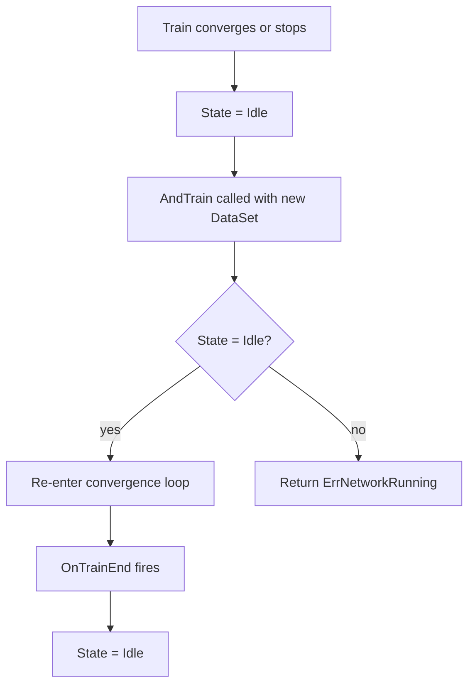

# Dataset Formats

**Version:** 0.1.0
**Status:** Draft
**Layer:** concept

## Overview

Defines the contract for structured binary dataset formats and the continuation training API.
Covers two areas: (1) the **IDX binary format** used by the MNIST handwritten-digit dataset
(magic number, dtype, multi-dimensional header, row-major data body), and (2) the
**`AndTrain` continuation contract** — a mechanism to resume training on a new data iterator
without reconstructing the network. Both are technology-agnostic contracts that extend
`l1-data-streaming.md` without modifying it.

## Related Specifications

- [l1-data-streaming.md](l1-data-streaming.md) — parent streaming contract; formats plug in as `DataSet[T]` producers
- [l1-training-semantics.md](l1-training-semantics.md) — `AndTrain` uses the same convergence loop contract
- [l1-network-persistence.md](l1-network-persistence.md) — loaded data must not affect serialised model state
- [l1-training-control.md](l1-training-control.md) — continuation training respects Pause/Resume/Stop lifecycle
- [l1-training-callbacks.md](l1-training-callbacks.md) — callbacks registered before `Train` remain active through `AndTrain`

## 1. Motivation

Two backlog items from Phase 4 remain unimplemented because the required spec did not exist:

- **E06 MNIST preset**: The MNIST benchmark requires loading IDX-format binary files. The
  existing `pkg/dataset/` supports only CSV streaming; IDX binary is a separate format.
- **E10 AndTrain continuation**: Users need to train a model in multiple passes with different
  datasets (pre-training → fine-tuning) without rebuilding the network from scratch.

This spec reserves the API contracts for both, enabling spec-driven implementation without
guessing at interface boundaries.

## 2. Constraints & Assumptions

- **FMT-C1 (IDX spec compliance)**: The IDX format is precisely defined by the MNIST website.
  The reader must be byte-exact; no inference or tolerance for non-standard files.
- **FMT-C2 (Stream, not bulk)**: IDX files can be large (60 000+ images). The loader MUST
  produce records via the existing streaming `DataSet[T]` interface; bulk in-memory load is
  not permitted as the default.
- **FMT-C3 (AndTrain is additive)**: `AndTrain` does not reset weights, biases, or running
  statistics. It is purely a new iteration over fresh data using the already-converged network.
- **FMT-C4 (Single-precision compatibility)**: Float32 and Float64 are both valid numeric
  precisions for MNIST pixel data (normalised to [0,1]).
- **FMT-C5 (No label encoding in spec)**: One-hot encoding of MNIST labels is the caller's
  responsibility; the loader emits raw label bytes as integers cast to `T`.

## 3. Core Invariants

- **FMT-1 (IDX magic number)**: A valid IDX file begins with two zero bytes, a data-type byte
  (`0x08`=uint8, `0x09`=int8, `0x0B`=int16, `0x0C`=int32, `0x0D`=float32, `0x0E`=float64),
  and a dimension-count byte. Any other magic sequence MUST produce a descriptive error.
- **FMT-2 (Dimension header)**: Following the magic, `ndim × 4` bytes encode big-endian int32
  dimension sizes. The product of all dimension sizes equals the number of data elements.
- **FMT-3 (Row-major order)**: Data elements are stored in row-major (C) order. The loader
  must reconstruct each sample as a flat vector of length `product(dims[1:])`.
- **FMT-4 (Streaming contract)**: The IDX loader MUST implement the `DataSet[T]` streaming
  interface from `l1-data-streaming.md` — bounded memory, cancellable, supports prefetch.
- **FMT-5 (MNIST pairing)**: An MNIST dataset pairs an image IDX file with a label IDX file.
  The loader MUST enforce that both files contain the same number of records; mismatched
  counts MUST produce an error before any data is emitted.
- **FMT-6 (AndTrain convergence contract)**: `AndTrain(dataset, options...)` re-enters the
  training loop from `l1-training-semantics.md` using the network's current weight state.
  The convergence criteria (max iterations, loss limit, min-loss rollback) are re-applied
  fresh; progress from the previous `Train` call does NOT carry over.
- **FMT-7 (AndTrain callback continuity)**: Callbacks registered before `Train` remain
  registered through subsequent `AndTrain` calls. A new `OnTrainEnd` event fires at the
  end of each `AndTrain` invocation independently.
- **FMT-8 (AndTrain control lifecycle)**: The training-control state machine resets to
  `Idle` between `Train` and `AndTrain`. Calling `AndTrain` on a network currently in
  `Running` state MUST return an error.

## 4. Detailed Design

### 4.1 IDX Binary Format

```
Offset  Size  Value
0       1     0x00 (zero)
1       1     0x00 (zero)
2       1     dtype code (0x08 = uint8 for MNIST images/labels)
3       1     number of dimensions N
4       4×N   big-endian int32 per dimension
...     *     data elements, row-major
```

### 4.2 MNIST Dataset Pair

```mermaid
graph LR
    ImgFile[train-images-idx3-ubyte] --> Loader[MNISTLoader]
    LblFile[train-labels-idx1-ubyte] --> Loader
    Loader --> DS[DataSet: (image []T, label []T) per record]
    DS --> Train[Train / AndTrain]
```

### 4.3 AndTrain Continuation Flow



## 7. Drawbacks & Alternatives

- **Alternative: bulk in-memory MNIST load** — simpler implementation but violates FMT-C2;
  rejected to maintain the bounded-memory guarantee for large datasets.
- **Alternative: separate `Continue()` method** — naming; `AndTrain` was chosen to mirror
  the existing `Train` signature and make continuation chains readable.
- **Alternative: carry convergence state across calls** — would complicate the loss-rollback
  invariant; keeping each call independent (FMT-6) is simpler and more predictable.

## Document History

| Version | Date | Description |
| :--- | :--- | :--- |
| 0.1.0 | 2026-05-12 | Initial Draft — IDX binary format + AndTrain continuation contract. |
