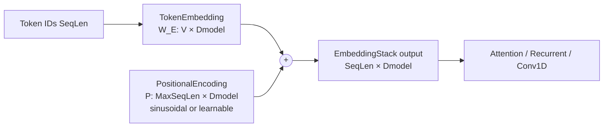

# Embedding Layers

**Version:** 0.1.0
**Status:** Stable
**Layer:** concept

## Overview

Defines the contract for **embedding layers** — input-side primitives that lift discrete token IDs (and their positions) into continuous `(SeqLen × Dmodel)` tensor space consumed by downstream sequence layers (Attention, Recurrent, Conv1D). Covers three composable primitives: `TokenEmbedding` (vocabulary lookup table mapping integer IDs to dense vectors), `PositionalEncoding` (positional signal — sinusoidal or learnable), and `EmbeddingStack` (canonical composition that sums TokenEmbedding + PositionalEncoding into a single tensor).

Scope is intentionally limited to **dense one-hot lookup + additive positional signal**. Sub-word tokenization (BPE, WordPiece), segment embeddings (BERT-style two-sentence inputs), rotary position embeddings (RoPE), and relative position biases are deferred to future spec amendments.

## Related Specifications

- [l1-neural-network-architecture.md](l1-neural-network-architecture.md) — Parent topology model; embeddings join the layer category hierarchy as input-side primitives
- [l1-attention.md](l1-attention.md) — Primary downstream consumer; attention has no internal positional encoding (ATT-C6) — caller (this spec) is responsible
- [l1-recurrent-layers.md](l1-recurrent-layers.md) — Alternative downstream consumer; recurrent layers have implicit positional bias via serial unrolling but still benefit from token embeddings
- [l1-conv-layers.md](l1-conv-layers.md) — Alternative downstream consumer; Conv1D over embedded sequences (e.g. text classification with TextCNN)
- [l1-weight-initialization.md](l1-weight-initialization.md) — Embedding table and learnable positional matrix initialization
- [l1-network-persistence.md](l1-network-persistence.md) — Lookup tables must survive JSON round-trip
- [l1-training-semantics.md](l1-training-semantics.md) — Embedding gradient is sparse (only rows for tokens present in batch update)
- [l1-regularization.md](l1-regularization.md) — Optional Dropout applied to embedding output before downstream consumers
- [l1-error-taxonomy.md](l1-error-taxonomy.md) — Out-of-vocabulary lookup is a user-config error category

## 1. Motivation

GoNN now hosts Attention (l1-attention.md ATT-1..10), Recurrent (REC-1..9), and Conv1D (CONV-1..9) primitives. All three operate on a `(SeqLen × Features)` continuous-valued tensor. Discrete-input sequence tasks — text classification, language modelling, machine translation — require a lift from integer token IDs to continuous vectors before the sequence layers can consume them. Without an embedding contract:

- Users cannot express NLP pipelines in the library at all — there is no documented way to convert a vocabulary index sequence into the float tensor that Attention expects.
- The Attention layer is architecturally orphaned for its primary use case (language modelling) because no sibling spec produces the positional information ATT-C6 explicitly delegates to the caller.
- Examples catalog (l2-usage-examples) cannot extend to text tasks; the catalog gap (E17+) is bounded by this missing primitive.

Adding `TokenEmbedding`, `PositionalEncoding`, and `EmbeddingStack` as first-class layer types:

1. Closes the discrete-to-continuous gap so the existing sequence layers (Attention, Recurrent, Conv1D) become usable for NLP.
2. Provides the positional signal that Attention explicitly does not bake in (ATT-C6), satisfying its precondition.
3. Establishes a layered tokenization story: this spec covers ID → vector lift; future amendments may add sub-word tokenization that produces the ID stream.
4. Unlocks E17+ catalog examples (sentiment classification, character-level language model, transformer encoder over MNIST patches).

## 2. Constraints & Assumptions

- **EMB-C1 (Integer-ID input only)**: TokenEmbedding accepts a `(SeqLen,)` vector of non-negative integer token IDs. The library does NOT include a tokenizer — IDs are produced upstream by user code or a future tokenization spec.
- **EMB-C2 (Closed vocabulary)**: Vocabulary size `V` is fixed at construction. IDs in `[0, V)` are valid; IDs outside this range are a user-config error (EMB-7 invariant). Special tokens (PAD, UNK, BOS, EOS) are user-managed positions within `[0, V)` — the spec does not reserve indices.
- **EMB-C3 (Additive position composition)**: When TokenEmbedding and PositionalEncoding are composed via EmbeddingStack, the position signal is **added** (element-wise) to the token vector. Concatenation, gating, and multiplicative composition are deferred to future amendments.
- **EMB-C4 (Max sequence length is bounded)**: PositionalEncoding requires a maximum sequence length `MaxSeqLen` fixed at construction. Inputs with `SeqLen > MaxSeqLen` are a user-config error. `SeqLen < MaxSeqLen` is always valid (positions beyond the input length are simply unused for that forward pass).
- **EMB-C5 (Sinusoidal is deterministic)**: Sinusoidal PositionalEncoding has zero learnable parameters — its values are derived from position index and dimension via fixed sine/cosine formula. Persistence stores only `MaxSeqLen` and `Dmodel`; the table is regenerated on load.
- **EMB-C6 (Learnable position is bounded)**: Learnable PositionalEncoding has `MaxSeqLen × Dmodel` learnable parameters. It cannot generalize beyond `MaxSeqLen` at inference (no extrapolation guarantee). Sinusoidal is the recommended default when extrapolation matters.
- **EMB-C7 (No batch dimension)**: Following the library's flat-tensor convention, embedding layers operate on a single `(SeqLen,)` ID sequence per Forward call. Batched processing is the training loop's responsibility, mirroring the convention used by Recurrent / Attention layers.
- **EMB-C8 (Float Dmodel range)**: Dmodel must equal the downstream layer's expected feature dimension. Mismatch is a compile-time error caught by the topology validator.

## 3. Core Invariants

- **EMB-1 (TokenEmbedding shape contract)**: For input `IDs ∈ [0, V)^SeqLen` (integer vector of length `SeqLen`), TokenEmbedding produces output `E ∈ (SeqLen, Dmodel)` where row `i` equals the `IDs[i]`-th row of the learned embedding table `W_E ∈ (V, Dmodel)`. The lookup is `E[i, :] = W_E[IDs[i], :]` for all `i ∈ [0, SeqLen)`. Shape contract: `(SeqLen,) → (SeqLen, Dmodel)`.

- **EMB-2 (TokenEmbedding parameters)**: TokenEmbedding owns one learnable matrix `W_E ∈ (V, Dmodel)` — total `V × Dmodel` parameters. There is no bias term. The vocabulary size `V` and the model dimension `Dmodel` are construction-time constants and persist as part of layer config.

- **EMB-3 (PositionalEncoding shape contract)**: PositionalEncoding produces `P ∈ (SeqLen, Dmodel)` independent of the input content — it depends only on `SeqLen` and `Dmodel`. For shorter inputs (`SeqLen < MaxSeqLen`) the layer returns the first `SeqLen` rows of its `(MaxSeqLen, Dmodel)` table.

- **EMB-4 (Sinusoidal formula)**: Sinusoidal PositionalEncoding values follow the Vaswani et al. 2017 convention:
  - `P[pos, 2k]     = sin(pos / 10000^(2k / Dmodel))`
  - `P[pos, 2k + 1] = cos(pos / 10000^(2k / Dmodel))`
  for all `pos ∈ [0, MaxSeqLen)` and `k ∈ [0, Dmodel / 2)`. When `Dmodel` is odd, the final dimension is filled with a single `sin` term and the corresponding `cos` is omitted. This formula gives unique encodings per position and supports relative-position generalization via the sinusoid's linear-transform property.

- **EMB-5 (Learnable positional parameters)**: Learnable PositionalEncoding owns one learnable matrix `W_P ∈ (MaxSeqLen, Dmodel)` — total `MaxSeqLen × Dmodel` parameters. Initialized small-random (Xavier on dimension `Dmodel`) so its initial contribution does not swamp the token signal.

- **EMB-6 (EmbeddingStack composition)**: EmbeddingStack applies TokenEmbedding then adds PositionalEncoding:
  - `Y = TokenEmbedding(IDs) + PositionalEncoding(SeqLen)`
  - `Y ∈ (SeqLen, Dmodel)`
  Composition is order-independent because addition is commutative; however the canonical authoring is "lookup then add" so the implementation can short-circuit position computation when sinusoidal cached values are available.

- **EMB-7 (Vocabulary bounds enforcement)**: At Forward time, the implementation MUST validate `0 ≤ IDs[i] < V` for all `i`. An out-of-range ID raises a category-tagged error (per l1-error-taxonomy) — never silent wrap-around, never silent clamp. The error message MUST report the offending position `i`, the offending ID value, and the vocabulary size `V`.

- **EMB-8 (Persistence)**: TokenEmbedding `W_E` and Learnable PositionalEncoding `W_P` must survive JSON round-trip identically (l1-network-persistence contract). Sinusoidal PositionalEncoding persists only `{MaxSeqLen, Dmodel}` — the lookup table is regenerated on load (EMB-C5). Layer type tag distinguishes "sinusoidal" vs "learnable" so deserialization picks the correct branch.

- **EMB-9 (Backward — sparse gradient for TokenEmbedding)**: Backward through TokenEmbedding accumulates upstream gradient into `W_E` only for rows whose IDs appeared in the current batch. Formally: for each `i ∈ [0, SeqLen)`, `∂L/∂W_E[IDs[i], :] += ∂L/∂E[i, :]`. Repeated IDs in the same sequence sum their contributions to the same row. There is no `∂L/∂IDs` — the input is discrete and not differentiable. PositionalEncoding (sinusoidal) has no gradient flow; learnable PositionalEncoding accumulates dense `∂L/∂W_P` for positions `[0, SeqLen)`.

- **EMB-10 (Layer interface compatibility)**: All three embedding types (`TokenEmbedding`, `PositionalEncoding`, `EmbeddingStack`) satisfy the same `Layer[T]` interface as Dense / Conv / Recurrent / Attention. TokenEmbedding's `Forward` signature accepts an integer ID slice; EmbeddingStack accepts the same. PositionalEncoding alone accepts an empty input (or a length hint) and returns its position table — it is rarely used standalone but the interface remains uniform.

## 4. Detailed Design

### 4.1 Component Surface



`EmbeddingStack` is the canonical user-facing layer for NLP pipelines. `TokenEmbedding` and `PositionalEncoding` are exposed standalone so users can compose alternate stacks (e.g. token-only for tasks where position is encoded by the downstream Conv1D, or position-only for ablation studies).

### 4.2 Shape Propagation Example

Vocabulary `V = 10000`, model dimension `Dmodel = 128`, max sequence length `MaxSeqLen = 512`, actual input length `SeqLen = 64`.

- **TokenEmbedding parameters**: `V × Dmodel = 10000 × 128 = 1,280,000` floats.
- **Sinusoidal PositionalEncoding parameters**: 0 (table regenerated from formula).
- **Learnable PositionalEncoding parameters**: `MaxSeqLen × Dmodel = 512 × 128 = 65,536` floats.
- **Forward output**: `(SeqLen, Dmodel) = (64, 128)` regardless of position-encoding variant.
- **Per-position cost**: TokenEmbedding is O(SeqLen × Dmodel) memory write (no compute beyond indexing). PositionalEncoding add is O(SeqLen × Dmodel) FLOPs.

Compared to a comparably-sized Dense layer (e.g. `Dense(Dmodel = 128, OutFeatures = 128)` = `128 × 128 + 128 ≈ 16,512` parameters), TokenEmbedding dominates parameter count for any non-trivial vocabulary — this is expected and motivates EMB-9's sparse update semantics.

### 4.3 Backward Pass — Sparse Update Rationale

TokenEmbedding's `W_E` is a `(V, Dmodel)` matrix where `V` is typically 10⁴–10⁵. A dense `∂L/∂W_E` accumulator the same shape would dominate memory and cache footprint despite most rows being zero (only IDs that appeared in the batch have non-zero gradient). The L2 implementation MUST:

1. Maintain a sparse representation of gradient: a list of `(rowID, vector)` pairs, or a dense buffer with a "touched rows" bitset.
2. Apply updates only to touched rows when the optimizer Step runs.
3. NOT zero the full `W_E` gradient buffer on every step — only the touched rows from the previous step.

This is a soft requirement of the L1 contract — the L2 implementation chooses the data structure but MUST achieve `O(unique IDs in batch × Dmodel)` per-step gradient and update work, not `O(V × Dmodel)`.

Learnable PositionalEncoding's `W_P` is `(MaxSeqLen, Dmodel)` — for typical NLP settings (`MaxSeqLen ≤ 1024`) this is two orders of magnitude smaller than `W_E`, so dense gradient is acceptable. Only positions `[0, SeqLen)` receive updates per batch.

### 4.4 Composition Patterns

**Pattern A — Standard transformer input (recommended)**:

```text
IDs(SeqLen,) ─► EmbeddingStack(V, Dmodel, MaxSeqLen, sinusoidal)
              └─► (SeqLen, Dmodel) ─► TransformerEncoder × N
```

**Pattern B — Position-aware Conv1D classifier**:

```text
IDs(SeqLen,) ─► EmbeddingStack(V, Dmodel, MaxSeqLen, learnable)
              └─► (SeqLen, Dmodel) ─► Conv1D × M ─► Flatten ─► Dense
```

**Pattern C — Position-free (rare; for permutation-invariant tasks)**:

```text
IDs(SeqLen,) ─► TokenEmbedding(V, Dmodel)
              └─► (SeqLen, Dmodel) ─► MeanPool ─► Dense
```

**Pattern D — Recurrent over embeddings**:

```text
IDs(SeqLen,) ─► TokenEmbedding(V, Dmodel)
              └─► (SeqLen, Dmodel) ─► LSTM ─► Dense
```

RNNs have implicit positional bias via serial unrolling so adding PositionalEncoding is optional and often hurts; the canonical Pattern D omits position.

### 4.5 Initialization

- **TokenEmbedding `W_E`**: Xavier-uniform on dimension `Dmodel` (fan-in = 1 since lookup is one-hot, fan-out = `Dmodel`). Bias zero (no bias term per EMB-2). Some recipes prefer normal(0, 1/sqrt(Dmodel)) which is equivalent up to constant; either is acceptable.
- **Learnable PositionalEncoding `W_P`**: Xavier-uniform on dimension `Dmodel`, OR small normal(0, 0.02) following BERT convention. The L2 implementation chooses one default and documents it. Either choice satisfies the invariant.
- **Sinusoidal**: No initialization (formula-defined per EMB-4).

## 6. Implementation Notes

L2 realization should land in three sub-phases:

1. **L2-A — TokenEmbedding baseline**: smallest surface; integer-ID input, single lookup matrix, sparse backward, finite-difference gradient check on a small `V`, JSON round-trip. Validates the layer interface and the sparse gradient pattern.
2. **L2-B — PositionalEncoding (sinusoidal + learnable)**: sinusoidal table generator with formula correctness test; learnable variant reusing the standard Xavier init plumbing; persistence branching on type tag.
3. **L2-C — EmbeddingStack composition**: thin wrapper that owns one TokenEmbedding + one PositionalEncoding; Forward calls TokenEmbedding then sums in PositionalEncoding output; Backward routes upstream gradient to both children (sparse to TokenEmbedding, dense to learnable position; sinusoidal is no-op).

All three share helper utilities (lookup index validation per EMB-7, sinusoidal table builder, sparse gradient accumulator). Package internal helpers SHOULD live in a single `table.go` mirroring the pattern established by `pkg/layer/attention/cell.go`.

## 7. Drawbacks & Alternatives

- **Alternative: Bake TokenEmbedding into TransformerEncoder block** — rejected. Reduces composability. Many architectures separate vocabulary (large, sparsely-updated) from the encoder stack (smaller, densely-updated) for distributed training reasons. Embedding-as-layer also enables Pattern C (no position) and Pattern D (RNN over embeddings) that a bundled approach would forbid.
- **Alternative: Concatenate position rather than add** — rejected. Adding preserves the input dimensionality (no shape change for downstream layers); concatenation would force `Dmodel` to be split between token and position channels and complicate the Attention compatibility story. The additive choice matches Vaswani et al. 2017 and BERT and is the dominant convention.
- **Alternative: Rotary Position Embedding (RoPE)** — out of scope for v0.1. RoPE applies position via rotation matrices inside the Attention scoring step rather than as an additive input. It is a v0.2 amendment that cross-cuts with l1-attention.md (ATT-C6 would loosen). Deferred to keep v0.1 scope bounded.
- **Alternative: Sub-word tokenization (BPE / WordPiece) bundled into TokenEmbedding** — out of scope. Tokenization is upstream of this spec; bundling it would force a tokenizer dependency and contradict C29 (zero external dependencies). A future `l1-tokenization.md` may cover this.
- **Alternative: Relative position bias (T5-style)** — out of scope. Relative position encoding lives inside the Attention layer scoring step (similar to RoPE) and is a v0.2 amendment to l1-attention.md.
- **Alternative: Embedding sharing (tied input/output weights for language modelling)** — out of scope for v0.1. Weight tying between TokenEmbedding and a final Dense projection is a common LM optimization that requires shared-parameter plumbing across non-adjacent layers. Deferred to a future shared-weights spec amendment.

## Canonical References

| Alias | Path | Purpose |
| :--- | :--- | :--- |
| `[ARCH-PARENT]` | `.design/main/specifications/l1-neural-network-architecture.md` | Parent topology model — embedding layers slot into the Layer category hierarchy as input-side primitives |
| `[ATTN-CONSUMER]` | `.design/main/specifications/l1-attention.md` | Primary downstream consumer; ATT-C6 explicitly delegates positional encoding to caller (this spec) |
| `[REC-CONSUMER]` | `.design/main/specifications/l1-recurrent-layers.md` | Alternative downstream consumer; RNN over token embeddings — Pattern D in §4.4 |
| `[CONV-CONSUMER]` | `.design/main/specifications/l1-conv-layers.md` | Alternative downstream consumer; Conv1D-over-embeddings — Pattern B in §4.4 |
| `[INIT-CONTRACT]` | `.design/main/specifications/l1-weight-initialization.md` | Xavier init for `W_E` and learnable `W_P` per EMB-5 / §4.5 |
| `[PERSIST]` | `.design/main/specifications/l1-network-persistence.md` | JSON round-trip contract per EMB-8 |
| `[TRAIN-SEM]` | `.design/main/specifications/l1-training-semantics.md` | Sparse gradient accumulation contract for `W_E` per EMB-9 / §4.3 |
| `[ERR-TAXONOMY]` | `.design/main/specifications/l1-error-taxonomy.md` | Out-of-vocabulary error category per EMB-7 |
| `[REGULARIZER]` | `.design/main/specifications/l1-regularization.md` | Optional Dropout on EmbeddingStack output before downstream Attention / Recurrent / Conv1D |

<!-- Downstream agent instruction: EMB-1..EMB-10 are normative. EMB-9 (sparse gradient for W_E) is the single highest-leverage correctness/performance invariant — a naive dense O(V × Dmodel) accumulator will functionally work but will dominate runtime memory and slow training by 1-2 orders of magnitude on realistic vocabularies. The L2 implementation MUST use a sparse representation (touched-rows bitset or hashed sparse map). Out-of-range ID handling per EMB-7 — never silent clamp or wrap; always raise a category-tagged error with the offending position/value. -->

## Document History

| Version | Date | Description |
| :--- | :--- | :--- |
| 0.1.0 | 2026-05-19 | Initial spec authored via `/magic-spec` Blank Trigger (Creative Spark 2). 10 invariants (EMB-1..EMB-10) covering TokenEmbedding lookup contract, sinusoidal + learnable PositionalEncoding, EmbeddingStack additive composition, vocabulary-bounds enforcement, JSON persistence with type-tag branching, sparse-gradient update for `W_E`, and `Layer[T]` interface compatibility. 8 constraints (EMB-C1..EMB-C8) bounding scope to integer-ID input, additive position composition, max-sequence-length cap; sub-word tokenization / segment embeddings / RoPE / relative-position bias / weight tying deferred to future amendments. 3-phase L2 implementation plan (TokenEmbedding baseline → PositionalEncoding variants → EmbeddingStack composer). Promoted Draft → Stable via Trust Mode (C9): MVC satisfied (Overview + §3 Core Invariants + §4 Detailed Design); no RULES.md conflicts; no circular dependencies; technology-agnostic — no Go types, no concrete package paths in invariants. |
