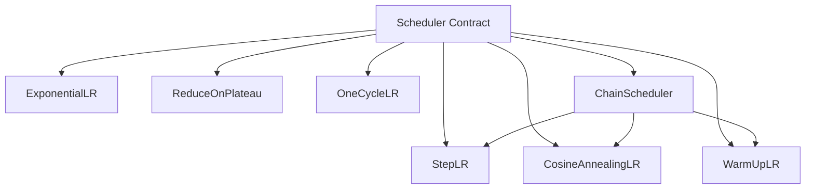
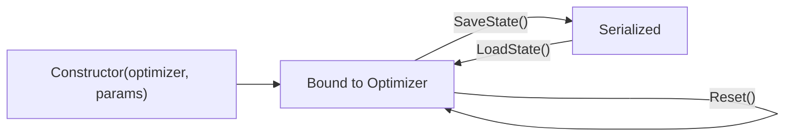

# Learning Rate Scheduling

**Version:** 1.0.0
**Status:** Stable
**Layer:** concept

## Overview

Defines the abstract contract for learning rate schedulers — functions that adjust the
effective learning rate over the course of training. A scheduler wraps an optimizer and
modifies its rate at defined intervals (per-epoch, per-step, or on-demand). This spec is
technology-agnostic; `l2-lr-scheduling-impl.md` (future) will realize it in Go.

## Related Specifications

- [l1-optimizer-strategies.md](l1-optimizer-strategies.md) — Optimizer that the scheduler wraps
- [l1-training-semantics.md](l1-training-semantics.md) — Training loop that drives scheduler steps
- [l1-performance-contract.md](l1-performance-contract.md) — Deep networks benefit most from scheduling
- [l2-deep-builder.md](l2-deep-builder.md) — Deep architectures that typically require LR scheduling

## 1. Motivation

A fixed learning rate is the single most common cause of:

- **Slow convergence**: rate too low wastes compute; rate too high oscillates.
- **Missed minima**: large rate overshoots narrow valleys.
- **Training instability**: deep networks (100+ layers) require warm-up phases.

The existing `LearningRate() T` accessor on optimizers (OPT-3 in `l1-optimizer-strategies.md`)
returns the rate but provides no mechanism to change it over time. A scheduler closes this gap
by providing a structured, composable way to adjust the rate.

## 2. Constraints & Assumptions

- A scheduler **wraps** an optimizer — it does not replace it. The optimizer's `Step()` contract
  is unchanged.
- Schedulers are called **once per scheduling interval** (epoch, step, or event). The training
  loop is responsible for calling the scheduler at the correct time.
- Scheduler state (current step, initial LR, etc.) is private. External code reads the
  effective rate via the optimizer's `LearningRate()`.
- Schedulers MUST be serializable for checkpointing — same `SaveState()/LoadState()` contract
  as optimizers (OPT-6).
- Composing multiple schedulers (e.g., warm-up then cosine decay) is a first-class concern.

## 3. Core Invariants

- **LRS-1**: A scheduler has a `Step()` method that advances the schedule by one interval
  and updates the optimizer's learning rate accordingly. Returns the new effective rate.
- **LRS-2**: After construction, the scheduler MUST NOT modify the optimizer's rate until
  the first `Step()` call. The initial rate is the optimizer's configured rate at bind time.
- **LRS-3**: Schedulers are composable — a `ChainScheduler` takes an ordered list of
  (scheduler, duration) pairs and applies each sub-scheduler for its duration window.
- **LRS-4**: A scheduler with an expired duration (step > totalSteps) MUST hold the last
  computed rate constant — no rate drift after schedule completion.
- **LRS-5**: `Reset()` restores the scheduler to its initial state (step 0, original rate).
  This enables training restarts without reconstructing the scheduler.
- **LRS-6**: Scheduler state MUST survive serialization round-trips: `LoadState(SaveState())`
  produces bit-identical subsequent rate outputs.

## 5. Detailed Design

### 5.1 Scheduler Taxonomy



### 5.2 Algorithm Reference

| Name | Parameters | Rate formula at step t |
| :--- | :--- | :--- |
| StepLR | stepSize, gamma | lr₀ × gamma^(⌊t / stepSize⌋) |
| ExponentialLR | gamma | lr₀ × gamma^t |
| CosineAnnealingLR | T_max, lr_min | lr_min + 0.5(lr₀ − lr_min)(1 + cos(πt / T_max)) |
| WarmUpLR | warmupSteps | lr₀ × (t / warmupSteps) for t < warmupSteps; lr₀ after |
| ReduceOnPlateau | patience, factor, threshold | lr × factor when metric stalls for patience steps |
| OneCycleLR | maxLR, totalSteps, phases | 3-phase: warm-up → cosine decay → final anneal |

### 5.3 Scheduler Lifecycle



### 5.4 Composition — ChainScheduler

The most common pattern for deep networks is warm-up followed by decay:

```text
ChainScheduler([
    (WarmUpLR(warmupSteps=1000), duration=1000),
    (CosineAnnealingLR(T_max=9000, lr_min=1e-6), duration=9000),
])
```

ChainScheduler tracks a global step counter. When the cumulative duration of sub-scheduler N
is exceeded, it transitions to sub-scheduler N+1 and calls `Reset()` on it with the current
rate as the new base. After all sub-schedulers are exhausted, LRS-4 applies.

### 5.5 ReduceOnPlateau — Event-Driven Scheduling

Unlike step-based schedulers, `ReduceOnPlateau` requires a **metric value** at each `Step()`:

```text
Step(metricValue):
    if metricValue improved by >= threshold:
        reset patience counter
    else:
        increment patience counter
    if patience counter >= patience:
        lr = lr × factor
        reset patience counter
```

This scheduler is the only one that observes training loss directly. It can be used
standalone or as the final stage of a ChainScheduler.

### 5.6 Integration Point

The scheduler hooks into the training loop at a defined point:

```text
Train():
    for each epoch:
        for each batch:
            forward()
            backward()
            optimizer.Step(weights, gradients)
        scheduler.Step()                       // epoch-level scheduling
        // OR: scheduler.Step() per batch     // step-level scheduling
```

The scheduling granularity (per-epoch vs per-step) is configured at construction time.
The training loop queries the scheduler's `Granularity()` to determine when to call `Step()`.

## 6. Implementation Notes

1. Implement `StepLR` and `WarmUpLR` first — simplest, cover the two most common patterns.
2. `CosineAnnealingLR` and `ChainScheduler` follow — enables the warm-up + cosine composition.
3. `ReduceOnPlateau` is independent and can be implemented in parallel with the above.
4. `OneCycleLR` is a preset composition of warm-up + cosine + final anneal — can be
   expressed as `ChainScheduler` with 3 segments or as a standalone implementation.

## 7. Drawbacks & Alternatives

- **Alternative (Manual rate adjustment via callbacks)**: The existing `EpochCallback` in the
  facade could manually set the learning rate. This works but is ad-hoc, not serializable,
  and not composable.
- **Drawback (Complexity)**: Seven scheduler types may be excessive for initial release.
  Mitigation: implement StepLR + CosineAnnealing + WarmUp as the core set; others are optional.
- **Alternative (Optimizer-internal scheduling)**: Some frameworks (e.g., Adam with weight decay)
  embed scheduling in the optimizer. We keep them separate for composition clarity.

## Canonical References

| Alias | Path | Purpose |
| :--- | :--- | :--- |
| `[OPT-L1]` | `.design/main/specifications/l1-optimizer-strategies.md` | Optimizer contract that schedulers wrap |
| `[TRAIN-L1]` | `.design/main/specifications/l1-training-semantics.md` | Training loop integration point |

## Document History

| Version | Date | Description |
| :--- | :--- | :--- |
| 1.0.0 | 2026-05-08 | Initial — learning rate scheduling contract. Trust Mode Stable. |
