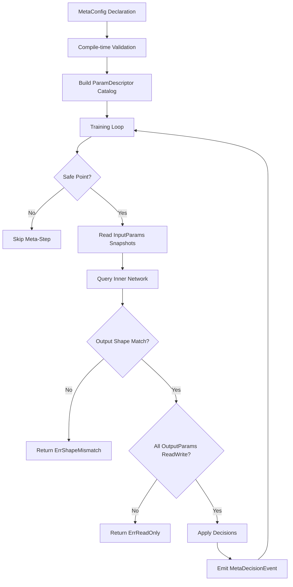

# Meta-Learning Hooks

**Version:** 1.0.0
**Status:** Stable
**Layer:** concept

## Overview

Defines the contract by which **any network parameter** — scalar hyperparameters, weight matrices,
bias vectors, topology metrics, training statistics, and structural descriptors — can be
**adaptively tuned by an inner GoNN network**, recursively. The outer network's training loop
accesses parameters through a uniform `ParamAccessor[T]` interface; any parameter can serve as
**input** (features) or **output** (tunable target) for an inner `*NN[T]` instance trained on
the outer loop's dynamics.

The v0.5.0 design covered only scalar hyperparameters via `Tunable[T]`. This v0.6.0 expansion
generalizes to **all parameter categories** so that any aspect of the network can be used for
recursive self-optimization.

## Related Specifications

- [l1-neural-network-architecture.md](l1-neural-network-architecture.md) — Parent
- [l1-training-control.md](l1-training-control.md) — Inner-network training is itself controllable
- [l1-observability-protocol.md](l1-observability-protocol.md) — Read-only snapshot contract; ParamAccessor extends this to read-write for tuning
- [l1-dynamic-topology.md](l1-dynamic-topology.md) — Topology mutations can be driven by meta-learning decisions
- [l1-training-semantics.md](l1-training-semantics.md) — Training metrics (loss, iterations) as meta-learning inputs
- [l1-weight-initialization.md](l1-weight-initialization.md) — Re-initialization strategy after parameter override
- [l1-training-callbacks.md](l1-training-callbacks.md) — OnImprovementFound event provides iteration-level meta signal; can trigger meta-learning decisions

## 1. Motivation

Hyperparameter tuning today is manual or grid-search. The library has all the pieces (training loop,
loss tracking, observability) to **let the network tune itself recursively**:

- Replace the constant `learningRate = 0.3` with `learningRate = innerNN.Query(currentLossHistory)`.
- Inner network learns from outer training trajectories.
- Same machinery works for any scalar — gradient-skip thresholds, batch-size schedules, etc.

**v0.6.0 extension — universal parameter access:**

Beyond scalar hyperparameters, research workflows need to:

- Use **weight statistics** (mean, variance, L2 norm per layer) as input features to predict
  optimal learning rate or topology changes.
- Use **training dynamics** (loss trajectory, gradient norms, epoch count, convergence speed)
  as multi-dimensional input to an inner optimizer network.
- Let an inner network **output structural decisions**: recommended neuron count, layer depth,
  activation function selector — fed back to `l1-dynamic-topology` mutation API.
- Use **per-neuron activation statistics** (dead neuron detection, saturation frequency) to drive
  pruning decisions via the inner network.
- Feed **any combination of parameters** as a feature vector to the inner network, not limited
  to pre-defined scalar slots.

The point of this spec is **reserving the API door** so future research can plug in without breaking
the public surface.

## 2. Constraints & Assumptions

- Tunability is **opt-in per parameter** — defaults remain constants. `WithLearningRate(0.3)` stays
  the simple path.
- Inner networks are **plain `*NN[T]`** — no special types. They use the same `Compile()`/`Query()`
  surface.
- **Recursion depth bounded** — at most one level of inner-network tuning is permitted in v1. A
  deeper meta-meta-learning topology requires explicit opt-in and a guard against infinite regress.
- **Read-write boundary**: Parameters accessed for **reading** (as inputs to the inner network) are
  non-invasive snapshots per `l1-observability-protocol` OBS-1. Parameters accessed for **writing**
  (as outputs from the inner network applied back to the outer network) must go through the same
  safe-point / transaction model as `l1-dynamic-topology` DYN-2.
- **No runtime type-switching**: The set of exposed parameters and their roles (input vs. output)
  is declared at configuration time, not changed mid-training.

## 3. Core Invariants

- **META-1**: Every adaptive parameter is read through a `Tunable[T]` interface; constant and
  schedule sources are equivalent values of this interface.
- **META-2**: Inner-network queries during training are **synchronous and bounded** — they execute
  inline within the outer training loop's control flow, with a configurable maximum execution time.
- **META-3**: Recursion guard: a `Tunable[T]` tracks its own depth; a `*NN[T]`-backed `Tunable` may
  not host another `*NN[T]`-backed `Tunable` for the same parameter (cycle prevention).
- **META-4**: Inner-network state changes are **observable** — they flow through the same observability
  protocol as the outer network. A GUI can watch both.
- **META-5**: **Universal parameter catalog** — every parameter of the network is registered in a
  `ParamDescriptor` catalog at `Compile()`-time. The catalog is immutable after compilation.
  Each descriptor has: name (string key), category, data shape, access mode (ReadOnly | ReadWrite).
- **META-6**: **Vector assembly** — any subset of catalog parameters can be flattened into a
  `[]T` feature vector for inner-network input/output. The flattening order is deterministic
  and stable across serialization round-trips.
- **META-7**: **Write-back safety** — parameter writes from the inner network's output are applied
  only at safe points (Paused/Idle or between-epoch barriers, consistent with DYN-2). Writes
  outside safe points return `ErrUnsafeWrite`.

## 4. Parameter Categories

All network parameters fall into these categories. Each can be configured as input (features for
the inner network), output (tuning targets), or both:

| Category | Examples | Shape | Access |
| :--- | :--- | :--- | :--- |
| **Scalar Hyperparameters** | learning rate, loss limit, momentum, gradient clip threshold, max iterations | `scalar T` | ReadWrite |
| **Training Metrics** | current loss, loss history (ring), iteration count, epoch count, convergence speed, elapsed time, samples seen | `scalar T` or `[]T` | ReadOnly |
| **Weight Statistics** | per-layer weight mean/variance/L2-norm, global weight L2-norm | `[]T` per layer | ReadOnly |
| **Gradient Statistics** | per-layer gradient mean/variance/L2-norm, gradient explosion/vanishing indicator | `[]T` per layer | ReadOnly |
| **Activation Statistics** | per-layer mean activation, dead neuron ratio, saturation ratio | `[]T` per layer | ReadOnly |
| **Topology Descriptors** | layer count, neurons per layer, total parameters count, connectivity density | `[]T` | ReadOnly |
| **Structural Decisions** | recommended neuron count delta, layer add/remove signal, activation function selector | `[]T` | ReadWrite (via `l1-dynamic-topology`) |
| **Raw Weights** | full weight matrix of a specific layer | `[][]T` | ReadWrite (experimental) |
| **Bias Vectors** | bias values per layer | `[]T` | ReadWrite |

> **ReadOnly** parameters can only be used as **input** to the inner network.
> **ReadWrite** parameters can be used as both **input** and **output** (tuning target).
> Writing raw weights is marked **experimental** — it bypasses the normal gradient descent path and
> may destabilize training. Protected by `WithExperimentalDirectWeightWrite(true)` flag.

## 5. Detailed Design

### 5.1 Core Interfaces

```text
// ParamDescriptor — metadata for one parameter slot
type ParamDescriptor struct {
    Name     string         // unique key, e.g. "layer.2.weight.mean"
    Category ParamCategory  // enum: Scalar, TrainingMetric, WeightStat, etc.
    Shape    []uint         // dimensionality: [] for scalar, [N] for vector, [N,M] for matrix
    Access   AccessMode     // ReadOnly | ReadWrite
}

// ParamAccessor — read-write access to a specific parameter
type ParamAccessor[T utils.Float] interface {
    Descriptor() ParamDescriptor
    Read() []T                    // snapshot; always returns flattened []T
    Write(values []T) error       // only for ReadWrite; returns ErrReadOnly for ReadOnly params
}

// Tunable[T] — v0.5.0 backward-compatible interface for scalar parameters
type Tunable[T utils.Float] interface {
    Value(ctx TuningContext[T]) T
}

// TuningContext — snapshot of outer loop state fed to inner network
type TuningContext[T utils.Float] struct {
    Iteration    uint64
    Epoch        uint64
    CurrentLoss  T
    LossHistory  []T                 // ring buffer, most recent last
    Params       map[string][]T      // all declared input params, keyed by name
}
```

### 5.2 Parameter Registration & Wiring

```text
nn := gonn.New[float64]().
    Input(10).Dense(20, SIGMOID, true).Output(1, LINEAR, MSE, true).
    // Scalar tunable (v0.5.0 style)
    WithLearningRateTunable(gonn.AdaptiveByNetwork(innerLR)).
    // Universal parameter wiring (v0.6.0)
    WithMetaLearning(gonn.MetaConfig[float64]{
        InputParams: []string{
            "training.loss_history",        // last N losses
            "training.iteration",           // current iteration
            "layer.1.weight.mean",          // mean weight of hidden layer
            "layer.1.weight.l2_norm",       // L2 norm of hidden layer weights
            "layer.1.activation.dead_ratio",// dead neuron ratio
            "topology.layer_count",         // current number of layers
        },
        OutputParams: []string{
            "hyperparams.learning_rate",    // adjust learning rate
            "topology.layer_1.neuron_delta",// recommend adding/removing neurons
        },
        InnerNetwork: innerOptimizer,
        ApplyAt:      gonn.EpochBarrier,    // apply outputs between epochs
    }).
    MustCompile()
```

### 5.3 Inner Network Training Loop

```text
for each outer epoch:
    // 1. Collect input features from declared InputParams
    features := assembleVector(config.InputParams)

    // 2. Query inner network
    decisions := innerOptimizer.Query(features)

    // 3. Apply decisions to declared OutputParams at safe point
    applyDecisions(config.OutputParams, decisions)   // respects META-7

    // 4. Optionally train inner network on outer loss trajectory
    if innerTrainingEnabled:
        innerTarget := computeMetaLoss(outerLossBeforeDecision, outerLossAfterDecision)
        innerOptimizer.Train(features, innerTarget)
```

### 5.4 Backward Compatibility

The v0.5.0 `Tunable[T]` interface is preserved as a **convenience wrapper** over the v0.6.0
`ParamAccessor[T]` system:

- `Const[T](v)` → accessor with `Category: Scalar`, `Access: ReadWrite`, returns `[v]`.
- `LinearDecay[T](from, to, steps)` → schedule-based accessor.
- `AdaptiveByNetwork[T](inner)` → wires a single scalar parameter via `MetaConfig` with one input
  (loss history) and one output (the scalar itself).

### 5.5 Safety Model



### 5.6 Design Decisions (Closed)

**TuningContext schema**: Frozen at `{Iteration, Epoch, CurrentLoss, LossHistory (ring), Params map}`.
The `Params` map already carries all declared input params. No additional fields for v1;
extensions require a minor spec bump.

**Inner network training loss**: `meta_loss = outer_loss_before_decision − outer_loss_after_decision`.
Positive value = improvement. Applied at the same barrier as the decision itself. Inner network
learns to predict parameter adjustments that reduce outer loss.

**Serialization**: The inner network is serialized as a nested JSON object within the outer network's
checkpoint, keyed `"meta_config.inner_network"`. This satisfies `l1-network-persistence` PERS-2
(round-trip integrity) for the full meta-learning configuration.

**Cost model (`ApplyAt`)**: Configurable via `MetaConfig.ApplyAt`: `IterationBarrier` (query per iteration,
research mode) or `EpochBarrier` (query per epoch, default). Default = `EpochBarrier` to avoid
inner-network overhead on every weight update.

**Statistics computation (eager vs lazy)**: Lazy with per-iteration caching. Statistics are computed
on the first `Read()` call per iteration and cached until the next weight update event. Prevents
redundant computation when multiple InputParams request the same underlying statistic (e.g.,
two params using `layer.1.weight.mean`).

**Multi-objective meta-learning**: Out of scope for v1. The inner network produces one scalar output
per declared OutputParam. Multi-objective optimization (Pareto fronts, scalarized objectives) is
deferred to a future minor extension.

**Structural decisions routing**: Structural outputs (neuron delta, layer add/remove signals) are
applied directly through the `l1-dynamic-topology` mutation API at safe points. No separate
"advisor" pattern is introduced — it adds indirection without benefit at this scale.

**Inner network auto-sizing**: At `Compile()`-time, `inputDim = Σ len(flatten(p)) for p in InputParams`
and `outputDim = Σ len(flatten(p)) for p in OutputParams`. The inner network's declared input/output
layer sizes MUST match these computed dimensions; mismatch returns `ErrDimensionMismatch` during
outer network compilation. This prevents runtime shape errors.

## 6. Implementation Notes

1. Phase 0 (this spec): publish the `ParamDescriptor` catalog and `ParamAccessor[T]` interface.
   Implement the catalog builder that registers all standard parameters at `Compile()`-time.
2. Phase 1: ship `Const` + schedule `Tunable` implementations + ReadOnly accessors for all
   training metrics and weight/gradient/activation statistics.
3. Phase 2: ship `WithMetaLearning(MetaConfig)` wiring. Inner network query at epoch barriers.
   ReadWrite accessors for scalar hyperparameters.
4. Phase 3: ship `AdaptiveByNetwork` with recursion guard. Structural decision outputs wired to
   `l1-dynamic-topology` mutation API. `WithExperimentalDirectWeightWrite` flag.

## Canonical References

| Alias | Path | Purpose |
| :--- | :--- | :--- |
| `[META]` | `pkg/nn/tunable.go` (new) | Tunable interface and stock implementations |
| `[PARAM]` | `pkg/nn/param.go` (new) | ParamDescriptor catalog and ParamAccessor |
| `[METACONFIG]` | `pkg/nn/meta.go` (new) | MetaConfig wiring and inner-loop integration |

## Document History

| Version | Date | Description |
| :--- | :--- | :--- |
| 0.1.0 | 2026-04-27 | Initial Draft from TODO #14 — most experimental of the batch. |
| 0.2.0 | 2026-05-01 | [MODIFIED] Universal parameter access: ParamDescriptor catalog, ParamAccessor interface, TuningContext v2, MetaConfig wiring, 9 parameter categories (scalar through raw weights), safety model diagram, META-5..META-7 invariants. v0.5.0 Tunable preserved as compatibility wrapper. From TODO #26. |
| 0.3.0 | 2026-05-11 | [MODIFIED] Draft → RFC. Closed all 8 design TBDs: TuningContext schema frozen, meta-loss definition, serialization contract (nested JSON), ApplyAt cost model (EpochBarrier default), lazy stat caching, multi-objective deferred to v2, structural routing via dynamic-topology API, auto-sizing via compile-time dimension check. Added l1-training-callbacks to Related Specifications. |
| 1.0.0 | 2026-05-17 | [MODIFIED] RFC → Stable via magic-spec promotion. All 7 invariants (META-1..META-7) frozen, 9 parameter categories ratified, safety model diagram authoritative. Unblocks l2-meta-learning-impl Trust Mode promotion and Phase 12 Track A scoping. No content changes from v0.3.0 — formal first stable cut. |
