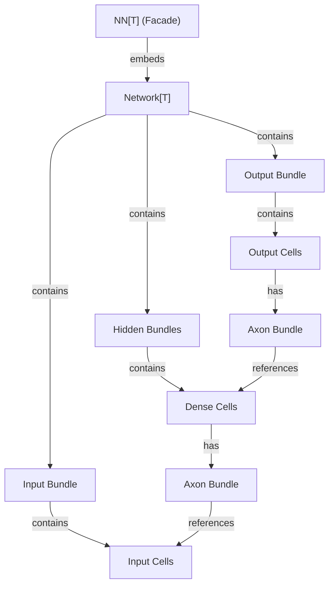
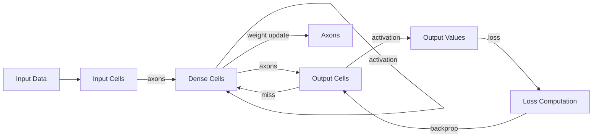

# Neural Network Architecture

**Version:** 2.0.0
**Status:** Stable
**Layer:** concept

## Overview

Defines the conceptual architecture of the GoNN neural network library. GoNN provides a generic, type-safe neural network implementation in Go using generics (`float32|float64`). The architecture follows a layered composition model: Network contains Layers, Layers contain Cells (neurons), and Cells are connected via Axons (weighted connections).

## Related Specifications

- [l1-math-functions.md](l1-math-functions.md) — Mathematical functions used by neurons and loss computation
- [l1-dynamic-topology.md](l1-dynamic-topology.md) — Defines the `Dynamic` topology mode introduced by INV-2 in v2.0
- [l2-nn-facade.md](l2-nn-facade.md) — Public API facade (implements this spec)
- [l2-network-graph.md](l2-network-graph.md) — Computational graph (implements this spec)
- [l2-layer-types.md](l2-layer-types.md) — Layer type hierarchy (implements this spec)
- [l2-neuron-model.md](l2-neuron-model.md) — Neuron/Cell/Axon model (implements this spec)

## 1. Motivation

Go lacks a native, zero-dependency neural network library that leverages Go generics for type safety. GoNN fills this gap by providing a composable, generic neural network library using only the standard library. The architecture must support:

- Type-safe numeric computation via Go generics
- Fluent builder API for network construction
- Forward and backward propagation
- Extensible activation and loss function sets

## 2. Constraints & Assumptions

- Zero external dependencies — standard library only
- Generic type parameter constrained to `float32 | float64` via `utils.Float`
- Single-threaded training loop (concurrency reserved for future phases)
- Feedforward topology only (no recurrent/convolutional layers in initial scope)

## 3. Core Invariants

- **INV-1**: All numeric computation must be generic over `utils.Float` constraint. No hardcoded float types.
- **INV-2 (v2.0 amended)**: Network topology mutability is governed by a **TopologyMode** parameter fixed at `Compile()`-time:
  - **Immutable** (default) — topology is frozen after construction; runtime modification is forbidden. This preserves v1.0 semantics for all existing users and L2 implementations that did not opt in.
  - **Dynamic** — topology may be mutated at synchronization barriers as defined in [l1-dynamic-topology.md](l1-dynamic-topology.md) (DYN-1..DYN-4). Mutations outside the documented barriers are forbidden.
  Switching mode after `Compile()` is forbidden in either direction. Implementations are not required to support `Dynamic` — those that don't MUST reject `WithTopologyMode(Dynamic)` at compile time with `ErrUnsupported`.
- **INV-3**: Forward propagation computes values layer-by-layer from Input to Output. Each cell computes the weighted sum of its incoming axon values plus activation.
- **INV-4**: Backward propagation computes loss gradients from Output to Input. Each cell propagates its miss (error) backward through outgoing axons.
- **INV-5**: Weight updates use gradient descent with a configurable learning rate.
- **INV-6**: Interface segregation: read-only access (`Nucleus[T]`) is separated from compute access (`Neuron[T]`).
- **INV-7**: Layer composition follows `core → base → specialized` embedding hierarchy. Each level adds capabilities without modifying the parent.
- **INV-8**: Axon connections are the sole mechanism for inter-cell communication. No direct cell-to-cell references outside the axon graph.

## 5. Detailed Design

### 5.1 Architecture Overview

### 5.2 Data Flow

### 5.3 Generic Type System

All numeric types are parameterized by `T utils.Float` where `Float` is defined as `float32 | float64`. This constraint propagates through the entire type hierarchy: `NN[T]`, `Network[T]`, `bundle[T,S]`, cell types, and `Axon[T]`.

### 5.4 Builder Pattern

Network construction uses a fluent builder:

- `New[T]()` creates an empty network
- `.Input(size)` adds the input layer
- `.Dense(size, activation, bias)` adds hidden layers
- `.Output(size, activation, loss, bias)` adds the output layer

The builder returns `*NN[T]` at each step, enabling method chaining.

## 6. Implementation Notes

1. Resolve compilation blockers first (Hidden cell type, OutgoingCell field, Output recursion)
2. Complete Build() to wire all layer connections
3. Implement Train/Query/Verify methods in the facade
4. Add comprehensive test coverage (target: 80%)

## 7. Drawbacks & Alternatives

- **Alternative**: Use reflection instead of generics — rejected for performance and type safety
- **Alternative**: Use external math libraries (gonum) — rejected to maintain zero-dependency policy
- **Drawback**: Go generics lack higher-kinded types, limiting some abstraction patterns
- **Drawback**: Slice type assertions in Go are not covariant, requiring element-by-element iteration

## Canonical References

| Alias | Path | Purpose |
| :--- | :--- | :--- |
| `[NN]` | `pkg/nn/nn.go` | Facade type definition and builder methods |
| `[NETWORK]` | `pkg/network/network.go` | Core computational graph structure |
| `[NEURON]` | `pkg/neuron/neuron.go` | Interface definitions (Nucleus, Neuron) |
| `[FLOAT]` | `pkg/utils/float.go` | Generic type constraint |

## Document History

| Version | Date | Description |
| :--- | :--- | :--- |
| 1.0.0 | 2026-04-21 | Initial Stable — reverse-engineered from existing codebase |
| 2.0.0 | 2026-04-28 | INV-2 amended to introduce TopologyMode (Immutable default, Dynamic opt-in). Added related-spec link to l1-dynamic-topology. Status reverted to RFC per amendment rule; C12 cascade demoted dependent L2 specs to RFC for re-review. |
| 2.0.0 | 2026-05-01 | [Batch-Stabilize] RFC → Stable. MVC satisfied: Overview + Core Invariants INV-1..8 + Detailed Design. C9 Trust Mode. Dynamic topology is optional opt-in; Immutable L2 dependents already Stable. |
