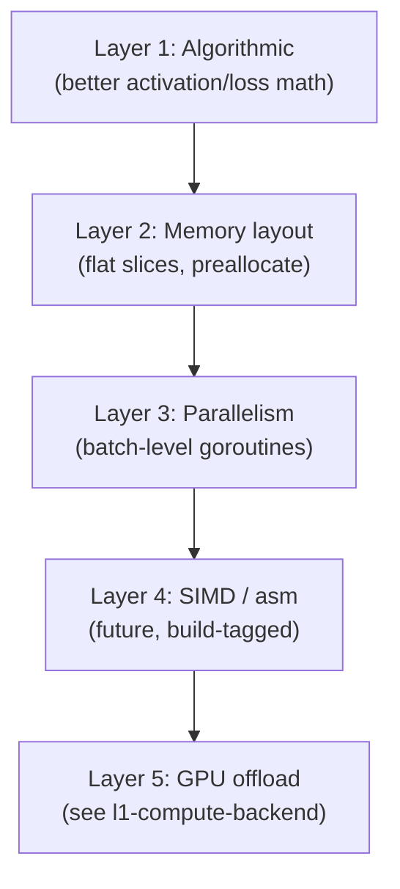

# Performance Contract

**Version:** 1.0.0
**Status:** Stable
**Layer:** concept

## Overview

Establishes performance guarantees and optimization principles for GoNN: vectorization at the
inner-loop level, parallelism at the batch level, cache-friendly memory layout, and benchmark-driven
regression detection. Defines what "fast" means for this library and how it is measured.

## Related Specifications

- [l1-neural-network-architecture.md](l1-neural-network-architecture.md) — Parent
- [l1-compute-backend.md](l1-compute-backend.md) — GPU / accelerator pluggability
- [l1-data-streaming.md](l1-data-streaming.md) — Memory-bounded data feeding

## 1. Motivation

Without an explicit performance contract, optimization becomes ad-hoc: a hotspot here, a goroutine
there, no protection against regressions. A contract makes performance a **first-class invariant**:
benchmarks gate merges, profiling targets are documented, and the optimization roadmap is intentional.

## 2. Constraints & Assumptions

> **Concept-Layer Notation**: References to `pprof`, `sync.Pool`, `runtime.NumCPU`, build tags, and
> `go test -bench` are **illustrative bindings** of universal performance concepts (sampling profiler,
> object pooling, hardware-parallelism query, conditional compilation, regression benchmarking) to
> the project's Go implementation. The performance contract — invariants, optimization layering,
> benchmark gating — is language-independent.

- Pure-language optimizations first; assembly / SIMD intrinsics deferred and behind conditional compilation.
- Parallelism via the language's lightweight concurrency primitives (Go: goroutines + channels).
- GPU offload is a **separate backend** ([l1-compute-backend.md](l1-compute-backend.md)) — not retrofit into the CPU path.
- Benchmarks live colocated with the code they measure and run via the language's standard test runner.

## 3. Core Invariants

- **PERF-1**: Every public hot-path function has at least one **benchmark**. CI tracks baseline.
  Regressions > 10% on a benchmark fail the merge.
- **PERF-2**: Memory layout for axons / weights / activations is **cache-friendly** — flat slices over
  pointer-to-struct chains where possible. Documented via Go escape analysis output.
- **PERF-3**: Goroutine count is **bounded** — never spawn one goroutine per neuron. Worker pools
  size to `runtime.NumCPU()` by default; configurable via option.
- **PERF-4**: Allocations in the inner training loop are **zero or pooled**. `sync.Pool` for transient
  buffers; preallocate slices at `Compile()` time for everything sized by topology.
- **PERF-5**: A `pprof` profiling hook is available via observability — `nn.WithProfiling(":6060")`
  starts the standard `net/http/pprof` listener, opt-in.

## 5. Detailed Design

### 5.1 Optimization Layers

Optimize from top down — algorithmic gains compound. Skip a layer only with a benchmark proving the
next layer's win.

### 5.2 Benchmark Targets (initial)

| Path | Target benchmark name | Initial baseline (TBD) |
| :--- | :--- | :--- |
| Forward pass | `BenchmarkForward_XOR_f32` | <!-- TBD --> |
| Backward pass | `BenchmarkBackward_XOR_f32` | <!-- TBD --> |
| Compile() | `BenchmarkCompile_DeepNetwork_f32` | <!-- TBD --> |
| Snapshot serialization | `BenchmarkSnapshotWrite_f32` | <!-- TBD --> |

### 5.3 Open Questions

- <!-- TBD: SIMD intrinsics — wait for go assembly or use generated `simd` package -->
- <!-- TBD: NUMA awareness for large-scale training -->

## 6. Implementation Notes

1. Establish benchmark baselines first (no optimization), then optimize against them.
2. Memory layout audit: convert `[]Cell` of pointer-to-struct fields to struct-of-arrays where the
   inner loop touches a single field.
3. `runtime.LockOSThread` for the training goroutine if profiling shows context-switch overhead.

## Canonical References

| Alias | Path | Purpose |
| :--- | :--- | :--- |
| `[BENCH]` | `pkg/*/bench_*_test.go` | Benchmark home (new pattern to establish) |

## Document History

| Version | Date | Description |
| :--- | :--- | :--- |
| 0.1.0 | 2026-04-27 | Initial Draft from TODO #11. |
| 0.1.0 | 2026-04-28 | Concept-Layer Notation added. Status promoted Draft → RFC. Optimization layers and 5 invariants ready for review. |
| 1.0.0 | 2026-05-01 | [Batch-Stabilize] RFC → Stable. MVC satisfied: Overview + Core Invariants PERF-1..5 + optimization layer diagram. C9 Trust Mode. |
