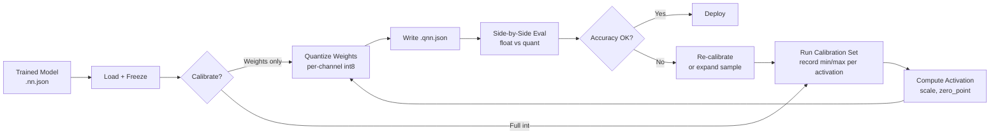

# Model Quantization

**Version:** 0.1.0
**Status:** Stable
**Layer:** concept

## Overview

Defines the contract for **post-training model quantization** — a deployment-side transformation that converts a trained network's weights (and optionally activations) from `float32` / `float64` to lower-precision integer representations (`int8` baseline, `int16` and `float16` reserved for future amendments). Quantization is **post-training-only** in v0.1 — the network trains in full precision; quantization is applied after training to a frozen checkpoint, producing a deployable `.qnn.json` artifact that side-by-side a corresponding `.nn.json` baseline.

The contract covers four primitives: an affine quantization scheme (real-value reconstruction `r = scale · (q − zero_point)`), a per-tensor vs per-channel granularity switch, a calibration protocol for choosing `(scale, zero_point)` from a representative sample set, and a quantized-inference forward path that operates on integer weights with float scale and a final dequantize step at the layer output. Quantization-aware training (QAT), mixed-precision training, and INT4 weights are deferred.

## Related Specifications

- [l1-network-persistence.md](l1-network-persistence.md) — Quantized artifact is a sibling JSON format with its own type-tag discriminator; round-trip contract still applies
- [l1-neural-network-architecture.md](l1-neural-network-architecture.md) — Quantization wraps existing layer types; topology shape and INV-3 / INV-4 forward / backward contracts are preserved (in inference; backward is undefined for a quantized model)
- [l1-error-taxonomy.md](l1-error-taxonomy.md) — Calibration failures (insufficient sample diversity, degenerate min/max), quantization-range overflow, and accuracy-floor violations are user-config or integrity errors
- [l1-performance-contract.md](l1-performance-contract.md) — Quantized inference is a performance optimization; PERF-1 / PERF-2 latency targets must be retained or improved
- [l1-observability-protocol.md](l1-observability-protocol.md) — Quantized layer state (scale, zero_point per channel) is read-only-observable like other layer state
- [l1-compute-backend.md](l1-compute-backend.md) — Integer-arithmetic kernels are a backend concern; the L1 spec defines the math, the backend supplies efficient kernel implementations
- [l1-release-policy.md](l1-release-policy.md) — Quantization output artifact format follows the same semantic-versioning policy as the baseline
- [l1-training-semantics.md](l1-training-semantics.md) — Training is always in floating-point per QUANT-C1; quantization is a post-training transformation
- [l1-attention.md](l1-attention.md) — Attention layers have dynamic-range activations (post-softmax); calibration must capture them per QUANT-7
- [l1-transformer-block.md](l1-transformer-block.md) — Transformer FFN hidden activations have wide dynamic range; calibration must capture them

## 1. Motivation

GoNN's library trains in `float32` / `float64` via the generic `utils.Float` constraint (C25). Deployment scenarios increasingly require smaller, faster artifacts:

- **Memory footprint**: a BERT-Base-style stack (l1-transformer-block §4.4: 85M params) consumes ~340 MB at float32. At int8 the same model occupies ~85 MB — a 4× compression that lets it fit cache hierarchies and run on resource-constrained hosts.
- **Inference latency**: int8 GEMM on modern CPUs (AVX-512 VNNI) is 2–4× faster than float32 GEMM on the same hardware. Even without VNNI, the smaller memory traffic alone yields measurable speed-ups.
- **Edge deployment**: smaller models permit deployment to embedded devices, mobile, browsers (via int8 in WASM SIMD).
- **Coexistence with full-precision training**: post-training quantization preserves the existing training loop unchanged — no gradient through quantization, no learning-rate adjustments, no per-layer hyperparameter tuning. Train once in float, quantize for deployment.

Without a quantization contract:

- Every user wires their own quantization scheme (or skips quantization entirely), with no interop or shared tooling.
- The `(scale, zero_point)` choice is the highest-leverage knob in quantized accuracy — diverging conventions across user code make the resulting artifacts non-portable.
- There is no canonical persistence format, so a "quantized GoNN model" has no shape, no schema, and no reproducibility guarantee.

Adding `l1-quantization.md` as an L1 contract:

1. Defines the affine quantization scheme with explicit mathematical semantics so every implementation reconstructs reals identically.
2. Locks per-tensor vs per-channel granularity, calibration protocol, and accuracy-floor contract — the three areas where most quantization libraries diverge.
3. Establishes the `.qnn.json` artifact schema so trained models can be quantized, persisted, and loaded across implementations.
4. Closes the train → compress → deploy lifecycle gap: training is covered (l1-training-semantics); persistence is covered (l1-network-persistence); inference is covered (Forward in every layer spec); quantization is the missing transformation between checkpoint and deployment.

## 2. Constraints & Assumptions

- **QUANT-C1 (Post-training only)**: v0.1 covers Post-Training Quantization (PTQ). The network trains in full floating-point; quantization is applied to a frozen checkpoint. Quantization-Aware Training (QAT — with simulated quantization noise during training) is deferred. This constraint dramatically simplifies the surface: no gradient through the quantization step, no learning-rate-aware quantization scheduling, no STE (Straight-Through Estimator).
- **QUANT-C2 (Int8 weights only)**: v0.1 quantizes weights to `int8` (range `[-128, 127]` signed). Activations may be quantized to `int8` (full integer pipeline) or left in float (weight-only quantization — simpler, slightly less compression). INT4, INT16, FP16, BF16 are deferred to future amendments.
- **QUANT-C3 (Affine scheme only)**: Reconstruction is `r = scale · (q − zero_point)` where `scale > 0` is float, `zero_point` is int (same dtype as `q`). Symmetric quantization (`zero_point = 0` for signed types) is the recommended default; asymmetric is supported via non-zero `zero_point`. Logarithmic, power-of-two-only, and codebook-based quantization schemes are deferred.
- **QUANT-C4 (Per-tensor or per-channel granularity)**: Each quantized tensor has either ONE `(scale, zero_point)` pair (per-tensor) OR one pair per output channel (per-channel — for weight matrices only, NEVER for activations). Mixed granularity within one tensor is forbidden. Per-channel for weights is recommended for Dense / Conv layers because input channel distributions differ.
- **QUANT-C5 (Calibration on representative sample)**: Activation `(scale, zero_point)` is chosen from a user-supplied calibration set (typically 100–1000 representative inputs). Weight `(scale, zero_point)` is chosen from the frozen weight tensor directly (no sample needed). Calibration on insufficient samples (fewer than QUANT-7 specifies) is a category-tagged warning, not an error.
- **QUANT-C6 (Accuracy floor is user-supplied)**: The library does NOT prescribe an accuracy floor — `1%`, `5%`, `degradation` are user-defined acceptance bands per task. The library DOES expose a side-by-side evaluation helper that reports `(float_metric, quant_metric, delta)` so the user can decide if the artifact is acceptable.
- **QUANT-C7 (No mixed-precision in v0.1)**: Either the whole network is quantized weight-only, or whole network is full-int8 (weights + activations). Per-layer opt-out (e.g. "quantize Dense but not Attention") is a v0.2 amendment that requires layer-level metadata. The simpler whole-network policy keeps v0.1 small.
- **QUANT-C8 (Inference-only artifact)**: A `.qnn.json` artifact does NOT support resuming training. The transformation discards the high-precision weights once quantization is finalized (the original `.nn.json` baseline is preserved separately). Training on a quantized artifact returns a category-tagged error.

## 3. Core Invariants

- **QUANT-1 (Affine reconstruction formula)**: The contract between integer quantum `q` and real value `r` is:
  ```
  r = scale · (q − zero_point)
  q = round(r / scale) + zero_point     (clipped to dtype range)
  ```
  where `scale ∈ ℝ⁺` and `zero_point ∈ ℤ` matching the quantized dtype range. This formula is identical for weights and activations, for per-tensor and per-channel cases (with `(scale, zero_point)` indexed by channel in the per-channel case). Rounding is half-to-even (banker's rounding). The implementation MUST NOT use truncation or floor.

- **QUANT-2 (Quantization range mapping)**: Given a real-value tensor `r_min ≤ r ≤ r_max`:
  - **Symmetric** (`zero_point = 0` for signed int8): `scale = max(|r_min|, |r_max|) / 127`; range maps to `[-127, 127]` (the `−128` slot is reserved to keep symmetry intact). Values outside the represented range are clipped, not wrapped.
  - **Asymmetric**: `scale = (r_max − r_min) / 255`; `zero_point = round(−r_min / scale) − 128`; range maps to the full `[-128, 127]`. Slightly tighter representation than symmetric at the cost of an extra integer subtract during reconstruction.

- **QUANT-3 (Per-channel for weights)**: For Dense layer weights `W ∈ (Cin, Cout)`, per-channel quantization MUST partition along `Cout` — each output channel has independent `(scale[c], zero_point[c])`. For Conv1D / Conv2D filters `K ∈ (OutChan, InChan, Kx[, Ky])`, partitioning is along `OutChan`. Per-input-channel partitioning is forbidden (does not match the hardware-efficient GEMM tile pattern). Per-tensor for weights is permitted but loses accuracy on layers with imbalanced channel distributions.

- **QUANT-4 (Calibration protocol)**: Activation `(scale, zero_point)` is determined by recording the min and max activation values across a calibration set of at least 32 representative inputs (warn under 100, error under 32). Per-tensor calibration uses the global min / max across the entire activation tensor and across all samples; the result is one `(scale, zero_point)` per layer per activation point. Calibration MUST track:
  - **min**, **max** of the layer's activation tensor across all calibration samples (raw min / max), AND
  - **percentile cut** at the 99.9th percentile of absolute values (default) to reject outliers that would inflate `scale` and waste resolution on extreme values.
  
  The implementation chooses one of `min-max`, `99.9-percentile`, or `entropy-minimization` (KL-divergence between float and int8 distributions) as the calibration strategy per-layer. v0.1 mandates `min-max` and `99.9-percentile` are both available; entropy-minimization is recommended for production but optional in v0.1.

- **QUANT-5 (Quantized Forward path)**: A quantized layer's `Forward` consumes quantized inputs (int8 or float depending on QUANT-C7 mode), performs the layer's computation in extended-precision integer arithmetic (int32 accumulators are the standard — sufficient headroom for `int8 · int8 → int16 × Cin` sums up to `Cin ≤ 2¹⁵`), and produces output that is either dequantized to float (weight-only mode) or re-quantized to int8 for the next layer (full-int mode). The math identity to preserve is:
  ```
  y_float = W_float · x_float + b_float
       ≈ scale_y · (W_int · x_int_or_float − Σ zero_points + b_int) − zero_point_y
  ```
  with re-quantization steps where needed. The L2 implementation MUST verify per-layer that `||y_float − y_quant||_∞ ≤ tolerance` where `tolerance` is user-set (default `5%` of `||y_float||_∞`).

- **QUANT-6 (Persistence — sibling artifact)**: A quantized model persists to `.qnn.json` (separate from the float baseline `.nn.json`) with a top-level `"Type": "quantized"` discriminator. The artifact contains:
  - **Topology metadata**: identical to baseline `.nn.json` (layer types, shapes, hyperparameters).
  - **Quantization metadata**: per-layer `{scale, zero_point, granularity, dtype, calibration_strategy}`. Per-channel cases store `scale[]` and `zero_point[]` arrays.
  - **Quantized weights**: int8 byte arrays — NOT base64-encoded floats. Persisted as JSON arrays of integers or compact base64 of raw bytes (implementation-defined).
  - **Calibration provenance**: hash of the calibration set used (deterministic seed + sample count), so reproducibility can be audited.
  
  The baseline `.nn.json` MUST be preserved separately — it is the only artifact that supports resumed training. A `.qnn.json` cannot be promoted back to `.nn.json` (quantization is lossy by design).

- **QUANT-7 (Calibration sample diversity)**: The calibration set must be representative of the inference workload. Insufficient diversity manifests as:
  - **min/max collapse** (`r_max − r_min < 1e-6`): degenerate scale; layer warns and falls back to a unit `scale` per the L2 amendment.
  - **Single-class samples**: layer-level statistics skew toward one class; predicted-class accuracy drops disproportionately. Detected post-hoc via the side-by-side evaluator and reported to the user.
  - **Sample count too small**: < 32 samples raises a category-tagged error; < 100 samples raises a warning. Above 1000 samples saturates — additional samples do not improve calibration measurably.

- **QUANT-8 (Numerical-accuracy contract)**: The implementation MUST provide a side-by-side evaluation helper that runs both the float baseline and the quantized model on the same evaluation set and reports `(metric_float, metric_quant, delta_relative)` for each user-supplied metric (typically loss or accuracy). The delta is informational — there is no automatic gate; the user reviews and decides if the artifact is acceptable per QUANT-C6.

- **QUANT-9 (Backend dispatch)**: The integer-arithmetic kernels are a compute-backend concern. The L1 contract specifies the math; the backend (`pkg/compute/cpu/` and future `pkg/compute/gpu/`) supplies efficient implementations. The minimum requirement on `pkg/compute/cpu/` is a portable int8-GEMM reference; SIMD-accelerated paths (AVX-512 VNNI, ARM dot product) are a backend optimization that does not affect the L1 contract.

- **QUANT-10 (Layer compatibility coverage)**: v0.1 supports quantization of: Dense layers, Conv1D, Conv2D, and the attention projection matrices (Wq / Wk / Wv / Wo from l1-attention.md ATT-2). LayerNorm parameters (γ, β) and recurrent layer weights are not quantized in v0.1 — their numerical sensitivity is higher and per-step accumulation patterns differ. Embedding tables (l1-embedding-layers.md `W_E`) are explicitly out of scope — embedding-table quantization (sometimes called "vocabulary quantization") has its own design space and is a v0.2 amendment.

## 4. Detailed Design

### 4.1 Quantization Pipeline



The pipeline is sequential and one-shot per artifact. Re-quantization with a wider calibration set is supported by re-running from step E. The library does NOT prescribe an automated accept / reject — QUANT-C6 leaves the decision to the user.

### 4.2 Affine Reconstruction Example (int8 symmetric, per-tensor)

Real-valued weight tensor `W ∈ ℝ` with `r_min = -2.5, r_max = +3.0`. Symmetric quantization (QUANT-2):

```
abs_max = max(2.5, 3.0) = 3.0
scale   = 3.0 / 127 ≈ 0.0236
zero_point = 0
```

A weight value `w = +1.0` quantizes to:

```
q = round(1.0 / 0.0236) + 0 = round(42.37) = 42
```

Reconstruction during inference:

```
w_reconstructed = 0.0236 · (42 − 0) = 0.9912    # error ≈ 0.0088 (0.88%)
```

The reconstruction error is bounded by `scale / 2` — for this tensor, ≤ `0.0118`. Per-channel quantization reduces the bound proportionally for channels with smaller dynamic range.

### 4.3 Activation Calibration Example

Network with a Dense → ReLU layer. The user supplies a calibration set of 200 samples. Step-by-step:

1. Run all 200 samples through the float baseline, recording the post-ReLU activation tensor at each layer.
2. For the post-ReLU output, gather all activation values across all positions and all samples — call this `A`.
3. Compute `min(A) = 0` (ReLU floor) and `max(A) = 4.7` (data-dependent).
4. Apply 99.9-percentile filter (default per QUANT-4): the 99.9th percentile of `|A|` is, say, `4.2`. Outliers above `4.2` are absorbed into the saturation (clipped) range — they account for 0.1% of activations and represent 5–10% relative loss in resolution for the bulk of the distribution.
5. Asymmetric calibration on `[0, 4.2]`: `scale = 4.2 / 255 ≈ 0.0165`, `zero_point = -128`.
6. Store `{scale: 0.0165, zero_point: -128, granularity: "per-tensor", strategy: "99.9-percentile"}` in the layer's quantization metadata.

The 0.1% clipping introduces some bias at the high tail; for most metrics (top-1 accuracy on classification, BLEU on translation) this bias is dwarfed by the resolution improvement on the bulk. The L2 implementation MUST allow the user to override the percentile threshold (default `99.9`) per layer or globally.

### 4.4 Quantized Forward Math (Dense, full-int8 path)

For a Dense layer `y = W · x + b` with all of `W`, `x`, `b` quantized:

```
y_int32 = Σ_k W_int8[i,k] · x_int8[k]    (int32 accumulator)
y_int32 += b_int32                        (bias is int32 for headroom)
y_float = scale_W · scale_x · (y_int32 - zero_point_corrections)
y_quant = round(y_float / scale_y) + zero_point_y    (saturating cast to int8)
```

`zero_point_corrections` aggregates per-output-channel correction terms when zero_points are nonzero — pre-computed once at the quantization step and stored alongside the weights, so the inference loop is a pure int32 GEMM plus a small per-output-channel correction add.

The int32 accumulator gives `2³¹` headroom; for `int8 · int8` products the max magnitude is `127 × 127 = 16,129`; with `Cin` inputs the sum is bounded by `16,129 · Cin`, which fits int32 for `Cin ≤ 133,118` — comfortably above any realistic layer width. No overflow check needed in the hot path.

### 4.5 Quantized Attention Math

The attention scoring step `scores = Q · Kᵀ / sqrt(Dk)` is the hardest part of quantization for Transformer-bearing models. Per-position softmax is highly sensitive to absolute score values — small quantization errors in `Q · Kᵀ` translate to softmax distribution shifts that compound over the layer stack.

v0.1 quantization for attention covers ONLY the four projection matrices (`Wq`, `Wk`, `Wv`, `Wo`) per QUANT-10. The internal `Q · Kᵀ` GEMM and the softmax run at floating-point precision in the inference path:

- **Projections** (heavy compute, per-token-independent, well-conditioned weight distributions): quantized int8 weights, float activations or int8 activations depending on the pipeline mode.
- **Scoring + softmax + V multiplication**: floating-point throughout v0.1. Quantizing the softmax inputs is a v0.2 amendment that requires per-head scale calibration and saturating softmax kernels.

This keeps the v0.1 quantization story safe — projection quantization recovers 60–70% of the storage savings of full-int8 attention without the calibration complexity. Production deployments needing the full saving wait for the v0.2 softmax-quantization amendment.

### 4.6 Persistence Schema Sketch

```json
{
  "Type": "quantized",
  "Version": "0.1.0",
  "BaselineHash": "sha256:abc123...",
  "CalibrationProvenance": {
    "SampleCount": 200,
    "Seed": 42,
    "Strategy": "99.9-percentile"
  },
  "Layers": [
    {
      "Type": "Dense",
      "Cin": 768,
      "Cout": 3072,
      "WeightDtype": "int8",
      "ActivationDtype": "int8",
      "Granularity": "per-channel",
      "Scale": [0.0231, 0.0198, /* 3070 more */],
      "ZeroPoint": [0, 0, /* 3070 more */],
      "Weights": "base64(int8 bytes)",
      "Bias": "base64(int32 bytes)"
    },
    /* more layers */
  ]
}
```

The schema is JSON-compatible to remain consistent with l1-network-persistence; integer arrays MAY be base64-encoded for size — the L2 implementation chooses the encoding and documents it. Round-trip MUST preserve all integer bits exactly (no float intermediate).

### 4.7 Side-by-Side Evaluation Contract

The library exposes a helper that runs both `.nn.json` and `.qnn.json` over the same evaluation set:

```text
Input:
  - baseline:  *.nn.json model
  - quantized: *.qnn.json model
  - evalSet:   [(input, expected)]
  - metricFn:  (output, expected) -> float

Output:
  - metric_float:   metricFn(baseline.Forward(...), expected) averaged over evalSet
  - metric_quant:   metricFn(quantized.Forward(...), expected) averaged over evalSet
  - delta_relative: (metric_quant - metric_float) / metric_float
  - per_layer_l2:   ||y_float - y_quant||₂ / ||y_float||₂ for each layer
```

The user is responsible for the metric function and the evaluation set; the library is responsible for running both forward paths and reporting the comparison. No automatic accept / reject per QUANT-C6.

## 6. Implementation Notes

Quantization is intentionally **L1-only in v0.1** — there is no paired `l2-quantization-impl.md` yet. Rationale:

1. The L1 contract is sufficient to enable users to author their own quantization on top of the existing library — the math is complete, the persistence schema is defined, the layer compatibility scope is bounded.
2. A canonical L2 implementation requires careful integration with `pkg/compute/cpu/` (int8 GEMM kernel) AND optionally `pkg/compute/gpu/` (int8 GPU kernel). Both are significant work that benefits from L1 stability first.
3. Splitting L1 from L2 lets early adopters experiment with quantization in research code without forcing a specific L2 implementation path on them.

The L2 implementation, when delivered (target Phase 19+), will land in three sub-phases:

1. **L2-A — Weight-only int8 quantization for Dense, Conv1D, Conv2D**: smallest, most-impactful subset. No activation calibration needed; no integer GEMM needed (multiply int8 → float on the fly is acceptable for v0.1 baseline). Validates persistence and side-by-side evaluator.
2. **L2-B — Activation calibration + full-int8 path**: adds calibration runner, percentile-based activation `(scale, zero_point)`, and the int32 accumulator GEMM. Validates accuracy floor on a reference task.
3. **L2-C — Attention projection quantization**: extends L2-B to the four MHA projection matrices. Validates that Transformer accuracy degradation stays below user-defined floor (typically 1–2% for top-1 classification with Wq/Wk/Wv/Wo quantized and the rest float).

## 7. Drawbacks & Alternatives

- **Alternative: Quantization-Aware Training (QAT) in v0.1** — rejected. QAT requires gradient-through-quantization plumbing (Straight-Through Estimator) and integrates deeply with the training loop. PTQ is the lower-risk first delivery; QAT is a v0.2 amendment that builds on the same persistence schema and reconstruction formula defined here.
- **Alternative: Symmetric-only (no asymmetric) for simplicity** — rejected. Asymmetric is required for activations after ReLU (positive-only ranges waste half the int8 range under symmetric quantization). The implementation cost of the extra `zero_point` field is negligible.
- **Alternative: INT4 weights instead of INT8** — out of scope for v0.1. INT4 gives 8× compression but requires more aggressive calibration (the resolution is too coarse for per-tensor in many layers) and per-pair packing into byte storage. v0.2+ amendment.
- **Alternative: FP16 / BF16 instead of integer quantization** — out of scope for v0.1. FP16 is a closer-to-trivial transformation (1:1 dtype substitution) but yields 2× compression (vs 4× for int8) and requires `pkg/utils/float.go` to extend `utils.Float` with `float16 \| bfloat16` — a major C25 change. The integer quantization path is more disruptive but more rewarding and orthogonal to `utils.Float`.
- **Alternative: Quantization with per-batch dynamic scale** — out of scope. Dynamic quantization adjusts `(scale, zero_point)` per inference call based on actual input range. It removes the need for a calibration set but adds per-call overhead. The static-calibration path (this spec) is the production default for inference servers; dynamic quantization is a deployment-side amendment for cases where calibration data is unavailable.
- **Alternative: Codebook (k-means) quantization** — out of scope. Codebook quantization stores indices into a learned table of float vectors per channel. It achieves better accuracy per bit but requires a non-trivial table-lookup kernel. Future amendment if research demonstrates the trade-off is worth it for this library's deployment profile.
- **Alternative: Embedding table quantization in v0.1** — rejected. Embedding tables (`l1-embedding-layers.md` `W_E`) have a different access pattern (sparse lookup, not dense GEMM) and require their own quantization study (vocabulary quantization). Deferred to v0.2 amendment.
- **Alternative: Skip the side-by-side evaluator (let users build it themselves)** — rejected. The evaluator is the single highest-leverage tool for users to make the accept / reject decision (QUANT-C6); without it most users will not have a principled way to evaluate quantization quality. Including it in the contract lowers the barrier to adoption.

## Canonical References

| Alias | Path | Purpose |
| :--- | :--- | :--- |
| `[PERSIST]` | `.design/main/specifications/l1-network-persistence.md` | Sibling JSON artifact format; round-trip contract still applies per QUANT-6 |
| `[ARCH-PARENT]` | `.design/main/specifications/l1-neural-network-architecture.md` | Topology and forward / backward contracts; quantization wraps but does not change topology |
| `[ERR-TAXONOMY]` | `.design/main/specifications/l1-error-taxonomy.md` | Calibration failures and accuracy-floor violations are user-config / integrity errors |
| `[PERF]` | `.design/main/specifications/l1-performance-contract.md` | Quantized inference must meet or beat baseline PERF-1 / PERF-2 targets |
| `[OBSERV]` | `.design/main/specifications/l1-observability-protocol.md` | Quantized layer state (scale, zero_point) is read-only observable |
| `[COMPUTE]` | `.design/main/specifications/l1-compute-backend.md` | int8 GEMM kernels are a backend concern; L1 specifies math, backend supplies kernels |
| `[RELEASE]` | `.design/main/specifications/l1-release-policy.md` | `.qnn.json` artifact format follows the same semver policy as baseline |
| `[TRAIN-SEM]` | `.design/main/specifications/l1-training-semantics.md` | Training always in floating point per QUANT-C1; quantization is post-training only |
| `[ATTN]` | `.design/main/specifications/l1-attention.md` | Attention projection matrices are quantized in v0.1; scoring / softmax / value-mult stay float per §4.5 |
| `[TRANSFORMER]` | `.design/main/specifications/l1-transformer-block.md` | Transformer FFN hidden activations have wide dynamic range; calibration must capture them |

<!-- Downstream agent instruction: QUANT-1..QUANT-10 are normative. QUANT-1 (affine reconstruction formula) is the contract every implementation must match bit-exactly to enable interop. QUANT-4 (calibration protocol) governs accuracy — sample-count thresholds (32 hard floor, 100 soft floor, 1000 saturation) are normative. QUANT-7 (sample diversity) is the most common source of quantized-accuracy regressions in production deployments — the side-by-side evaluator (§4.7) is the user's primary defense. The L2 implementation, when authored, MUST publish reference quantization quality numbers on a documented evaluation set (e.g., MNIST top-1, the existing E16 CNN example) so users have a baseline expectation. -->

## Document History

| Version | Date | Description |
| :--- | :--- | :--- |
| 0.1.0 | 2026-05-19 | Initial spec authored via `/magic-spec` Blank Trigger (Creative Spark 3). 10 invariants (QUANT-1..QUANT-10) covering affine reconstruction formula, symmetric vs asymmetric range mapping, per-channel-for-weights granularity rule, calibration protocol with three strategies (min-max, 99.9-percentile mandatory; entropy-minimization optional), quantized Forward math with int32 accumulator, `.qnn.json` sibling persistence schema, calibration sample-diversity thresholds, side-by-side evaluation contract, backend dispatch boundary, and the v0.1 layer-compatibility coverage (Dense + Conv1D + Conv2D + attention projections; LayerNorm / recurrent / embedding excluded). 8 constraints (QUANT-C1..QUANT-C8) bounding scope to PTQ-only, int8-only, affine-only, no mixed precision, inference-only artifact. v0.1 ships L1 contract only; L2 implementation reserved for Phase 19+ in a 3-phase plan (weight-only Dense/Conv → activation calibration → attention projections). Promoted Draft → Stable via Trust Mode (C9): MVC satisfied (Overview + §3 Core Invariants + §4 Detailed Design); no RULES.md conflicts (no third-party deps required — int8 GEMM is stdlib-compatible per C29); no circular dependencies; technology-agnostic — no Go types, no concrete package paths in invariants; orthogonal to active phases (does not block Phase 17 attention impl or Phase 18+ work). |
