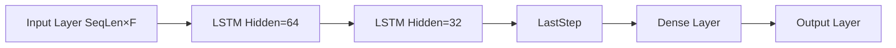

# Recurrent Layers

**Version:** 0.1.0
**Status:** Stable
**Layer:** concept

## Overview

Defines the contract for **recurrent neural-network layers** that process sequence data with
hidden state propagated across time steps. Covers three composable primitives: `SimpleRNN`
(tanh-activated Elman recurrence), `LSTM` (long short-term memory with input/forget/cell/output
gates), and `GRU` (gated recurrent unit with reset/update gates). All three obey a uniform
`(SeqLen × Features) → (SeqLen × Hidden)` shape contract, integrate with the existing topology
model via the same `Layer[T]` interface as Dense / Conv, and support back-propagation through
time (BPTT) with optional gradient clipping.

Scope is intentionally limited to **fixed-length sequences with a single recurrent direction**
(left-to-right). Bidirectional recurrence, attention-style sequence interactions, and variable-
length batching are deferred to future spec amendments.

## Related Specifications

- [l1-neural-network-architecture.md](l1-neural-network-architecture.md) — Parent topology model; recurrent layers extend the layer category hierarchy
- [l1-conv-layers.md](l1-conv-layers.md) — Sibling sequence primitive (1-D conv shares the (SeqLen × Features) input contract)
- [l1-training-semantics.md](l1-training-semantics.md) — Recurrent layers participate in the forward/backward convergence loop; BPTT extends the standard backward
- [l1-weight-initialization.md](l1-weight-initialization.md) — Recurrent weights (input-to-hidden, hidden-to-hidden) require orthogonal / Xavier init
- [l1-network-persistence.md](l1-network-persistence.md) — Recurrent weights + biases must survive JSON round-trip
- [l1-optimizer-strategies.md](l1-optimizer-strategies.md) — Gradient clipping is an optimizer-side hook this contract requires
- [l1-normalization-layers.md](l1-normalization-layers.md) — LayerNorm is the canonical normalization for recurrent hidden state (BatchNorm is unsafe across time)
- [l1-dynamic-topology.md](l1-dynamic-topology.md) — Recurrent layers can be inserted/removed at topology safe-points

## 1. Motivation

GoNN currently supports fully-connected, convolutional, and normalization layers. This covers
tabular, image, and 1-D-sequence-with-translation-invariance tasks. It does NOT cover:

- **Time-series with long-range dependencies** — stock data, weather, sensor streams where the
  output depends on state accumulated over many prior steps. Conv1D with large kernels approximates
  this but trades parameter count for receptive field.
- **Natural-language processing** — character-level / token-level sequence modeling where the
  prior context is the dominant signal.
- **Online / streaming inference** — networks that maintain state between calls (Conv1D requires
  the full window upfront; recurrent layers naturally fold state forward one step at a time).

Adding `SimpleRNN`, `LSTM`, and `GRU` as first-class layer types:

1. Completes the deep-learning trinity FC + CNN + RNN in a single library.
2. Provides composable primitives for sequence-to-vector (encoder), sequence-to-sequence
   (encoder-decoder), and stateful inference (`Step()` API).
3. Integrates with the existing `Layer[T]` interface so the rest of the topology model is
   unchanged.
4. Unlocks E17+ catalog examples (sentiment, char-RNN, time-series forecasting).

## 2. Constraints & Assumptions

- **REC-C1 (Single direction)**: Recurrence is left-to-right (time step 0 → SeqLen-1). Bidirectional layers are deferred.
- **REC-C2 (Fixed sequence length per batch)**: All samples in a batch share `SeqLen`. Variable-length batching with padding masks is deferred.
- **REC-C3 (Dense integration)**: Recurrent output `(SeqLen × Hidden)` is consumed either by another recurrent layer, by a `Flatten` collapsing to `(SeqLen·Hidden)`, or by the `LastStep` extractor producing `(Hidden,)`. No bespoke sequence-to-Dense bridge.
- **REC-C4 (BPTT depth = SeqLen)**: Backpropagation Through Time unfolds the recurrence over the full sequence length. Truncated BPTT (TBPTT) with explicit truncation step is deferred.
- **REC-C5 (Gradient clipping is opt-in)**: The optimizer-side hook for clipping by global norm is required but defaults to disabled. The recurrent layers themselves do NOT clip — that violates layer-internal locality.
- **REC-C6 (Hidden state initial value)**: Initial hidden state `h_0` is zero by default. Custom `h_0` is an optional method on the layer for stateful inference.
- **REC-C7 (LayerNorm-friendly, BatchNorm-unsafe)**: Recurrent hidden state changes per time step; BatchNorm statistics across time would mix sample positions. LayerNorm (per-sample, per-step) is the only normalization permitted inside the recurrent loop.

## 3. Core Invariants

- **REC-1 (Forward shape contract)**: For input `X ∈ (SeqLen, F_in)`, the layer produces output `H ∈ (SeqLen, Hidden)`. The output at step `t` depends ONLY on input steps `0..t` and prior hidden state — no leakage from future steps.

- **REC-2 (SimpleRNN cell)**: For each step `t`:
  `h_t = tanh(W_xh · x_t + W_hh · h_{t-1} + b_h)`
  with `W_xh ∈ (Hidden, F_in)`, `W_hh ∈ (Hidden, Hidden)`, `b_h ∈ (Hidden,)`. Output equals hidden state.

- **REC-3 (LSTM cell)**: Four gates per step `t`:
  - Input gate:  `i_t = sigmoid(W_xi · x_t + W_hi · h_{t-1} + b_i)`
  - Forget gate: `f_t = sigmoid(W_xf · x_t + W_hf · h_{t-1} + b_f)`
  - Cell input: `g_t = tanh(W_xg · x_t + W_hg · h_{t-1} + b_g)`
  - Output gate: `o_t = sigmoid(W_xo · x_t + W_ho · h_{t-1} + b_o)`
  - Cell state: `c_t = f_t ⊙ c_{t-1} + i_t ⊙ g_t`
  - Hidden: `h_t = o_t ⊙ tanh(c_t)`

  Both `h_t` and `c_t` are propagated; the layer's externally-visible state is `h_t`.

- **REC-4 (GRU cell)**: Two gates per step `t`:
  - Reset gate:  `r_t = sigmoid(W_xr · x_t + W_hr · h_{t-1} + b_r)`
  - Update gate: `z_t = sigmoid(W_xz · x_t + W_hz · h_{t-1} + b_z)`
  - Candidate:   `h̃_t = tanh(W_xh · x_t + W_hh · (r_t ⊙ h_{t-1}) + b_h)`
  - Hidden:      `h_t = (1 - z_t) ⊙ h_{t-1} + z_t ⊙ h̃_t`

- **REC-5 (BPTT correctness)**: Gradient of the loss w.r.t. each weight is the sum over time of the per-step gradient. For `W_hh` specifically: `∂L/∂W_hh = Σ_t (∂L/∂h_t · h_{t-1}^T)`. This invariant is necessary for convergence.

- **REC-6 (Initial state contract)**: Hidden state `h_0` (and cell state `c_0` for LSTM) is initialised to zero by default. Layers expose `SetInitialState(h, c)` for stateful inference; subsequent `Forward` calls use the user-supplied state until `ResetState()` is called.

- **REC-7 (Weight initialization)**: Input-to-hidden weights (`W_x*`) use the strategy from `l1-weight-initialization.md` (Xavier or He). Hidden-to-hidden weights (`W_h*`) MUST use **orthogonal initialization** (random orthonormal matrix) to prevent vanishing/exploding gradients in deep BPTT.

- **REC-8 (Persistence)**: All weight matrices and bias vectors must survive a JSON round-trip identically (l1-network-persistence contract). The initial state IS NOT persisted — it is runtime state, not model state.

- **REC-9 (Layer interface compatibility)**: All three recurrent types must satisfy the same `Layer[T]` interface as Dense / Conv so the network graph treats them uniformly. The `Forward(input)` signature is shape-polymorphic — recurrent layers accept `(SeqLen, F_in)` while Dense / Conv layers accept their own shape.

## 4. Detailed Design

### 4.1 Layer Composition



Two recurrent patterns:

1. **Sequence → vector** (classification): `Input → LSTM → LastStep → Dense → Output`. `LastStep` extracts `h_{SeqLen-1}` as a `(Hidden,)` vector.
2. **Sequence → sequence** (per-step prediction): `Input → LSTM → Flatten → Dense → Output`. Flatten collapses `(SeqLen × Hidden)` to `(SeqLen·Hidden,)` for the Dense head.

Stacked recurrent layers (RNN-2 → RNN-2) feed the upper layer's `(SeqLen × Hidden)` output directly as the lower layer's input — no extractor in between.

### 4.2 Shape Propagation Example

Input: `(SeqLen=10, F_in=20)`.

- LSTM(Hidden=64): output `(10, 64)`. Parameters: `4 × (64×20 + 64×64 + 64) = 4 × (1280 + 4096 + 64) = 21,760`.
- LastStep: output `(64,)`.
- Dense(32): output `(32,)`. Parameters: `64×32 + 32 = 2,080`.

### 4.3 BPTT Gradient Flow

Forward pass caches the hidden state at every time step (`h_0..h_{SeqLen-1}`) and, for LSTM, the
cell state (`c_0..c_{SeqLen-1}`) plus the gate activations. Backward walks time in reverse:

1. Compute `δ_t = ∂L/∂h_t` from the upstream gradient + the next step's contribution (`∂h_{t+1}/∂h_t`).
2. Accumulate per-step weight gradients into running totals `∇W_xh`, `∇W_hh`, `∇b_h`.
3. Compute `∂L/∂x_t` and accumulate into the layer's input-gradient buffer.

The forward-cache buffers grow `O(SeqLen × Hidden)`. For long sequences this dominates memory.
The L2 implementation MAY add a TBPTT truncation knob (per REC-C4 future amendment).

### 4.4 Gradient Clipping Integration

The optimizer-side global-norm clip is a separate hook (`WithGradClipNorm(threshold)`). It runs
between weight gradient accumulation and `opt.Step`:

```text
if ‖∇θ‖ > threshold: ∇θ ← ∇θ × (threshold / ‖∇θ‖)
```

`‖∇θ‖` is the L2 norm of the **flattened concatenation** of all trainable parameters' gradients
across the entire network — not per-layer. This is the standard global-norm clip and the
sentence-piece compatible default for RNN training.

### 4.5 Stateful Inference Pattern

For online / streaming inference (one time step per call):

```text
layer.ResetState()
for x_t in stream:
    h_t = layer.Step(x_t)  // updates internal h_{t-1} ← h_t
    use(h_t)
```

`Step(x_t)` is the per-step variant of `Forward`. It maintains hidden state across calls until
`ResetState()` is invoked. The batched `Forward` API resets state before processing each batch.

## 6. Implementation Notes

L2 realization should land in three sub-phases:

1. **L2-A — SimpleRNN baseline**: smallest surface; validates the layer-interface integration, BPTT correctness via finite-difference gradient check, and JSON round-trip. Foundation for LSTM/GRU.
2. **L2-B — LSTM**: largest gate surface (4 gates × 3 weight matrices each). Forward / Backward / Init / JSON / Step API.
3. **L2-C — GRU**: smaller than LSTM (2 gates) but reuses the gate-loop pattern from L2-B.

All three share helper utilities (orthogonal init, gate fusion, state caching) — package
internal helpers live in `pkg/layer/recurrent/cell.go`.

The `LastStep` extractor is a stateless pseudo-layer in `pkg/layer/recurrent/last_step.go`. It
satisfies `Layer[T]` and slices the upstream output at the time axis.

## 7. Drawbacks & Alternatives

- **Alternative: Transformer-only (skip RNN entirely)** — rejected for v0.13. Transformer requires attention primitives, positional encoding, and matmul-heavy hot loops that benefit dramatically from the GPU backend; rolling RNN first is cheaper to deliver and exercises BPTT in the existing CPU backend. Transformer is the natural v0.14+ target after `l2-backend-gpu.md` lands.
- **Alternative: Bidirectional RNN as a flag on the base layer** — rejected; bidirectional doubles the forward-pass complexity and changes the gradient flow non-trivially. Future amendment with its own L1 invariant set.
- **TBPTT with explicit truncation step** — deferred; full BPTT first establishes correctness; TBPTT is a memory-vs-accuracy tradeoff added later.
- **Echo State Network / Reservoir Computing** — out of scope; not in the standard deep-learning catalog.

## Canonical References

| Alias | Path | Purpose |
| :--- | :--- | :--- |
| `[ARCH-PARENT]` | `.design/main/specifications/l1-neural-network-architecture.md` | Parent topology model — recurrent layers slot into the Layer category hierarchy |
| `[CONV-SIBLING]` | `.design/main/specifications/l1-conv-layers.md` | Sibling sequence primitive — Conv1D shares the `(SeqLen × Features)` input shape pattern |
| `[TRAIN-SEM]` | `.design/main/specifications/l1-training-semantics.md` | Backward pass — BPTT extends the standard backward contract |
| `[INIT-CONTRACT]` | `.design/main/specifications/l1-weight-initialization.md` | Orthogonal init for `W_hh` is mandatory per REC-7 |
| `[PERSIST]` | `.design/main/specifications/l1-network-persistence.md` | JSON round-trip contract per REC-8 |
| `[OPT-STRAT]` | `.design/main/specifications/l1-optimizer-strategies.md` | `WithGradClipNorm` integration point per REC-C5 + §4.4 |
| `[NORM-LAYER]` | `.design/main/specifications/l1-normalization-layers.md` | LayerNorm-friendly / BatchNorm-unsafe rationale per REC-C7 |
| `[DYN-TOPO]` | `.design/main/specifications/l1-dynamic-topology.md` | Safe-point insertion / removal rules for recurrent layers |

<!-- Downstream agent instruction: REC-1..REC-9 are the normative invariants. REC-7 (orthogonal
     init for W_hh) is the single most common source of training-divergence bugs in RNN code —
     the L2 implementation MUST verify orthogonality via spectral-norm check in tests. -->

## Document History

| Version | Date | Description |
| :--- | :--- | :--- |
| 0.1.0 | 2026-05-18 | Initial spec authored via `/magic-spec` Spark 1a. 9 invariants (REC-1..REC-9) covering SimpleRNN / LSTM / GRU forward equations, BPTT correctness, weight init constraints, persistence, and `Layer[T]` interface compatibility. 7 constraints (REC-C1..REC-C7). 3-phase L2 implementation plan (SimpleRNN baseline → LSTM → GRU). Promoted Draft → Stable via Trust Mode (MVC: Overview + §3 Core Invariants + §4 Detailed Design; no RULES conflicts; no cycles). |
