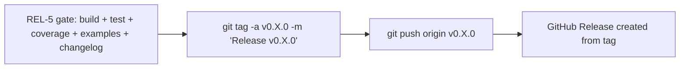

# Release Policy

**Version:** 1.0.0
**Status:** Stable
**Layer:** concept

## Overview

Defines the semantic versioning policy for GoNN, the public API surface contract, and the release
gate criteria that must pass before tagging any version. This spec is the authoritative source
for what constitutes a breaking vs. non-breaking change, which packages are public, and what
the v0.6.0 milestone delivers.

## Related Specifications

- [l1-neural-network-architecture.md](l1-neural-network-architecture.md) — Public API entry point
- [l1-network-persistence.md](l1-network-persistence.md) — Serialization contract; breaking changes here require a major version bump
- [l1-observability-protocol.md](l1-observability-protocol.md) — Observer contract; additions are minor; removals are breaking
- [l1-error-taxonomy.md](l1-error-taxonomy.md) — Sentinel errors are part of the public surface

## 1. Motivation

Phase 5 is complete. The multi-hidden catalog (E03/E04/E05/E07/E08/E13) is green. Before
tagging `v0.6.0`, the project needs a shared definition of:

- Which packages are part of the public contract (import-stable surface).
- What version bump is required for each class of change.
- What release gate checks must be green before tagging.

Without this policy, version numbers carry no semantic meaning for downstream users.

## 2. Constraints & Assumptions

- GoNN follows `v0.MINOR.PATCH` during the pre-1.0 phase. `v0.x` does not guarantee API
  stability across minor bumps — users should pin to a specific minor version.
- Public API packages are those explicitly listed in REL-2. All other packages under `pkg/`
  are internal implementation detail and may change without a version bump.
- The release gate checks in REL-5 are mandatory pre-conditions; no exceptions and no
  conditional bypasses.

## 3. Core Invariants

- **REL-1**: Version numbers follow Semantic Versioning 2.0.0. During `v0.x`, any minor bump
  may contain breaking changes (SemVer-compliant for pre-1.0 releases).
- **REL-2**: The **public API surface** consists of: `pkg/nn` (all exported symbols),
  `pkg/activation` (all exported functions and the `Type` enum), `pkg/loss` (all exported
  functions and the `Type` enum). All other packages (`pkg/network`, `pkg/layer`, `pkg/neuron`,
  `pkg/compute`, etc.) are **internal** and not subject to the stability guarantee.
- **REL-3**: A **breaking change** to any public API symbol (signature change, removal, rename,
  semantic change) requires at minimum a `MINOR` bump during `v0.x`. During `v1.x+`, it
  requires a `MAJOR` bump.
- **REL-4**: A **non-breaking addition** to the public API (new exported function, new option,
  new algorithm) requires a `MINOR` bump. A bug fix with no API change requires a `PATCH` bump.
- **REL-5**: **Release gate** — all of the following MUST be green before tagging: (a) `go build
  ./...` clean with no warnings, (b) `go test -race ./...` passes with zero race reports, (c)
  every non-example package has ≥ 80% line coverage, (d) all example modules build and pass
  their smoke tests (`go test ./...` in each example directory), (e) `CHANGELOG.md` entry
  authored for the release.
- **REL-6**: Every release tag is immutable. No force-push to version tags. Patches to a
  released version create a new patch tag, never amend an existing one.

## 5. Detailed Design

### 5.1 v0.6.0 Deliverables

The `v0.6.0` tag marks the completion of multi-hidden topology support:

- Multi-hidden `Network[T]` — unlimited hidden layers via `HiddenLayers []uint`.
- `pkg/persistence` schema v1.1.0 — multi-hidden weight serialization.
- Six new catalog examples: E03 perceptron, E04 binary_classification, E05 iris,
  E07 regression_sin, E08 regression_multi, E13 higher_order_options.
- Known debt documented in CHANGELOG: `axon.New[T]` ignores `WeightInit` for deep ReLU
  (mitigated by SIGMOID + input normalization).

### 5.2 v0.7.0 Planned Deliverables (post-Phase 6)

- `pkg/optimizer/` — pluggable SGD/Adam/RMSProp optimizer (Phase 6, Track A).
- `pkg/regularizer/` — L1/L2/Dropout regularization (Phase 6, Track B).
- WeightInit fix: `axon.New[T]` applies configured Xavier/He (Phase 6, Track B, T-6B06).

### 5.3 Known Debt to Document Before v0.6.0

- `axon.New[T]` always uses `U[-0.5, 0.5]` regardless of configured `WeightInit`.
- `E06` (MNIST loader) and `E10` (AndTrain continuation) remain deferred.

### 5.4 Release Process

## 6. Implementation Notes

1. Audit `pkg/nn` exported symbols against the public surface defined in REL-2.
2. Author `CHANGELOG.md` with v0.6.0 section (multi-hidden, new examples, known debt).
3. Update root `README.md` — document multi-hidden API (`HiddenLayers` option, v0.6 feature list).
4. Run the full gate check (REL-5) — resolve all failures before tagging.
5. Create annotated tag `v0.6.0` with message summarizing deliverables from §5.1.

## 7. Drawbacks & Alternatives

- A module-per-package release strategy (separate `go.mod` per sub-package) would provide
  finer-grained stability signals but adds maintenance overhead — deferred until user demand
  justifies it.

## Canonical References

| Alias | Path | Purpose |
| :--- | :--- | :--- |
| `[ARCH-L1]` | `.design/main/specifications/l1-neural-network-architecture.md` | Public API entry point definition |
| `[PERS-L1]` | `.design/main/specifications/l1-network-persistence.md` | Serialization contract for breaking-change classification |
| `[CHANGELOG]` | `CHANGELOG.md` | Release notes (to be created for v0.6.0, updated for v0.7.0) |

## Document History

| Version | Date | Description |
| :--- | :--- | :--- |
| 1.0.0 | 2026-05-07 | Initial — release policy for v0.6.0 and beyond (Spark 3). Trust Mode Stable. |
