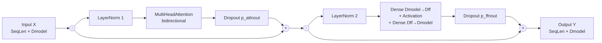
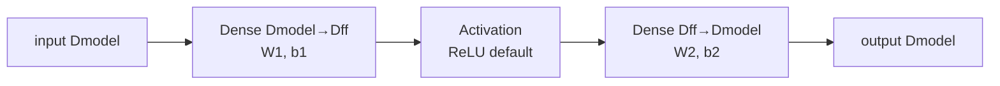

# Transformer Block

**Version:** 0.1.0
**Status:** Stable
**Layer:** concept

## Overview

Defines the contract for **Transformer blocks** — composite sequence-processing primitives that combine MultiHeadAttention, LayerNorm, a position-wise Feed-Forward Network (FFN), and residual connections into a single reusable layer. Covers three primitives: `TransformerEncoderBlock` (self-attention + FFN with two residuals — the BERT / encoder pattern), `TransformerDecoderBlock` (causal self-attention + FFN with two residuals — the GPT / decoder-only pattern), and `TransformerStack` (N stacked encoder or decoder blocks). All three preserve the `(SeqLen × Dmodel) → (SeqLen × Dmodel)` shape contract established by the underlying attention spec.

Scope is intentionally limited to **encoder-only and decoder-only stacks**. Full encoder-decoder cross-attention (the original 2017 architecture with separate encoder and decoder streams) is deferred — it requires cross-attention which is itself deferred at l1-attention.md ATT-C2. The two primitives delivered here cover BERT-style, GPT-style, and ViT-style architectures, which span the dominant production use cases.

## Related Specifications

- [l1-attention.md](l1-attention.md) — Mandatory primitive — TransformerEncoderBlock uses bidirectional MultiHeadAttention; TransformerDecoderBlock uses causal MultiHeadAttention via ATT-C4
- [l1-normalization-layers.md](l1-normalization-layers.md) — LayerNorm is the mandatory normalizer per Vaswani et al. 2017 §3.1; BatchNorm is unsafe per the same rationale as REC-C7 / attention §4.5
- [l1-neural-network-architecture.md](l1-neural-network-architecture.md) — Parent topology model; Transformer block is a composite layer in the Layer category hierarchy
- [l1-embedding-layers.md](l1-embedding-layers.md) — Upstream producer of the `(SeqLen × Dmodel)` input tensor; EmbeddingStack output feeds directly into a TransformerStack
- [l1-regularization.md](l1-regularization.md) — Dropout applied in three canonical positions (post-attention, post-FFN, post-attention-weights per ATT-C7)
- [l1-weight-initialization.md](l1-weight-initialization.md) — Xavier on FFN Dense layers; inherits Attention's W_q/W_k/W_v/W_o init
- [l1-network-persistence.md](l1-network-persistence.md) — Composite block must round-trip via JSON; children handle their own marshalling
- [l1-training-semantics.md](l1-training-semantics.md) — Backward through residual + norm + attention + FFN cascade; standard chain rule
- [l1-recurrent-layers.md](l1-recurrent-layers.md) — Sibling sequence primitive; Transformer blocks are the modern alternative to stacked LSTM
- [l1-dynamic-topology.md](l1-dynamic-topology.md) — Whole blocks can be inserted / removed at topology safe-points (treated as atomic units)

## 1. Motivation

GoNN currently ships MultiHeadAttention (l1-attention.md), LayerNorm (l1-normalization-layers.md NORM-2), Dense (l2-layer-types.md), and Dropout (l1-regularization.md). These are the four ingredients of a Transformer block. Without a composite-block contract:

- Users must hand-wire every block (one MHA + two LayerNorm + two Dense + two residual adds + two Dropout placements) — repetitive, error-prone, divergent across user code.
- The pre-norm vs post-norm decision (§4 below) — a critical training-stability lever — must be reinvented per-user; there is no canonical wiring.
- Stacking N identical blocks (the typical 6/12/24-layer Transformer) requires a hand-rolled loop, with no shared parameter-count or shape-validation logic.
- Examples catalog (l2-usage-examples) cannot host transformer-based examples (E17+) without a composite block primitive — composing 50+ raw layers per example would dominate the example file.

Adding `TransformerEncoderBlock`, `TransformerDecoderBlock`, and `TransformerStack` as first-class layer types:

1. Captures the canonical block wiring in one place, so every user-facing Transformer follows the same proven topology.
2. Exposes the pre-norm / post-norm switch as a single construction flag — the most consequential architectural decision compressed to one boolean.
3. Reduces the example surface area for E17+ catalog entries from ~50 layer-wires per block to one constructor call.
4. Provides a stable insertion point for future amendments (relative position bias, RoPE, swiGLU FFN variants) without forcing every user to refactor their hand-wired blocks.

## 2. Constraints & Assumptions

- **TRANS-C1 (Self-attention only)**: TransformerEncoderBlock and TransformerDecoderBlock use self-attention only — Q, K, V derive from the block's single input. Cross-attention (separate K/V source) is deferred, gated by l1-attention.md ATT-C2.
- **TRANS-C2 (Encoder = bidirectional, Decoder = causal)**: The only documented difference between EncoderBlock and DecoderBlock in v0.1 is the causal masking flag forwarded to the inner MultiHeadAttention layer. EncoderBlock disables causal mask (full bidirectional attention); DecoderBlock enables it (each position attends only to itself and prior positions).
- **TRANS-C3 (Two-layer FFN with one hidden activation)**: The position-wise FFN is exactly `Dense(Dmodel → Dff) → Activation → Dense(Dff → Dmodel)` where `Dff` is configurable (canonical default `4 × Dmodel`). Three-layer FFNs, gated FFNs (swiGLU, GeGLU), and convolutional FFN replacements are deferred.
- **TRANS-C4 (FFN activation defaults to ReLU)**: ReLU is the v0.1 default. GELU is the modern preference (BERT, GPT-2+) but requires a `Gelu[T]` activation that may not yet exist in `pkg/activation/`. The L2 implementation MAY add Gelu and switch the default in a minor-bump amendment.
- **TRANS-C5 (LayerNorm only)**: Per Vaswani et al. and the universal modern preference, only LayerNorm is permitted as the block's normalizer. BatchNorm is forbidden (statistics across sequence positions are unsafe — same rationale as REC-C7 and the attention §4.5 discussion). RMSNorm and other variants are deferred.
- **TRANS-C6 (Pre-norm vs post-norm is construction-time)**: A boolean flag at construction selects pre-norm (`X + MHA(LN(X))` and `Y + FFN(LN(Y))` — recommended for stacks ≥ 6 layers) or post-norm (`LN(X + MHA(X))` and `LN(Y + FFN(Y))` — original 2017). The flag CANNOT change after construction. Both variants are observably equivalent for shallow stacks; pre-norm wins for deep stacks because the residual gradient path skips both norm operations.
- **TRANS-C7 (Three Dropout positions)**: v0.1 honors three Dropout placements: (a) on attention weights post-softmax per ATT-C7, (b) on the attention output before residual add, (c) on the FFN output before residual add. All three default to `p = 0.0` (disabled). All three share a single layer-level `DropoutRate` field for simplicity — per-position rates are deferred to a future amendment.
- **TRANS-C8 (Stack homogeneity)**: A `TransformerStack` with `N` blocks uses N independent block instances with **independent** parameters (no weight tying across blocks). All N blocks share construction config (`Dmodel`, `NumHeads`, `Dff`, `Causal`, `PreNorm`, `DropoutRate`) but have unique weights. Cross-block weight tying is deferred.

## 3. Core Invariants

- **TRANS-1 (Shape preservation)**: A Transformer block (Encoder or Decoder) takes input `X ∈ (SeqLen, Dmodel)` and produces output `Y ∈ (SeqLen, Dmodel)`. Shape is preserved end-to-end so blocks stack uniformly. A TransformerStack of `N` blocks produces the same `(SeqLen, Dmodel)` output. No block in v0.1 changes sequence length or model dimension.

- **TRANS-2 (Encoder forward composition — post-norm)**: When `PreNorm == false`, TransformerEncoderBlock computes:
  ```
  A = MultiHeadAttention(X)          // bidirectional self-attention, ATT-C4 disabled
  A' = Dropout(A, p_attnout)
  Z = LayerNorm(X + A')
  F = FFN(Z) = Dense₂(Activation(Dense₁(Z)))
  F' = Dropout(F, p_ffnout)
  Y = LayerNorm(Z + F')
  ```
  Two residual adds, two LayerNorms, one MHA, one FFN. Shape preserved.

- **TRANS-3 (Encoder forward composition — pre-norm)**: When `PreNorm == true`, TransformerEncoderBlock computes:
  ```
  Z₁ = LayerNorm(X)
  A = MultiHeadAttention(Z₁)         // bidirectional
  A' = Dropout(A, p_attnout)
  Z = X + A'                         // residual skips the norm
  Z₂ = LayerNorm(Z)
  F = FFN(Z₂)
  F' = Dropout(F, p_ffnout)
  Y = Z + F'                         // residual skips the norm
  ```
  The residual path now bypasses both LayerNorms — the dominant reason pre-norm trains stable to 24+ layers without warmup.

- **TRANS-4 (Decoder forward composition)**: TransformerDecoderBlock is identical to TransformerEncoderBlock at the wiring level (TRANS-2 / TRANS-3 hold) but the inner MultiHeadAttention has ATT-C4 (causal masking) **enabled** — each position attends only to itself and prior positions. This is the only structural difference between encoder and decoder blocks in v0.1.

- **TRANS-5 (FFN structure)**: The position-wise Feed-Forward Network applies two Dense layers with one activation between them:
  ```
  FFN(z) = W₂ · Activation(W₁ · z + b₁) + b₂
  ```
  where `W₁ ∈ (Dmodel, Dff)`, `b₁ ∈ (Dff,)`, `W₂ ∈ (Dff, Dmodel)`, `b₂ ∈ (Dmodel,)`. The same FFN parameters apply identically at every sequence position (position-wise = parameter-shared across positions). Per-position cost is `O(Dmodel · Dff + Dff · Dmodel) = O(2 · Dmodel · Dff)`. With canonical `Dff = 4 · Dmodel`, FFN dominates parameter count over attention for typical configurations.

- **TRANS-6 (Residual connection contract)**: Both residual additions (post-attention and post-FFN) are element-wise tensor sums of two `(SeqLen, Dmodel)` tensors. The residual gradient flows backward unchanged through the sum, providing the gradient shortcut that lets gradients reach early layers regardless of stack depth. The L2 implementation MUST NOT clip, normalize, or scale the residual contribution.

- **TRANS-7 (Stack composition)**: TransformerStack with `N` blocks computes:
  ```
  X₀ = input
  Xᵢ = Block_i(Xᵢ₋₁)   for i ∈ [1, N]
  output = X_N
  ```
  All N blocks share construction config but have independent weights. The stack itself is a thin wrapper that owns the N block instances and routes Forward / Backward sequentially. No additional LayerNorm at the stack output in v0.1 (some recipes add one — deferred to a future amendment as it overlaps with pre-norm trade-offs).

- **TRANS-8 (Backward correctness)**: Backward propagation walks the forward graph in reverse: through the second residual sum (gradient splits), through the FFN (standard Dense chain rule), through LayerNorm, through the first residual sum (gradient splits), through MHA (ATT-7 four-path backward), back to the input. Both residual paths receive copies of their respective upstream gradient (the gradient is duplicated at the sum-junction during backward — standard convention). The implementation MUST correctly accumulate gradients to all child parameters: 4 MHA projection matrices and biases + 2 FFN matrices and biases + 2 LayerNorm gamma/beta vectors per block.

- **TRANS-9 (Persistence)**: A Transformer block persists its construction config (`Dmodel`, `NumHeads`, `Dff`, `Causal`, `PreNorm`, `DropoutRate`, `Activation` identifier) and delegates parameter persistence to its children (one MHA via ATT-9, two LayerNorm via NORM persistence, two Dense via standard layer persistence). The block's `Type` discriminator distinguishes encoder vs decoder blocks. A TransformerStack persists its config plus a JSON array of its N children in topology order. JSON round-trip restores the full block / stack identically.

- **TRANS-10 (Layer interface compatibility)**: TransformerEncoderBlock, TransformerDecoderBlock, and TransformerStack satisfy the same `Layer[T]` interface as Dense / Conv / Recurrent / Attention. Their `Forward(input)` signature accepts `(SeqLen, Dmodel)` and returns `(SeqLen, Dmodel)`. Padding-mask forwarding (when the inner MHA's optional MaskedLayer extension is set) propagates from the block's MaskedLayer extension to its inner MHA — the block forwards the mask to its child.

## 4. Detailed Design

### 4.1 Encoder Block Topology (Pre-Norm — Recommended)



The two `((·))` split points are tensor-passthroughs that fork into the residual path; the two `((+))` adds are element-wise tensor sums. Both LayerNorms are skipped by the residual flow — that is the structural reason pre-norm trains stable at depth.

### 4.2 Decoder Block Topology

Identical to §4.1 with one change — the inner MultiHeadAttention has `Causal = true` (ATT-C4 enabled). In Forward, scores for position `i` attending to positions `j > i` are masked to `-∞` before softmax, driving the corresponding attention weights to zero. The rest of the wiring (residual, LayerNorm, FFN, Dropout) is unchanged. v0.1 deliberately does NOT add a cross-attention block between self-attention and FFN — that would require cross-attention support from l1-attention.md, currently deferred at ATT-C2.

### 4.3 FFN Structure



`Dff` is configurable; canonical default is `4 · Dmodel`. The same `(W₁, b₁, W₂, b₂)` quadruple applies at every sequence position (position-wise sharing). Parameter count per FFN: `Dmodel · Dff + Dff + Dff · Dmodel + Dmodel = 2 · Dmodel · Dff + Dff + Dmodel`. For `Dmodel = 128, Dff = 512`: `2 · 128 · 512 + 512 + 128 = 131,712` parameters — already larger than a single MHA layer (`66,048` per §4.2 of l1-attention.md).

### 4.4 Parameter Count Example — BERT-Base-style Block

`Dmodel = 768, NumHeads = 12, Dff = 3072, SeqLen = 512`:

| Component | Parameters |
| :--- | :--- |
| MultiHeadAttention (4 × `Dmodel · Dmodel + Dmodel`) | `4 · (768·768 + 768) = 2,362,368` |
| LayerNorm × 2 (each `2 · Dmodel`) | `2 · 1,536 = 3,072` |
| FFN Dense₁ (`Dmodel · Dff + Dff`) | `768·3072 + 3072 = 2,362,368` |
| FFN Dense₂ (`Dff · Dmodel + Dmodel`) | `3072·768 + 768 = 2,360,064` |
| **Per-block total** | **7,087,872** |
| **12-block stack** | **85,054,464** |

For comparison, BERT-Base lists ~110M parameters total — the remaining ~25M live in the embedding + pooler. Numbers match the canonical architecture within expected rounding.

### 4.5 Pre-Norm vs Post-Norm Stability

Pre-norm (TRANS-3) is recommended for stacks of 6+ layers. Reason: the residual gradient path during backward is:

- **Post-norm**: gradient flows back through `LayerNorm⁻¹` once per block before reaching the residual stream. Composing N such norms multiplies gradient magnitude in unpredictable ways; the standard remedy is a learning-rate warmup period over the first ~10,000 steps.
- **Pre-norm**: gradient flows through the residual stream UNCHANGED by the norm — the norm only sees the side-branch gradient. Composing N residuals adds gradient contributions but does not multiplicatively distort them; warmup becomes optional.

Pre-norm trades slightly worse final loss in some shallow-stack benchmarks for dramatically better stability at depth. Both variants are exposed because hyperparameter searches across both have produced state-of-the-art results in different regimes; the L1 spec does not prescribe a default — the L2 implementation MUST default to a documented choice and explain the rationale.

### 4.6 Padding Mask Propagation

When the inner MHA's optional padding-mask extension is used (per l1-attention.md ATT-6), the block forwards a per-call padding mask `m ∈ {0, 1}^SeqLen` to its inner MHA. The mask does NOT affect LayerNorm (NORM-2 LayerNorm computes per-sample-per-feature statistics, agnostic of which positions are valid), nor does it affect FFN (parameter-shared across positions). The mask affects only the attention step — which is consistent with l1-attention.md ATT-6 semantics.

The L2 implementation MUST expose a block-level mask-forwarding entry point so users can pass the padding mask once per forward call without reaching into the inner MHA directly.

### 4.7 Backward Pass Sketch

For TransformerEncoderBlock (pre-norm), the backward chain is:

1. Upstream gradient `∂L/∂Y` at the second residual sum.
2. Sum-junction splits: `∂L/∂Z = ∂L/∂Y` (residual path) and `∂L/∂F' = ∂L/∂Y` (FFN path).
3. FFN-path: backward through Dropout (passthrough scaling) → FFN second Dense → activation backward → FFN first Dense → LayerNorm₂ → adds at `∂L/∂Z`.
4. First residual sum: `∂L/∂X = ∂L/∂Z` (residual path) and `∂L/∂A' = ∂L/∂Z` (attention path).
5. Attention-path: backward through Dropout → MHA (ATT-7 four-path backward) → LayerNorm₁ → adds at `∂L/∂X`.
6. Final `∂L/∂X` is the block's downstream gradient. All child parameter gradients (`∂L/∂Wq..o`, `∂L/∂W₁..₂`, `∂L/∂γ₁..₂`, `∂L/∂β₁..₂`) accumulate to their respective child layers and flow through the standard optimizer Step.

Backward correctness is validated by finite-difference gradient check on a small block (`Dmodel = 8, NumHeads = 2, Dff = 16, SeqLen = 4`) — same pattern used for l1-attention.md ATT-7.

### 4.8 Stack Forward / Backward

TransformerStack with `N` blocks holds `blocks[N]` and routes forward as `output = blocks[N-1].Forward(...blocks[0].Forward(input)...)`. Backward routes in reverse. The stack itself holds no parameters — it is a thin sequencer. The L2 implementation MAY parallelize parameter updates across blocks (no cross-block dependency in Adam / SGD steps), but Forward and Backward are sequential by construction.

## 6. Implementation Notes

L2 realization should land in three sub-phases:

1. **L2-A — TransformerEncoderBlock (post-norm baseline)**: smallest surface that exercises the composite-layer pattern. Composes one MHA + two LayerNorm + two Dense + two residual adds (Dropout off in v0.0). Validates the child-ownership pattern, JSON round-trip for a composite block, and the finite-difference gradient check across the whole block.
2. **L2-B — Pre-norm variant + Dropout integration**: adds the boolean `PreNorm` flag and routes the forward / backward through the alternate wiring per TRANS-3. Wires the three Dropout positions per TRANS-C7 (post-attn-weights via existing ATT-C7 hook, post-attn, post-ffn). Validates the equivalence of forward output between pre-norm and post-norm at Dropout = 0 by reset-init equivalence test.
3. **L2-C — TransformerDecoderBlock + TransformerStack**: TransformerDecoderBlock is a copy of EncoderBlock with `Causal = true` forwarded to MHA — straightforward delta. TransformerStack owns `N` child blocks with shared config but independent weights; Forward / Backward route sequentially. Validates BERT-Base-style parameter count (§4.4) and a 6-block stack converges on a synthetic copy-task.

All three share helper utilities for child-layer construction and gradient routing. The composite block's persistence MUST delegate to children rather than re-implement field-by-field marshalling — composite specs should not duplicate primitive serialization logic.

## 7. Drawbacks & Alternatives

- **Alternative: Encoder-decoder cross-attention block in v0.1** — rejected. Requires cross-attention from l1-attention.md (ATT-C2 deferred). v0.1 covers encoder-only (BERT, ViT) and decoder-only (GPT) which are the dominant production architectures. Encoder-decoder Transformer (original 2017, T5) is a v0.2 amendment that adds a third primitive `TransformerCrossDecoderBlock`.
- **Alternative: Single `TransformerBlock` type with mode flag (encoder / decoder)** — accepted but rejected for v0.1 clarity. The two block types share 95% of code but the one-line semantic difference (causal flag forwarded) is more readable as two named types in `pkg/layer/transformer/`. The L2 implementation MAY consolidate to one type with a mode enum following the `PositionalEncoding` / `MultiHeadAttention` precedent if package surface grows unwieldy.
- **Alternative: Bundle EmbeddingStack into TransformerStack** — rejected. Embedding is an input-side concern with sparse-update semantics (EMB-9) that don't apply to the Transformer body. Keeping them separate preserves the EMB-9 sparse-optimizer path and lets users compose Pattern C / D from l1-embedding-layers.md §4.4.
- **Alternative: Make FFN configurable (3-layer, gated swiGLU, GeGLU, conv FFN)** — out of scope for v0.1. swiGLU and GeGLU are the modern preferences (LLaMA, PaLM) but introduce extra parameter slots and an activation extension point. A v0.2 amendment may add a `FFNVariant` enum without breaking the existing wiring contract.
- **Alternative: Per-position-rate Dropout (separate p for each of the three positions)** — out of scope for v0.1. The Vaswani 2017 paper uses one Dropout rate for all three; modern recipes (BERT, GPT-2) follow the same convention. Per-position rates add 3× config surface for marginal benefit. Future amendment if research demonstrates the value.
- **Alternative: Bake positional encoding into the block** — rejected. Position is an input-side concern handled by l1-embedding-layers.md EmbeddingStack. The Transformer block intentionally accepts an already-positioned tensor so it can compose with non-NLP use cases (ViT patches, audio frames) where positional encoding takes a different form.
- **Alternative: Final LayerNorm at TransformerStack output** — out of scope for v0.1. Some recipes (GPT-2, BERT) place a final LayerNorm after the stack; others do not. The decision interacts with pre-norm vs post-norm. v0.1 omits it for orthogonality; users may add `WithLayerNorm` after the stack if needed.

## Canonical References

| Alias | Path | Purpose |
| :--- | :--- | :--- |
| `[ATTN]` | `.design/main/specifications/l1-attention.md` | Mandatory inner primitive — encoder uses bidirectional MHA, decoder uses causal MHA per ATT-C4 |
| `[NORM]` | `.design/main/specifications/l1-normalization-layers.md` | LayerNorm is the only permitted normalizer per TRANS-C5; BatchNorm forbidden across sequence positions |
| `[ARCH-PARENT]` | `.design/main/specifications/l1-neural-network-architecture.md` | Parent topology model — composite block in the Layer category hierarchy |
| `[EMBED]` | `.design/main/specifications/l1-embedding-layers.md` | Upstream producer of `(SeqLen, Dmodel)` input via EmbeddingStack |
| `[REG]` | `.design/main/specifications/l1-regularization.md` | Dropout primitive used at three positions per TRANS-C7 |
| `[INIT]` | `.design/main/specifications/l1-weight-initialization.md` | Xavier on FFN Dense layers; inherits attention's projection init |
| `[PERSIST]` | `.design/main/specifications/l1-network-persistence.md` | Composite block delegates to children's JSON marshalling per TRANS-9 |
| `[TRAIN-SEM]` | `.design/main/specifications/l1-training-semantics.md` | Backward through residual + norm + attention + FFN cascade |
| `[REC-SIBLING]` | `.design/main/specifications/l1-recurrent-layers.md` | Sibling sequence primitive — Transformer is the modern alternative to stacked LSTM |
| `[DYN-TOPO]` | `.design/main/specifications/l1-dynamic-topology.md` | Whole blocks treated as atomic insertion / removal units at safe-points |

<!-- Downstream agent instruction: TRANS-1..TRANS-10 are normative. TRANS-3 (pre-norm forward) is the recommended default for stacks of 6+ blocks — gradient stability dominates at depth. TRANS-6 (residual unmodified) is the single most violated invariant in implementations — DO NOT scale, clip, or normalize the residual contribution; the residual stream is the gradient highway that makes deep stacks trainable. The L2 implementation MUST verify gradient flow at the block level via finite-difference, NOT just at the child-layer level — the residual interactions cannot be caught by component-level tests alone. -->

## Document History

| Version | Date | Description |
| :--- | :--- | :--- |
| 0.1.0 | 2026-05-19 | Initial spec authored via `/magic-spec` Blank Trigger (Creative Spark 1). 10 invariants (TRANS-1..TRANS-10) covering shape preservation, encoder & decoder forward composition (pre-norm and post-norm), FFN structure (two-Dense with one activation), residual contract (unmodified), N-block stack composition, backward correctness across the cascade, child-delegated persistence, `Layer[T]` interface compatibility, and padding-mask forwarding. 8 constraints (TRANS-C1..TRANS-C8) bounding scope to encoder-only and decoder-only (no cross-attention), two-layer ReLU FFN default, LayerNorm only, construction-time pre-norm / post-norm switch, shared layer-level Dropout rate, independent block weights. 3-phase L2 implementation plan (post-norm encoder baseline → pre-norm + Dropout → decoder + stack). Promoted Draft → Stable via Trust Mode (C9): MVC satisfied (Overview + §3 Core Invariants + §4 Detailed Design); no RULES.md conflicts; no circular dependencies; composes existing Stable primitives (Attention, LayerNorm, Dense, Dropout); technology-agnostic. |
