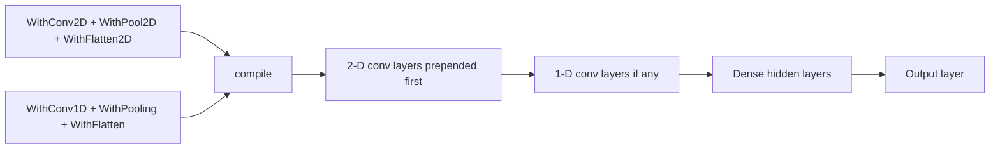

# 2-D Convolutional Layers — Go Implementation

**Version:** 0.1.0
**Status:** Stable
**Layer:** implementation
**Implements:** l1-conv-2d-layers.md

## Overview

Go realization of the 2-D convolutional layer contract from `l1-conv-2d-layers.md`.
Extends `pkg/layer/conv/` with four new types: `Conv2D[T]`, `MaxPool2D[T]`,
`AvgPool2D[T]`, and `Flatten2D[T]`. All four satisfy the same `layer.Layer[T]`
interface as `Input`, `Dense`, `Conv1D`, and `Output` so the existing network
graph iterates them uniformly. New functional options `WithConv2D`,
`WithMaxPool2D`, `WithAvgPool2D`, and `WithFlatten2D` are added to
`pkg/nn/options.go`. Tensor layout is CHW row-major throughout (CONV2D-C9);
filter-major flat `[]T` storage generalises Conv1D Variant A by adding the
inner-channel axis.

## Related Specifications

- [l1-conv-2d-layers.md](l1-conv-2d-layers.md) — L1 parent contract (Stable v0.2.0)
- [l2-conv-layers-impl.md](l2-conv-layers-impl.md) — 1-D analogue; weight storage Variant A extended here to 2-D
- [l2-layer-types.md](l2-layer-types.md) — `layer.Layer[T]` interface; all four types must satisfy it
- [l2-network-graph.md](l2-network-graph.md) — network graph iterates layers uniformly; conv-2d layers join the chain
- [l2-nn-facade.md](l2-nn-facade.md) — `WithConv2D` / `WithMaxPool2D` / `WithAvgPool2D` / `WithFlatten2D` are new options
- [l2-init-impl.md](l2-init-impl.md) — kernel weight initialization; fan-in for He/Xavier is `C_in × K_h × K_w`
- [l2-optimizer-impl.md](l2-optimizer-impl.md) — optimizer `Step()` must reach `Conv2D` weights via `GradSlots()`
- [l2-perf-impl.md](l2-perf-impl.md) — `sync.Pool` for gradient scratch buffers (PERF-4 zero-alloc backward)
- [l2-errors-impl.md](l2-errors-impl.md) — new `ErrConv2DShapeMismatch`, `ErrConv2DPoolSizeMismatch` sentinels
- [l2-dataset-loader-impl.md](l2-dataset-loader-impl.md) — `WithImageShape` adapter to re-tensorise flat MNIST vectors to `(1, 28, 28)` CHW tensors

## 4. Invariant Compliance

| L1 Invariant | Implementation |
| :--- | :--- |
| CONV2D-1 Output shape formula | `outputShape(inH, inW, kH, kW, sH, sW int, pad PadMode) (outH, outW int)` pure function in `conv2d.go`; called in `Conv2D.compile()` / `Validate()` to size downstream layers |
| CONV2D-2 Filter weights only trainable params | `Conv2D[T].Weights []T` (length `NumFilters*InChannels*KernelH*KernelW`) and optional `Biases []T` (length `NumFilters`) are the only fields that enter optimizer `Step()` via `GradSlots()`; `MaxPool2D`, `AvgPool2D`, and `Flatten2D` carry no trainable parameters |
| CONV2D-3 Forward determinism | `Conv2D.Forward` is a pure function of its `Weights`, `Biases`, and input slice; no RNG or global mutable state is accessed in the forward path |
| CONV2D-4 Gradient correctness (cross-correlation) | `Conv2D.Backward(upstream)` computes `gradW[f,c,i,j] += lastInput[c,y+i,x+j] * upstream[f,y,x]` (summed over output spatial positions) and `gradX[c,y,x] += Weights[f,c,i,j] * upstream[f,y+i,x+j]` (full 2-D cross-correlation summed over output channels); bias gradient is `gradB[f] = sum(upstream[f,:,:])` |
| CONV2D-5 Pool semantics (max/avg, non-overlapping) | `MaxPool2D[T].Forward` stores `argmaxH []int` and `argmaxW []int` (one entry per output position per channel) for backward routing; `Backward` routes upstream gradient only to the saved argmax position per window; `AvgPool2D[T].Backward` distributes upstream gradient evenly across all `P_h * P_w` positions per window |
| CONV2D-6 Flatten2D element order | `Flatten2D[T].Forward` iterates channels outer-to-inner following CHW flat-index `c * H * W + y * W + x` (CONV2D-C9); backward is a reshape-only operation using the same index formula so gradient routing is deterministic across versions |
| CONV2D-7 Weight persistence (JSON round-trip) | `Conv2D[T]` implements `json.Marshaler` / `json.Unmarshaler` via struct-alias pattern; exported JSON fields: `num_filters`, `in_channels`, `kernel_h`, `kernel_w`, `stride_h`, `stride_w`, `padding`, `use_bias`, `weights`, `biases`; `UnmarshalJSON` validates `len(Weights) == NumFilters*InChannels*KernelH*KernelW`; pool and flatten types persist only their configuration scalars (`pool_h`, `pool_w`) |
| CONV2D-8 Weight initialization | `Conv2D[T].Init(rng *rand.Rand)` calls `utils.HeNormal[T](rng, fanIn)` per weight where `fanIn = InChannels * KernelH * KernelW`; biases are zero-initialised; same delegate pattern as `Conv1D.Init` |
| CONV2D-9 Layer interface compatibility | All four types (`Conv2D[T]`, `MaxPool2D[T]`, `AvgPool2D[T]`, `Flatten2D[T]`) satisfy `layer.Layer[T]`; compile-time `var _ layer.Layer[float64] = (*Conv2D[float64])(nil)` assertions live in `conv2d.go`; no type switches in network graph iteration |

## 5. Detailed Design

### 5.1 Package Structure

```plaintext
pkg/layer/conv/
├── conv.go        # existing: package doc + compile-time interface assertions (extend for 2-D types)
├── conv1d.go      # existing: Conv1D[T] — unchanged
├── pool.go        # existing: MaxPool1D[T] — unchanged
├── flatten.go     # existing: Flatten[T] — unchanged
├── conv2d.go      # new: Conv2D[T] — constructor, Forward, Backward, Init, JSON, outputShape
├── pool2d.go      # new: MaxPool2D[T], AvgPool2D[T] — constructor, Forward, Backward
└── flatten2d.go   # new: Flatten2D[T] — stateless shape-collapse, Forward, Backward
```

### 5.2 Conv2D Weight Storage (CHW, filter-major flat `[]T`)

Layout is CHW row-major per CONV2D-C9. Filter storage generalises Conv1D Variant A:

```go
// Conv2D is a 2-D convolutional layer. Weight storage uses filter-major flat
// []T of length NumFilters*InChannels*KernelH*KernelW — filter f, input
// channel c, row i, column j resides at:
//   Weights[f*(InChannels*KernelH*KernelW) + c*(KernelH*KernelW) + i*KernelW + j]
// Input element (c, y, x) resides at flat index c*H*W + y*W + x (CHW, CONV2D-C9).
type Conv2D[T utils.Float] struct {
    Weights    []T     `json:"weights"`
    Biases     []T     `json:"biases,omitempty"`
    gradW      []T     `json:"-"`
    gradB      []T     `json:"-"`
    gradX      []T     `json:"-"`
    lastInput  []T     `json:"-"` // CHW-flat copy of the most recent Forward input
    InH        int     `json:"in_h"`
    InW        int     `json:"in_w"`
    NumFilters int     `json:"num_filters"`
    InChannels int     `json:"in_channels"`
    KernelH    int     `json:"kernel_h"`
    KernelW    int     `json:"kernel_w"`
    StrideH    int     `json:"stride_h"`
    StrideW    int     `json:"stride_w"`
    Padding    PadMode `json:"padding"`
    UseBias    bool    `json:"use_bias"`
}
```

The flat index formulae for both input and filter are MANDATORY — independent
re-derivation is forbidden (CONV2D-C9 §6 Implementation Notes).

### 5.3 outputShape helper

```go
// outputShape returns (outH, outW) for a 2-D convolution given spatial
// dimensions and kernel parameters. Generalises outputLen from conv1d.go
// to two axes.
func outputShape(inH, inW, kH, kW, sH, sW int, pad PadMode) (outH, outW int)
```

`compile()` calls `outputShape` to compute the input size of the first Dense
layer after `Flatten2D` — replaces the 1-D `outputLen()` call in that path.

### 5.4 MaxPool2D / AvgPool2D Backward

```go
type MaxPool2D[T utils.Float] struct {
    argmaxH  []int // row of max per (channel, output position)
    argmaxW  []int // col of max per (channel, output position)
    PoolH    int   `json:"pool_h"`
    PoolW    int   `json:"pool_w"`
    lastInH  int
    lastInW  int
    lastC    int
}
// Backward: upstream[c, oy, ox] flows only to lastInput[c, argmaxH[idx], argmaxW[idx]]
// where idx = c*outH*outW + oy*outW + ox

type AvgPool2D[T utils.Float] struct {
    PoolH   int `json:"pool_h"`
    PoolW   int `json:"pool_w"`
    lastInH int
    lastInW int
    lastC   int
}
// Backward: upstream[c, oy, ox] / (PoolH * PoolW) distributed to all positions
// in window (c, oy*PoolH..oy*PoolH+PoolH, ox*PoolW..ox*PoolW+PoolW)
```

### 5.5 Flatten2D

`Flatten2D[T]` is stateless — no weights, no saved activations beyond the input
shape needed for backward reshape. `Forward` iterates channels outer-to-inner
following CHW order. `Backward` is a single `copy` back into a
`(C, H, W)`-shaped gradient buffer.

```go
type Flatten2D[T utils.Float] struct {
    lastC int
    lastH int
    lastW int
}
```

### 5.6 Options Wiring

New entries in `pkg/nn/options.go`:

```go
func WithConv2D[T utils.Float](numFilters, inChannels, kernelH, kernelW, strideH, strideW int, pad PadMode, useBias bool) Option[T]
func WithMaxPool2D[T utils.Float](poolH, poolW int) Option[T]
func WithAvgPool2D[T utils.Float](poolH, poolW int) Option[T]
func WithFlatten2D[T utils.Float]() Option[T]
```

These options append to a `[]layer.Layer[T]` convolution prefix in `config.go`
alongside the existing Conv1D prefix. `compile()` prepends the 2-D conv stack
before the 1-D stack (if any), then before the Dense hidden stack.

### 5.7 compile() integration



`compile()` computes the flat output size of the final `Flatten2D` or `Flatten`
layer using `outputShape()` / `outputLen()` respectively and sets the `InputSize`
of the first Dense hidden layer accordingly.

### 5.8 Error Handling

New sentinels in `pkg/utils/errors.go`:

- `ErrConv2DShapeMismatch` — input spatial dimension < kernel dimension under `PadValid` (violates CONV2D-1).
- `ErrConv2DPoolSizeMismatch` — pool dimension > feature-map dimension.

`Conv2D.Validate(inC, inH, inW int) error` checks both constraints and returns
a wrapped `ErrConv2DShapeMismatch` on failure.

## 6. Implementation Notes

1. **CHW index formulae are MANDATORY verbatim from CONV2D-C9**:
   - Input element `(c, y, x)` → flat index `c * H * W + y * W + x`.
   - Filter element `(f, c, i, j)` → flat index `f * (InChannels * KernelH * KernelW) + c * (KernelH * KernelW) + i * KernelW + j`.
   Independent re-derivation is forbidden — copy from the L1 spec directly.

2. **Write `conv2d.go` first** (compile-time `var _` assertions only) — forces
   compiler errors early if the interface contract is broken.

3. **Backward-pass test matrix** (mandatory per CONV2D-4):
   - Both padding modes (`PadValid`, `PadSame`).
   - Both pool variants (`MaxPool2D`, `AvgPool2D`).
   - At least one multi-channel case (`InChannels ≥ 2`).
   Table-driven tests in `pkg/layer/conv/conv2d_test.go`.

4. **MNIST 2-D adapter** — `l2-dataset-loader-impl.md` must be amended to add a
   `WithImageShape(channels, height, width int) Option[T]` option (or equivalent
   re-tensoriser) in `pkg/dataset/mnist.go`. The existing loader emits flat
   784-byte `[]T` tensors; the adapter wraps the output in a CHW-shaped `(1, 28, 28)`
   view without copying, feeding `Conv2D` directly. This is a minor amendment
   (patch bump on `l2-dataset-loader-impl.md`) and is a prerequisite for the
   MNIST CNN example in the follow-up implementation phase.

5. **outputShape() must be used at compile time** — `Validate` calls it during
   `compile()` to set the downstream Dense layer's `InputSize`. Any mismatch
   (e.g., kernel larger than spatial dimension under `PadValid`) returns
   `ErrConv2DShapeMismatch` before the forward pass begins.

6. **sync.Pool for grad buffers** — `gradW`, `gradB`, `gradX` are cap-checked
   and zero-reset at the start of each `Backward` call (same pattern as
   `Conv1D.Backward`). A future `sync.Pool` wrapper MAY be introduced in
   `l2-perf-impl.md` after profiling confirms allocation pressure.

7. **Parallel-mode serialization** — tasks modifying `pkg/layer/conv/conv.go`
   and `pkg/nn/options.go` MUST be serialized in the implementation phase
   (`@role:orchestrator` constraint). `conv2d.go`, `pool2d.go`, and `flatten2d.go`
   are independent and MAY be implemented in parallel.

## Document History

| Version | Date | Description |
| :--- | :--- | :--- |
| 0.1.0 | 2026-05-17 | Initial spec — Conv2D/MaxPool2D/AvgPool2D/Flatten2D Go realization; CHW filter-major storage; all 9 CONV2D invariants mapped; MNIST adapter requirement documented. Promoted Draft → Stable via Trust Mode (L1 parent Stable v0.2.0; MVC satisfied; no RULES conflicts). |
