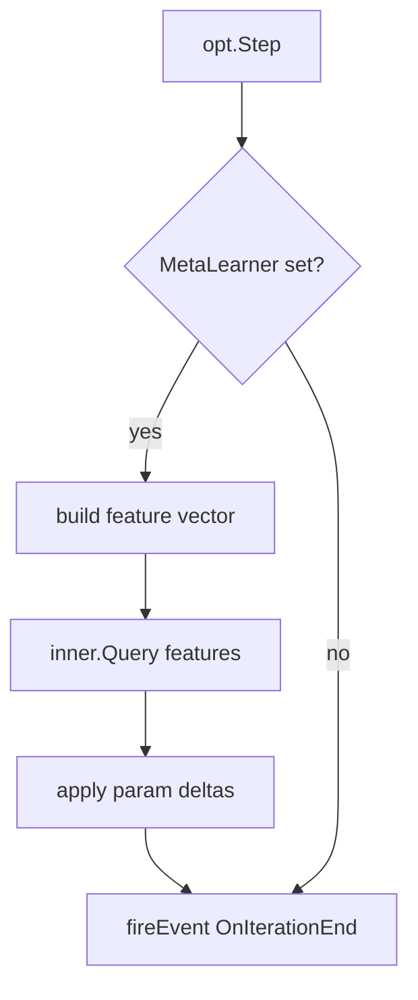

# Meta-Learning Hooks — Go Implementation

**Version:** 0.1.0
**Status:** Draft
**Layer:** implementation
**Implements:** l1-meta-learning-hooks.md

<!-- NOTE: Cannot reach RFC until l1-meta-learning-hooks.md is promoted from RFC → Stable.
     Blocked on explicit user review per RULES.md §2. -->

## Overview

Go realization of the meta-learning hooks contract from `l1-meta-learning-hooks.md`.
Exposes `ParamAccessor[T]`, `Tunable[T]`, and `MetaLearner[T]` in a new `pkg/nn/meta.go`
file. A `WithMetaLearner` option wires an inner `*NN[T]` into the outer network's training
loop so that hyperparameters (learning rate, thresholds) are queried from the inner network
at each iteration rather than read from static config fields.

## Related Specifications

- [l1-meta-learning-hooks.md](l1-meta-learning-hooks.md) — L1 parent (RFC v0.3.0, promotion pending)
- [l2-nn-facade.md](l2-nn-facade.md) — `WithMetaLearner` is a new functional option on `*NN[T]`
- [l2-training-loop.md](l2-training-loop.md) — train.go integration point for per-iteration hook
- [l2-callbacks-impl.md](l2-callbacks-impl.md) — `OnImprovementFound` can surface meta-learning signals
- [l2-errors-impl.md](l2-errors-impl.md) — new `ErrMetaLearnerShape` sentinel for mismatched inner NN output

## 4. Invariant Compliance

| L1 Invariant | Implementation |
| :--- | :--- |
| Opt-in tunability; defaults remain constants | `WithMetaLearner` option — absent means static config fields are used unchanged |
| `ParamAccessor[T]` uniform interface (scalar + tensor params) | `ParamAccessor[T]` interface in `pkg/nn/meta.go`; scalar wrapper `ScalarParam[T]` + slice wrapper `SliceParam[T]` |
| Inner network receives feature vector, outputs parameter deltas | `MetaLearner[T].Query(features []T) []T` calls inner `*NN[T].Query`; output slice maps to registered `Tunable[T]` targets |
| Recursive self-optimization (inner trains on outer dynamics) | Inner `*NN[T]` is a full GoNN network; caller is responsible for its training schedule |
| Thread-safety: outer training loop is single-threaded at safe-points | No additional locking needed; hook executes at the same safe-point as callback events |
| No modification of frozen (non-Tunable) params | `Tunable[T]` wraps only explicitly registered params; non-registered fields are read-only |

## 5. Detailed Design

### 5.1 Package Structure

```plaintext
pkg/nn/
└── meta.go          # ParamAccessor[T], ScalarParam[T], SliceParam[T],
                     # MetaLearner[T], metaHook (unexported integration glue)
```

### 5.2 Interface and Type Definitions

```
// [REFERENCE] — pseudo-code; not executable Go

type ParamAccessor[T utils.Float] interface {
    Get() []T          // returns current value as flat slice (len 1 for scalars)
    Set([]T) error     // validates shape before applying
    Name() string      // stable identifier for logging
}

type ScalarParam[T utils.Float] struct { ptr *T; name string }
// Get: return []T{*ptr}
// Set: validate len == 1, then *ptr = v[0]

type SliceParam[T utils.Float] struct { ptr *[]T; name string }
// Get: return copy of *ptr
// Set: validate len matches, then copy into *ptr

type MetaLearner[T utils.Float] struct {
    inner  *NN[T]
    params []ParamAccessor[T]   // ordered: inner.Query output[i] → params[i]
}

// Query builds feature vector from outer NN state, calls inner.Query,
// applies output deltas to registered params.
func (m *MetaLearner[T]) step(outerFeatures []T) error
```

### 5.3 train.go Integration

The meta-learner hook executes at the same safe-point as callbacks, after `opt.Step` and
before `fireEvent(OnIterationEnd)`. Feature vector construction is caller-defined via a
`FeatureFunc[T]` field on `MetaLearner[T]` — defaults to `[]T{loss, iteration/maxIter}`.



### 5.4 Error Handling

- `ErrMetaLearnerShape` — inner NN output size ≠ number of registered `Tunable` params.
- `ErrMetaLearnerRunning` — `WithMetaLearner` called while outer network is `Running`.

### 5.5 WithMetaLearner Option

```
// [REFERENCE]
func WithMetaLearner[T utils.Float](ml *MetaLearner[T]) Option[T]
// Sets config.MetaLearner = ml; validated during compile().
```

## 6. Implementation Notes

1. `pkg/nn/meta.go` — interfaces + concrete wrappers + `MetaLearner[T]`. No train.go imports.
2. `pkg/nn/config.go` — add `MetaLearner *MetaLearner[T]` field (nil = disabled).
3. `pkg/nn/options.go` — `WithMetaLearner` option.
4. `pkg/nn/train.go` — single `if nn.cfg.MetaLearner != nil { nn.cfg.MetaLearner.step(...) }` call after opt.Step.
5. `pkg/utils/errors.go` — add `ErrMetaLearnerShape`, `ErrMetaLearnerRunning` sentinels.

## Document History

| Version | Date | Description |
| :--- | :--- | :--- |
| 0.1.0 | 2026-05-12 | Initial Draft — blocked on l1-meta-learning-hooks RFC→Stable. |
