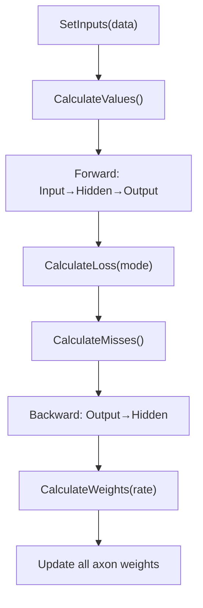

# Network Computational Graph

**Version:** 1.1.0
**Status:** Stable
**Layer:** implementation
**Implements:** l1-neural-network-architecture.md

## Overview

Specifies the internal computational graph that manages the neural network's data structure and propagation algorithms. `Network[T]` contains bundles of cells organized by layer role (Input, Hidden, Output) and implements forward propagation, loss computation, backward propagation, and weight updates.

## Related Specifications

- [l1-neural-network-architecture.md](l1-neural-network-architecture.md) — Parent concept spec
- [l2-nn-facade.md](l2-nn-facade.md) — Public facade that embeds Network
- [l2-layer-types.md](l2-layer-types.md) — Layer types that populate bundles
- [l2-neuron-model.md](l2-neuron-model.md) — Cell types stored in bundles

## 1. Motivation

The computational graph is the core engine of the neural network. It must efficiently manage the topology of cells and connections, execute forward/backward passes, and update weights. Separating this from the public facade allows internal optimization without API changes.

## 2. Constraints & Assumptions

- `Network[T]` is a value type (struct), embedded by `NN[T]`
- Default learning rate: 0.3
- Bundle is a generic container `bundle[T utils.Float, S neuron.Nucleus[T]]`
- Bundles store cells as slices; type assertions needed for polymorphic operations

## 4. Invariant Compliance

| L1 Invariant | Implementation |
| :--- | :--- |
| INV-1 (Generic Float) | `Network[T utils.Float]` with T propagated to all bundles |
| INV-3 (Forward propagation) | `CalculateValues()` iterates Input→Hidden→Output |
| INV-4 (Backward propagation) | `CalculateMisses()` iterates Output→Hidden (via axon.OutgoingCell) |
| INV-5 (Gradient descent) | `CalculateWeights(rate *T)` applies learning rate to each axon |
| INV-8 (Axon-only communication) | All inter-cell data flows through axon.CalculateValue/Miss/Weight |

## 5. Detailed Design

### 5.1 Network Structure

```plaintext
Network[T utils.Float]
├── Input   bundle[T, *cell.Input[T]]
├── Hidden  bundle[T, *cell.Dense[T]]   // Note: uses cell.Hidden[T] (missing type)
├── Output  bundle[T, *cell.Output[T]]
├── LearningRate *T
├── New[T]() Network[T]
├── Build() error
├── CalculateValues()
├── CalculateLoss(mode loss.Type) T
├── CalculateMisses()
└── CalculateWeights(rate *T)
```

### 5.2 Propagation Pipeline



### 5.3 Bundle Type

```plaintext
bundle[T utils.Float, S neuron.Nucleus[T]]
├── cells  []S
├── size   int
├── Init(size int)
├── SetInputs(data *[]T)
├── SetTargets(target *[]T)
├── calculateValues()     // requires Neuron[T] assertion
├── calculateWeights(*T)  // requires Neuron[T] assertion
└── getMisses() []*T
```

### 5.4 Known Issues (Critical)

1. **`cell.Hidden[T]` type does not exist** — referenced in Network but never defined
2. **`Build()` incomplete** — only wires Input→Hidden, not Hidden→Output
3. **Slice type assertion fails** — `any(b.cells).([]neuron.Neuron[T])` always returns false in Go (slices are not covariant)
4. **`SetInputs()` overwrites single cell** — loop iterates data but always writes to `cells[0]`
5. **`SetTargets()` type assertion fails** — casts bundle to `*cell.Output[T]` (wrong type)
6. **`propagation.go` index mismatch** — uses `Hidden.size` to iterate `Output.cells`

## 6. Implementation Notes

1. Define `cell.Hidden[T]` (alias to Dense or new type)
2. Fix Build() to complete all layer connections
3. Replace slice type assertions with element-by-element iteration
4. Fix SetInputs() to iterate cells, not just cells[0]
5. Fix SetTargets() type assertion

## 7. Drawbacks & Alternatives

- **Alternative**: Use interface slices `[]Neuron[T]` directly instead of generic bundles — simpler but loses compile-time type safety
- **Drawback**: Current design requires unsafe type assertions that defeat the purpose of generics

## Canonical References

| Alias | Path | Purpose |
| :--- | :--- | :--- |
| `[NETWORK]` | `pkg/network/network.go` | Network struct and Build() |
| `[BUNDLE]` | `pkg/network/bundle.go` | Bundle generic container |
| `[PROPAGATION]` | `pkg/network/propagation.go` | Forward/backward/weight methods |

## Document History

| Version | Date | Description |
| :--- | :--- | :--- |
| 1.0.0 | 2026-04-21 | Initial Stable — reverse-engineered from existing codebase |
| 1.1.0 | 2026-04-28 | Re-confirmed Stable under parent INV-2 v2.0 (TopologyMode). Bundles and propagation pipeline are mode-agnostic; Dynamic-mode mutations are deferred to l1-dynamic-topology rebalance step. No change to public Network[T] surface. |
