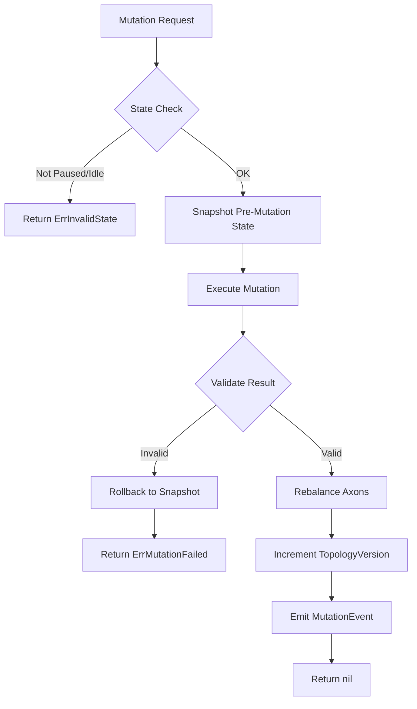

# Dynamic Topology Mode

**Version:** 0.2.0
**Status:** Draft
**Layer:** concept

## Overview

Proposes a **Dynamic mode** for networks where layers and neurons can be added or removed during
training or inference. Today `l1-neural-network-architecture.md` INV-2 forbids this ("Network topology
is immutable after construction"). This spec proposes amending INV-2 to introduce two modes:

- **Immutable** (current default) — INV-2 holds as written.
- **Dynamic** — topology mutations are permitted at well-defined synchronization barriers.

> ✓ **Conflict resolved (2026-04-28)**: Parent `l1-neural-network-architecture.md` v2.0.0 (RFC) amended INV-2
> to introduce a TopologyMode parameter (Immutable default, Dynamic opt-in). This spec is now the
> authoritative definition of the Dynamic mode and is referenced from the parent's Related Specifications.

## Related Specifications

- [l1-neural-network-architecture.md](l1-neural-network-architecture.md) — Parent (proposed amendment)
- [l1-training-control.md](l1-training-control.md) — Mutations occur at Paused-state safe points
- [l1-weight-initialization.md](l1-weight-initialization.md) — Fresh weight initialization for new connections
- [l1-checkpointing.md](l1-checkpointing.md) — Snapshot must capture topology version for rollback
- [l1-observability-protocol.md](l1-observability-protocol.md) — Mutation events exposed to observers

## 1. Motivation

Real research workflows want to:

- Grow a network during training (add a hidden layer when loss plateaus — neural architecture search).
- Prune dead neurons (those whose outgoing weights have collapsed near zero).
- Add output dimensions when the task definition changes (online learning with new classes).
- **Insert or remove entire hidden layers** at runtime to adjust network depth without rebuilding
  from scratch — e.g., progressively deepening a shallow network as training data complexity grows.
- **Shrink over-parameterized networks** by removing redundant layers (layer pruning) to reduce
  inference latency while preserving accuracy.

Forcing teardown + rebuild + retrain from scratch wastes compute and breaks continuity.

## 2. Constraints & Assumptions

- Dynamic mode is **opt-in** — the default remains Immutable to preserve current users' guarantees.
- Mutations are only permitted at **synchronization barriers** (paused state, between epochs).
  Mid-iteration mutation is an error.
- Adding capacity preserves existing weights bit-identically; only new connections are initialized fresh.
- Removing capacity invalidates affected outgoing axons; downstream weights must be re-normalized.
- **Layer mutations are structurally heavier** than neuron mutations: adding/removing a layer
  requires re-wiring two adjacent layers (predecessor and successor), not just one.
- **Input and Output layers are immutable** — only hidden (Dense) layers may be added or removed
  dynamically. Changing I/O dimensions is a separate concern (task/class evolution).

## 3. Core Invariants

- **DYN-1**: Mode is fixed at `Compile()`-time via `WithTopologyMode(Immutable | Dynamic)`. Switching
  mode mid-life is forbidden.
- **DYN-2**: All mutation methods (`AddHiddenLayer`, `RemoveHiddenLayer`, `AddNeuron`, `RemoveNeuron`)
  require the network to be in `Paused` (training) or `Idle` (post-train) state per `l1-training-control`.
- **DYN-3**: Mutations are **transactional** — either fully applied or fully rolled back on validation
  failure. No half-mutated network states exist.
- **DYN-4**: After any mutation, a **rebalance step** re-wires axons; the rebalance algorithm is
  deterministic given (old graph, mutation, RNG seed).
- **DYN-5**: A mutation **version counter** is monotonically incremented on every successful mutation.
  This counter is persisted in snapshots and exposed via observability, enabling rollback alignment.
- **DYN-6**: **Minimum topology constraint** — the network must always contain at least one hidden
  layer after any `RemoveHiddenLayer` call. Removing the last hidden layer returns an error.

## 5. Detailed Design

### 5.1 Mutation API (proposed)

```text
nn.AddHiddenLayer(position uint, size uint, activation Type, bias bool) error
nn.RemoveHiddenLayer(position uint) error
nn.AddNeuron(layerIdx uint, count uint) error
nn.RemoveNeuron(layerIdx uint, count uint) error
nn.TopologyVersion() uint64
```

### 5.2 Layer Lifecycle

Layer mutations are the most structurally impactful operations. The following rules govern them:

**5.2.1 Adding a Hidden Layer (`AddHiddenLayer`)**

```text
Before:  ... → Layer[p-1] → Layer[p] → ...
After:   ... → Layer[p-1] → NEW_LAYER → Layer[p] → ...
```

1. **Position validation**: `position` is a 0-based index into the hidden layer sequence.
   `position == 0` inserts immediately after Input; `position == len(hidden)` inserts
   immediately before Output. Out-of-range returns `ErrInvalidPosition`.
2. **Layer construction**: a new Dense layer is created with the given `size`, `activation`,
   and `bias` parameters. Cells are initialized but have no axon connections yet.
3. **Forward re-wiring**: axons from `Layer[p-1]` are disconnected from `Layer[p]` and
   reconnected to `NEW_LAYER`. New axons are created from `NEW_LAYER` to `Layer[p]`.
4. **Weight initialization**: new axon weights use the strategy from `l1-weight-initialization`
   (Xavier/He depending on activation). Existing weights on untouched axons are preserved
   bit-identically.
5. **Bias initialization**: if `bias == true`, the bias cell weight is initialized to zero.
6. **Rebalance**: DYN-4 applies — full deterministic re-wire.
7. **Version bump**: DYN-5 — topology version incremented.

**5.2.2 Removing a Hidden Layer (`RemoveHiddenLayer`)**

```text
Before:  ... → Layer[p-1] → REMOVED → Layer[p+1] → ...
After:   ... → Layer[p-1] → Layer[p+1] → ...
```

1. **Position validation**: `position` must refer to an existing hidden layer.
   Attempting to remove Input or Output returns `ErrImmutableLayer`. Violating
   DYN-6 (last hidden layer) returns `ErrMinimumTopology`.
2. **Axon disconnection**: all axons into and out of the removed layer are destroyed.
3. **Bridge re-wiring**: new axons are created from `Layer[p-1]` to `Layer[p+1]`.
   Since the fan-in/fan-out dimensions change, weight initialization follows the
   same strategy as `AddHiddenLayer` §5.2.1 step 4.
4. **Weight re-normalization**: downstream layer weights are scaled by
   `old_fan_in / new_fan_in` to preserve activation magnitude. This is a heuristic —
   fine-tuning epochs are expected after layer removal.
5. **Dead reference cleanup**: any observability subscriptions or checkpoint metadata
   referencing the removed layer must be invalidated.
6. **Rebalance**: DYN-4 applies.
7. **Version bump**: DYN-5 — topology version incremented.

### 5.3 Neuron Mutation Details

**5.3.1 Adding Neurons (`AddNeuron`)**

1. `layerIdx` must refer to a hidden layer. Adding neurons to Input/Output is forbidden
   (I/O dimensions are fixed by the problem definition).
2. `count` new cells are appended to the target layer. Axons from the previous layer to
   the new cells are initialized fresh; axons from new cells to the next layer are
   initialized fresh. Existing connections are untouched.
3. Bias cell (if present) remains a single cell — not duplicated.

**5.3.2 Removing Neurons (`RemoveNeuron`)**

1. `count` cells are removed from the end of the target hidden layer (LIFO order).
   To remove specific neurons, a future API extension may accept indices.
2. All axons into and out of removed cells are destroyed.
3. Downstream weights connected to surviving cells are re-normalized:
   `weight *= old_size / new_size` (fan-in correction).
4. Removing all non-bias cells from a layer is an error (`ErrEmptyLayer`).

### 5.4 Mutation Transaction Protocol



### 5.5 Open Questions

- <!-- TBD: gradient continuity across mutation — should optimizer state for unchanged weights persist? Likely yes for neuron add; reset recommended after layer add/remove -->
- <!-- TBD: what happens to in-flight epoch counter / loss history after mutation? Propose: epoch counter resets to 0, loss history is preserved with a mutation marker -->
- <!-- TBD: serialization format extension for `Dynamic` snapshots — include mutation log for replay -->
- <!-- TBD: should RemoveNeuron support index-based removal instead of LIFO? Deferred to v0.7.0 -->
- <!-- TBD: maximum depth / maximum neurons-per-layer guard to prevent runaway growth -->

## 6. Implementation Notes

1. Phase 1: define mode parameter and gate all mutations behind `Dynamic` mode.
2. Phase 2: implement `AddNeuron` / `RemoveNeuron` (least disruptive) first as proof-of-concept.
3. Phase 3: implement `AddHiddenLayer` (re-wires more axons but same algorithm).
4. Phase 4: implement `RemoveHiddenLayer` (requires weight re-normalization and dead-ref cleanup).
5. Phase 5: expose `TopologyVersion` via observability and integrate with checkpointing.

## Canonical References

| Alias | Path | Purpose |
| :--- | :--- | :--- |
| `[L1-ARCH]` | `.design/specifications/l1-neural-network-architecture.md` | Parent — INV-2 amended |
| `[L1-INIT]` | `.design/specifications/l1-weight-initialization.md` | Weight init for new connections |
| `[L1-CTRL]` | `.design/specifications/l1-training-control.md` | Safe-point state machine |
| `[L1-CKPT]` | `.design/specifications/l1-checkpointing.md` | Snapshot topology version |

## Document History

| Version | Date | Description |
| :--- | :--- | :--- |
| 0.1.0 | 2026-04-27 | Initial Draft from TODO #6 — flagged conflict with INV-2. |
| 0.1.0 | 2026-04-28 | Conflict resolved by parent v2.0.0 amendment introducing TopologyMode. Spec remains Draft pending design review of Dynamic-mode mutation API. |
| 0.2.0 | 2026-05-01 | [MODIFIED] Expanded layer management: §5.2 Layer Lifecycle (add/remove semantics), §5.3 Neuron Mutation Details, §5.4 Transaction Protocol diagram, DYN-5/DYN-6 invariants, extended motivation and related specs. Minor version bump per extensibility. |
