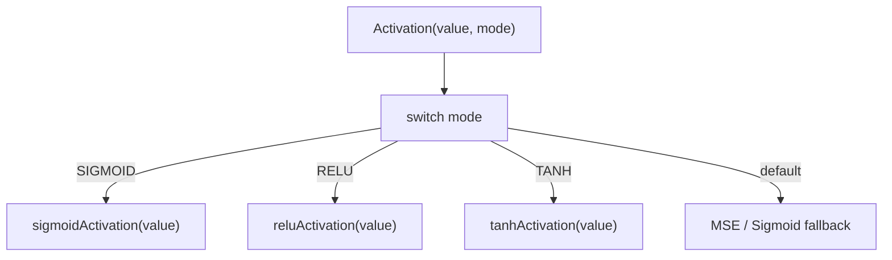

# Mathematical Functions

**Version:** 1.0.0
**Status:** Stable
**Layer:** concept

## Overview

Defines the conceptual framework for mathematical functions used in the neural network: activation functions (non-linear transformations applied to neuron outputs) and loss functions (error metrics comparing predictions to targets). Both function families follow a dispatcher pattern with enum-based selection.

## Related Specifications

- [l1-neural-network-architecture.md](l1-neural-network-architecture.md) — Parent architecture that uses these functions
- [l2-activation-functions.md](l2-activation-functions.md) — Activation function implementations
- [l2-loss-functions.md](l2-loss-functions.md) — Loss function implementations

## 1. Motivation

Neural networks require two categories of mathematical functions:
1. **Activation functions**: Apply non-linear transformations to neuron values, enabling the network to learn complex patterns
2. **Loss functions**: Measure the difference between predicted and target values, providing the gradient signal for learning

A unified dispatcher pattern allows runtime selection of functions via enum constants, supporting experimentation with different function combinations without code changes.

## 2. Constraints & Assumptions

- All functions must be generic over `utils.Float` (`float32 | float64`)
- Functions must be stateless — no internal mutable state
- Each activation function must provide both forward (activation) and backward (derivative) computations
- Loss functions operate on scalar values (batch/vector operations deferred to future phase)

## 3. Core Invariants

- **INV-1**: Every activation function MUST implement both `Activation(value)` and `Derivative(value)` operations. A function without a derivative cannot be used in backpropagation.
- **INV-2**: The dispatcher pattern uses `Type uint8` enum constants. Adding a new function requires: (a) new enum constant, (b) implementation file, (c) switch case in dispatcher.
- **INV-3**: Function implementations are pure functions — same input always produces same output, no side effects.
- **INV-4**: The `Function[T]` interface provides an alternative object-oriented access pattern alongside the dispatcher. Both must produce identical results for the same inputs.
- **INV-5**: Derivative functions receive the already-activated value (post-activation), not the raw pre-activation input. This convention must be consistent across all implementations.

## 5. Detailed Design

### 5.1 Activation Functions

| Function | Formula (forward) | Use Case |
| :--- | :--- | :--- |
| Sigmoid | 1 / (1 + exp(-x)) | Binary classification, output layer |
| TanH | (exp(x) - exp(-x)) / (exp(x) + exp(-x)) | Hidden layers, zero-centered |
| ReLU | max(0, x) | Default hidden layer activation |
| LeakyReLU | x if x > 0, else leak*x | Avoids dying ReLU problem |
| ELU | x if x > 0, else alpha*(exp(x)-1) | Smooth alternative to ReLU |
| SELU | lambda * ELU(x, alpha) | Self-normalizing networks |
| Swish | x * sigmoid(x) | Google research, smooth ReLU alternative |
| ELiSH | Swish if x >= 0, else ELU-like | Experimental hybrid |
| Linear | x | Regression output layer |
| Softmax | exp(xi) / sum(exp(xj)) | Multi-class classification (requires vector) |

### 5.2 Loss Functions

| Function | Formula | Use Case |
| :--- | :--- | :--- |
| MSE | (predicted - target)^2 | Default regression loss |
| MAE | abs(predicted - target) | Robust to outliers |
| RMSE | sqrt(MSE) | Same units as target |
| BCE | Binary cross-entropy | Binary classification |
| CCE | Categorical cross-entropy | Multi-class classification |
| Huber | MSE if small, MAE if large | Combines MSE and MAE benefits |
| And 12 more | Various | See l2-loss-functions.md |

### 5.3 Dispatcher Pattern

## 6. Implementation Notes

1. Softmax requires vector input (entire layer values) — cannot be implemented as scalar function
2. Derivative convention: input is post-activation value, not raw input
3. COSINE loss enum exists but implementation is missing — must be added

## 7. Drawbacks & Alternatives

- **Alternative**: Strategy pattern with struct per function — adds heap allocation overhead
- **Alternative**: Function pointers instead of switch — less discoverable, harder to serialize
- **Drawback**: Dual API (interface + dispatcher) creates maintenance burden — consider consolidating

## Canonical References

| Alias | Path | Purpose |
| :--- | :--- | :--- |
| `[ACT]` | `pkg/activation/activation.go` | Activation dispatcher and type definitions |
| `[LOSS]` | `pkg/loss/loss.go` | Loss dispatcher and type definitions |

## Document History

| Version | Date | Description |
| :--- | :--- | :--- |
| 1.0.0 | 2026-04-21 | Initial Stable — reverse-engineered from existing codebase |
