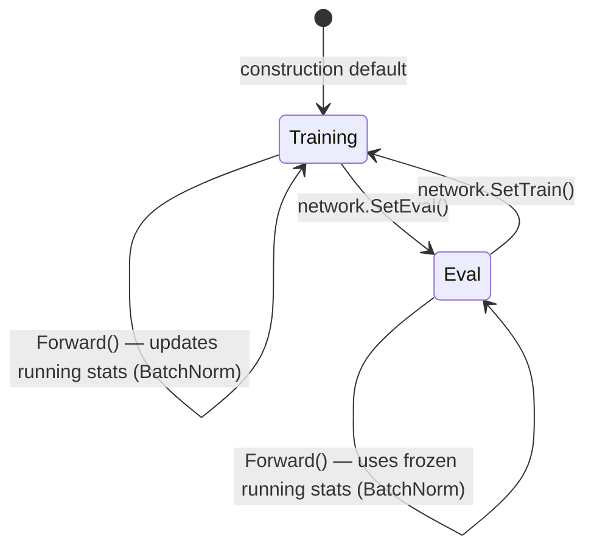

# Normalization Layers

**Version:** 1.0.0
**Status:** Stable
**Layer:** concept

## Overview

Defines the contract for normalization layers — shape-preserving transformations that
stabilize training by standardizing intermediate activations. Covers three canonical variants:
**BatchNorm** (statistics over the batch dimension), **LayerNorm** (statistics over all
features of a single sample), and **GroupNorm** (statistics over feature sub-groups within
a single sample). All share a common affine post-normalization step and a train/eval mode
switch; they differ only in the axes over which statistics are computed.

Normalization is a prerequisite for training deep networks (depth > 3 hidden layers) without
pathological vanishing/exploding gradients, and for building ResNet-style residual connections.

## Related Specifications

- [l1-neural-network-architecture.md](l1-neural-network-architecture.md) — topology model; norm layers are a new layer category
- [l2-layer-types.md](l2-layer-types.md) — L2 implementation target (Input, Dense, Output; norm layers join this hierarchy)
- [l1-training-semantics.md](l1-training-semantics.md) — train/eval mode switching hooks into the training loop
- [l1-dynamic-topology.md](l1-dynamic-topology.md) — norm layers can be inserted/removed at runtime safe-points
- [l1-weight-initialization.md](l1-weight-initialization.md) — affine parameters (γ, β) require initialization
- [l1-observability-protocol.md](l1-observability-protocol.md) — running statistics and affine params exposed as read-only state
- [l1-network-persistence.md](l1-network-persistence.md) — running stats and affine params must round-trip through JSON

## 1. Motivation

The library supports networks up to arbitrary depth via `l1-dynamic-topology`. Without
normalization, deep networks suffer from:

- **Internal covariate shift** — activation distribution shifts as weights update, forcing
  later layers to adapt to a moving target.
- **Gradient pathology** — vanishing gradients (saturated activations) or exploding gradients
  that destabilize training.
- **Sensitivity to initialization and learning rate** — small weight perturbations ripple
  multiplicatively through many layers.

BatchNorm (Ioffe & Szegedy, 2015) addresses this for batch-level training. LayerNorm
addresses it for single-sample settings (RNNs, Transformers). GroupNorm addresses it when
small batch sizes make BatchNorm statistics noisy.

Including this contract enables:
1. A concrete `pkg/layer/norm` implementation.
2. Training deep GoNN networks that currently diverge without careful LR tuning.
3. A composable primitive for future Transformer-block specs.

## 2. Constraints & Assumptions

- All variants operate on a **1-D feature vector** per sample. GoNN's current network model
  (`l1-neural-network-architecture`) represents activations as flat vectors, not 2D/3D
  tensors. Spatial (CNN) normalization modes (spatial BatchNorm, InstanceNorm) are
  **out of scope** and reserved for a future `l1-convolutional-layers` spec.
- **No cross-layer statistics**: each normalization layer computes statistics independently;
  there is no global normalization across the whole network.
- BatchNorm's running statistics are **non-trainable** state, not gradient-tracked parameters.
  Affine scale (γ) and shift (β) **are** trainable.
- The spec is **placement-agnostic**: where in the layer stack the user inserts a norm layer
  is their decision. Pre-activation (before activation function) is conventional but not enforced.

## 3. Core Invariants

- **NORM-1 (Shape Preservation)**: A normalization layer's output shape MUST equal its
  input shape. `len(output) == len(input)` for all batch sizes, all variants, in both
  train and eval modes.

- **NORM-2 (Axis Contract)**: Each variant normalizes over precisely defined axes:
  - *BatchNorm* — statistics (mean, variance) are computed **per feature** across all
    samples in the current batch. Feature dimension is fixed at construction.
  - *LayerNorm* — statistics are computed **per sample** across all features.
    No batch dependency.
  - *GroupNorm* — features are partitioned into G equally-sized groups; statistics are
    computed **per group per sample**. G must evenly divide the feature count.
    InstanceNorm is the degenerate case where G equals the feature count.

- **NORM-3 (Affine Transform)**: After normalization to zero-mean / unit-variance, each
  variant applies an element-wise affine transform: `y = γ ⊙ x̂ + β`, where γ and β are
  learnable weight vectors of the same length as the feature dimension. Affine is enabled
  by default; it MAY be disabled at construction, in which case γ ≡ 1 and β ≡ 0 (identity).

- **NORM-4 (Epsilon)**: Variance computation MUST add a configurable stability constant
  ε > 0 before the square root: `x̂ = (x − μ) / √(σ² + ε)`. Default ε = 1e-5.
  ε is immutable after construction (not a trained parameter).

- **NORM-5 (BatchNorm Running Statistics)**: BatchNorm MUST maintain `running_mean` and
  `running_var` vectors updated during training via exponential moving average:
  ```
  running_mean = (1 − momentum) * running_mean + momentum * batch_mean
  running_var  = (1 − momentum) * running_var  + momentum * batch_var
  ```
  Default momentum = 0.1. Running stats are initialized to `0` (mean) and `1` (var).
  LayerNorm and GroupNorm have no running statistics.

- **NORM-6 (Train / Eval Mode)**: Every normalization layer MUST support a binary mode flag:
  - *Training mode*: BatchNorm uses batch statistics and updates running stats.
    LayerNorm / GroupNorm always use per-sample statistics (mode flag has no effect on them).
  - *Eval (inference) mode*: BatchNorm uses `running_mean` / `running_var` from accumulated
    training history. Layer's behavior is deterministic and batch-size independent.
  The network's train/eval switch propagates to all normalization layers atomically.

- **NORM-7 (Weight Participation)**: Affine parameters (γ, β) are first-class trainable
  weights. They MUST:
  - Be included in weight initialization (γ initialized to 1, β to 0).
  - Be included in serialization / deserialization round-trips (`l1-network-persistence`).
  - Receive gradient-derived updates from the optimizer on every training iteration.
  - Be visible to the observability snapshot (`l1-observability-protocol`).

- **NORM-8 (Topology Integration)**: A normalization layer MUST be insertable at any
  position in the network's layer sequence, including between two Dense layers or between
  an Input and the first Dense layer. Removal of a norm layer at a dynamic topology
  safe-point MUST restore the preceding topology without side effects.

- **NORM-9 (Persistence Round-Trip)**: The full state of a normalization layer — running
  stats (BatchNorm only), affine params, epsilon, momentum, mode flag — MUST survive a
  `Save → Load` cycle with bit-identical numerical values.

## 5. Detailed Design

### 5.1 Forward Pass Pseudo-code

```text
NormLayer.Forward(x [N]float, mode TrainEval) → [N]float:

  -- BatchNorm (normalized_shape = feature_count F):
  if mode == Training:
      μ_b = mean(x over batch dimension)
      σ²_b = var(x over batch dimension)
      update running_mean, running_var with momentum
  else:
      μ_b, σ²_b = running_mean, running_var
  x̂ = (x − μ_b) / sqrt(σ²_b + ε)

  -- LayerNorm:
  μ_s = mean(x over feature dimension, per sample)
  σ²_s = var(x over feature dimension, per sample)
  x̂ = (x − μ_s) / sqrt(σ²_s + ε)

  -- GroupNorm (G groups, F/G features per group):
  for g in 0..G:
      slice = x[g*(F/G) .. (g+1)*(F/G)]
      μ_g = mean(slice)
      σ²_g = var(slice)
      x̂[slice] = (slice − μ_g) / sqrt(σ²_g + ε)

  -- Common affine step (all variants, if affine enabled):
  return γ ⊙ x̂ + β
```

### 5.2 Mode Transition Diagram



### 5.3 Variant Selection Guide

| Condition | Recommended Variant |
| :--- | :--- |
| Batch size ≥ 16, no sequential dependency | BatchNorm |
| Batch size < 8, or single-sample inference | LayerNorm |
| Grouped feature structure (e.g., G=8 for 64 features) | GroupNorm |
| Per-feature independence required | GroupNorm with G = F (InstanceNorm case) |

### 5.4 Interaction with Dynamic Topology

When a normalization layer is inserted via `l1-dynamic-topology` mutation API:

1. Layer is constructed with `mode = Training`, running stats at defaults (0 / 1).
2. Affine params are initialized: γ = 1, β = 0 (identity — no distortion at insertion).
3. The preceding and following layers retain their weight connections unchanged.
4. No re-initialization of surrounding layers is required.

On removal: running stats and affine params are discarded. No rollback needed.

## 6. Implementation Notes

1. Implement `pkg/layer/norm/` as a new sub-package: `batchnorm.go`, `layernorm.go`,
   `groupnorm.go`, sharing a common `normalizer.go` interface.
2. Running statistics (BatchNorm) are non-allocated per forward call — pre-allocate at
   construction for zero-alloc inference path (aligns with `l1-performance-contract`).
3. Affine params are registered with the optimizer via the same gradient slot mechanism
   used by Dense layer weights.
4. `SetTrain()` / `SetEval()` propagation must be atomic across all norm layers in the
   network — use a single mode flag on the Network struct, read by each layer on Forward.

## 7. Drawbacks & Alternatives

- **No spatial BatchNorm**: CNN use cases are not covered. Acceptable at this stage; GoNN
  is a flat-vector library. When `l1-convolutional-layers` is written, this spec will be
  extended (minor bump).
- **BatchNorm with batch size 1**: mathematically undefined (variance = 0). Callers are
  responsible for using LayerNorm instead in such scenarios. A runtime guard (return error
  if BatchNorm called with N=1 in training mode) is recommended in the L2 implementation.
- **Alternative: Power Normalization**: rejected as non-standard and unnecessary at this
  stage.
- **Alternative: Spectral Normalization**: GAN-specific; out of scope.

## Canonical References

| Alias | Path | Purpose |
| :--- | :--- | :--- |
| `[LAYER-TYPES]` | `.design/specifications/l2-layer-types.md` | L2 target — norm layers join this hierarchy |
| `[PERF]` | `.design/specifications/l1-performance-contract.md` | Zero-alloc constraint for running stats |
| `[PERSIST]` | `.design/specifications/l1-network-persistence.md` | JSON round-trip contract for running stats and affine params |

## Document History

| Version | Date | Description |
| :--- | :--- | :--- |
| 1.0.0 | 2026-05-11 | Initial Stable — BatchNorm/LayerNorm/GroupNorm contract. NORM-1..9 invariants. C9 Trust Mode auto-promoted. |
