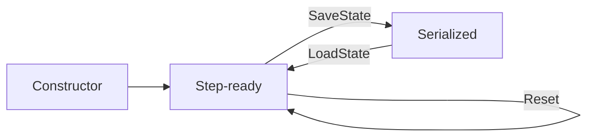

# Optimizer Strategies

**Version:** 1.0.0
**Status:** Stable
**Layer:** concept

## Overview

Defines the abstract contract for parameter-update strategies used during neural network training.
An optimizer takes the current weights and their gradients (or loss deltas) and produces updated
weights. The contract is algorithm-agnostic: implementations may be stateless (SGD) or stateful
(Adam tracks first and second moment estimates). This spec is the authoritative source for optimizer
semantics; `l2-optimizer-impl.md` realizes it in Go.

## Related Specifications

- [l1-training-semantics.md](l1-training-semantics.md) — Training loop within which the optimizer is called
- [l1-weight-initialization.md](l1-weight-initialization.md) — Initial weight state before first optimizer step
- [l1-neural-network-architecture.md](l1-neural-network-architecture.md) — Network structure defining weight tensors
- [l1-meta-learning-hooks.md](l1-meta-learning-hooks.md) — Meta-learning can tune optimizer hyperparameters

## 1. Motivation

The current `Train()` implementation hardcodes vanilla SGD with a fixed learning rate
(`rate × gradient`). This blocks:

- Faster convergence for deep ReLU chains (Adam adapts per-parameter learning rates).
- Learning-rate schedules (warm-up, cosine decay) without modifying the training loop.
- Meta-learning (`l1-meta-learning-hooks`) — requires optimizer to be a first-class swappable value.

Defining a clean optimizer contract allows dropping in any update strategy without touching
the core training loop.

## 2. Constraints & Assumptions

- The optimizer is called **once per weight-update cycle** — after gradients are computed,
  before the next forward pass.
- Optimizer state (moment estimates, step counters) is **private** to the optimizer instance.
  The training loop MUST NOT inspect internal state.
- Optimizer instances are **not goroutine-safe** — one instance per training session.
  No sharing across concurrent training calls.
- A `LearningRate() T` accessor is REQUIRED so external observers and meta-learning hooks
  can read the current effective rate.
- Optimizers MUST be serializable for checkpointing: `SaveState() ([]byte, error)` /
  `LoadState([]byte) error`.

## 3. Core Invariants

- **OPT-1**: Every optimizer implements `Step(weights []T, deltas []T) error`. `weights` is
  modified in-place; `deltas` are consumed but not modified.
- **OPT-2**: `Step` is called exactly once per weight-update cycle. Calling it out of sequence
  produces undefined behavior — implementations are not required to detect this.
- **OPT-3**: An optimizer with `LearningRate() == 0` MUST produce a zero weight update (no-op).
  This is the defined "frozen gradient" state.
- **OPT-4**: Stateful optimizers (Adam, RMSProp) reset their internal state when `Reset()` is
  called. `Reset()` MUST restore the optimizer to the same state as immediately after construction.
- **OPT-5**: The SGD optimizer (the baseline) requires no state beyond learning rate and optional
  momentum. All other optimizer types are optional extensions.
- **OPT-6**: Optimizer state MUST survive serialization round-trips:
  `LoadState(SaveState())` produces bit-identical subsequent `Step` calls.

## 5. Detailed Design

### 5.1 Algorithm Reference

| Name | State | Update formula (per weight wᵢ) |
| :--- | :--- | :--- |
| SGD | none | wᵢ ← wᵢ − lr × δᵢ |
| SGD+Momentum | velocity vᵢ | vᵢ ← γvᵢ + lr × δᵢ; wᵢ ← wᵢ − vᵢ |
| Adam | m₁ᵢ, m₂ᵢ, step t | bias-corrected moments; wᵢ ← wᵢ − lr × m̂₁ᵢ / (√m̂₂ᵢ + ε) |
| RMSProp | squared EMA vᵢ | vᵢ ← αvᵢ + (1−α)δᵢ²; wᵢ ← wᵢ − lr × δᵢ / √(vᵢ + ε) |

### 5.2 Optimizer State Lifecycle

### 5.3 Default Optimizer

If no optimizer is configured, the training loop MUST fall back to SGD with the `LearningRate`
from network configuration. This preserves backward compatibility with all v0.5 / v0.6 examples.

## 6. Implementation Notes

1. Implement SGD first (stateless) — validates the interface without state management complexity.
2. Add Adam second — most widely used; validates stateful serialization.
3. SGD+Momentum and RMSProp follow Adam as straightforward extensions.

## 7. Drawbacks & Alternatives

- Keeping SGD inline is simpler but prevents optimizer pluggability required by
  `l1-meta-learning-hooks`.
- A function-type optimizer (`type OptimizerFn func(w, d []T)`) is lighter but cannot carry state
  for Adam's moment tracking.

## Canonical References

| Alias | Path | Purpose |
| :--- | :--- | :--- |
| `[TRAIN-L1]` | `.design/specifications/l1-training-semantics.md` | Training loop contract this optimizer hooks into |
| `[INIT-L1]` | `.design/specifications/l1-weight-initialization.md` | Initial weight values before first Step |

## Document History

| Version | Date | Description |
| :--- | :--- | :--- |
| 1.0.0 | 2026-05-07 | Initial — optimizer strategies contract for Phase 6 (Spark 1). Trust Mode Stable. |
