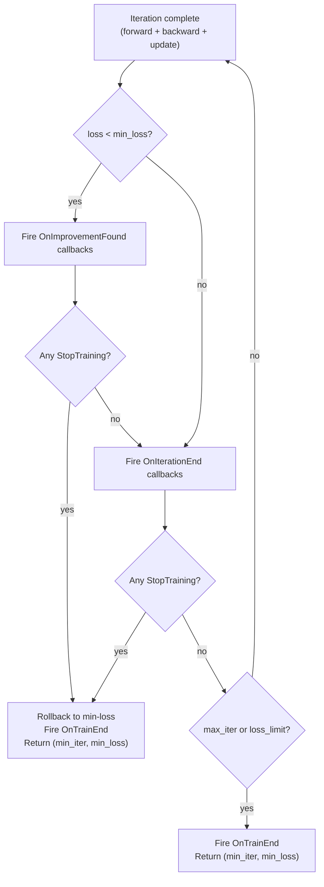

# Training Callbacks

**Version:** 1.0.0
**Status:** Stable
**Layer:** concept

## Overview

Defines the **event-driven extension contract** for the training loop: a mechanism by which
external code (user logic, monitoring agents, early-stopping strategies) reacts to training
events without modifying the core loop or the public `Train()` API. Callbacks are registered
before training, invoked synchronously at well-defined event boundaries, and may signal
early termination via a sentinel return value.

This spec bridges `l1-observability-protocol` (passive read) and `l1-training-control`
(active stop/pause): callbacks are the reactive middle layer — they *receive* events and
*may request* termination, but cannot issue direct control calls.

## Related Specifications

- [l1-neural-network-architecture.md](l1-neural-network-architecture.md) — Parent
- [l1-training-semantics.md](l1-training-semantics.md) — Loop iteration boundaries where callbacks fire
- [l1-training-control.md](l1-training-control.md) — Callbacks signal stop via sentinel, not direct control calls
- [l1-observability-protocol.md](l1-observability-protocol.md) — Read-only snapshot passed to callbacks
- [l1-checkpointing.md](l1-checkpointing.md) — OnImprovementFound event is the natural trigger for checkpoint saves
- [l1-error-taxonomy.md](l1-error-taxonomy.md) — Callback errors are wrapped and classified

## 1. Motivation

The training loop defined in `l1-training-semantics` is a self-contained convergence engine.
Users cannot currently:

- Log metrics at each iteration without modifying the loop.
- Implement custom early stopping (e.g., stop if loss does not improve for 50 iterations).
- Save intermediate checkpoints at arbitrary milestones beyond the built-in interval.
- Integrate external experiment trackers (MLflow, Weights & Biases equivalent) without
  forking the library.
- Visualize live training curves without polling via the observability protocol.

Callbacks solve all of these without exposing mutability in the training loop, and without
requiring the user to subclass or re-implement the training loop.

## 2. Constraints & Assumptions

- GoNN's primary training mode is **online** (single sample per call to `Train()`).
  Callbacks fire per-iteration (each call to the inner iteration unit), not per-epoch.
  Epoch semantics are an anticipated extension, noted in §5.3.
- Callbacks are **synchronous**: invoked on the training goroutine, blocking that goroutine
  until they return. Asynchronous / non-blocking callbacks are a Layer 2 adapter concern.
- Callbacks are **registered before training begins**. Dynamic registration/deregistration
  during an active training session is out of scope.
- The spec is **technology-agnostic**: references to function types are conceptual; concrete
  Go interface definitions belong in the L2 implementation spec.

## 3. Core Invariants

- **CB-1 (Synchronous Invocation)**: Callbacks are invoked synchronously by the training
  loop at event boundaries. The loop does not advance to the next iteration or terminate
  until all registered callbacks for the current event have returned.

- **CB-2 (No Direct Mutation)**: A callback MUST NOT call any mutating operation on the
  network (weight update, topology change, Stop/Pause/Resume) directly during invocation.
  Doing so is a contract violation and results in undefined behavior (likely deadlock or
  corrupted state). The only sanctioned control action is returning the `StopTraining`
  sentinel signal (see CB-6).

- **CB-3 (Zero Overhead)**: When no callbacks are registered, the training loop MUST incur
  zero overhead — no allocations, no function pointer calls, no registry iteration.
  This preserves the performance guarantees of `l1-performance-contract`.

- **CB-4 (Read-Only State)**: The `CallbackContext` passed to every callback is a read-only
  snapshot conforming to `l1-observability-protocol`. It must not expose mutable references
  to weights, internal buffers, or training state. Writing to a received snapshot is
  undefined behavior.

- **CB-5 (Panic Recovery)**: If a callback panics, the training loop MUST recover the panic,
  emit a structured error log (per `l1-error-taxonomy` category: `CallbackPanic`), and
  continue training as if the callback had returned normally (no stop signal). A panicking
  callback does not abort training and does not corrupt the network state.

- **CB-6 (StopTraining Signal)**: A callback MAY return the `StopTraining` sentinel to
  request early termination. The loop treats this equivalently to the loss-limit exit in
  `l1-training-semantics` TRN-1(a): it terminates after the current iteration completes,
  rolls back weights to the min-loss snapshot (TRN-3), and returns `(min_iter, min_loss)`.
  The stop reason is included in the final `OnTrainEnd` event.

- **CB-7 (Registration Order)**: Multiple callbacks registered for the same event MUST be
  invoked in registration order (FIFO). Each callback's return value is evaluated
  independently. The first `StopTraining` encountered terminates the sequence for that
  event; remaining registered callbacks for that event are NOT invoked after a stop signal
  is received.

- **CB-8 (OnTrainEnd Guarantee)**: The `OnTrainEnd` event MUST fire exactly once after
  every training session, regardless of the stop reason: loss-limit convergence, max
  iterations reached, external `Stop()` or context cancellation, `StopTraining` signal
  from a callback, or panic in the training loop itself. Callbacks registered for
  `OnTrainEnd` must not be skipped.

- **CB-9 (Event Boundary Atomicity)**: At the point a callback is invoked, the current
  iteration is fully complete: forward pass, loss computation, backward pass, and weight
  update have all concluded. A callback never observes partial iteration state.

## 5. Detailed Design

### 5.1 Event Catalog

| Event | Fires When | CallbackContext Contents |
| :--- | :--- | :--- |
| `OnIterationEnd` | After every completed iteration | iteration, current_loss, min_loss, min_iter, network snapshot |
| `OnImprovementFound` | When `current_loss < min_loss` (new best) | iteration, new_min_loss, prev_min_loss, network snapshot |
| `OnTrainEnd` | After training session ends for any reason | total_iterations, final_min_loss, stop_reason |

> `OnImprovementFound` fires on the **same** iteration as the corresponding `OnIterationEnd`.
> Order: `OnImprovementFound` → `OnIterationEnd` (improvement is reported first).

### 5.2 Control Flow Diagram



### 5.3 CallbackContext Schema (Conceptual)

```text
CallbackContext:
  Iteration    int          -- current iteration number (1-based)
  Loss         float        -- loss after this iteration
  MinLoss      float        -- lowest loss observed so far
  MinIter      int          -- iteration at which MinLoss was first observed
  StopReason   StopReason   -- for OnTrainEnd only; nil for other events
  Snapshot     NetworkSnap  -- read-only network snapshot per l1-observability-protocol
```

`StopReason` enum: `LossLimit | MaxIterations | ContextCancelled | ExternalStop | CallbackStop | LoopError`

### 5.4 Epoch-Equivalent Events (Anticipated Extension)

When mini-batch / epoch training is added (per `l1-training-semantics` §5.4 open question),
two additional events will be appended without breaking existing registrations:

- `OnEpochBegin(epoch int)` — before the first sample of an epoch.
- `OnEpochEnd(epoch int, epoch_loss float)` — after all samples in an epoch.

Existing `OnIterationEnd` / `OnImprovementFound` callbacks remain unchanged. This is a
minor version bump on this spec when implemented.

## 6. Implementation Notes

1. Implement `CallbackRegistry` in `pkg/nn/callbacks.go` — a slice per event type with
   range-over-func dispatch. Zero callbacks = nil slice; no iteration occurs.
2. `Train()` in `pkg/nn/train.go` acquires a pointer to the registry at call start (not
   per-iteration) — safe because registration is pre-training only.
3. Panic recovery wraps each individual callback call, not the entire event dispatch loop,
   so one panicking callback does not suppress subsequent callbacks for the same event.
4. `OnTrainEnd` must be deferred in the training loop (`defer fireTrainEnd(...)`) to
   guarantee it fires even on unexpected `Train()` exits (context panic, OOM).

## 7. Drawbacks & Alternatives

- **Asynchronous callbacks**: sending events to a channel instead of blocking the loop.
  Rejected at L1 — async introduces bounded-buffer overflow semantics and makes StopTraining
  signals non-deterministic. An async adapter is a valid L2 choice.
- **Interface-based callbacks vs. function type callbacks**: both are valid L2 realizations.
  The L1 spec intentionally does not prescribe Go interface vs. `func` type.
- **No OnIterationBegin**: pre-iteration callbacks would observe partial state (between weight
  update and next forward pass). Rejected to avoid invariant CB-9 complications.
- **No OnBatchBegin/End at L1**: deferred until mini-batch training is specified in
  `l1-training-semantics`.

## Canonical References

| Alias | Path | Purpose |
| :--- | :--- | :--- |
| `[TRAIN-SEM]` | `.design/specifications/l1-training-semantics.md` | Loop iteration boundaries; TRN-3 min-loss rollback applies on CB-6 stop |
| `[OBS]` | `.design/specifications/l1-observability-protocol.md` | CallbackContext snapshot contract |
| `[CTRL]` | `.design/specifications/l1-training-control.md` | CB-2 explains why callbacks must not call Stop/Pause directly |

## Document History

| Version | Date | Description |
| :--- | :--- | :--- |
| 1.0.0 | 2026-05-11 | Initial Stable — CB-1..9 invariants. 3 events: OnIterationEnd, OnImprovementFound, OnTrainEnd. C9 Trust Mode auto-promoted. |
