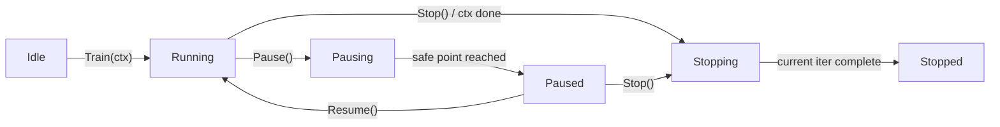

# Training Control & Lifecycle

**Version:** 0.1.0
**Status:** Draft
**Layer:** concept

## Overview

Defines the training lifecycle as a state machine with explicit Pause / Resume / Stop control. Long
training runs must be interruptible without losing progress or corrupting weights. Establishes the
contract for cooperative cancellation via `context.Context` and external control signals.

## Related Specifications

- [l1-neural-network-architecture.md](l1-neural-network-architecture.md) — Parent invariants on propagation
- [l1-checkpointing.md](l1-checkpointing.md) — Snapshots produced on pause / interval
- [l1-observability-protocol.md](l1-observability-protocol.md) — State exposure for external controllers
- [l2-nn-facade.md](l2-nn-facade.md) — `Train()` API surface

## 1. Motivation

Today `Train()` is a black-box loop. There is no way to:

- Stop training cleanly without killing the process and losing weights.
- Pause to inspect / persist intermediate state, then resume.
- Hand control to an external supervisor (CI, notebook, GUI) without polling.

Real workflows (overnight training, hyperparameter sweeps, GUI-driven experimentation) require this.

## 2. Constraints & Assumptions

- Cooperative cancellation only — no goroutine kills. Library checks control state at safe points.
- Pause must be **idempotent** and **reentrant**: calling Pause on a paused session is a no-op.
- Resume must be **deterministic**: bit-identical continuation if no inputs changed (RNG seed pinned).

## 3. Core Invariants

- **CTRL-1**: Training state ∈ {Idle, Running, Pausing, Paused, Stopping, Stopped}. Transitions are
  one-way except Paused → Running (resume) and Running → Pausing → Paused.
- **CTRL-2**: A pause request observed mid-iteration completes the current iteration (forward + backward
  + weight update) before transitioning to Paused. No partial weight states are exposed.
- **CTRL-3**: `Stop()` is destructive: it transitions Running/Paused → Stopping → Stopped. Stopped
  sessions cannot be resumed; the network remains queryable with whatever weights existed at stop.
- **CTRL-4**: `context.Context` cancellation is honored at the same safe points as Pause/Stop. Library
  treats `ctx.Err() != nil` equivalently to `Stop()`.
- **CTRL-5**: External observers (see `l1-observability-protocol.md`) read state via lock-free atomic
  load. State transitions never block readers.

## 5. Detailed Design

### 5.1 State Machine

### 5.2 Open Questions

- <!-- TBD: API surface — methods on *NN[T] (n.Pause()) vs separate Controller object n.Controller() -->
- <!-- TBD: callback semantics during Pausing — does WithEpochCallback fire on the paused iteration? -->
- <!-- TBD: timeout for Pausing → Paused transition; what if a long iteration blocks the safe point? -->

## 6. Implementation Notes

1. Define safe points: end of each iteration in `Train()` loop.
2. State stored as `atomic.Int32` for lock-free reads.
3. Pause/Resume/Stop methods send via a single buffered channel; the loop drains and acts at safe points.

## Canonical References

| Alias | Path | Purpose |
| :--- | :--- | :--- |
| `[TRAIN]` | `pkg/nn/train.go` | Training loop hosts the state machine |
| `[REF-RU]` | `.references/rustunumic/train.rs` | Source loop without control — gap this spec fills |

## Document History

| Version | Date | Description |
| :--- | :--- | :--- |
| 0.1.0 | 2026-04-27 | Initial Draft from TODO #2. |
