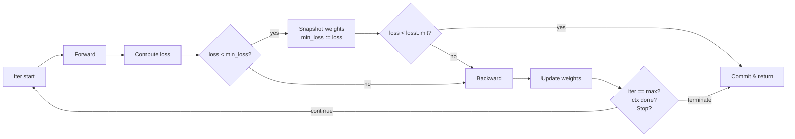

# Training Semantics

**Version:** 0.1.0
**Status:** Draft
**Layer:** concept

## Overview

Defines what `Train()` actually means: the convergence loop, early-stopping criteria, the
min-loss-with-rollback strategy, and the return contract. Without this spec, the public training API
(`l2-nn-facade.md` `WithLossLimit`, `WithMaxIterations`, `Train()` returns `(iterations, loss)`) is
syntactic but semantically undefined — callers cannot reason about what guarantees the library makes.

## Related Specifications

- [l1-neural-network-architecture.md](l1-neural-network-architecture.md) — Parent (INV-3..INV-5 covered here)
- [l1-training-control.md](l1-training-control.md) — Pause/Resume sit on top of this loop
- [l1-checkpointing.md](l1-checkpointing.md) — Snapshots fire from milestones defined here
- [l2-nn-facade.md](l2-nn-facade.md) — Public API surface this spec gives meaning to

## 1. Motivation

The historical `gonn_old` and `rustunumic` reference implementations both had a sophisticated training
loop (max iter, loss-limit early exit, min-loss tracking, deepcopy of best weights, count-of-best-iter
return). The current GoNN code has none of that. A semantics spec captures the lessons learned from
both predecessors and pins them to invariants so the implementation cannot regress.

## 2. Constraints & Assumptions

- Single-threaded loop within one network instance (concurrent training across separate networks is
  fine; that's a different problem).
- Weight updates are **gradient descent** with a learning rate. Optimizers (Adam, RMSProp, momentum)
  are **out of scope** — reserved for a future `l1-optimizers.md` that extends this spec.
- The default training mode is **online** (one sample per iteration, as `Train(input, target)`).
  Mini-batch and full-batch modes are anticipated extensions and noted in §5.4.

## 3. Core Invariants

- **TRN-1**: A training session terminates when **any** of: (a) loss falls below `lossLimit`, (b)
  iteration count reaches `maxIterations`, (c) external Stop / context cancellation per
  `l1-training-control`, (d) network state transitions away from `Running`.
- **TRN-2**: At every iteration the loop tracks `(min_loss, min_iter)` — the lowest loss observed and
  the iteration at which it occurred. The corresponding **weights snapshot** is held in memory.
- **TRN-3**: On termination via (a) or (b), the network's persistent weights are **rolled back to the
  min-loss snapshot**. The user receives the network at its observed best, not its last state. This
  prevents the common pitfall where late-stage divergence destroys a good model.
- **TRN-4**: The return value `(iterations, loss)` reports `(min_iter, min_loss)` — the success
  point — not the wall-clock final iteration. This makes the value diagnostic.
- **TRN-5**: A single iteration is the atomic unit: forward → loss compute → backward → weight
  update. Pause / Stop signals are observed only at iteration boundaries (per `l1-training-control`
  CTRL-2).
- **TRN-6**: The loop is **deterministic** given a pinned RNG seed and a fixed input order. Two runs
  with the same seed and inputs produce bit-identical weights (per-precision tolerance).

## 5. Detailed Design

### 5.1 Loop Pseudo-code

```text
Train(ctx, input, target):
    if not initialized: Init(len(input), len(target))
    min_loss = +Inf
    min_iter = 0
    snapshot = nil
    for iter := 1; iter <= maxIterations; iter++:
        if ctx.Done() or Stop signaled: break
        if Pause signaled: wait until Resume or Stop
        forwardPass(input)
        loss = computeLoss(target)
        if loss < min_loss:
            min_loss = loss
            min_iter = iter
            snapshot = deepCopy(weights)
            if loss < lossLimit:
                weights = snapshot   # commit best
                return (min_iter, min_loss)
        backwardPass()
        updateWeights(learningRate)
        epochCallback?(iter, loss)
    if min_iter > 0:
        weights = snapshot           # commit best
    return (min_iter, min_loss)
```

### 5.2 State Diagram (per-iteration)



### 5.3 Soft-Failure Behaviors

- **NaN loss**: detected after `computeLoss`. Loop **halts** without further weight updates and returns
  `(0, NaN)` paired with `ErrTrainingFailure`. Snapshot is **not** committed (it may already be
  corrupt).
- **Loss diverges** (10× growth from `min_loss` over 100+ iterations): emit `Warn` log; do **not**
  abort. User sees the warning and may Stop manually.
- **No improvement** observed (`min_iter == 0` at end): return `(0, +Inf)` paired with
  `ErrTrainingFailure`. Network keeps initial weights.

### 5.4 Open Questions

- <!-- TBD: extension to mini-batch — this spec defines online; mini-batch is a generalization -->
- <!-- TBD: extension to full-batch / epoch concept — N samples make one "epoch", how does loss-limit interact? -->
- <!-- TBD: optimizer slot — momentum / Adam need state across iterations; where does it sit? -->
- <!-- TBD: how does `AndTrain` (continuation per gonn_old) interact with min-loss tracking — fresh tracker or carry-over? -->

## 6. Implementation Notes

1. Phase 1: implement TRN-1..TRN-4 in `pkg/nn/train.go` (currently a stub). The reference behavior is
   in `.references/rustunumic/train.rs` and `.references/gonn_old/pkg/nn/train.go` — port the
   semantics, not the code.
2. Phase 2: layer `l1-training-control` Pause/Resume on top.
3. Phase 3: layer `l1-checkpointing` snapshot triggers on top.

## Canonical References

| Alias | Path | Purpose |
| :--- | :--- | :--- |
| `[TRAIN]` | `pkg/nn/train.go` | Implementation home (currently stub) |
| `[REF-RU]` | `.references/rustunumic/train.rs` | Source of min-loss / rollback / loss-limit pattern |
| `[REF-OLD]` | `.references/gonn_old/pkg/nn/train.go` | Source of `AndTrain` continuation idea |

## Document History

| Version | Date | Description |
| :--- | :--- | :--- |
| 0.1.0 | 2026-04-27 | Initial Draft — closes implicit references from `l2-nn-facade.md` `WithLossLimit`/`WithMaxIterations`. |
