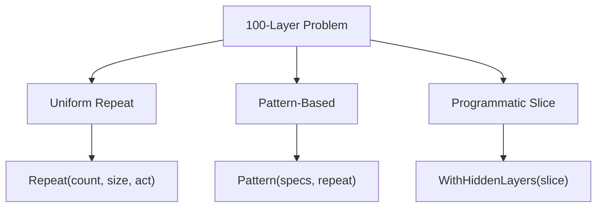

# Deep Network Builder Ergonomics

**Version:** 1.0.0
**Status:** Stable
**Layer:** implementation
**Implements:** l1-neural-network-architecture.md

## Overview

Extends the public API facade (`l2-nn-facade.md` §5.2–§5.3) with ergonomic patterns
for constructing networks with many hidden layers (10–1000+). The existing per-layer
chaining (`Dense()/WithHiddenLayer()`) becomes impractical beyond ~5 layers. This spec
defines bulk topology constructors that solve the **100-layer problem**: how does a user
express a deep architecture in one readable call?

## Related Specifications

- [l2-nn-facade.md](l2-nn-facade.md) — Parent API spec; this extends §5.2/§5.3 surface
- [l2-multihidden-impl.md](l2-multihidden-impl.md) — Internal chain that supports N hidden layers
- [l1-neural-network-architecture.md](l1-neural-network-architecture.md) — Architecture invariants
- [l2-layer-types.md](l2-layer-types.md) — Layer type hierarchy used by specs
- [l1-lr-scheduling.md](l1-lr-scheduling.md) — LR schedulers often paired with deep networks

## 1. Motivation

Consider a user building a 100-layer deep network. Current API:

```go
// Problem: 100 chained Dense() calls — unreadable, unmaintainable
nn.NewBuilder[float64]().
    Input(784).
    Dense(512, activation.RELU, true).
    Dense(512, activation.RELU, true).
    // ... 98 more lines ...
    Output(10, activation.SOFTMAX, true).
    Compile()
```

This is not viable. Users need **bulk constructors** that express deep topologies
concisely while preserving type safety and the existing `Config[T]` pipeline.

## 2. Constraints & Assumptions

- All bulk constructors produce `[]HiddenLayerSpec[T]` — they compose into the
  existing `Config.HiddenLayers` slice without architectural changes.
- Bulk constructors are available in **both** API styles (Builder methods + Option functions).
- The `Compile()` gate remains the single validation point — bulk constructors only
  populate config; they do not validate.
- Mixing bulk and per-layer calls within a single construction is permitted — layers
  are appended in call order.
- Performance: topology construction is O(N) in layer count — no lazy evaluation needed.

## 4. Invariant Compliance

| L1 Invariant | Implementation |
| :--- | :--- |
| INV-1 (Generic Float) | All bulk constructors parameterized by `T utils.Float`. |
| INV-2 (Immutable topology) | Bulk constructors write during Configuring state only; frozen at Compile. |
| INV-7 (Layer composition) | All generated layers are standard `HiddenLayerSpec[T]` entries. |

## 5. Detailed Design

### 5.1 The 100-Layer Problem — Solution Taxonomy

Three complementary approaches, each serving a different use case:



### 5.2 Approach 1 — Uniform Repeat

For N identical hidden layers (same size, activation, bias):

```go
// [REFERENCE] Builder Style A
nn.NewBuilder[float64]().
    Input(784).
    Repeat(100, 256, activation.RELU, true).  // 100 hidden layers, all 256-RELU
    Output(10, activation.SOFTMAX, true).
    Compile()

// [REFERENCE] Options Style B
nn.New[float64](
    nn.WithInput[float64](784),
    nn.Repeat[float64](100, 256, activation.RELU),     // bias = DefaultBias
    nn.WithOutput[float64](10, activation.SOFTMAX),
)
```

Pseudo-code:

```text
Repeat(count, size, act, bias):
    for i in 0..count:
        append HiddenLayerSpec{Size: size, Activation: act, Bias: bias}
```

### 5.3 Approach 2 — Pattern-Based Block

For repeating a multi-layer **block** pattern N times (e.g., residual-style stacks):

```go
// [REFERENCE] Define a 3-layer block, repeat it 33 times = 99 hidden layers
block := []nn.HiddenLayerSpec[float64]{
    {Size: 256, Activation: activation.RELU, Bias: true},
    {Size: 256, Activation: activation.RELU, Bias: true},
    {Size: 128, Activation: activation.RELU, Bias: true},
}

nn.NewBuilder[float64]().
    Input(784).
    Pattern(block, 33).        // 33 × 3 = 99 hidden layers
    Dense(64, activation.RELU, true).  // + 1 final hidden = 100 total
    Output(10, activation.SOFTMAX, true).
    Compile()

// Options Style B
nn.New[float64](
    nn.WithInput[float64](784),
    nn.Pattern[float64](block, 33),
    nn.WithHiddenLayer[float64](64, activation.RELU),
    nn.WithOutput[float64](10, activation.SOFTMAX),
)
```

### 5.4 Approach 3 — Direct Slice Setter

For full programmatic control — the user builds `[]HiddenLayerSpec` externally:

```go
// [REFERENCE] Programmatic topology (e.g., generated by hyperparameter search)
layers := make([]nn.HiddenLayerSpec[float64], 100)
for i := range layers {
    layers[i] = nn.HiddenLayerSpec[float64]{
        Size:       uint(512 - i*4),            // progressive shrink
        Activation: activation.RELU,
        Bias:       true,
    }
}

nn.NewBuilder[float64]().
    Input(784).
    HiddenLayers(layers).
    Output(10, activation.SOFTMAX, true).
    Compile()

// Options Style B — same effect
nn.New[float64](
    nn.WithInput[float64](784),
    nn.WithHiddenLayers[float64](layers),     // plural — bulk setter
    nn.WithOutput[float64](10, activation.SOFTMAX),
)
```

### 5.5 Existing Higher-Order Options Integration

The facade (§5.3) already defines `Sequential` and `DeepNetwork`. These remain as
convenience presets. The new constructors supplement, not replace, them:

| Constructor | Use case | Layer count control |
| :--- | :--- | :--- |
| `Sequential(count, size, act)` | N identical layers | Exact |
| `DeepNetwork(startSize, layers, act)` | Progressive halving | Exact |
| `Repeat(count, size, act, bias)` | N identical, with explicit bias | Exact |
| `Pattern(block, repeats)` | Repeating multi-layer blocks | block.len × repeats |
| `HiddenLayers(slice)` / `WithHiddenLayers` | Full programmatic control | len(slice) |

**Note**: `Sequential` and `Repeat` are nearly identical. `Repeat` adds explicit `bias`
control on Builder side. On Options side, `Sequential` is kept for backward compatibility;
`Repeat` is the recommended replacement.

### 5.6 API Summary

**Builder methods (Style A):**

```go
func (n *NN[T]) Repeat(count, size uint, act activation.Type, bias bool) *NN[T]
func (n *NN[T]) Pattern(block []HiddenLayerSpec[T], repeats uint) *NN[T]
func (n *NN[T]) HiddenLayers(layers []HiddenLayerSpec[T]) *NN[T]
```

**Option constructors (Style B):**

```go
func Repeat[T utils.Float](count, size uint, act activation.Type) Option[T]
func Pattern[T utils.Float](block []HiddenLayerSpec[T], repeats uint) Option[T]
func WithHiddenLayers[T utils.Float](layers []HiddenLayerSpec[T]) Option[T]
```

### 5.7 Validation Rules

These are checked at `Compile()` (no new validation stage):

| Rule | Trigger | Severity |
| :--- | :--- | :--- |
| RepeatCountZero | `Repeat(0, ...)` / `Pattern(_, 0)` | Hard error |
| PatternBlockEmpty | `Pattern([], _)` | Hard error |
| ExcessiveLayers | `len(HiddenLayers) > 10000` | Soft warning |

## 6. Implementation Notes

1. All three constructors append to `Config.HiddenLayers` — no new fields in Config.
2. `Repeat` and `Pattern` are syntactic sugar over `HiddenLayers` and can be
   implemented as one-liners.
3. `HiddenLayers` (plural) on Builder **replaces** any previously added hidden layers.
   On Options, `WithHiddenLayers` appends (consistent with `WithHiddenLayer` singular).
4. This does not change the `compile()` routine — it already iterates `Config.HiddenLayers`.

## 7. Drawbacks & Alternatives

- **Alternative (Config file)**: Load topology from JSON/YAML. Deferred to persistence
  spec — requires `Config` to become public and serializable.
- **Alternative (Functional loop)**: Let users write Go loops with `WithHiddenLayer`.
  This works but pollutes the option chain — `WithHiddenLayers(slice)` is cleaner.
- **Drawback (API surface)**: Three new constructors may overlap with `Sequential`/`DeepNetwork`.
  Mitigation: clear documentation of when to use which.

## Canonical References

| Alias | Path | Purpose |
| :--- | :--- | :--- |
| `[FACADE]` | `.design/specifications/l2-nn-facade.md` | Parent API spec |
| `[CONFIG]` | `pkg/nn/config.go` | HiddenLayers slice that all constructors populate |
| `[PRESETS]` | `pkg/nn/presets.go` | Sequential/DeepNetwork — existing higher-order options |
| `[BUILDER]` | `pkg/nn/builder.go` | Target file for Repeat/Pattern/HiddenLayers methods |
| `[OPTIONS]` | `pkg/nn/options.go` | Target file for WithHiddenLayers/Repeat/Pattern options |

## Document History

| Version | Date | Description |
| :--- | :--- | :--- |
| 1.0.0 | 2026-05-08 | Initial — deep builder ergonomics for the 100-layer problem. Trust Mode Stable. |
