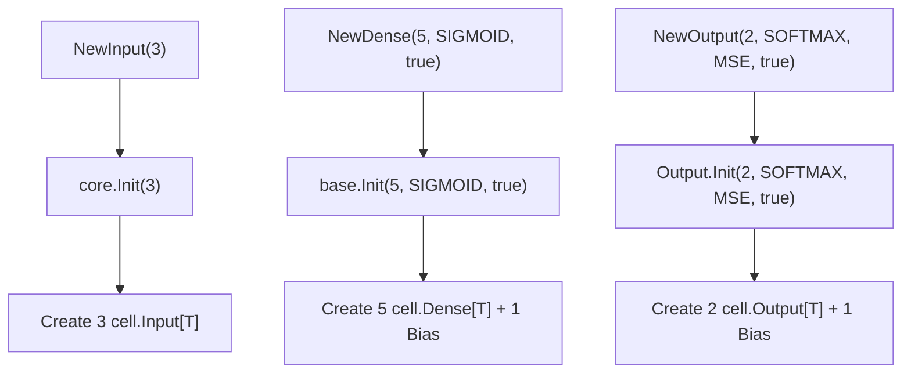

# Layer Types

**Version:** 1.0.0
**Status:** Stable
**Layer:** implementation
**Implements:** l1-neural-network-architecture.md

## Overview

Specifies the layer type hierarchy used to organize neurons in the network. Layers follow a composition-based hierarchy: `core[T]` (base container) → `base[T]` (adds activation and bias) → specialized types (`Input`, `Dense`, `Output`). Each layer type creates and manages a collection of cells of the corresponding type.

## Related Specifications

- [l1-neural-network-architecture.md](l1-neural-network-architecture.md) — Parent concept spec
- [l2-network-graph.md](l2-network-graph.md) — Network that contains layers
- [l2-neuron-model.md](l2-neuron-model.md) — Cell types managed by layers

## 1. Motivation

Layers provide a logical grouping of neurons with shared properties (activation function, bias). The hierarchical design avoids code duplication while allowing specialization for different roles in the network topology.

## 2. Constraints & Assumptions

- All layer types are generic over `utils.Float`
- Layers use pointer embedding (`*base`, `*core`) for composition
- Each layer manages its own cell initialization
- Layer order: Input → Dense (hidden, 0 or more) → Output

## 4. Invariant Compliance

| L1 Invariant | Implementation |
| :--- | :--- |
| INV-1 (Generic Float) | All layer types parameterized by `T utils.Float` |
| INV-7 (Composition hierarchy) | `core → base → Dense/Output` embedding chain |
| INV-2 (Immutable topology) | Layers created during build phase, not modifiable at runtime |

## 5. Detailed Design

### 5.1 Type Hierarchy

```plaintext
core[T, S neuron.Nucleus[T]]  (unexported)
├── Type    neuron.Type
├── Id      uint
├── Size    int
├── cells   []S
└── Init(size int)

    base[T, S neuron.Nucleus[T]]  (unexported, embeds *core)
    ├── Bias        bool
    ├── Activation  activation.Type
    └── Init(size int, activation Type, bias bool)

        Input[T]  = type alias core[T, *cell.Input[T]]
        ├── NewInput[T](size int) *Input[T]
        └── Init(size int)

        Dense[T]  struct, embeds *base[T, *cell.Dense[T]]
        ├── NewDense[T](size int, activation Type, bias bool) *Dense[T]
        └── Init(size int, activation, bias)

        Output[T]  struct, embeds *base[T, *cell.Output[T]]
        ├── Loss  loss.Type
        ├── NewOutput[T](size int, activation Type, loss Type, bias bool) *Output[T]
        └── Init(size int, activation, loss, bias)
```

### 5.2 Layer Creation Flow



### 5.3 Known Issues (Critical)

1. **Nil pointer on creation**: `NewDense` creates `&Dense[T]{}` but embedded `*base` is nil → calling `Init()` panics
2. **Nil pointer on Output**: Same issue — `Output.base` is nil
3. **`NewInput` ignores size parameter**: Calls `Init(0)` instead of `Init(size)`
4. **Duplicate Init logic**: `Dense.Init()` and `base.Init()` contain identical code
5. **Layers not registered**: Builder creates layers but doesn't add them to Network

## 6. Implementation Notes

1. Fix constructors to properly initialize embedded pointer fields
2. Fix `NewInput` to pass `size` parameter to `Init`
3. Deduplicate Init logic between Dense and base
4. Ensure layers register themselves with Network during construction

## 7. Drawbacks & Alternatives

- **Alternative**: Flat hierarchy (no embedding) — simpler but more code duplication
- **Alternative**: Interface-based layers — more flexible but loses direct field access
- **Drawback**: Pointer embedding requires careful nil-safety in constructors

## Canonical References

| Alias | Path | Purpose |
| :--- | :--- | :--- |
| `[CORE]` | `pkg/layer/core.go` | Base layer container |
| `[BASE]` | `pkg/layer/base.go` | Extended layer with activation/bias |
| `[INPUT]` | `pkg/layer/input.go` | Input layer type |
| `[DENSE]` | `pkg/layer/dense.go` | Dense (hidden) layer type |
| `[OUTPUT]` | `pkg/layer/output.go` | Output layer type |

## Document History

| Version | Date | Description |
| :--- | :--- | :--- |
| 1.0.0 | 2026-04-21 | Initial Stable — reverse-engineered from existing codebase |
