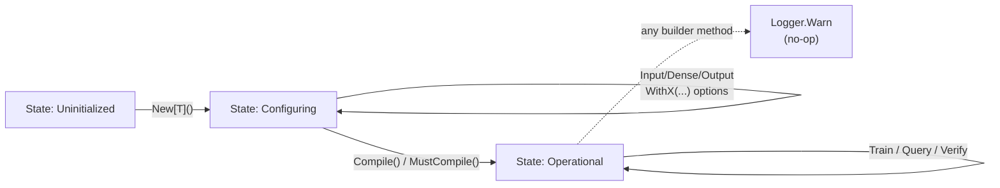

# NN Facade

**Version:** 2.0.0
**Status:** RFC
**Layer:** implementation
**Implements:** l1-neural-network-architecture.md

## Overview

Specifies the public API facade for the GoNN library. The `NN[T]` type is the primary entry point for users.
This revision (`v2.0.0`) defines a **dual-style fluent API** that combines two complementary construction
patterns from the `.references/fluent_api/` design exploration:

1. **Builder pattern** (v1) — chained method calls terminating in `Compile()` / `MustCompile()`. Optimized
   for readability and IDE discoverability. Recommended for examples, tutorials, and the 80% common case.
2. **Functional Options pattern** (v3) — a single constructor accepting variadic options. Optimized for
   composition, presets, and reusable option bundles. Recommended for advanced users, DSL construction,
   and library extension.

Both styles populate the same internal configuration state and share a single `compile()` finalization
step. Users may pick either style based on context; mixing styles inside a single construction is
**not supported**.

## Related Specifications

- [l1-neural-network-architecture.md](l1-neural-network-architecture.md) — Parent concept spec
- [l2-network-graph.md](l2-network-graph.md) — Underlying computational graph wired by `Compile()`
- [l2-layer-types.md](l2-layer-types.md) — Layer types created by builder/option methods
- [l2-activation-functions.md](l2-activation-functions.md) — Activation symbols accepted by builder
- [l2-loss-functions.md](l2-loss-functions.md) — Loss symbols accepted by `WithLoss()`
- [l2-usage-examples.md](l2-usage-examples.md) — Canonical example catalog testing this contract

## 1. Motivation

The previous facade (v1.0.0) lacked an explicit finalization step. Builder methods registered layers but
never wired them into the underlying `Network[T]`, leaving `Train()` / `Query()` / `Verify()` as stubs
with no defined entry semantics. Without a `Compile()` boundary the library has no clear point at which
to:

- Validate topology (every required layer present, sizes positive, output activation compatible with loss).
- Initialize weights using a chosen strategy.
- Transition the network from "configurable" to "operational" state.

This revision introduces an explicit construction lifecycle and documents both styles as first-class.
It also imports the maturity from `.references/rustunumic/` — early-stopping criteria, callback hooks,
and a defined return contract for `Train()`.

## 2. Constraints & Assumptions

- `NN[T]` embeds `network.Network[T]` (composition, not inheritance).
- Builder methods return `*NN[T]` for fluent chaining.
- Functional options are typed as `Option[T]` — a single function type closed over the internal config.
- `Compile()` is the **only** legal way to transition from "configuring" to "operational" state.
- Calling a builder/option method after `Compile()` returns the same network unchanged and emits a
  `Logger.Warn` ("network already compiled — mutation ignored"). This preserves L1 INV-2 (immutable topology).
- `Train()` is single-threaded per network instance (concurrent training is out of scope for this spec).
- All public methods on a compiled network are safe for concurrent **read** access (e.g., parallel `Query()`).

## 4. Invariant Compliance

| L1 Invariant | Implementation |
| :--- | :--- |
| INV-1 (Generic Float) | `NN[T utils.Float]`; every constructor, builder method, and option type is parameterized by `T`. |
| INV-2 (Immutable topology) | Topology is frozen at `Compile()`. Post-compile mutations are no-ops with a warning. |
| INV-3 (Forward propagation) | `Query()` and the forward phase of `Train()` delegate to `Network[T].Forward()` (see l2-network-graph). |
| INV-4 (Backward propagation) | `Train()` invokes `Network[T].Backward()` after each forward pass. |
| INV-5 (Gradient descent) | `WithLearningRate(rate T)` configures the learning rate; weight updates use SGD per current scope. |
| INV-6 (Interface segregation) | Public facade exposes only `NN[T]` methods. Internal `Nucleus[T]` / `Neuron[T]` remain unexported. |
| INV-7 (Layer composition) | Builder methods (`Input/Dense/Output`) and option constructors (`WithInput/WithHiddenLayer/WithOutput`) emit canonical layer types from `pkg/layer/`. |
| INV-8 (Axon-only links) | `Compile()` wires axons exclusively via `Network[T].Build()`; no facade method touches cells directly. |

## 5. Detailed Design

### 5.1 Construction Lifecycle



Three states: **Uninitialized → Configuring → Operational**. Each state has a defined set of legal calls.
Illegal calls do not panic — they are no-ops with a warning to preserve fluent-chain ergonomics in
example code.

### 5.2 Style A — Builder API (v1 derivative)

**Public surface:**

```go
// [REFERENCE] Builder constructor and chainable methods.
func NewBuilder[T utils.Float]() *NN[T]

// Topology — order matters: Input → (Dense)* → Output → (WithX)* → Compile.
func (n *NN[T]) Input(size uint) *NN[T]
func (n *NN[T]) Dense(size uint, act activation.Type, bias bool) *NN[T]
func (n *NN[T]) Hidden(size uint, act activation.Type, bias bool) *NN[T] // alias for Dense
func (n *NN[T]) Output(size uint, act activation.Type, bias bool) *NN[T]

// Configuration — accepted at any point in the chain before Compile.
func (n *NN[T]) WithLearningRate(rate T) *NN[T]
func (n *NN[T]) WithLoss(lossType loss.Type) *NN[T]
func (n *NN[T]) WithBias(use bool) *NN[T]                       // global default for layers added after this call
func (n *NN[T]) WithWeightInit(method WeightInitMethod) *NN[T]  // see §5.6
func (n *NN[T]) WithLossLimit(threshold T) *NN[T]               // early-stopping criterion (see l1-training-semantics)
func (n *NN[T]) WithMaxIterations(count uint) *NN[T]
func (n *NN[T]) WithEpochCallback(fn func(epoch uint, loss T)) *NN[T]
func (n *NN[T]) WithBatchCallback(fn func(batch uint, loss T)) *NN[T]

// Finalization — moves to Operational state.
func (n *NN[T]) Compile() (*NN[T], error)
func (n *NN[T]) MustCompile() *NN[T]    // panics on error; reserved for examples/tests
```

**Breaking change vs. v1.0.0**: `Output()` no longer accepts `loss.Type`. Loss is configured via the
separate `WithLoss(lossType)` method. Rationale: separation of structural (output activation, size,
bias) from training-time concerns (loss). This matches the recommendation in `fluent_api_comparison.md`.

**Pseudo-code for `Compile()`:**

```text
Compile():
    if state != Configuring: return self, ErrAlreadyCompiled
    if !inputSet:            return nil, ErrInputMissing
    if !outputSet:           return nil, ErrOutputMissing
    if learningRate <= 0:    learningRate = DefaultLearningRate (0.3)
    if lossType == "":       lossType = loss.MSE
    if maxIterations == 0:   maxIterations = DefaultMaxIterations
    if weightInit == "":     weightInit = WeightInitXavier

    network.SetInputLayer(inputSize)
    network.SetHiddenLayers(hiddenLayers...)
    network.SetOutputLayer(outputSize, outputActivation, useBias)
    err = network.Build(weightInit)
    if err != nil: return nil, fmt.Errorf("compile: %w", err)

    state = Operational
    return self, nil
```

### 5.3 Style B — Functional Options API (v3 derivative)

**Public surface:**

```go
// [REFERENCE] Option type — a function that mutates internal config state.
type Option[T utils.Float] func(*Config[T])

// Constructors — both produce a compiled, Operational *NN[T].
func New[T utils.Float](opts ...Option[T]) (*NN[T], error)
func MustNew[T utils.Float](opts ...Option[T]) *NN[T]    // panics on error

// Topology options.
func WithInput[T utils.Float](size uint) Option[T]
func WithHiddenLayer[T utils.Float](size uint, act activation.Type) Option[T]
func WithOutput[T utils.Float](size uint, act activation.Type) Option[T]

// Configuration options — names mirror builder methods (without the receiver).
func WithLearningRate[T utils.Float](rate T) Option[T]
func WithLoss[T utils.Float](lossType loss.Type) Option[T]
func WithBias[T utils.Float](use bool) Option[T]
func WithWeightInit[T utils.Float](method WeightInitMethod) Option[T]
func WithLossLimit[T utils.Float](threshold T) Option[T]
func WithMaxIterations[T utils.Float](count uint) Option[T]
func WithEpochCallback[T utils.Float](fn func(epoch uint, loss T)) Option[T]
func WithBatchCallback[T utils.Float](fn func(batch uint, loss T)) Option[T]
```

**Higher-order options** (composition utilities — see `.references/fluent_api/fluent_api_v3.go`):

```go
// Sequential — N hidden layers of identical size and activation.
func Sequential[T utils.Float](count, size uint, act activation.Type) Option[T]

// DeepNetwork — N hidden layers with progressively halving size, floor of 2.
func DeepNetwork[T utils.Float](startSize, layers uint, act activation.Type) Option[T]

// StandardSetup — opinionated defaults bundle (rate, loss=MSE, bias=true, init=xavier).
func StandardSetup[T utils.Float](rate T) Option[T]
```

**Presets** (named option bundles for canonical tasks):

```go
func PresetXOR[T utils.Float]() Option[T]                         // 2 → Sigmoid(4) → Sigmoid(1), MSE, rate=0.3
func PresetMNIST[T utils.Float]() Option[T]                       // 784 → ReLU(128) → ReLU(64) → SoftMax(10), CE, he-init
func PresetRegression[T utils.Float](inputSize, hiddenSize uint) Option[T]  // hidden(ReLU) → hidden/2(ReLU) → Linear(1), MSE
```

Presets are **partial option bundles** — users append additional options (e.g., callbacks) to customize.

### 5.4 Interoperability and Style Boundaries

| Concern | Builder (Style A) | Options (Style B) |
| :--- | :--- | :--- |
| Entry point | `NewBuilder[T]()` | `New[T](opts...)`/`MustNew[T]()` |
| State after entry | Configuring | Operational (compile is implicit) |
| Reuse / save config | Manual (call `.Config()`) | Native — slice of `Option[T]` |
| Best for | Examples, tutorials | Library code, presets, DSL |
| IDE discoverability | High (chained methods) | Medium (need to know option names) |

**Mixing rule**: A single network must be constructed using exactly one style. Calling builder methods
on a network produced by `New[T]()` is a Configuring-state violation and follows the post-compile
warning behavior.

**Convergence point**: both styles populate the same `Config[T]` struct (see §5.5) and call the same
internal `compile()` function. There is no duplicated logic.

### 5.5 Internal Configuration Type

```go
// [REFERENCE] Internal configuration — populated by either style; not exported in v2.0.
type Config[T utils.Float] struct {
    InputSize        uint
    HiddenLayers     []HiddenLayerSpec[T]
    OutputSize       uint
    OutputActivation activation.Type

    LearningRate     T
    LossType         loss.Type
    LossLimit        T
    MaxIterations    uint
    WeightInit       WeightInitMethod
    DefaultBias      bool

    EpochCallback    func(epoch uint, loss T)
    BatchCallback    func(batch uint, loss T)
}

type HiddenLayerSpec[T utils.Float] struct {
    Size       uint
    Activation activation.Type
    Bias       bool
}
```

**Future extension hook (out of scope for v2.0)**: a serializable variant of `Config[T]` is reserved
for `l1-network-persistence.md` (planned). When that spec lands, this struct may be promoted to public
API to support `WriteConfig` / `ReadConfig` round-trips.

### 5.6 Weight Initialization Methods

```go
// [REFERENCE] Recognized strategies. Default = Xavier.
type WeightInitMethod string

const (
    WeightInitXavier WeightInitMethod = "xavier"   // good for tanh/sigmoid layers
    WeightInitHe     WeightInitMethod = "he"       // good for ReLU/LeakyReLU layers
    WeightInitRandom WeightInitMethod = "random"   // uniform [-1, 1)
)
```

The full algorithm contract for each method belongs to a future `l1-weight-initialization.md` spec.
For v2.0 the symbols are reserved and `Compile()` accepts them; defaulting and the actual numeric
formulas are TBD pending that spec.

### 5.7 Validation Rules at `Compile()`

The following are **hard errors** — `Compile()` returns a wrapped error:

| Rule              | Trigger condition                                                |
| :---------------- | :--------------------------------------------------------------- |
| InputMissing      | No `Input(...)` / `WithInput(...)` call observed                 |
| OutputMissing     | No `Output(...)` / `WithOutput(...)` call observed               |
| InputSizeZero     | `Input(0)` requested                                             |
| OutputSizeZero    | `Output(0, ...)` requested                                       |
| HiddenSizeZero    | Any hidden layer with `size == 0`                                |
| RateNonPositive   | `WithLearningRate(<= 0)` requested                               |
| MaxIterZero       | `WithMaxIterations(0)` requested                                 |
| UnknownActivation | Activation symbol not registered in `activation` dispatcher      |
| UnknownLoss       | Loss symbol not registered in `loss` dispatcher                  |
| UnknownInit       | Weight init method not in §5.6 list                              |

**Soft warnings** (logged but do not block compile):

- Output activation `SOFTMAX` paired with loss `MSE` (typically you want CrossEntropy).
- Output activation `SIGMOID` paired with `CrossEntropy` and output size > 1 (use `BinaryCrossEntropy`
  for size 1, `CrossEntropy` typically pairs with `SOFTMAX`).
- More than 5 hidden layers with `WithWeightInit(WeightInitRandom)` (gradient explosion risk).

### 5.8 Example: Both Styles, Same Network

**Style A (Builder):**

```go
// [REFERENCE] XOR network via builder.
nn, err := nn.NewBuilder[float32]().
    Input(2).
    Dense(4, activation.SIGMOID, true).
    Output(1, activation.SIGMOID, true).
    WithLearningRate(0.3).
    WithLoss(loss.MSE).
    Compile()
```

**Style B (Options):**

```go
// [REFERENCE] Same XOR network via functional options.
nn := nn.MustNew[float32](
    nn.WithInput[float32](2),
    nn.WithHiddenLayer[float32](4, activation.SIGMOID),
    nn.WithOutput[float32](1, activation.SIGMOID),
    nn.WithLearningRate[float32](0.3),
    nn.WithLoss[float32](loss.MSE),
)
```

**Style B with preset:**

```go
// [REFERENCE] Equivalent via preset.
nn := nn.MustNew[float32](nn.PresetXOR[float32]())
```

## 6. Implementation Notes

1. **Migration from v1.0.0**: drop the `loss.Type` parameter from `Output()`. Existing call sites must
   add an explicit `.WithLoss(...)`. Default remains `loss.MSE`.
2. **Deprecate** the legacy commented code in `pkg/nn/builder.go` and `pkg/nn/config.go` — replace with
   the v2.0 surface. Do not preserve as compatibility shims.
3. **Order of implementation**: Builder API first (smaller surface), then refactor `compile()` to
   accept any `Config[T]`, then layer Functional Options on top reusing the same `compile()`.
4. **Higher-order options and presets** can land in a follow-up patch (0.1.x → 0.2.x) without
   re-promoting the spec — they are pure compositions of the documented base options.
5. **Callbacks** invoke synchronously on the training goroutine. Long-running callbacks block training.
   This is documented but not enforced.

## 7. Drawbacks & Alternatives

- **Drawback (Mixing risk)**: Two construction styles increase API surface. Mitigation: examples in
  `l2-usage-examples.md` consistently demonstrate one style per example with rationale.
- **Drawback (Validation timing)**: validation only fires at `Compile()`. A misconfigured chain runs
  silently until the terminator. Mitigation: each builder method may emit a `Logger.Debug` trace entry.
- **Alternative (Single style)**: Picking only Builder OR only Options simplifies the API but loses
  reusability (Builder) or readability (Options). The references show both communities active enough to
  warrant first-class support of both.
- **Alternative (Config-first)**: A `NetworkConfig` struct (see `fluent_api_v2.go`) was considered.
  Rejected for v2.0 because it duplicates the role of `Option[T]` slice composition. Reserved for the
  forthcoming persistence spec where serializability is required.

## Canonical References

| Alias | Path | Purpose |
| :--- | :--- | :--- |
| `[NN]` | `pkg/nn/nn.go` | Main facade type — receives the new builder/options surface |
| `[BUILDER]` | `pkg/nn/builder.go` | Hosts builder methods (`Input/Dense/Output/WithX/Compile`) |
| `[OPTIONS]` | `pkg/nn/options.go` | New file — hosts `Option[T]`, `New[T]`, `WithX` options |
| `[PRESETS]` | `pkg/nn/presets.go` | New file — hosts `Sequential`, `DeepNetwork`, `PresetXOR/MNIST/Regression` |
| `[QUERY]` | `pkg/nn/query.go` | Forward-only inference |
| `[TRAIN]` | `pkg/nn/train.go` | Training loop driver — invokes Network forward/backward |
| `[VERIFY]` | `pkg/nn/verify.go` | Forward + loss without weight update |
| `[REF-V1]` | `.references/fluent_api/fluent_api_v1.go` | Source of Builder pattern design |
| `[REF-V3]` | `.references/fluent_api/fluent_api_v3.go` | Source of Functional Options pattern, presets, callbacks |
| `[REF-RU]` | `.references/rustunumic/train.rs` | Source of training-loop maturity (LossLimit, min-loss tracking) |

## Document History

| Version | Date | Description |
| :--- | :--- | :--- |
| 1.0.0 | 2026-04-21 | Initial Stable — reverse-engineered from existing codebase. |
| 2.0.0 | 2026-04-27 | Major redesign: dual-style API (Builder + Functional Options), explicit `Compile()` lifecycle, callbacks, presets, validation rules. Loss removed from `Output()` signature (breaking). Status reverted to RFC per amendment rule. |
