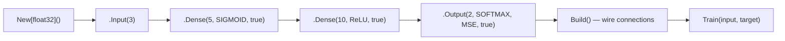

# NN Facade

**Version:** 1.0.0
**Status:** Stable
**Layer:** implementation
**Implements:** l1-neural-network-architecture.md

## Overview

Specifies the public API facade for the GoNN library. The `NN[T]` type is the primary entry point for users. It provides a fluent builder API for network construction and methods for training, querying, and verifying neural networks.

## Related Specifications

- [l1-neural-network-architecture.md](l1-neural-network-architecture.md) — Parent concept spec
- [l2-network-graph.md](l2-network-graph.md) — Underlying computational graph
- [l2-layer-types.md](l2-layer-types.md) — Layer types created by builder methods

## 1. Motivation

Users need a clean, discoverable API to construct and operate neural networks. The facade pattern hides the complexity of the internal network graph, layer management, and propagation mechanics behind a simple fluent interface.

## 2. Constraints & Assumptions

- `NN[T]` embeds `network.Network[T]` — composition, not inheritance
- Builder methods return `*NN[T]` for method chaining
- All public methods must be safe for concurrent read access (training is single-threaded)

## 4. Invariant Compliance

| L1 Invariant | Implementation |
| :--- | :--- |
| INV-1 (Generic Float) | `NN[T utils.Float]` — all methods parameterized by T |
| INV-2 (Immutable topology) | Builder creates layers; `Build()` finalizes connections |
| INV-6 (Interface segregation) | NN exposes high-level methods; internal Nucleus/Neuron interfaces hidden |

## 5. Detailed Design

### 5.1 Type Definition

```plaintext
NN[T utils.Float]
├── network.Network[T]  (embedded)
├── New[T]() *NN[T]     (constructor)
├── Input(size uint) *NN[T]
├── Dense(size uint, activation Type, bias bool) *NN[T]
├── Output(size uint, activation Type, loss Type, bias bool) *NN[T]
├── Query(input []T) []T
├── Train(input, target []T) (uint, T)
└── Verify(input []T, target ...[]T) T
```

### 5.2 Builder Flow



### 5.3 Current Status (Known Issues)

- `builder.go` and `config.go` are fully commented out (legacy alternative architecture)
- `Train()`, `Query()`, `Verify()` are stub methods returning nil/zero
- Builder methods create layers but do not store them in the Network
- `MaxIteration` constant: 1e+9

## 6. Implementation Notes

1. Fix builder to register layers with Network (currently lost)
2. Implement `Train()` using Network's propagation methods
3. Implement `Query()` as forward-only propagation
4. Decide on commented-out `Compile()` pattern vs current fluent builder
5. Remove or integrate legacy code in builder.go, config.go

## 7. Drawbacks & Alternatives

- **Alternative**: Compile() pattern (in commented code) with WithLoss(), WithLearningRate() — more explicit but less fluent
- **Drawback**: Fluent builder doesn't validate topology at build time

## Canonical References

| Alias | Path | Purpose |
| :--- | :--- | :--- |
| `[NN]` | `pkg/nn/nn.go` | Main facade type and builder |
| `[BUILDER]` | `pkg/nn/builder.go` | Legacy builder (commented out) |
| `[CONFIG]` | `pkg/nn/config.go` | Legacy config (commented out) |
| `[QUERY]` | `pkg/nn/query.go` | Query method stub |
| `[TRAIN]` | `pkg/nn/train.go` | Train method stub + legacy code |
| `[VERIFY]` | `pkg/nn/verify.go` | Verify method stub |

## Document History

| Version | Date | Description |
| :--- | :--- | :--- |
| 1.0.0 | 2026-04-21 | Initial Stable — reverse-engineered from existing codebase |
