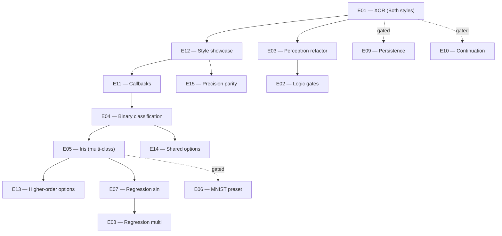

# Usage Examples Catalog

**Version:** 1.0.0
**Status:** Draft
**Layer:** implementation
**Implements:** l1-neural-network-architecture.md

## Overview

Canonical catalog of example programs that **must exist** under `examples/` and serve as the executable
contract for the public API defined in [l2-nn-facade.md](l2-nn-facade.md). Each example is specified by
its purpose, dataset shape, network topology, training hyperparameters, expected behavior, and which API
style (Builder vs Functional Options) it demonstrates.

This spec covers **what** examples exist and **why** — concrete Go source code lives in `examples/{name}/`
and is permitted to evolve independently as long as it satisfies the contract documented here.

## Related Specifications

- [l1-neural-network-architecture.md](l1-neural-network-architecture.md) — Parent concept spec
- [l2-nn-facade.md](l2-nn-facade.md) — Public API contract these examples exercise
- [l2-activation-functions.md](l2-activation-functions.md) — Activation symbols referenced
- [l2-loss-functions.md](l2-loss-functions.md) — Loss symbols referenced

## 1. Motivation

Examples are the **executable specification** of the public API. They serve four overlapping goals:

1. **Onboarding** — new users copy/paste a working example and adapt it.
2. **Regression detection** — `go test ./examples/...` (or a smoke runner) catches API breakage early.
3. **Documentation** — every README and pkg.go.dev surface points back to a runnable example.
4. **Coverage of API surface** — every documented method/option must appear in at least one example.

Without a curated catalog the `examples/` directory drifts: examples become stale, half-broken, or
duplicated. Specifying the catalog keeps the surface intentional and reviewable.

## 2. Constraints & Assumptions

- Examples are organized as `examples/{name}/main.go` plus optional `README.md`, `data/`, and `_test.go`.
- The repository's own `go.work` includes `examples/` as a workspace member; each example is its own
  module to avoid polluting the library's dependency graph (matches current layout).
- Examples must compile with `go build ./examples/...` (no missing imports, no `// TODO` panics in the
  golden path).
- Datasets must be either generated in code (XOR, sin) or shipped as small files (< 1 MiB) under
  `examples/{name}/data/`. Large datasets (MNIST, CIFAR) are referenced by URL in README and downloaded
  on first run.
- Each example must complete in **< 30 seconds** on a modern laptop CPU. Heavier benchmarks live under
  `bench/` (out of scope for this spec).
- Russian commentary is permitted in `README.md`; in-code comments and identifiers stay English per
  project rules.

## 4. Invariant Compliance

| L1 Invariant | Implementation |
| :--- | :--- |
| INV-1 (Generic Float) | Catalog explicitly includes both `float32` and `float64` variants (E10/E11). |
| INV-2 (Immutable topology) | Every example calls `Compile()` (Builder) or `New[T]()` (Options) once before training. |
| INV-3/INV-4 (Forward/Backward) | Every example invokes `Train()` and at least one of `Query()`/`Verify()`. |
| INV-7 (Layer composition) | Examples cover all three public layer creators: `Input`, `Dense`, `Output`. |

## 5. Detailed Design

### 5.1 Catalog Schema

Each example entry MUST specify the following fields:

| Field | Description |
| :--- | :--- |
| ID | Stable identifier `E{nn}` for cross-referencing in tasks/PRs. |
| Path | `examples/{name}/` |
| Category | One of: Foundational, Classification, Regression, Persistence, Continuation, Observability, Style. |
| Purpose | One sentence — what concept the example illustrates. |
| Dataset | Shape and origin (generated / file / URL). |
| Topology | Layer sizes and activations (e.g., `2 → Sigmoid(4) → Sigmoid(1)`). |
| Hyperparams | Learning rate, loss, max iterations, loss limit, weight init, bias. |
| API Style | `Builder` \| `Options` \| `Preset` \| `Both` (split into two main_*.go files). |
| Expected Output | What the user sees on stdout (loss curve, final query result, "Elapsed time"). |
| Status | `MUST` \| `SHOULD` \| `MAY` — implementation priority. |

### 5.2 Example Catalog

#### Foundational

**E01 — XOR (canonical hello-world)**

| Field | Value |
| :--- | :--- |
| Path | `examples/xor/` |
| Purpose | Smallest non-linear classification — proves backprop works. |
| Dataset | 4 samples in code: `[[0,0],[0,1],[1,0],[1,1]] → [0,1,1,0]`. |
| Topology | `2 → Sigmoid(4) → Sigmoid(1)`, bias on. |
| Hyperparams | rate=0.3, loss=MSE, max-iter=10000, loss-limit=1e-4, init=xavier. |
| API Style | `Both` — `main_builder.go` + `main_options.go` to demonstrate parity. |
| Expected Output | Final loss < 0.01; Query for each input prints predicted class. |
| Status | MUST |

**E02 — Logical gates suite (AND / OR / NAND)**

| Field | Value |
| :--- | :--- |
| Path | `examples/logic_gates/` |
| Purpose | Show the same topology learning different functions; pedagogical contrast with XOR. |
| Dataset | 4 samples each, generated in a loop over the three gate truth tables. |
| Topology | `2 → Sigmoid(2) → Sigmoid(1)`, bias on. |
| Hyperparams | rate=0.5, loss=MSE, max-iter=5000, loss-limit=1e-4. |
| API Style | `Builder`. |
| Expected Output | Per-gate trained network + accuracy table over the 4 inputs. |
| Status | SHOULD |

**E03 — Perceptron (legacy continuity)**

| Field | Value |
| :--- | :--- |
| Path | `examples/perceptron/` (already exists — refactor to v2.0 API) |
| Purpose | Preserve the historical perceptron demo from `gonn_old`; smoke test for non-trivial multi-output. |
| Dataset | In-code 11-element sequence (sliding window of 3-in / 2-out). |
| Topology | `3 → Sigmoid(5) → ReLU(10) → Sigmoid(5) → SoftMax(2)`, mixed bias. |
| Hyperparams | rate=0.3, loss=ARCTAN, max-iter=100000, loss-limit=1e-6. |
| API Style | `Builder`. |
| Expected Output | Final query for `[-0.52, 0.66, 0.81]` ≈ `[-0.13, 0.2]`; "Elapsed time" line. |
| Status | MUST |

#### Classification

**E04 — Binary classification (toy)**

| Field | Value |
| :--- | :--- |
| Path | `examples/binary_classification/` |
| Purpose | Demonstrate sigmoid output + `BinaryCrossEntropy` loss. |
| Dataset | Generated: 200 points in 2D, two Gaussian blobs, labels {0,1}. |
| Topology | `2 → ReLU(8) → ReLU(8) → Sigmoid(1)`, bias on. |
| Hyperparams | rate=0.01, loss=BinaryCrossEntropy, max-iter=2000, init=he. |
| API Style | `Options`. |
| Expected Output | Train accuracy > 95%; held-out test accuracy. |
| Status | SHOULD |

**E05 — Multi-class classification (Iris-like)**

| Field | Value |
| :--- | :--- |
| Path | `examples/iris/` |
| Purpose | Demonstrate softmax output + `CrossEntropy` loss on tabular data. |
| Dataset | 150 samples, 4 features, 3 classes. Shipped CSV (~5 KiB). |
| Topology | `4 → ReLU(16) → ReLU(8) → SoftMax(3)`, bias on. |
| Hyperparams | rate=0.01, loss=CrossEntropy, max-iter=3000, init=he. |
| API Style | `Options` with `WithEpochCallback`. |
| Expected Output | Per-100-epoch loss prints; final test-set accuracy ≥ 90%. |
| Status | SHOULD |

**E06 — MNIST-style preset (image classification)**

| Field | Value |
| :--- | :--- |
| Path | `examples/mnist/` |
| Purpose | Demonstrate a deeper net via `PresetMNIST` and downloaded data. |
| Dataset | MNIST 28x28 grayscale; URL referenced in README; first-run download. |
| Topology | `784 → ReLU(128) → ReLU(64) → SoftMax(10)` (defined by `PresetMNIST`). |
| Hyperparams | rate=0.001, loss=CrossEntropy, max-iter=5 epochs, init=he. |
| API Style | `Preset`. |
| Expected Output | Per-epoch validation accuracy; final accuracy ≥ 92%. |
| Status | MAY (depends on dataset loader spec — out of v2.0 scope) |

#### Regression

**E07 — 1D function approximation (sin)**

| Field | Value |
| :--- | :--- |
| Path | `examples/regression_sin/` |
| Purpose | Visualizable proof that the network can fit a smooth non-linear function. |
| Dataset | Generated: 200 points, x ∈ [-π, π], y = sin(x). |
| Topology | `1 → TanH(16) → TanH(16) → Linear(1)`, bias on. |
| Hyperparams | rate=0.01, loss=MSE, max-iter=5000, init=xavier. |
| API Style | `Builder`. |
| Expected Output | RMSE on a held-out grid; ASCII plot or CSV dump for plotting. |
| Status | SHOULD |

**E08 — Multi-output regression (preset)**

| Field | Value |
| :--- | :--- |
| Path | `examples/regression_multi/` |
| Purpose | Show `PresetRegression` + multi-dim output for vector targets. |
| Dataset | Generated: 5-dim inputs → 3-dim outputs via a known linear+noise function. |
| Topology | `5 → ReLU(16) → ReLU(8) → Linear(3)` (via `PresetRegression(5, 16)` + override). |
| Hyperparams | rate=0.01, loss=MSE, max-iter=3000. |
| API Style | `Preset` + extra `Options`. |
| Expected Output | Per-output-dim RMSE. |
| Status | MAY |

#### Persistence

**E09 — Save / reload (placeholder until persistence spec)**

| Field | Value |
| :--- | :--- |
| Path | `examples/persistence/` |
| Purpose | Train, write `nn.json` + `weights.json`, reload, query — round-trip integrity. |
| Dataset | XOR (re-uses E01 setup for stability). |
| Topology | Same as E01. |
| Hyperparams | Same as E01. |
| API Style | `Builder` for train phase; reload via persistence API (TBD). |
| Expected Output | Pre-save query == post-reload query (bit-identical for `float64`, ε-close for `float32`). |
| Status | MAY (gated on `l1-network-persistence.md` — planned, not yet drafted) |

#### Continuation

**E10 — `AndTrain`: resume training after a Query**

| Field | Value |
| :--- | :--- |
| Path | `examples/continuation/` |
| Purpose | Demonstrate that `Query()` does not destroy training state — `AndTrain(target)` resumes. |
| Dataset | XOR. |
| Topology | Same as E01. |
| Hyperparams | Same as E01. |
| API Style | `Builder`. |
| Expected Output | Loss before continuation > loss after continuation; demonstrates state preservation. |
| Status | MAY (gated on `AndTrain` API surface — not yet in `l2-nn-facade.md` v2.0; reserved) |

#### Observability

**E11 — Progress callbacks**

| Field | Value |
| :--- | :--- |
| Path | `examples/callbacks/` |
| Purpose | Demonstrate `WithEpochCallback` and `WithBatchCallback` for training progress. |
| Dataset | XOR (small enough to iterate visibly). |
| Topology | Same as E01. |
| Hyperparams | Same as E01 + max-iter=2000. |
| API Style | `Options`. |
| Expected Output | Stdout: every 100 epochs, `epoch=N loss=X` line; final summary. |
| Status | SHOULD |

#### API Style Showcase

**E12 — Three styles, identical network**

| Field | Value |
| :--- | :--- |
| Path | `examples/style_showcase/` |
| Purpose | Direct side-by-side: same XOR network built three ways (Builder, Options, Preset) — proves equivalence. |
| Dataset | XOR. |
| Topology | Same as E01. |
| Hyperparams | Same as E01. |
| API Style | All three in one file (three `func`s, single `main` calling each). |
| Expected Output | Three networks; final losses converge to within 1e-3 of each other. |
| Status | MUST |

**E13 — Higher-order options (`Sequential`, `DeepNetwork`)**

| Field | Value |
| :--- | :--- |
| Path | `examples/higher_order_options/` |
| Purpose | Demonstrate compositional power of the Functional Options style. |
| Dataset | Iris-like (re-uses E05). |
| Topology A | `4 → Sequential(3, 16, ReLU) → SoftMax(3)` — three identical hidden layers. |
| Topology B | `4 → DeepNetwork(32, 4, ReLU) → SoftMax(3)` — sizes 32 → 16 → 8 → 4. |
| Hyperparams | Same as E05. |
| API Style | `Options` (showcases higher-order option helpers). |
| Expected Output | Both reach ≥ 85% accuracy; runtime contrast logged. |
| Status | SHOULD |

**E14 — Shared options across multiple networks**

| Field | Value |
| :--- | :--- |
| Path | `examples/shared_options/` |
| Purpose | Demonstrate `[]Option[T]` reuse — train two architectures with identical hyperparameters. |
| Dataset | Generated 2D classification. |
| Topology A | `2 → ReLU(8) → Sigmoid(1)`. |
| Topology B | `2 → ReLU(16) → ReLU(8) → Sigmoid(1)`. |
| Hyperparams | Shared via a `commonOpts := []Option[T]{...}` slice. |
| API Style | `Options`. |
| Expected Output | Side-by-side final loss + iteration count. |
| Status | MAY |

#### Type Variants

**E15 — `float32` vs `float64` parity**

| Field | Value |
| :--- | :--- |
| Path | `examples/precision/` |
| Purpose | Same network in both numeric types; surface speed/accuracy trade-off. |
| Dataset | XOR. |
| Topology | Same as E01. |
| Hyperparams | Same as E01. |
| API Style | `Builder` (twice, once per type). |
| Expected Output | Final loss for both; elapsed time for both; numeric drift. |
| Status | MAY |

### 5.3 Coverage Matrix

This matrix proves the catalog covers every public API element. Each cell lists the example IDs that
touch the element. **An empty cell is a coverage gap and should block promotion of this spec to Stable.**

| API Element | Covered by |
| :--- | :--- |
| `NewBuilder[T]()` + `Compile()` | E01, E02, E03, E07, E10, E12, E15 |
| `New[T](opts...)` / `MustNew[T]` | E01, E04, E05, E08, E11, E12, E13, E14 |
| `Input` / `WithInput` | All examples |
| `Dense` / `WithHiddenLayer` | All except E06 (uses preset) |
| `Output` / `WithOutput` | All examples |
| `WithLearningRate` | All examples |
| `WithLoss` | All examples |
| `WithBias` | E03 (toggles globally), E07 |
| `WithWeightInit` (xavier/he) | E01 (xavier), E04 (he), E06 (he), E07 (xavier) |
| `WithMaxIterations` | All examples |
| `WithLossLimit` | E01, E02, E03 |
| `WithEpochCallback` | E05, E11 |
| `WithBatchCallback` | E11 |
| `Sequential` | E13 |
| `DeepNetwork` | E13 |
| `PresetXOR` | E12 |
| `PresetMNIST` | E06 |
| `PresetRegression` | E08 |
| `Train` | All examples |
| `Query` | All examples |
| `Verify` | E04, E05, E07 |
| `AndTrain` | E10 (gated) |
| Persistence (Save/Reload) | E09 (gated) |

### 5.4 Implementation Order

The MUST examples define the v2.0 minimum bar. The order below is recommended for incremental landing:

Solid arrows are non-gated dependencies. Dashed arrows mark examples gated on future specs
(persistence, AndTrain, MNIST data loader).

### 5.5 Smoke-Test Contract

Each example directory contains a `main_test.go` (where feasible) with a single test that runs the
whole `main()` and asserts the final loss / accuracy threshold. CI runs `go test ./examples/...` —
a failed example breaks the build. This converts the catalog from documentation into an enforced
contract.

For examples with random initialization, tests must seed the RNG via a documented hook (`utils.Seed`
or equivalent) and use looser thresholds to avoid flakiness.

## 6. Implementation Notes

1. Begin with **E01** (XOR, Both styles) and **E12** (Style showcase) — they exercise the entire `Compile()`
   path and prove dual-style parity.
2. **E03** (Perceptron) already exists in `examples/perceptron/main.go` but uses the v1.0 API and is
   stub-broken — refactor as part of the v2.0 facade landing.
3. The smoke-test convention (§5.5) should land alongside the first example so subsequent examples
   inherit the pattern.
4. Documentation: each example MUST have a top-of-file doc comment explaining the concept and
   pointing at this spec by ID.

## 7. Drawbacks & Alternatives

- **Drawback (Maintenance burden)**: 15 examples is a lot to keep healthy. Mitigation: smoke tests catch
  rot automatically; gated examples (E06/E09/E10) wait for their gating specs.
- **Drawback (Scope creep)**: Persistence and continuation examples reference APIs that don't yet exist
  in `l2-nn-facade.md` v2.0. They are explicitly marked `gated` and `MAY` to avoid blocking landing.
- **Alternative (Single mega-example)**: One file demonstrating every API call. Rejected — examples need
  to be small and focused for onboarding value; one mega-example serves no specific learner.
- **Alternative (No catalog spec, just code)**: Let `examples/` evolve organically. Rejected — without
  the coverage matrix (§5.3) the team has no visibility into API surface gaps.

## Canonical References

| Alias | Path | Purpose |
| :--- | :--- | :--- |
| `[FACADE]` | `.design/specifications/l2-nn-facade.md` | API contract these examples exercise |
| `[EX-DIR]` | `examples/` | Top-level examples directory |
| `[REF-V1]` | `.references/fluent_api/fluent_api_v1.go` | Source examples for Builder style (`ExampleSimpleXOR` etc.) |
| `[REF-V3]` | `.references/fluent_api/fluent_api_v3.go` | Source examples for Options style + Presets |
| `[REF-OLD]` | `.references/gonn_old/examples/` | Historical examples (perceptron, linear, query, and_train, json) |
| `[REF-RU]` | `.references/rustunumic/train.rs` | Source of training-loop maturity referenced by E11 callbacks |

## Document History

| Version | Date | Description |
| :--- | :--- | :--- |
| 1.0.0 | 2026-04-27 | Initial Draft — 15-entry catalog with coverage matrix and implementation order. |
