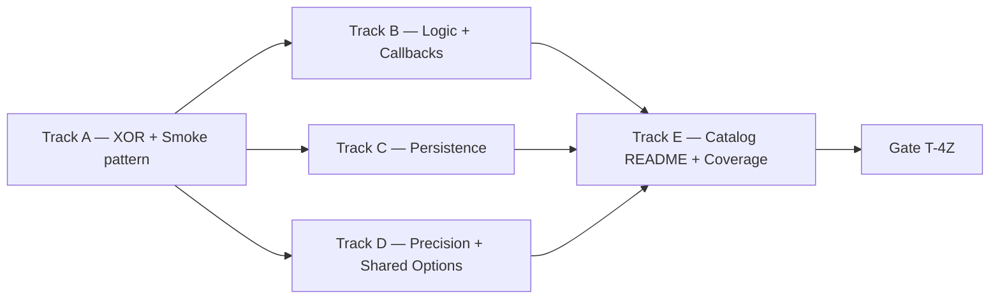

# Phase 4 Tasks — Examples Catalog (Track D)

**Phase:** 4
**Status:** `Done` (2026-05-02)
**Strategic Goal:** Land the v0.1 example catalog defined in [l2-usage-examples.md](../specifications/l2-usage-examples.md) Stable v1.0.0 — every example smoke-tests a meaningful API surface and CI catches regressions via `go test ./examples/...`. The canonical 15-entry catalog is partitioned by the v0.1 multi-hidden constraint: 7 entries implemented in this phase; 8 deferred to v0.2 (multi-hidden topology / `AndTrain` / dataset loader). Closed 2026-05-02 via /magic.run with all 10 atomic tasks + 4 gate checks green.

## Constraint — Multi-Hidden Topology Deferred

`pkg/nn.compile()` rejects `len(HiddenLayers) > 1` with an explicit "planned for v0.2" error (logged in Phase 2 outcome). Examples requiring 2+ hidden layers wait for the v0.2 multi-hidden patch and are listed under the **Deferred to v0.2** section below — they remain in the spec catalog but are not active Phase 4 tasks.

## Track A — Foundation (XOR + Smoke-Test Pattern)

**Spec:** [l2-usage-examples.md](../specifications/l2-usage-examples.md) §5.5 (smoke-test contract), E01, E12
**Depends on:** Phase 2 ✓ (Public facade), Phase 3 ✓ (persistence for E09 later)
**Establishes:** smoke-test convention copied by every subsequent example.

- [ ] **T-4A01** — `examples/xor/` (E01): create `main_builder.go` and `main_options.go` showing dual-style XOR. Topology `2 → Sigmoid(4) → Sigmoid(1)`, bias on, rate=0.3, loss=MSE, max-iter=10000, loss-limit=1e-4, init=xavier. Each main prints final per-input prediction. Expected final loss < 0.01.
- [ ] **T-4A02** — `examples/xor/main_test.go`: smoke test seeds RNG via `utils.Seed`, runs both `main_builder` and `main_options` body via extracted `runBuilder()` / `runOptions()` helpers, asserts final loss < 0.05 (loose threshold). Establishes the testing pattern for §5.5.
- [ ] **T-4A03** — `examples/style_showcase/` (E12): three functions in one `main.go` (`buildBuilder`, `buildOptions`, `buildPreset`) returning the same XOR network; final losses must converge within 1e-3. Proves dual-style + preset parity.

## Track B — Logic + Observability

**Spec:** [l2-usage-examples.md](../specifications/l2-usage-examples.md) E02, E11
**Depends on:** Track A (smoke-test pattern + XOR baseline)

- [ ] **T-4B01** — `examples/logic_gates/` (E02): single hidden layer `2 → Sigmoid(2) → Sigmoid(1)` trained over AND/OR/NAND truth tables in a loop. rate=0.5, loss=MSE, max-iter=5000, loss-limit=1e-4. Builder API. Prints accuracy table per gate.
- [ ] **T-4B02** — `examples/callbacks/` (E11): XOR with `WithEpochCallback` printing every 100 epochs and `WithBatchCallback` printing per-sample loss. Options API. Stdout shows training progress; final summary line.

## Track C — Persistence Round-Trip

**Spec:** [l2-usage-examples.md](../specifications/l2-usage-examples.md) E09 (ungated 2026-05-01)
**Depends on:** Track A (XOR baseline) + Phase 3 Track A (`pkg/persistence` Stable)

- [ ] **T-4C01** — `examples/persistence/` (E09): train E01 XOR, dump `pkg/nn` config + weights into `ConfigDoc[T]` / `WeightsDoc[T]`, call `persistence.WriteConfig` + `persistence.WriteWeights` to a temp dir, then `persistence.ReadWeights` and rebuild a network with the loaded weights. Compare pre-save vs post-reload `Query` outputs — must match within `cpu.ToleranceF32` for f32, bit-identical for f64. Builder API for train; the rebuild path documents the conversion seam between `pkg/nn.Config` and `persistence.ConfigDoc` (the v0.1 boundary; future `pkg/nn` hooks will close this gap automatically).
- [ ] **T-4C02** — `examples/persistence/main_test.go`: smoke test with a fixed seed; round-trip `Query` output bit-identical for `float64`, ε ≤ ToleranceF32 for `float32`.

## Track D — Type & Composition Showcases

**Spec:** [l2-usage-examples.md](../specifications/l2-usage-examples.md) E14 (adapted), E15
**Depends on:** Track A
**Note (E14 adaptation)**: spec §5.2 lists Topology B with two hidden layers; that variant is deferred until multi-hidden support arrives. v0.1 substitution pairs two **single-hidden** widths (e.g. `2 → ReLU(8) → Sigmoid(1)` vs `2 → ReLU(16) → Sigmoid(1)`) so the pedagogical point — shared options across distinct topologies — still lands.

- [ ] **T-4D01** — `examples/shared_options/` (E14, adapted): build `commonOpts := []nn.Option[float32]{...}` and reuse across two single-hidden architectures. Options API. Print side-by-side final loss + iterations for both nets.
- [ ] **T-4D02** — `examples/precision/` (E15): identical XOR built twice — once `nn.New[float32]`, once `nn.New[float64]`. Builder API. Print final loss + elapsed time for each; demonstrate numeric drift on the same seed.

## Track E — Catalog Maintenance & Coverage

**Spec:** [l2-usage-examples.md](../specifications/l2-usage-examples.md) §5.3 (Coverage Matrix), §6 (refactor of `examples/perceptron/` left for v0.2 — multi-hidden gated)

- [ ] **T-4E01** — Top-level `examples/README.md` table linking to every example with status `Active` (v0.1) or `Deferred` (v0.2 multi-hidden / AndTrain). Refresh `go.work` to include new example modules. Add `// removed once v0.2 lands` doc-comment in `examples/perceptron/main.go` documenting the temporary stub state — the legacy file already lives there but is broken under v2.0 facade and stays parked until E03 is unblocked.
- [ ] **T-4E02** — Coverage matrix audit: cross-reference §5.3 with the implemented examples and produce a markdown gap table noting which API elements are exercised by Phase 4 v0.1 vs which wait on v0.2 (multi-hidden, AndTrain, dataset loader). Embed the audit at the bottom of `examples/README.md`.

## Phase Gate (T-4Z)

- [ ] **T-4Z01** — `go build ./examples/...` — every active example compiles. Modules added under `go.work` are recognised.
- [ ] **T-4Z02** — `go test ./examples/...` — every smoke test passes deterministically (seeded RNG; loose loss thresholds).
- [ ] **T-4Z03** — `go test -race ./examples/...` — race-clean. (CGO required for race detector → run via PowerShell per repeated 2026-04-29 / 2026-05-01 STATE.md note.)
- [ ] **T-4Z04** — STATE.md updated; CHANGELOG.md Phase 4 entry; PLAN.md Phase 4 → ✓ Done; v0.1 release-ready bar reached. Multi-hidden v0.2 backlog promoted to active phase planning.

## Deferred to v0.2 (Multi-Hidden / AndTrain / MNIST Loader)

These catalog entries stay in the spec but are NOT active Phase 4 tasks. Each unblocks once its gate clears:

| ID | Path | Gate |
| :--- | :--- | :--- |
| E03 | `examples/perceptron/` | v0.2 multi-hidden |
| E04 | `examples/binary_classification/` | v0.2 multi-hidden |
| E05 | `examples/iris/` | v0.2 multi-hidden |
| E06 | `examples/mnist/` | v0.2 multi-hidden + dataset-loader spec |
| E07 | `examples/regression_sin/` | v0.2 multi-hidden |
| E08 | `examples/regression_multi/` | v0.2 multi-hidden + `PresetRegression` |
| E10 | `examples/continuation/` | `AndTrain` API surface |
| E13 | `examples/higher_order_options/` | v0.2 multi-hidden |

## Track Execution Order

Track A first (it establishes the smoke-test pattern every subsequent example reuses). B, C, D run in parallel after A. Track E (catalog README + coverage audit) depends on the example set being final. Gate validates the whole catalog.
